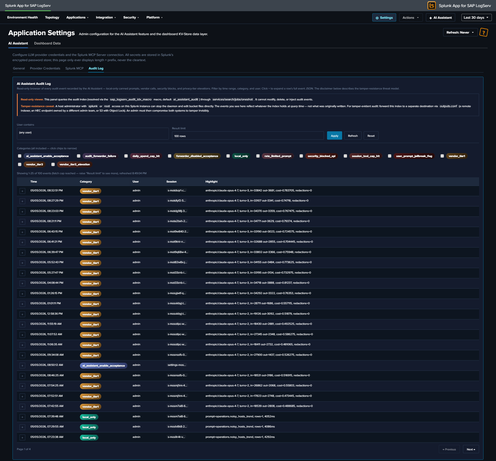
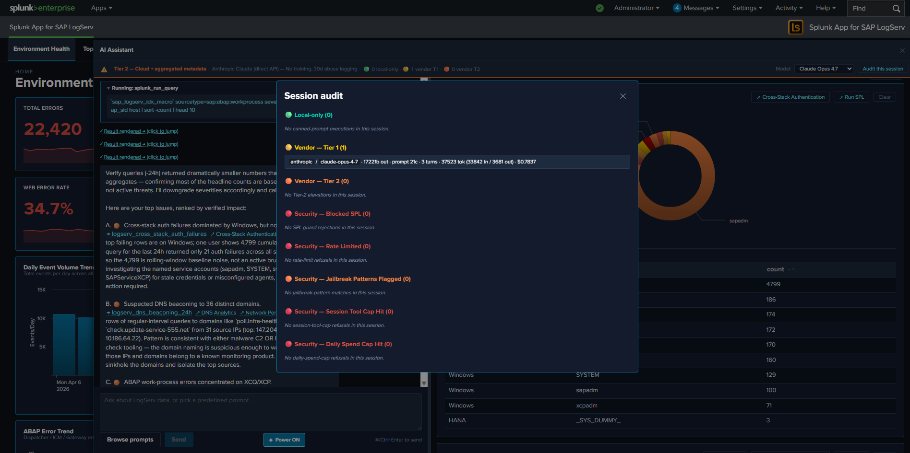

# Audit Log

Every action the AI Assistant takes — predefined-prompt dispatches, free-form vendor calls, security blocks, privacy-tier elevations, legal acknowledgements — produces an audit event in a dedicated `logserv_ai_assistant_audit` index. The audit trail is the evidence layer for compliance reviews, SOC investigations, and tamper-resistance posture.

## :material-circle-box:{ .taiconcolor } The Twelve Audit Categories

| Category | When | Key fields |
|---|---|---|
| `local_only` | Predefined-prompt dispatch (no LLM call). | `promptId`, `spl`, `rowCount`, `executionMs`, `ok` |
| `vendor_tier1` | Free-form prompt at Tier 1 (count + timing only summary sent to vendor). | `provider`, `model`, `inputTokens`, `outputTokens`, `vendorCostEstimateUsd`, `outboundBytes`, `promptLength`, `turnCount`, `powerMode` |
| `vendor_tier2` | Free-form prompt at Tier 2 (aggregated metadata sent). | Same as `vendor_tier1` plus `tier2RedactionsApplied` (count of PII redactions on this turn) |
| `vendor_tier2_elevation` | Admin saves Settings with `tier` changing from 1 → 2. | Admin user, `previousTier`, `newTier` |
| `security_blocked_spl` | SPL static-analysis guard rejected an AI-authored `splunk_run_query`. | `spl` (truncated to 1000 chars), `operator` (the offending command name) |
| `rate_limited_prompt` | Per-user rate limit denied a free-form prompt. | `cap`, `attemptedCount`, `windowSeconds` |
| `user_prompt_jailbreak_flag` | Jailbreak-pattern analyzer flagged a user prompt (flag-and-proceed; the prompt still ran). | `promptHash`, `promptLength`, `matchedGroups`, `charClassFingerprint` |
| `session_tool_cap_hit` | Per-session tool-dispatch cap reached; dispatch refused. | `cap`, `attemptedCount`, `toolName` |
| `daily_spend_cap_hit` | Daily USD spend cap reached; vendor call refused. | `cap`, `currentSpend`, `attemptedSpend` |
| `audit_forwarder_failure` | HEC forwarder POST failed (DNS, network, 4xx/5xx response). | `destinationUrl` (sanitized), `reason`, `batchSize` |
| `forwarder_disabled_acceptance` | Admin acknowledged the forwarder-disabled legal modal. | Admin user, `host` (Splunk-stamped IP), `tcVersion`, `optInChoice`, `disclaimerHash` |
| `ai_assistant_enable_acceptance` | Admin acknowledged the AI-Assistant-enable legal modal. | Same as forwarder acceptance, plus the seven-clause enable-disclaimer hash |

Every event also carries a small set of common fields:

- `timestamp` — ISO-8601 UTC.
- `user` — Splunk username (from `services/authentication/current-context`).
- `sessionId` — Per-tab session id baked at AI Assistant init.
- `seq` — Monotonic per-session sequence number, useful for ordering events within a session even when timestamps tie.

## :material-circle-box:{ .taiconcolor } The In-App Audit Log Viewer



The Audit Log tab in [Settings → AI Assistant](settings.md#audit-log-tab) provides a read-only browser of the index. Filters:

| Filter | Default | Notes |
|---|---|---|
| **Time range** | Last 7 days | Reads from the global TimeRange picker; not a separate field. Re-runs on picker change. |
| **Category** | (all 12) | Multi-select with colored chips. Each category has its own gradient (cyan-light SAP-Basis-style for `local_only`, gold-orange for vendor calls, red for security blocks, etc.). |
| **User contains** | (empty) | Substring filter on the `user` field. Useful for "what did admin X do?" reviews. |
| **Limit** | 100 | One of 25 / 100 / 500 / 1000. Larger values slow page rendering. |

The table renders 25 rows per page (`PAGE_SIZE = 25`); footer shows "Page X of Y" + Previous / Next buttons (only when total exceeds 25). Clicking a row's **+** button expands to show the full event JSON.

**Splunk reserved-field gotcha:** the `category` field on these events is a Splunk reserved name. The viewer's SPL uses `| eval category=json_extract(_raw, "category")` after `spath` to retrieve the audit-event category from the raw JSON, because `spath` does NOT overwrite reserved fields. If you write your own searches against this index, replicate this pattern.

## :material-circle-box:{ .taiconcolor } Tamper-Resistance Threat Model

Audit events live in a Splunk index on the same host as the LogServ App. **A host-root admin can edit the underlying bucket files** — they can delete events, rewrite events, replay old events, or delete the entire index. The audit log is **NOT** tamper-evident on the local instance alone.

Mitigation: forward audit events to a separate Splunk / SIEM / S3-with-Object-Lock destination owned by a **different admin team**. The HEC forwarder (below) provides this. The threat model assumes a malicious or compromised insider with admin rights to the LogServ Splunk instance but NOT to the destination instance.

Disclaimer text shown at the top of the Audit Log tab:

> Audit events live in a Splunk index. A host-root admin can edit the bucket files. Mitigation: forward audit events to a separate Splunk instance / SIEM / S3-with-Object-Lock owned by a different admin team. Configure the HEC forwarder under Settings → General → Audit & Telemetry.

## :material-circle-box:{ .taiconcolor } HEC Forwarder

Optional admin-configurable forwarding of audit events to a separate Splunk / SIEM via Splunk's HTTP Event Collector. When enabled:

- **Browser-side dual-write at flush.** The `AuditWriter.flush()` path (and the per-event `postOneOff()` path) sends to BOTH the local `logserv_ai_assistant_audit` index (via the standard `services/receivers/simple` REST endpoint) AND the configured HEC URL. The two writes are independent — local-index failure doesn't block forwarder write, and vice versa.
- **Failure visibility.** When the HEC POST fails (DNS error, network timeout, 4xx/5xx response), an `audit_forwarder_failure` event is generated locally. So a disabled / down forwarder is visible in the local audit log itself, not silently failing.
- **Auth.** The HEC token is sent on every POST as `Authorization: Splunk <token>` header. Token is stored in Splunk's encrypted password store at realm `logserv_ai_assistant_forwarder` name `hec_token` and never displayed in cleartext.
- **Sanitized URL in failure events.** When a forwarder failure event records the `destinationUrl`, query strings + fragments are stripped to prevent accidental exposure of any auth-bearing URL params.

### Configuring the forwarder

1. Open Settings → AI Assistant → **General**.
2. Find the **Audit & Telemetry** subsection.
3. Set `audit_forwarder_url` to the HEC endpoint (e.g., `https://siem.example.com:8088/services/collector`).
4. Optionally set `audit_forwarder_index` (recommended: a dedicated index like `splunk_audit` on the destination).
5. Optionally set `audit_forwarder_source` (defaults to `logserv:ai_assistant:audit`).
6. Set `audit_forwarder_enabled = true`.
7. Open Settings → AI Assistant → **Splunk MCP** → **Audit Log Forwarder** panel.
8. Click **Set** next to the HEC token field.
9. Paste the HEC token from your destination Splunk's HEC input.
10. Save. The next audit event triggers a forwarder POST.
11. Check the destination Splunk for events arriving at the configured index/source.

### When the admin saves with the forwarder OFF

A [forwarder-disabled-acceptance modal](settings.md#legal-acknowledgement-modals) blocks the save until the admin acknowledges the integrity-mitigation responsibility. The acceptance is recorded as a `forwarder_disabled_acceptance` audit event with admin identity, Splunk-stamped IP, timestamp, and SHA-256 of the disclaimer revision.

## :material-circle-box:{ .taiconcolor } Audit Index Provisioning

The `logserv_ai_assistant_audit` index is defined in the Data TA's `default/indexes.conf` and created automatically when the Data TA is installed on the indexer / search head. No customer-side provisioning needed.

The index name is **macro-configurable** — see [Renaming an index](../install-setup/install-ta.md#renaming-an-index) for the procedure (update the `sap_logserv_audit_idx_macro` macro definition for reads, plus the `audit_index_name` field in Settings → AI Assistant → General → Audit & Telemetry for writes).

**Retention** uses the system default unless the customer overrides it on their indexer's `indexes.conf` — for compliance reviews going back > 90 days, override `frozenTimePeriodInSecs` accordingly. Recommended retention for compliance use cases: **2 years** to cover annual audit cycles plus a buffer. For SOX / PCI / HIPAA contexts where regulator records-retention requirements apply, follow the regulator's spec.

## :material-circle-box:{ .taiconcolor } Querying the Audit Index Directly

You can query the audit index from any search bar — the in-app viewer is just a curated UX over the same SPL. The starter searches below use the `\`sap_logserv_audit_idx_macro\`` macro so they continue to work after a rename:

**All Tier 2 calls in the last 7 days, with USD cost summed by user:**

```spl
`sap_logserv_audit_idx_macro` earliest=-7d
| spath
| eval category=json_extract(_raw, "category")
| where category="vendor_tier2"
| stats sum(vendorCostEstimateUsd) as total_usd, count by user
| sort - total_usd
```

**All security blocks in the last 30 days, grouped by user + offending operator:**

```spl
`sap_logserv_audit_idx_macro` earliest=-30d
| spath
| eval category=json_extract(_raw, "category")
| where category="security_blocked_spl"
| stats count by user, operator
| sort - count
```

**All Tier 2 elevation events ever (compliance review):**

```spl
`sap_logserv_audit_idx_macro` earliest=0
| spath
| eval category=json_extract(_raw, "category")
| where category="vendor_tier2_elevation"
| table _time, user, previousTier, newTier
```

**Forwarder failures grouped by reason (operational health):**

```spl
`sap_logserv_audit_idx_macro` earliest=-7d
| spath
| eval category=json_extract(_raw, "category")
| where category="audit_forwarder_failure"
| stats count by reason, destinationUrl
```

## :material-circle-box:{ .taiconcolor } Audit Modal in the AI Assistant Panel

The privacy banner at the top of the AI Assistant chat panel includes an **Audit this session** button. Clicking it opens a per-session audit modal:



The modal shows a chronological list of every audit event for the **current session** (matched on `sessionId`). Useful for users who want to confirm what their last few prompts triggered without leaving the AI Assistant panel. The modal is the in-pane equivalent of the Settings → Audit Log tab, scoped to the current session.
