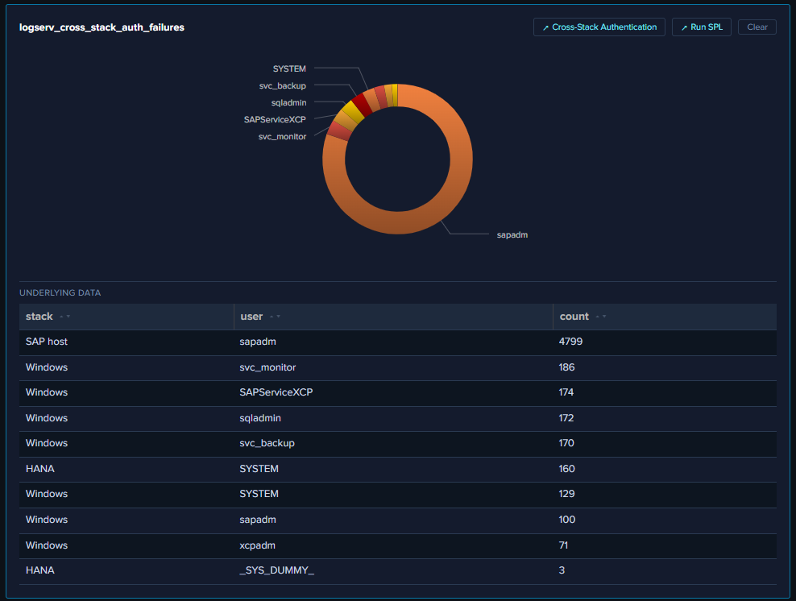

# Drill-down Chips

Drill-down chips are clickable affordances that appear next to AI Assistant tool-result tiles (right pane) and inline citations in the chat narrative (left pane). They connect the AI Assistant's investigation flow back into the dashboards or Splunk's universal Search app, with the dispatch's exact time range pre-applied.

## :material-circle-box:{ .taiconcolor } The Two Chip Types

### `↗ Dashboard`

Opens the related OOTB dashboard in a new browser tab. Sourced from the per-prompt dashboard mapping in the intent map — single string or array. Multi-target prompts (20 of 48 — e.g., `logserv_hana_failed_auth` → HANA Audit + Cross-Stack Authentication) render multiple chips, one per target.

The URL embeds the dispatch's exact earliest/latest as query params, and the destination dashboard hydrates its time picker from those params on mount.

### `↗ Run SPL`

Opens Splunk's universal Search app in a new browser tab with the dispatched SPL pre-populated and the dispatch's exact earliest/latest pre-applied. The chip is hidden on synthetic blocked-SPL results so it doesn't help the user manually run a query that the [SPL static-analysis guard](free-form-prompts.md) just rejected.

For canned-prompt dispatches, the SPL is the prompt's catalog SPL string. For AI-driven saved-search calls, the SPL is resolved from the same catalog lookup. For AI-driven ad-hoc queries, the SPL is the AI's own query string.

## :material-circle-box:{ .taiconcolor } Where Chips Render

### On every tool-result tile in the right pane

Chips appear in the tile's actions slot (in the FramedPanel header), between the tile title and the **Clear** button. Order: dashboard chip(s) first, then `↗ Run SPL`, then **Clear**.

### Alongside `[→ saved_search]` citations in the chat narrative

The AI's narrative response cites tool dispatches as `[→ logserv_xxx]`. Each citation in chat becomes a clickable scroll-to-tile span (clicking it scrolls the right pane to the matching tile), with sibling chips auto-appended on the same line: `↗ Dashboard` (one per resolvable target) + `↗ Run SPL`.

A typical citation in chat reads:

> A. [severity:high] Cross-stack auth failures concentrated on Windows.
> [→ logserv_cross_stack_auth_failures] ↗ Cross-Stack Authentication ↗ Run SPL
> 7 of the top-10 failing-stack rows are Windows...

Where:
- `[→ logserv_cross_stack_auth_failures]` is the clickable scroll-to-tile span (cyan-light + dotted underline)
- `↗ Cross-Stack Authentication` is the dashboard chip (opens that dashboard in a new tab at the dispatch's time range)
- `↗ Run SPL` is the SPL chip (opens Splunk Search with the dispatched SPL + same time range)

## :material-circle-box:{ .taiconcolor } Time-Range Preservation

Both chip types preserve the dispatch's **exact** time range — not the user's current global TimeRange picker, not the dashboard's default. So a `-24h` verify-query opens its destination at `-24h`; a `-30d` cumulative search opens at `-30d`; the dispatch's window IS the right answer for the destination.

This matters because the user's TimeRange picker may have changed between when the AI dispatched the search and when the user clicks the drill-down. By embedding the dispatch's window in the URL, the destination reflects exactly what the AI saw.

## :material-circle-box:{ .taiconcolor } Security Posture

- **`target="_blank"` + `rel="noopener noreferrer"`** on every chip. The `noopener` flag breaks the `window.opener` reference that reverse-tabnabbing relies on.
- **Row values spliced into SPL get quote-escaped before URL encoding** so a row value containing a quote or backslash can't break out of the SPL string context.
- **No SPL chip on synthetic blocked-SPL results.** When the SPL static-analysis guard blocks an AI-authored query, the synthetic error tile is rendered without the `↗ Run SPL` chip — the chip would defeat the guard by helping the user manually dispatch the same SPL.
- **No drill-downs from compliance audit-trail tables.** The After-Hours Privileged Changes + Recent Privileged Changes tables on the Change & Configuration Activity dashboard intentionally have NO row drill-downs (clicking through to raw events would pollute the audit trail with the reviewer's own search activity in subsequent compliance reports).

For the orchestrator-layer URL pre-resolution pattern that powers these chips, see [AI Assistant Implementation Reference](../developer/ai-assistant-internals.md).
