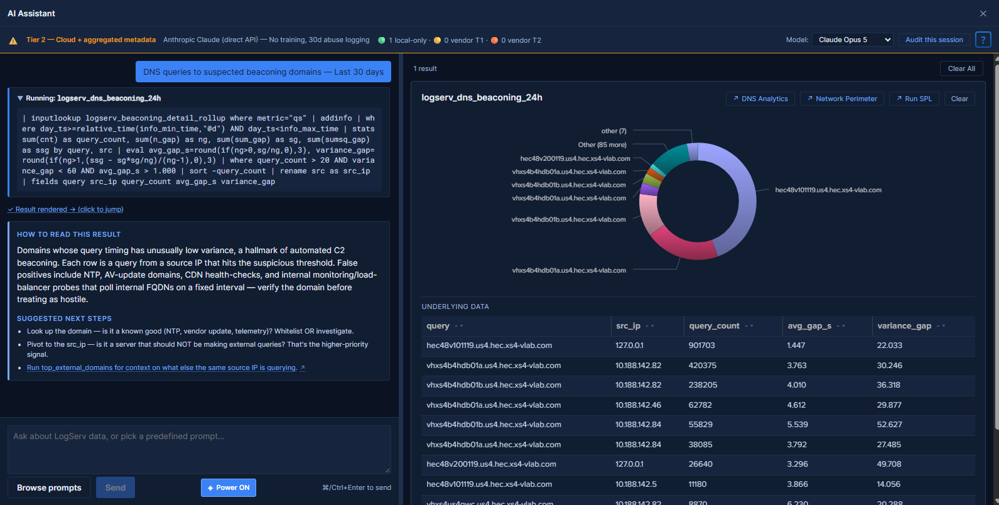

# AI Assistant — Overview

!!! info "Predefined prompts work out of the box; free-form needs a credential"
    The released v0.1.2 App package is the **full-LLM build variant**, so both paths described below are present. The predefined-prompt path — the prompt catalog, MCP dispatch, result tiles, guidance cards, drill-down chips, and audit log — is **active on install**, with no LLM provider, vendor credential, or vendor network call involved anywhere in it. The **free-form / LLM-driven path stays inert until an admin configures an [LLM provider credential](settings.md#provider-credentials-tab)**, and an upgrade creates none. An admin can restrict a deployment to predefined prompts at run time with the **Templates-only mode** toggle, and a compile-time [templates-only build variant](templates-only-build.md) exists where that restriction must not be reversible. See [Build Variants](templates-only-build.md).

## :material-circle-box:{ .taiconcolor } What the AI Assistant Is

The AI Assistant is a Splunk-aware assistant panel embedded in the LogServ App that lets analysts run cataloged investigations against their Splunk data. It sits to the right of every dashboard as a togglable side panel, accessed via the **AI Assistant** button at the right end of the header's second row.



The feature has **two distinct paths**. **The first works on install; the second needs an LLM provider credential:**

- **Predefined prompts (no LLM call) — active on install.** The user opens the prompt browser and clicks one of the cataloged prompts (three packs plus a context-aware **Dashboard Focused** tab). The orchestrator dispatches the prompt's saved search via the [Splunk MCP Server](mcp-setup.md), renders the result tile in the right pane (table / chart / KPI / pie), and appends a static interpretation + suggested-next-steps card. **No vendor LLM is invoked.** Free, instant (search latency only), zero data egress.
- **Free-form prompts (LLM-driven) — requires a provider credential.** Once an admin configures an [LLM provider credential](settings.md#provider-credentials-tab), the user can also type a natural-language question; the orchestrator sends a system primer + the question + tool definitions to the configured vendor (Anthropic / OpenAI / Azure OpenAI / AWS Bedrock), and the AI dispatches saved searches and synthesizes a narrative reply. Until a credential exists the chat input is inert and no vendor call is possible. An admin can switch the path off outright with the **Templates-only mode** toggle, and a compile-time [templates-only build variant](templates-only-build.md) disables it irreversibly — the build flag forces templates-only mode at every point the setting is read, the chat input and Send button are disabled, and an independent guard short-circuits the LLM dispatch entry point. See [Build Variants](templates-only-build.md) for that mechanism, and for the separate v0.0.6 line, where the provider code is physically absent from the bundle.

## :material-circle-box:{ .taiconcolor } The Privacy Posture

> **With no LLM provider credential configured, nothing is ever transmitted to any AI vendor — there are no vendor calls at all.**

The predefined-prompt path runs entirely between your browser, your Splunk search head, and the Splunk MCP Server on it. Search results render locally in the right pane; no summary, no metadata, and no prompt text leaves your Splunk environment.

Once a provider credential is configured, a second guarantee takes over:

> **No event data from your Splunk instance is ever transmitted to any AI vendor.**

That guarantee is not policy; it is **enforced by the type system at build time, with a runtime defense-in-depth scan as a second layer**. The TypeScript compiler refuses to put any tool-result value from MCP into an outbound vendor payload, and every outbound payload is additionally serialized and scanned at dispatch time — it is rejected if any Splunk data field key (`_raw`, `_time`, `host`, `source`, `sourcetype`, `index`, …) appears. Either layer is sufficient; both ship. The only conversion path produces a non-data summary whose contents are gated by the active **privacy tier** ([Privacy Tiers](privacy-tiers.md)): Tier 1 (default) exposes `count + execution_time` only; Tier 2 (admin opt-in) adds aggregated metadata (cardinality, top-N values, min/max/avg/sum, time range) but still no raw rows; Tier 0 (future) is air-gapped Ollama. What the vendor sees: the user's question, schema descriptions, tool definitions, and the tier-bounded summaries — never a field value from any event.

For the build-time type-system mechanism, see [AI Assistant Implementation Reference](../developer/ai-assistant-internals.md).

## :material-circle-box:{ .taiconcolor } Architecture at a Glance

The published package's flow has no vendor in it:

```
   User picks a prompt (prompt browser)
        |
        v
   Orchestrator  -->  Splunk MCP Server  -->  Splunk search-job
        |                                           |
        |  <------  results (stay client-side) <----+
        v
   Guidance card (left pane)      Tool result tile (right pane)
```

The **full-LLM variant** adds the vendor loop around the same MCP dispatch:

```
   User question
        |
        v
   AI vendor  -->  AI picks tools  -->  Splunk MCP Server  -->  Splunk search-job
        |                                                              |
        |                                  (raw rows stay client-side) |
        |  <-----  privacy-tier summary  <----+ (count + timing,
        |                                       optionally aggregates)
        |
        v  AI synthesizes narrative reply
   Chat panel (left pane)        Tool result tiles (right pane)
```

Every saved-search dispatch produces a tool-result tile in the right pane (table / chart / KPI / pie based on the prompt's `renderHint`). Drill-down chips (`↗ <Dashboard name>`, `↗ Run SPL`) on each tile connect the conversation back into the dashboards or Splunk's universal Search app — see [Drill-down Chips](drill-down-chips.md).

## :material-circle-box:{ .taiconcolor } Key Capabilities

**In the published package:**

- **The predefined-prompt catalog** in three packs (SAP Basis / Security / Operations) plus a context-aware **Dashboard Focused** tab that auto-filters to prompts relevant to the dashboard you currently have open. Many prompts read the same KV-Store rollups the dashboards use, so they stay fast at any data volume. See [Predefined Prompts](predefined-prompts.md).
- **Result tiles + guidance cards** — every dispatch renders the actual data (table / chart / KPI / pie) plus a static "How to read this result" interpretation and suggested next steps from the intent map.
- **[Drill-down chips](drill-down-chips.md)** — a `↗ <Dashboard name>` chip per related dashboard and `↗ Run SPL` on every tile, carrying the dispatch's exact time window.
- **[Audit log](audit-log.md)** — every canned-prompt dispatch (and every admin acknowledgement) lands in a dedicated `logserv_ai_assistant_audit` index, with an in-app browser + optional [HEC forwarder](audit-log.md#hec-forwarder) for tamper-evidence.
- **[Settings](settings.md)** — the admin Settings page (General / Provider Credentials / Splunk MCP / Audit Log sub-tabs), including the MCP request timeout and the audit-forwarder configuration.

**Once an LLM provider credential is configured:**

- **Free-form prompts** against four providers (Anthropic, OpenAI, Azure OpenAI, AWS Bedrock), with a per-user model picker and [dynamic model discovery](settings.md#how-model-discovery-works). See [Free-form Prompts](free-form-prompts.md).
- **[Power Mode](power-mode.md)** — admin-granted, role-gated `✦ Power` toggle that forces a saved-search dispatch before LLM synthesis (forced-RAG).
- **[Privacy tiers](privacy-tiers.md)** + **[time-window reasoning](time-window-reasoning.md)** — the vendor-facing privacy envelope and the primer rules that keep AI severity claims honest.
- **[OWASP LLM Top 10 (2025) controls](owasp-llm-compliance.md)** — prompt-injection sanitization, type-bounded data redaction, SPL static-analysis guard, jailbreak detection, per-user rate limit, USD spend cap, PII redaction.

## :material-circle-box:{ .taiconcolor } Prerequisites

- **Splunk 9.4.3 or later.**
- **[Splunk MCP Server (Splunkbase App 7931)](https://splunkbase.splunk.com/app/7931) v1.0.3 or later** (v1.1.0+ recommended) installed on the same search head as the LogServ App. See [Splunk MCP Setup](mcp-setup.md). Cookie auth from the same Splunk Web session works by default; the optional bearer token layers on top.
- **No LLM provider and no vendor credential** — the published package runs the predefined-prompt + MCP path only.
- **An admin-tier role** (`admin`, `sc_admin`, or `sc_subadmin`) to enable the feature, configure MCP, manage the audit forwarder, and view the Audit Log tab.

## :material-circle-box:{ .taiconcolor } First-time UX

1. Click **AI Assistant** at the right end of the header's second row. The right-side panel opens. (Where **Templates-only mode** is on, or a templates-only build is installed, an info banner at the top of the chat pane explains that free-form prompts are off.)
2. If MCP isn't healthy, the panel shows a setup wizard with diagnostic guidance — see [Splunk MCP Setup](mcp-setup.md). Otherwise, the panel is ready.
3. Click **Browse predefined prompts** to open the catalog modal. Pick a prompt from the SAP Basis / Security / Operations / Dashboard Focused tab.
4. The prompt dispatches via MCP and renders a tool tile in the right pane along with a static "How to read this result" guidance card on the left.
5. Click any of the drill-down chips on the tile (`↗ <Dashboard name>`, `↗ Run SPL`) to investigate further.

(Once an LLM provider credential is configured, the chat input additionally accepts free-form questions — see [Free-form Prompts](free-form-prompts.md).)

## :material-circle-box:{ .taiconcolor } When to Use Which Path

| Use case | Path |
|---|---|
| Routine "show me X" investigations on the cataloged dimensions | Predefined prompts (no credential needed) |
| Compliance / audit reports with a fixed cadence | Predefined prompts (deterministic, zero vendor traffic) |
| Free-form questions the catalog doesn't cover | Free-form — **requires a provider credential**, with [Power Mode](power-mode.md) on if available |
| Cross-cutting "what's most critical right now?" investigations | Free-form — **requires a provider credential** (the AI dispatches multiple saved searches and synthesizes) |
| Environments where vendor-LLM access is intentionally unavailable | Configure no provider credential, or turn on **Templates-only mode**; a compile-time [templates-only build](templates-only-build.md) makes it irreversible |
| Policy requires the vendor client code physically absent from the bundle | The separate **v0.0.6 line** (see [Build Variants](templates-only-build.md)) |

## :material-circle-box:{ .taiconcolor } Where to Go Next

**Works out of the box:**

- **[Predefined Prompts](predefined-prompts.md)** — the prompt catalog, the prompt browser UX, and the intent-map customization story.
- **[Splunk MCP Setup](mcp-setup.md)** — installing and configuring the prerequisite MCP server.
- **[Settings & Configuration](settings.md)** — the admin **Application Settings** page (`#/settings`): top-level **AI Assistant** and **Dashboard Data** tabs, with the AI Assistant configuration as sub-tabs.
- **[Audit Log](audit-log.md)** — what's logged, the in-app viewer, and the optional HEC forwarder for tamper-evidence.
- **[Build Variants](templates-only-build.md)** — what the published full-LLM build does, and what the compile-time templates-only variant guarantees.

**Once a provider credential is configured:**

- **[Free-form Prompts](free-form-prompts.md)** — the LLM-driven flow, tool dispatch, citations, and rate limiting.
- **[Privacy Tiers](privacy-tiers.md)** — what each tier exposes to the vendor, and the decision matrix for picking one.
- **[OWASP LLM Top 10 Compliance](owasp-llm-compliance.md)** — security controls posture for compliance reviews.
