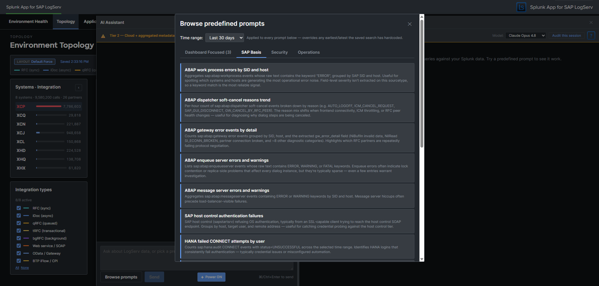

# Predefined Prompts

Predefined prompts are 61 cataloged saved searches across three packs that the AI Assistant can dispatch via the [Splunk MCP Server](mcp-setup.md) **without invoking any LLM**. They are the deterministic, vendor-traffic-free path through the AI Assistant: the user clicks a prompt card, the orchestrator dispatches the saved search, the result tile renders in the right pane, and a static interpretation + suggested-next-steps card appears in the chat.

This is the **only path that's active in the [Templates-only build variant](templates-only-build.md)** — partners can demo + investigate the LogServ solution end-to-end without any LLM provider configured.

## :material-circle-box:{ .taiconcolor } The Three Packs

| Pack | Count | Focus |
|---|---|---|
| **SAP Basis** | 15 | SAP Basis admin investigations: HANA service severity breakdown, ABAP work-process errors, integration topology call volume, RFC partner failures |
| **Security** | 28 | Auth failures, beaconing detection, after-hours admin activity, permission grants, GRANT-to-non-managed-role detection, HANA SYSTEM logins, Windows lockouts |
| **Operations** | 18 | Ingest health, error rate trends, error-category breakdowns, top error categories, host volume drop, freshness checks, Cloud Connector backend latency |

The full catalog ships inside the LogServ App as a data-driven intent map. Each prompt entry includes the saved-search name, label, description, render hint, chart hint, chart palette, dashboard mapping, interpretation, and suggested next steps.

## :material-circle-box:{ .taiconcolor } The Dashboard Focused Tab

The first-position tab in the prompt browser is **Dashboard Focused** — it auto-filters the catalog to prompts that are mapped to the dashboard you currently have open. The mapping is the per-prompt `dashboard` field in the intent map (single string or array — multi-target prompts map to multiple dashboards). The tab auto-hides when the active dashboard has zero matching prompts (e.g., on Settings or AI Assistant pages).

Each card on the Dashboard Focused tab carries a small pack-origin chip (cyan-light SAP Basis / salmon-red Security / gold-orange Operations) so users can find the prompt back in its home pack later.

## :material-circle-box:{ .taiconcolor } What Happens When You Click a Prompt

1. **Dispatch.** The orchestrator calls `splunk_run_saved_search` on the MCP server with the prompt's saved-search name and the dashboard's currently-selected time range.
2. **Tile renders.** The MCP server returns the rows. The orchestrator renders them in a tool-result tile in the right pane, with the prompt's pre-configured `renderHint` (`table` / `timechart` / `kpi` / `pie`) and optional companion `chartHint` (chart on top + table below for `renderHint=table` prompts that benefit from a visual).
3. **Guidance card.** A "How to read this result" card appears in the left chat pane below the user's prompt label. The card has two parts:
    - **Interpretation** — one paragraph explaining what the result means and what shapes are normal vs. concerning. Sourced from the intent map's `interpretation` field.
    - **Suggested next steps** — a bulleted list of follow-up investigations. Some entries are plain text; others are clickable deep-link chips that open Splunk's universal Search app with a focused SPL pre-filled and the dispatch's exact earliest/latest pre-applied. Sourced from the intent map's `nextSteps` array.
4. **Drill-down chips on the tile.** Every tile carries `↗ Dashboard` chip(s) (one per resolvable dashboard from the prompt's `dashboard` field) and a `↗ Run SPL` chip in its actions slot. See [Drill-down Chips](drill-down-chips.md).

**No LLM call.** No vendor traffic. No tokens. The dispatch is recorded as a `local_only` audit event with the prompt id + SPL + row count + execution time + ok flag. See [Audit Log](audit-log.md).

## :material-circle-box:{ .taiconcolor } The Tab Persistence Convention

The prompt browser remembers your last-selected tab across modal-open events, persisted per-tab in `sessionStorage` under `logserv.aiAssistant.promptActivePack`. The persistence rule is **selection-based, not casual-flipping-based** — your tab choice is only remembered if you actually picked a prompt from it. Casual tab-flipping (browsing without clicking a card) doesn't persist. If your last selected tab points at a tab that's hidden on the current dashboard (e.g., persisted to Dashboard Focused on a dashboard with no matching prompts), the resolver falls back to `sap_basis`.

## :material-circle-box:{ .taiconcolor } Customizing the Catalog

The prompt catalog is data-driven and customizable. New prompts can be added, existing prompts can be edited, and the catalog can be tailored per deployment. The full JSON schema, build-time consistency check, and pre-deploy SPL dry-run recipe are documented in [AI Assistant Implementation Reference — Adding a New Predefined Prompt](../developer/ai-assistant-internals.md).

## :material-circle-box:{ .taiconcolor } The Splunk Risky-Command Safeguard

Splunk Web's Search app has a safety modal that triggers on "risky" commands: `map`, `runshell`, `script`, `delete`, `crawl`, `tscollect`, `loadjob`, `outputlookup`, `outputcsv`, `sendalert`, `sendemail`. Any URL passed to `/app/search/search?q=...` containing one of these triggers the modal — even though our own MCP-dispatched saved searches don't.

The drill-down chips that open Splunk Search from the prompt browser's `nextSteps` deep-links are subject to this safeguard. The shipped prompt catalog has been scanned and rewritten where needed to avoid these commands; if you customize the catalog, scan any new SPL for risky commands before shipping. See [AI Assistant Implementation Reference](../developer/ai-assistant-internals.md) for the rewrite pattern (`map` → first-class subsearch).

## :material-circle-box:{ .taiconcolor } Clear All / Per-Result Clear

The right pane carries a **Clear All** button in the toolbar above the result list, plus a **Clear** button on every individual tile (in the actions slot, alongside the drill-down chips). Both prune the conversation:

- **Per-tile Clear** removes the tool_call + tool_result + the user message that triggered the dispatch (so a canned-prompt's chat label disappears alongside its result panel) + the guidance card. Outbound vendor refs for that tile are also stripped from the next-turn vendor-message buffer.
- **Clear All** wipes the entire conversation, including all tool_results, all guidance cards, all assistant_text messages, and all user messages. The chat session id is preserved so audit events continue with the same correlation id.
