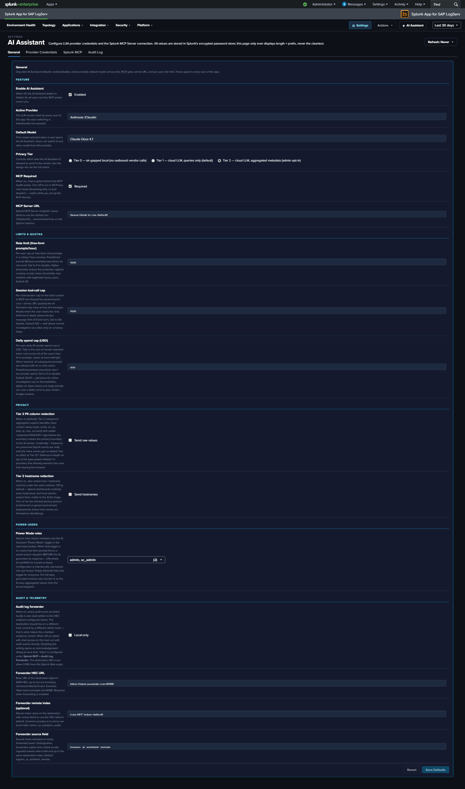

# Settings & Configuration

!!! info "Which settings apply in the published (templates-only) package"
    The released v0.1.1 App is the **templates-only build variant** — free-form LLM dispatch is disabled at compile time ([Build Variants](templates-only-build.md)). On this page that means: the **Provider Credentials sub-tab is hidden**, the **model-discovery rows** (governance toggle, Discovered-models status, Refresh button) and the **Templates-only mode toggle** are hidden, and the LLM-specific fields (`provider`, `default_model`, `tier`, `power_user_roles`, the Limits & Quotas caps, the Tier-2 privacy rows) still render but have no effect — there is no LLM dispatch for them to govern. The fields that matter in this build are `enabled`, `mcp_required`, `mcp_server_url`, `mcp_timeout_seconds`, and the Audit & Telemetry group. In the separately-built **full-LLM variant**, every field on this page is operational.

The **Application Settings** page is at **`#/settings`** within the LogServ App (the old `#/settings/ai-assistant` URL still works and redirects here). Admin-only. The page is organized as a **two-level tab hierarchy**:

```
Application Settings
├── AI Assistant            (top-level tab)
│   ├── General             (sub-tab)
│   ├── Provider Credentials(sub-tab)
│   ├── Splunk MCP          (sub-tab)
│   └── Audit Log           (sub-tab)
└── Dashboard Data          (top-level tab)
```

The two top-level tabs render with the standard tab chrome; the AI Assistant sub-tabs render as a lighter, secondary text-tab row beneath them.



## :material-circle-box:{ .taiconcolor } The Two Top-Level Tabs

| Tab | Scope |
|---|---|
| **AI Assistant** | Everything specific to the AI Assistant feature, split across four sub-tabs (below). |
| **Dashboard Data** | App-wide admin controls for the KV-Store rollup data layer that powers every dashboard **and** the Environment Topology view — aggregation master switch, retention, one-time backfill, per-rollup status, and clear ([see below](#dashboard-data-tab)). |

### AI Assistant sub-tabs

| Sub-tab | Scope |
|---|---|
| **General** | Org-wide AI Assistant defaults (enable/disable, provider, model, tier, MCP gate, server URL, rate limit, spend cap, Power Users, audit forwarder) |
| **Provider Credentials** | LLM provider API keys (Anthropic / OpenAI / Azure OpenAI / AWS Bedrock) |
| **Splunk MCP** | MCP Server bearer token + Audit Forwarder HEC token |
| **Audit Log** | Read-only browser of every audit event in the `logserv_ai_assistant_audit` index |

In the [Templates-only build variant](templates-only-build.md), the Provider Credentials sub-tab is hidden entirely (no LLM provider needed) and an info banner at the top of the AI Assistant tab explains the build mode.

## :material-circle-box:{ .taiconcolor } General Tab

The General tab is divided into five semantic subsections: **Feature**, **Limits & Quotas**, **Privacy**, **Power Users**, **Audit & Telemetry**.

### Feature

| Field | Default | Description |
|---|---|---|
| **`enabled`** | `false` | Master switch. When false, the `✦ AI Assistant` button in the nav is hidden and no AI traffic flows. The first time an admin flips this to `true`, an [enable-acceptance modal](#legal-acknowledgement-modals) blocks the save until acknowledged. |
| **`provider`** | `mock` | Active LLM vendor: `mock` / `anthropic` / `openai` / `azure_openai` / `bedrock` / `ollama` (future release). |
| **`default_model`** | per-provider | Default model id for the active provider. The dropdown offers the provider's **merged model list** — curated baseline plus any vendor-discovered models (see [How model discovery works](#how-model-discovery-works)). The per-user model picker in the chat panel can switch within the same list. |
| **`model_discovery_enabled`** | `true` | Governance toggle for [dynamic model discovery](#how-model-discovery-works). When off, the App never calls any vendor model-listing endpoint and the pickers offer the curated static baseline only. |
| **`tier`** | `1` | Privacy tier 0 / 1 / 2. See [Privacy Tiers](privacy-tiers.md). Any elevation to Tier 2 (from Tier 0 or Tier 1) records a `vendor_tier2_elevation` audit event. |
| **`mcp_required`** | `true` | When false, runs MCP-less chat mode (streaming-only, no tool dispatch). |
| **`mcp_server_url`** | blank | MCP server endpoint. Blank uses the scheme-relative `/en-US/splunkd/__raw/services/mcp`. See [Splunk MCP Setup](mcp-setup.md). |
| **`mcp_timeout_seconds`** | `60` | Browser-side timeout (seconds) for each MCP request — tool dispatch, saved-search run, health probe. If a legitimately-slow prompt shows `signal is aborted without reason`, raise this. Separate from the MCP server's own REST timeout (`mcp.conf [server] timeout`, default 60s); the effective ceiling is the lower of the two, so to allow a search past 60s raise both. Range `5`–`600`. |

Beneath the `mcp_timeout_seconds` field, a **read-only "MCP server timeout"** row displays the Splunk MCP Server app's own `mcp.conf [server] timeout` (read cross-app from App 7931), so both numbers sit side by side — the effective ceiling for a request is the lower of the two. It is display-only: changing the *server* timeout means editing App 7931's `mcp.conf` and restarting Splunk (the MCP server is a different app and caches the value in a persistent process, so it can't be changed live from here). When App 7931 isn't installed or reachable the row shows **Not detected**.

In the **full-LLM variant**, a **Discovered models** status row also renders beneath the model fields — the active provider's discovery state (how many models were discovered, when the list was last fetched, the error text if the last refresh failed) together with a **Refresh model list** button that re-queries the vendor on demand. See [How model discovery works](#how-model-discovery-works). These rows are hidden in the published templates-only package.

### Limits & Quotas

| Field | Default | Description |
|---|---|---|
| **`rate_limit_per_hour`** | `30` | Per-user rolling-1-hour rate limit on free-form prompts. 0 = disabled. Maps to [LLM10](owasp-llm-compliance.md). Canned prompts are never rate-limited. |
| **`tool_calls_per_session_cap`** | `100` | Per-chat-session cap on tool dispatches to prevent infinite tool loops. 0 = disabled. Maps to [LLM06](owasp-llm-compliance.md). |
| **`daily_spend_cap_usd`** | `50.00` | Per-**user** daily cap on free-form vendor spend (estimated from token counts). The tally resets at local midnight; 0 = disabled. Maps to [LLM10](owasp-llm-compliance.md). |

### Privacy

| Field | Default | Description |
|---|---|---|
| **`tier2_pii_redaction`** | `true` | When Tier 2 is active, redact known identifier columns (`email`, `user(name)`, the six `src/source/client/remote/dest/destination` IP prefixes, `mac`, `account` — see [Privacy Tiers](privacy-tiers.md) for the exact pattern list) before sending to the LLM. Stable per-value `<redacted-XXXXXXX>` tags so cardinality reasoning still works. |
| **`tier2_redact_hostnames`** | `false` | Whether to redact hostname columns under the Tier 2 PII rule. Default off — hostname is often non-sensitive in SAP environments. |

### Power Users

| Field | Default | Description |
|---|---|---|
| **`power_user_roles`** | empty CSV | Comma-separated Splunk roles allowed to see the `✦ Power` toggle *(full-LLM variant — see [Power Mode](power-mode.md))*. |

### Audit & Telemetry

| Field | Default | Description |
|---|---|---|
| **`audit_index_name`** | `logserv_ai_assistant_audit` | Index that receives audit writes. Rename in lockstep with the `sap_logserv_audit_idx_macro` macro, which controls reads. |
| **`audit_forwarder_enabled`** | `false` | Forward audit events to a separate Splunk / SIEM via HEC for tamper-evidence. When the admin saves with this off, a [forwarder-disabled-acceptance modal](#legal-acknowledgement-modals) blocks the save until acknowledged. |
| **`audit_forwarder_url`** | blank | HEC base URL (e.g., `https://siem.example.com:8088` — the App appends `/services/collector/event`). |
| **`audit_forwarder_index`** | blank | Optional index field to send with each event. |
| **`audit_forwarder_source`** | `logserv_ai_assistant_remote` | `source` field for forwarded events — deliberately distinct from the local sourcetype (`logserv:ai_assistant:audit`) so forwarded copies are distinguishable. |

## :material-circle-box:{ .taiconcolor } How Model Discovery Works

!!! note "Full-LLM variant only"
    Model discovery is **inert in the published templates-only package** — no vendor model-listing call is ever made, and its Settings rows are hidden. This section describes the full-LLM variant.

In the full-LLM variant, the model pickers (Settings → General `default_model` and the chat panel's per-user picker) offer a **merged model list** per provider: a curated static baseline **plus** models discovered live from the configured vendor.

**What discovery actually calls.** Discovery is a **metadata-only GET** against the vendor's model-listing endpoint — the same credential and the same trust envelope as the existing "validate credential" check. No prompt text, no Splunk event data, and no aggregates are involved; the request and response carry model metadata only.

| Provider | Discovery source |
|---|---|
| Anthropic | `GET /v1/models` (paginated; display names + context windows carried through) |
| OpenAI | `GET /v1/models`, filtered to chat-capable families, with dated snapshots collapsed onto their alias |
| Azure OpenAI | Three-step deployment discovery: `/openai/v1/models` → `/openai/deployments` → the deployment name(s) configured on the Settings page |
| AWS Bedrock | `ListFoundationModels`, filtered to Anthropic / on-demand / text / streaming / active |
| Mock | A synthetic `mock-discovered` entry (used for keyless end-to-end testing) |

**When it refreshes.** Three triggers, all governed by the `model_discovery_enabled` toggle:

1. **Credential save** — saving a provider credential on the Provider Credentials sub-tab refreshes that provider's list immediately.
2. **Manual** — the **Refresh model list** button on the General sub-tab.
3. **24-hour TTL** — opening the chat panel refreshes the active provider's list if the cached copy is older than 24 hours (at most once per page load; never fires if the panel is never opened).

**Where the list lives.** Discovered lists cache in the `logserv_ai_models` KV Store collection (one row per provider: the sanitized model list, fetch timestamp, fetching user, and last error). Model ids and labels are allowlist-sanitized on write **and** on read, and the static baseline always survives the merge — a poisoned or malformed cache entry cannot remove the known-good models.

**Failure behavior.** A failed refresh preserves the row's last-good models and timestamp and only updates the error text (shown on the **Discovered models** status row). The picker never shrinks below the static baseline.

**Audit trail.** Every refresh — success or failure, any trigger — writes a **`model_discovery`** audit event (provider, trigger, ok, model count, duration, error) to the `logserv_ai_assistant_audit` index, browsable on the Audit Log sub-tab.

**Cost estimates stay honest.** The vendor cost table used for spend tracking is exact-id keyed. A discovered model with no known price reports **$0** — the App never guesses a price from an id prefix. The `daily_spend_cap_usd` limit therefore only counts models with known pricing.

**How to disable it.** Turn off **`model_discovery_enabled`** on the General sub-tab and save. From that point the App makes **no** vendor model-listing calls (all three triggers are gated), and the pickers offer the curated static baseline only. Existing cached rows in `logserv_ai_models` are ignored while the toggle is off and simply overwritten on the next refresh if it is re-enabled.

## :material-circle-box:{ .taiconcolor } Provider Credentials Tab

!!! note "Full-LLM variant only"
    This sub-tab is **hidden in the published templates-only package** (no LLM provider is involved). This section describes the full-LLM variant.

One panel per provider. Each panel has the credential fields for that provider — typically just an API key, plus per-provider extras (Azure deployment URL, Bedrock region, etc.). Credentials are stored in Splunk's encrypted password store via `/servicesNS/nobody/<app>/storage/passwords`. The Settings page only ever displays length + prefix, never the cleartext.

The realm convention is `logserv_ai_assistant_<provider>` and the credential name corresponds to the field. So Anthropic's API key lives at realm `logserv_ai_assistant_anthropic` name `api_key`; OpenAI's at `logserv_ai_assistant_openai` name `api_key`; etc.

**Setting a credential** (admin-only):

1. Pick the provider's panel on this tab.
2. Click **Set** next to the field.
3. Paste the credential.
4. Click **Save**. The credential lands in Splunk's encrypted password store; no cleartext is ever rendered back. (Credential saves do not write an audit event.)

**Deleting a credential:**

1. Click **Delete** next to the field.
2. Confirm.
3. The credential is removed from Splunk's encrypted password store.

If the active `provider` field on the General tab points at a provider whose credentials aren't set, the AI Assistant produces an error on the first free-form prompt: *"Provider 'X' has no credentials configured. Open Settings → Provider Credentials to set them."*

In the [Templates-only build variant](templates-only-build.md), this entire tab is hidden.

## :material-circle-box:{ .taiconcolor } Splunk MCP Tab


Two panels:

### Splunk MCP Server

| Field | Realm | Name |
|---|---|---|
| **`bearer_token`** | `logserv_ai_assistant_mcp` | `bearer_token` |

OAuth/JWT token issued by your Splunk MCP Server. The admin pastes this. **Optional** — cookie auth from the same Splunk Web session works by default for HTTP-only Splunk.

### Audit Log Forwarder

| Field | Realm | Name |
|---|---|---|
| **`hec_token`** | `logserv_ai_assistant_forwarder` | `hec_token` |

HEC token for tamper-evident audit forwarding to a separate Splunk / SIEM. The destination URL + on/off toggle live under General → Audit & Telemetry. The token is sent on every audit-event POST as `Authorization: Splunk <token>`. See [Audit Log → HEC Forwarder](audit-log.md#hec-forwarder).

## :material-circle-box:{ .taiconcolor } Audit Log Tab


Read-only browser of every event in the `logserv_ai_assistant_audit` index. The search window is driven by the global TimeRange picker in the navigation bar — the viewer re-runs on every picker change, and there is no separate time-range control. Filters: category multi-select (13 categories — `local_only`, `vendor_tier1`, `vendor_tier2`, `security_blocked_spl`, `rate_limited_prompt`, `user_prompt_jailbreak_flag`, `session_tool_cap_hit`, `daily_spend_cap_hit`, `audit_forwarder_failure`, `vendor_tier2_elevation`, `forwarder_disabled_acceptance`, `ai_assistant_enable_acceptance`, `model_discovery`), user-contains text filter, result limit (50 / 100 / 250 / 500, default 100).

Clicking a row's **+** expand button reveals the full event JSON. The page is paginated client-side at 25 rows per page; "Showing N-M of T events" + Previous / Next buttons render below the table when T > 25.

**Tamper-resistance disclaimer** at the top of the panel:

> Audit events live in a Splunk index. A host-root admin can edit the bucket files. Mitigation: forward audit events to a separate Splunk instance / SIEM / S3-with-Object-Lock owned by a different admin team. Configure the HEC forwarder under Settings → General → Audit & Telemetry.

See [Audit Log](audit-log.md) for the threat model + forwarder configuration.

## :material-circle-box:{ .taiconcolor } Dashboard Data Tab

The **Dashboard Data** top-level tab is the admin control surface for the entire KV-Store rollup data layer that powers every dashboard **and** the Environment Topology view — a global hourly-aggregation master switch, a 365-day retention display, the one-time backfill, a per-rollup status + action table, and a global clear.

Because it manages the dashboard data layer (not the AI Assistant feature), its controls are documented alongside that architecture: see **[Dashboard Performance & Data Freshness → The Dashboard Data settings tab](../logserv-app/dashboards/performance.md#the-dashboard-data-settings-tab)**.

A read-only view of the same rollup health — freshness plus the 30-day-history completeness —
is available to **every** user (no admin role needed) on the
**[Data Doctor's Diagnostics page](../logserv-app/dashboards/platform/diagnostics.md)**
(*Platform → Diagnostics*), which points back here for the actual backfill/clear controls.

## :material-circle-box:{ .taiconcolor } Legal Acknowledgement Modals

Two legal acknowledgement modals gate specific Settings save flows. Both follow Splunk's `splunk_instrumentation` `optInVersion` framework — once acknowledged at version V, future saves with the same disclaimer revision skip the modal; bumping the version forces re-ack.

### Enable Acceptance Modal (orange-bordered)

Triggers when:
- `saved.enabled === false && draft.enabled === true` (every "I'm turning this on" deliberate action), OR
- The current `optInVersion` of the enable-TC stanza is higher than the user's last acknowledgement.

The modal disclaimer covers seven clauses: data egress acknowledgement, customer responsibility, AS-IS warranty disclaimer, indemnification, limitation of liability, authority warrant, record-of-acknowledgement. Aligned to Splunk MSA + Cisco EULA conventions.

User identity, Splunk-stamped IP (`host` field), timestamp, and SHA-256 of the disclaimer revision are recorded in an `ai_assistant_enable_acceptance` audit event. **Yes** path: save proceeds + bumps the user's `optInVersionAcknowledged`. **No** path: save aborts + records the No choice.

### Forwarder Disabled Acceptance Modal (red-bordered)

Triggers when:
- `saved.audit_forwarder_enabled === true && draft.audit_forwarder_enabled === false` (every "I'm turning this protection off" deliberate action), OR
- The current `optInVersion` of the forwarder-TC stanza is higher than the user's last acknowledgement.

The disclaimer covers integrity-mitigation responsibility: with the forwarder off, audit events are recoverable only from the local index, which a host-root admin can edit. Same identity + IP + timestamp + disclaimer-hash recording as the enable modal. Records `forwarder_disabled_acceptance` audit event.

### Why the hybrid trigger logic

Pure `optInVersion`-only gating (acknowledge once, never prompted again until the version bumps) is what Splunk's stock telemetry uses. We added the deliberate-toggle-transition trigger because re-enabling the AI Assistant after a disable, or re-disabling the forwarder after enabling, are deliberate user actions that warrant re-acknowledgement of the legal posture each time. Pure version-only gating would let these toggle-flips slip without re-ack.

## :material-circle-box:{ .taiconcolor } Live UI Refresh on Save

When the admin saves a config change in the General tab that affects what users see (master `enabled` toggle, `mcp_required`, `power_user_roles`, etc.), the AI Assistant re-applies the new config to the running session within a few seconds. No page reload required.

For example: disabling the AI Assistant via the master toggle and clicking Save Defaults — the `✦ AI Assistant` button in the top-right nav disappears within ~4 seconds, no browser refresh needed. Similarly, re-enabling re-shows the button immediately. For the callback wiring, see [AI Assistant Implementation Reference](../developer/ai-assistant-internals.md).
