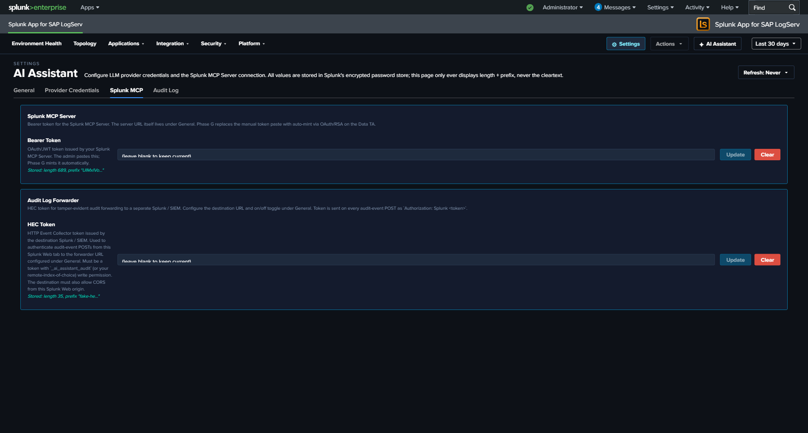

# Settings & Configuration

!!! warning "Current release: the Provider Credentials tab is hidden — LLM dispatch is disabled"
    The current release ships with the LLM-driven path **disabled at compile time pending internal review**. The Provider Credentials tab is hidden entirely in current builds, and the model picker on the General tab is non-functional even though the underlying setting persists. The General tab's `provider`, `default_model`, `tier`, `power_user_roles`, `tier2_pii_redaction`, `tier2_redact_hostname`, `rate_limit_per_hour`, `daily_spend_cap_usd`, and `session_tool_call_cap` fields are documented for the future release that re-enables the LLM path; in the current release, only `enabled`, `mcp_required`, `mcp_server_url`, and the audit-forwarder fields under Audit & Telemetry are operationally meaningful.

The AI Assistant Settings page is at **`#/settings/ai-assistant`** within the LogServ App. Admin-only. Six tabs, each handling a different aspect of the app's configuration. (The page is named for the AI Assistant but also hosts the app-wide dashboard data-layer admin controls.)

## :material-circle-box:{ .taiconcolor } The Six Tabs

| Tab | Scope |
|---|---|
| **General** | Org-wide AI Assistant defaults (enable/disable, provider, model, tier, MCP gate, server URL, rate limit, spend cap, Power Users, audit forwarder) |
| **Provider Credentials** | LLM provider API keys (Anthropic / OpenAI / Azure OpenAI / AWS Bedrock) |
| **Splunk MCP** | MCP Server bearer token + Audit Forwarder HEC token |
| **Audit Log** | Read-only browser of every audit event in the `logserv_ai_assistant_audit` index |
| **Topology** | Admin controls for the Environment Topology view's hourly KV-Store aggregation + on-demand backfill |
| **Dashboard Data** | Admin controls for the dashboard KV-Store rollups — run the one-time backfill that seeds dashboard history ([see below](#dashboard-data-tab)) |

In the [Templates-only build variant](templates-only-build.md), the Provider Credentials tab is hidden entirely (no LLM provider needed) and an info banner at the top of the page explains the build mode.

## :material-circle-box:{ .taiconcolor } General Tab

The General tab is divided into four semantic subsections: **Feature**, **Limits & Quotas**, **Privacy**, **Audit & Telemetry**.

### Feature

| Field | Default | Description |
|---|---|---|
| **`enabled`** | `false` | Master switch. When false, the `✦ AI Assistant` button in the nav is hidden and no AI traffic flows. The first time an admin flips this to `true`, an [enable-acceptance modal](#legal-acknowledgement-modals) blocks the save until acknowledged. |
| **`provider`** | `mock` | Active LLM vendor: `mock` / `anthropic` / `openai` / `azure_openai` / `bedrock` / `ollama` (future release). |
| **`default_model`** | per-provider | Default model id for the active provider. Per-user model picker in the chat panel can switch within the same provider's `models[]`. |
| **`tier`** | `1` | Privacy tier 0 / 1 / 2. See [Privacy Tiers](privacy-tiers.md). Elevating to Tier 2 records a `vendor_tier2_elevation` audit event. |
| **`mcp_required`** | `true` | When false, runs MCP-less chat mode (streaming-only, no tool dispatch). |
| **`mcp_server_url`** | blank | MCP server endpoint. Blank uses the scheme-relative `/en-US/splunkd/__raw/services/mcp`. See [Splunk MCP Setup](mcp-setup.md). |
| **`power_user_roles`** | empty CSV | Comma-separated Splunk roles allowed to see the `✦ Power` toggle. See [Power Mode](power-mode.md). |

### Limits & Quotas

| Field | Default | Description |
|---|---|---|
| **`rate_limit_per_hour`** | `30` | Per-user rolling-1-hour rate limit on free-form prompts. 0 = disabled. Maps to [LLM10](owasp-llm-compliance.md). Canned prompts are never rate-limited. |
| **`session_tool_call_cap`** | `100` | Per-chat-session cap on tool dispatches to prevent infinite tool loops. 0 = disabled. Maps to [LLM06](owasp-llm-compliance.md). |
| **`daily_spend_cap_usd`** | per-org | Cumulative-cost cap on free-form vendor spend per app instance per UTC day. Resets at 00:00 UTC. Maps to [LLM10](owasp-llm-compliance.md). |

### Privacy

| Field | Default | Description |
|---|---|---|
| **`tier2_pii_redaction`** | `true` | When Tier 2 is active, redact known identifier columns (`email`, `user(name)`, `*_ip`, `mac`, `account`) before sending to the LLM. Stable per-value `<redacted-XXXXXXX>` tags so cardinality reasoning still works. |
| **`tier2_redact_hostname`** | `false` | Whether to redact hostname columns under the Tier 2 PII rule. Default off — hostname is often non-sensitive in SAP environments. |

### Audit & Telemetry

| Field | Default | Description |
|---|---|---|
| **`audit_forwarder_enabled`** | `false` | Forward audit events to a separate Splunk / SIEM via HEC for tamper-evidence. When the admin saves with this off, a [forwarder-disabled-acceptance modal](#legal-acknowledgement-modals) blocks the save until acknowledged. |
| **`audit_forwarder_url`** | blank | HEC endpoint URL (e.g., `https://siem.example.com:8088/services/collector`). |
| **`audit_forwarder_index`** | blank | Optional index field to send with each event. |
| **`audit_forwarder_source`** | `logserv:ai_assistant:audit` | `source` field for forwarded events. |

## :material-circle-box:{ .taiconcolor } Provider Credentials Tab

One panel per provider. Each panel has the credential fields for that provider — typically just an API key, plus per-provider extras (Azure deployment URL, Bedrock region, etc.). Credentials are stored in Splunk's encrypted password store via `/servicesNS/nobody/<app>/storage/passwords`. The Settings page only ever displays length + prefix, never the cleartext.

The realm convention is `logserv_ai_assistant_<provider>` and the credential name corresponds to the field. So Anthropic's API key lives at realm `logserv_ai_assistant_anthropic` name `api_key`; OpenAI's at `logserv_ai_assistant_openai` name `api_key`; etc.

**Setting a credential** (admin-only):

1. Pick the provider's panel on this tab.
2. Click **Set** next to the field.
3. Paste the credential.
4. Click **Save**.
5. The Settings page records a `local_only` audit event with the realm + name + length + prefix (never the cleartext).

**Deleting a credential:**

1. Click **Delete** next to the field.
2. Confirm.
3. The credential is removed from Splunk's encrypted password store.

If the active `provider` field on the General tab points at a provider whose credentials aren't set, the AI Assistant produces an error on the first free-form prompt: *"Provider 'X' has no credentials configured. Open Settings → Provider Credentials to set them."*

In the [Templates-only build variant](templates-only-build.md), this entire tab is hidden.

## :material-circle-box:{ .taiconcolor } Splunk MCP Tab

Two panels:

### Splunk MCP Server

| Field | Realm | Name |
|---|---|---|
| **`bearer_token`** | `logserv_ai_assistant_mcp` | `bearer_token` |

OAuth/JWT token issued by your Splunk MCP Server. The admin pastes this. **Optional** — cookie auth from the same Splunk Web session works by default for HTTP-only Splunk.

### Audit Log Forwarder

| Field | Realm | Name |
|---|---|---|
| **`hec_token`** | `logserv_ai_assistant_forwarder` | `hec_token` |

HEC token for tamper-evident audit forwarding to a separate Splunk / SIEM. The destination URL + on/off toggle live under General → Audit & Telemetry. The token is sent on every audit-event POST as `Authorization: Splunk <token>`. See [Audit Log → HEC Forwarder](audit-log.md#hec-forwarder).

## :material-circle-box:{ .taiconcolor } Audit Log Tab

Read-only browser of every event in the `logserv_ai_assistant_audit` index. Filters: time range (preset Last 24h / 7d / 30d / 90d), category multi-select (12 categories — `local_only`, `vendor_tier1`, `vendor_tier2`, `security_blocked_spl`, `rate_limited_prompt`, `user_prompt_jailbreak_flag`, `session_tool_cap_hit`, `daily_spend_cap_hit`, `audit_forwarder_failure`, `vendor_tier2_elevation`, `forwarder_disabled_acceptance`, `ai_assistant_enable_acceptance`), user-contains text filter, result limit (25 / 100 / 500 / 1000).

Clicking a row's **+** expand button reveals the full event JSON. The page is paginated client-side at 25 rows per page; "Showing N-M of T events" + Previous / Next buttons render below the table when T > 25.

**Tamper-resistance disclaimer** at the top of the panel:

> Audit events live in a Splunk index. A host-root admin can edit the bucket files. Mitigation: forward audit events to a separate Splunk instance / SIEM / S3-with-Object-Lock owned by a different admin team. Configure the HEC forwarder under Settings → General → Audit & Telemetry.

See [Audit Log](audit-log.md) for the threat model + forwarder configuration.

## :material-circle-box:{ .taiconcolor } Topology Tab

Admin controls for the time-bucketed KV Store that powers the [Environment Topology](../logserv-app/dashboards/topology.md) view. Hourly scheduled searches aggregate node + edge activity into the `logserv_topology_nodes` + `logserv_topology_edges` collections; the topology view reads from KV Store at render time, filtered by the global time-range picker. This tab surfaces the per-collection status and an on-demand backfill so an admin can populate topology history immediately after install rather than waiting for the hourly aggregation.

## :material-circle-box:{ .taiconcolor } Dashboard Data Tab

Admin controls for the time-bucketed **KV-Store rollups that power the dashboard suite**. The 21 non-Topology dashboards read precomputed, hour-bucketed data from `logserv_*_rollup` collections instead of scanning raw events on every page load — see [Dashboard Performance & Data Freshness](../logserv-app/dashboards/performance.md) for the architecture.

This tab is where you run the **one-time backfill after a fresh install on a high-volume instance**:

1. Review the per-rollup status. Collections without history show an "incomplete history" banner.
2. Click **Run backfill**.
3. Watch the progress bar; the run is idempotent and resumable, so it's safe to re-run.

The backfill seeds **30 days** of history into every rollup collection, dispatching each rollup's component aggregation searches as **top-level Splunk jobs** (which complete correctly at customer scale — the bundled `*_backfill` saved searches truncate at high event volume because of a subsearch wall-clock limit). After this, the hourly aggregation keeps each collection current and the cache grows toward the 365-day retention window. You only need to run the backfill again if you reinstall or clear a collection.

!!! note "You can skip the backfill"
    Without it, rolled-up panels start populating from the next hourly aggregation onward, filling in one hour at a time. The backfill exists only to make 30 days of history available immediately.

## :material-circle-box:{ .taiconcolor } Legal Acknowledgement Modals

Two compile-time legal modals gate specific Settings save flows. Both follow Splunk's `splunk_instrumentation` `optInVersion` framework — once acknowledged at version V, future saves with the same disclaimer revision skip the modal; bumping the version forces re-ack.

### Enable Acceptance Modal (orange-bordered)

Triggers when:
- `saved.enabled === false && draft.enabled === true` (every "I'm turning this on" deliberate action), OR
- The current `optInVersion` of the enable-TC stanza is higher than the user's last acknowledgement.

The modal disclaimer covers seven clauses: data egress acknowledgement, customer responsibility, AS-IS warranty disclaimer, indemnification, limitation of liability, authority warrant, record-of-acknowledgement. Aligned to Splunk MSA + Cisco EULA conventions.

User identity, Splunk-stamped IP (`host` field), timestamp, and SHA-256 of the disclaimer revision are recorded in an `ai_assistant_enable_acceptance` audit event. **Yes** path: save proceeds + bumps the user's `optInVersionAcknowledged`. **No** path: save aborts + records the No choice.

### Forwarder Disabled Acceptance Modal (cyan-bordered)

Triggers when:
- `saved.audit_forwarder_enabled === true && draft.audit_forwarder_enabled === false` (every "I'm turning this protection off" deliberate action), OR
- The current `optInVersion` of the forwarder-TC stanza is higher than the user's last acknowledgement.

The disclaimer covers integrity-mitigation responsibility: with the forwarder off, audit events are recoverable only from the local index, which a host-root admin can edit. Same identity + IP + timestamp + disclaimer-hash recording as the enable modal. Records `forwarder_disabled_acceptance` audit event.

### Why the hybrid trigger logic

Pure `optInVersion`-only gating (acknowledge once, never prompted again until the version bumps) is what Splunk's stock telemetry uses. We added the deliberate-toggle-transition trigger because re-enabling the AI Assistant after a disable, or re-disabling the forwarder after enabling, are deliberate user actions that warrant re-acknowledgement of the legal posture each time. Pure version-only gating would let these toggle-flips slip without re-ack.

## :material-circle-box:{ .taiconcolor } Live UI Refresh on Save

When the admin saves a config change in the General tab that affects what users see (master `enabled` toggle, `mcp_required`, `power_user_roles`, etc.), the AI Assistant re-applies the new config to the running session within a few seconds. No page reload required.

For example: disabling the AI Assistant via the master toggle and clicking Save Defaults — the `✦ AI Assistant` button in the top-right nav disappears within ~4 seconds, no browser refresh needed. Similarly, re-enabling re-shows the button immediately. For the callback wiring, see [AI Assistant Implementation Reference](../developer/ai-assistant-internals.md).
