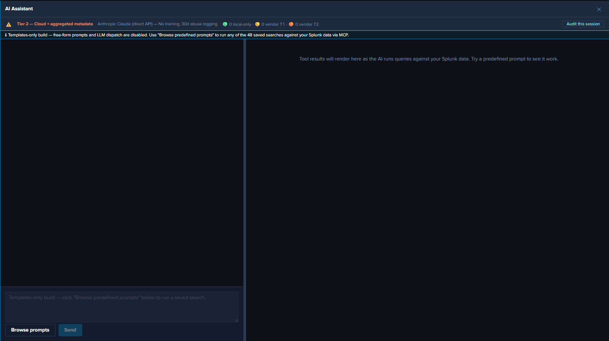

# Templates-only Build Variant

!!! info "In this release, the templates-only build IS the published tarball"
    As of 2026-08-18, v0.1.1 publishes the **templates-only build** described on this page as its release tarball — the AI Assistant runs the full predefined-prompt catalog via the Splunk MCP Server, and the free-form LLM path is disabled at compile time. The **regular, LLM-enabled build** of the same source remains available as an archived variant for approved deployments (and is what the LLM-related pages in this documentation describe); in that variant, the runtime `templates_only_mode` toggle in Settings → AI Assistant → General provides a no-rebuild restriction with the option to re-enable later.

The templates-only build is a variant of the LogServ App that has the AI Assistant's free-form / LLM-driven path **disabled at compile time**. No configuration change can restore it: the build flag forces the `templates_only_mode` setting on at the point where it is read, so every source of that setting — the KV Store settings row, a `local/ai_assistant_settings.conf` override, or the shipped default — reports templates-only regardless of what it actually contains. Flipping the setting (by any route, including a direct REST write) has no effect, and the Settings toggle for it is hidden in this build because it could not change anything. The MCP path + 61 canned prompts + tool tiles + drill-down chips + audit log all stay fully active, so the LogServ solution can be run end-to-end without an LLM provider. As of 2026-08-18 this variant is the published release tarball; the regular, LLM-enabled build of the same source is the archived alternative for approved deployments.

## :material-circle-box:{ .taiconcolor } Why a Compile-Time Variant

The runtime alternative — an admin toggle in Settings that disables the LLM path — would let any local Splunk admin flip it back on. For deployments where the LLM dispatch path is intentionally not available — such as demonstration environments or restricted-environment customers — a compile-time variant is the right shape: the decision is fixed when the tarball is produced and cannot be undone in the field.

!!! note "Two levels of guarantee — pick the one your policy needs"
    This variant is a **functional** disable: the vendor provider code is still present in the bundle, but nothing can reach it (the flag forces the setting on at read time, and the LLM dispatch entry point is independently guarded by the same flag). It is the right choice for demos, partners, and most restricted environments.

    If your policy requires that the vendor code be **physically absent** from the shipped bundle — for example, an environment where the presence of an outbound API client is itself the concern — use the separate **v0.0.6 line** instead, which deletes the provider implementations from source. That line publishes the templates-only build as its released tarball.

## :material-circle-box:{ .taiconcolor } What Changes in the Templates-only Build

### UI gating (visible to the user)

- **Chat input text field** — disabled, with placeholder *"Templates-only mode — click 'Browse predefined prompts' below to run a saved search."*
- **Send button** — unconditionally disabled (in addition to the existing `!text.trim() || busy` guard).
- **Power Mode toggle** — hidden (forced-RAG is meaningless when there's no LLM call to force a saved-search before).
- **Browse prompts button** — fully enabled. The only entry point in this build.
- **Privacy banner model picker** — hidden (no model = no picker).
- **Top-of-chat info banner** — cyan-info-tone banner reads: *"Templates-only mode — free-form prompts and LLM dispatch are disabled. Use 'Browse predefined prompts' to run any of the predefined saved searches against your Splunk data via MCP."*
- **Settings page** — the **Provider Credentials tab is hidden entirely** (if it was the active tab, the page falls back to General rather than rendering blank). The **"Templates-only mode" toggle is also hidden**, since it cannot change anything in this build. Top-of-page info banner explains the mode; as of build 334 its closing sentence branches on the build flag — in this build it states that the mode is fixed at compile time and cannot be switched off from Settings (the full-LLM build's banner instead points at the runtime toggle in the General sub-tab). Other tabs (General / Splunk MCP / Audit Log) remain fully visible since partners need MCP config + audit visibility.
- **Model discovery** — inert. No vendor model-list calls are made, and its Settings rows (the toggle and the "Refresh model list" button) are hidden.

### Defense-in-depth runtime guard

Even if a future code path reaches the LLM dispatch entry point (keyboard shortcut, programmatic dispatch from a future feature, etc.), a guard short-circuits with a system notice before any vendor call. In a templates-only build that guard is tied directly to the build flag as well as to the runtime setting, so it holds even if the setting never reaches the dispatch layer. The UI gating is the primary defense; the function-level guard is the safety net. For the guard's exact location and code shape, see [AI Assistant Implementation Reference](../developer/ai-assistant-internals.md).

## :material-circle-box:{ .taiconcolor } What's Still Active in Templates-only

- **The full predefined-prompt catalog.** Click any card in the prompt browser to dispatch.
- **Tool tiles in the right pane.** Tables, charts, KPIs, pies — all rendered identically to the regular build.
- **Static interpretation + suggested-next-steps cards.** Per-prompt guidance from the intent map.
- **Drill-down chips.** `↗ Dashboard` (one per related dashboard) + `↗ Run SPL` on every tile.
- **Audit log.** All `local_only` events for canned-prompt dispatches, plus `audit_forwarder_failure` events if the forwarder is configured. No `vendor_tier1` / `vendor_tier2` events because there are no vendor calls.
- **HEC audit forwarder.** Same dual-write behavior as the regular build.
- **All dashboards.** Environment Health, Applications, Integration, Security, Platform — every dashboard plus the Environment Topology view.
- **Per-dashboard auto-refresh picker, Download PNG, time-range URL preservation.** All identical to the regular build.
- **Settings → General, Splunk MCP, Audit Log.** Visible and functional; admin can configure MCP, audit forwarder, etc.

## :material-circle-box:{ .taiconcolor } What's Disabled in Templates-only

- **Free-form prompts.** Chat input greyed; Send disabled. The defense-in-depth guard short-circuits any code path that reaches the LLM dispatch entry point.
- **Power Mode.** Toggle hidden; the forced-RAG rule has nothing to enforce since there's no LLM dispatch.
- **Provider Credentials tab.** Hidden entirely.
- **Model picker in privacy banner.** Hidden.
- **Vendor calls.** `vendor_tier1` / `vendor_tier2` audit categories are never emitted.

## :material-circle-box:{ .taiconcolor } End-User Experience

After the templates-only build is installed, the user opens Splunk Web → clicks the **`✦ AI Assistant`** button. The cyan "Templates-only build" banner renders at the top of the chat panel. The user opens the prompt browser, runs prompts, sees tiles + drill-down chips, and navigates dashboards. The full LogServ analytics experience is available, just without the free-form / LLM-driven path.

The destination Splunk search head needs the [Splunk MCP Server](mcp-setup.md) installed for prompt dispatch to work.

