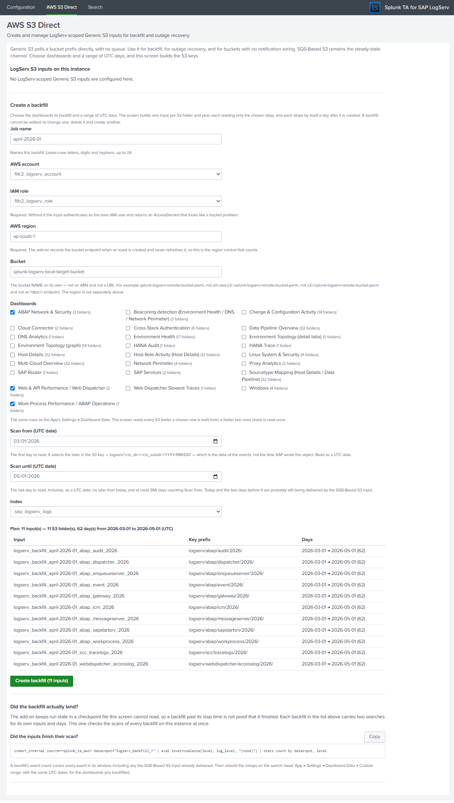
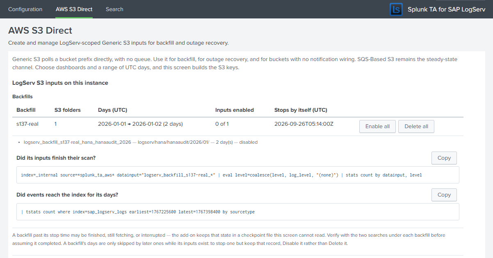

# AWS Direct S3 Polling (Backfill and Recovery)

### :material-circle-box:{ .taiconcolor } Introduction

The three AWS setup guides all use the **SQS-Based S3** input: SAP's S3 bucket emits a notification for every new object, the queue holds it, and the Splunk Add-on for Amazon Web Services fetches exactly that object. That is the steady-state ingest path, and nothing on this page replaces it.

This page covers the **Generic S3** input (`aws_s3://`) that the same add-on also ships. It polls a bucket prefix directly and needs no queue at all. It exists for the cases the notification path cannot serve:

- **Backfilling a date range that predates your input** — logs that were already in the bucket before you configured LogServ ingest.
- **Recovering from an outage** — if the Heavy Forwarder is down long enough for queue messages to age out, those notifications are gone permanently, but the objects are still in the bucket.
- **A bucket with no notification wiring** — for example, a copy of the logs you hold yourself.

The quickest way to run one is the **AWS S3 Direct** screen in the Data TA ([section 2a](#2a-the-aws-s3-direct-screen)): you choose dashboards and a range of days, and it builds the inputs. Sections 1 and 4 explain the input itself, for anyone configuring one by hand.

!!! note
    Direct S3 polling is a **secondary channel**, intended to be switched on for a specific job and switched off again. Splunk's own guidance is to use SQS-Based S3 for ongoing ingest; see [Scale limits](#scale-limits) below.

<br>

### :material-circle-box:{ .taiconcolor } 1. The prefix selects the events — the scan window does not

This is the single most important thing to understand before configuring the input by hand, and it is easy to get backwards.

A LogServ object key looks like this:

```
logserv/<clz_dir>/<clz_subdir>/<YYYY>/<MM>/<DD>/<filename>.json.gz
```

The date in that path is the **event date** — the day the logs inside the object were produced.

The input also has two datetime fields, `initial_scan_datetime` and `terminal_scan_datetime`. **Both bound the object's S3 `LastModified` timestamp — the moment the object was written to the bucket. Neither has any relationship to the timestamps of the events inside it.** The add-on names the field `last_modified` internally, and it is `last_modified` that its resume checkpoint is keyed on.

Those two clocks routinely diverge by a wide margin, because SAP writes objects into event-dated paths some time after the events occur. Objects sampled from a LogServ bucket carried 2025 event dates while every one of them had a `LastModified` in 2026.

:material-lightning-bolt:{ .taiconcolor } **So: to ingest a particular range of log dates, express it in the key — the `key_name` prefix, and for several days a `whitelist` (section 4). Use the scan-window fields only when you genuinely want to bound by upload time** — for example, "only objects written since the outage began". The AWS S3 Direct screen works this way: its **Scan from** and **Scan until** are dates in the key.

!!! warning "A blank scan field does not mean “no bound”"
    Leaving **`initial_scan_datetime`** empty does *not* mean “from the beginning of the prefix”. The add-on substitutes **now minus seven days** — `aws_s3_conf.py::_get_last_modified_time` treats both an empty value and the literal string `default` that way. A backfill of a historical prefix left blank therefore selects nothing, logs an ordinary `keys are scanned` line and reports success. Set it to an explicit floor instead - but **not a 1970 date**. Splunk's own `search/timeparser` rejects those (`HTTP 400 Invalid time.`), and the add-on resolves this field through that parser on *every poll* while validating only locally on create: the input saves cleanly, reports success and then fetches nothing, permanently. `2000-01-01T00:00:00Z` is below anything S3 can hold (S3 launched in 2006) and parses correctly.

    Leaving **`terminal_scan_datetime`** empty is the opposite problem: the add-on returns an open-ended sentinel and the input keeps polling indefinitely. Set it so a backfill run terminates on its own.

    The **AWS S3 Direct** screen (section 2a) sets both itself and never sends a blank.

??? tip "How this was established"
    Objects were copied into a bucket so that their `LastModified` (2026-09-09) and their envelope event time (2025-06-11) were about fifteen months apart. Three inputs were then created over the identical prefix, differing only in their scan bounds:

    | test | `initial_scan_datetime` | `terminal_scan_datetime` | keys selected | events |
    |---|---|---|---|---|
    | T1 | 2020-01-01 | 2026-09-01 (after the events, before the write) | **0** | **0** |
    | T2 | 2020-01-01 | 2026-12-31 | 5 | 5 |
    | T3 | 2026-09-05 (after the events, before the write) | — | **5** | **5** |

    Bounding on `LastModified` predicts 0 and 5; bounding on event time predicts 5 and 0. The measured results match `LastModified` in both directions.

<br>

### :material-circle-box:{ .taiconcolor } 2. Why the add-on's own form cannot create this input

The add-on's **S3 Bucket** field on the Generic S3 setup page is a dropdown with no free-text entry, and the endpoint that populates it calls the AWS `ListBuckets` API. That requires the `s3:ListAllMyBuckets` permission, which **cannot be scoped to a single bucket** — AWS accepts only `Resource: "*"` for it.

The consequence is worth stating plainly, because the symptom is confusing:

- **The input works perfectly at runtime on a bucket-scoped policy.** Only the form that creates it is blocked.
- If you try to use the UI you will see `AccessDenied` on the bucket dropdown, and the form cannot be saved, because there is no way to type the bucket name instead.

Whether granting `s3:ListAllMyBuckets` is even an option depends on which topology you deployed:

| Topology | Whose bucket is it? | `s3:ListAllMyBuckets` |
|---|---|---|
| [AWS Remote S3 Connect](aws-remote-s3-connect-guide.md) | SAP ECS account | Expect SAP to refuse — it would expose their entire bucket inventory |
| [AWS Remote S3 Filter](aws-remote-s3-filter-guide.md) | SAP ECS account | Same |
| [AWS Remote S3 Copy](aws-remote-s3-copy-guide.md) | Your Secondary account | Your call — but still not required, since the steps below avoid the form |

There are two ways round it, and neither needs `s3:ListAllMyBuckets`:

- **The AWS S3 Direct screen** shipped with the Splunk TA for SAP LogServ (Splunk Web → *Splunk TA for SAP LogServ* → **AWS S3 Direct**). It types the bucket name rather than listing buckets, so the blocked endpoint is never called. See section 2a.
- **REST or `inputs.conf` directly**, as in section 4, which likewise never touches that endpoint.

<br>

### :material-circle-box:{ .taiconcolor } 2a. The AWS S3 Direct screen

The Data TA ships a screen for this job: **Splunk Web → *Splunk TA for SAP LogServ* → AWS S3 Direct**. It creates and manages LogServ-scoped Generic S3 inputs inside the AWS add-on from your browser, as the signed-in user, and adds no new Python, REST handler or capability of its own.

Run it on the **heavy forwarder that will hold the inputs**. A Generic S3 input collects from the instance it is defined on, so creating one on a search head or indexer means that instance starts polling S3 — usually not what you want. The screen checks where it is running: on Splunk Cloud it will not write at all, and on an instance with no enabled AWS inputs it asks you to confirm before the first create.

??? note "Example — three rows chosen, and the plan the screen builds from them"
    

#### You choose dashboards and days; the screen builds the keys

- **Dashboards** — the same rows as the LogServ App's **Settings → Dashboard Data** list. Tick one or several. The screen reads every S3 folder (`<clz_dir>/<clz_subdir>`) those rows are built from, and a folder two rows share is read once.
- **Scan from** and **Scan until** — two **UTC dates**, both included, with no time of day. They select the date in the key, `logserv/<clz_dir>/<clz_subdir>/YYYY/MM/DD/`, which is the date of the events inside. Scan until can be today at the latest, and a range covers at most 366 days.

From those the screen creates **one input per S3 folder and calendar year**:

- its **key prefix** is the tightest one that holds the chosen days — the day itself, else its month, else its year;
- a **whitelist** names the exact days, so an input for 14 to 18 September reads those five day folders and nothing else under `…/2026/09/`;
- it is named `logserv_backfill_<job>_<folder>_<year>`, where `<job>` is the name you give the backfill (lower-case letters, digits and hyphens, up to 24 characters).

??? tip "Which S3 folders each dashboard row reads"
    Derived from the searches that build each rollup, and checked against the LogServ App on every build. The four rows whose searches read the whole index take all 32 folders. Squid appears under both of its real layouts, `proxy/squid` (the AWS bucket) and `linux/proxy` (Azure), and the Pacemaker cluster log under `linux/pacemaker` (GCP); a folder your bucket does not have gives an input that finds nothing.

    | Dashboard Data row | S3 folders |
    |---|---|
    | ABAP Network & Security | `abap/audit`, `abap/gateway`, `abap/icm` |
    | Beaconing detection | `dns/binddns`, `linux/proxy`, `proxy/squid` |
    | Change & Configuration Activity | `hana/hanaaudit`, `linux/cron`, `linux/linux_secure`, `linux/localmessages`, `linux/messages`, `linux/pacemaker`, `linux/proxy`, `linux/slapd`, `linux/sudolog`, `linux/warn`, the four `windows/WinEventLog:*` channels |
    | Cloud Connector | `scc/audit`, `scc/tracelogs` |
    | Cross-Stack Authentication | `hana/hanaaudit`, `sap/sapstartsrv`, the four `windows/WinEventLog:*` channels |
    | Data Pipeline Overview | all 32 |
    | DNS Analytics | `dns/binddns` |
    | Environment Health | `abap/dispatcher`, `abap/gateway`, `abap/icm`, `hana/hanaaudit`, `hana/tracelogs`, `linux/linux_secure`, `linux/proxy`, `proxy/squid`, `sap/saprouter`, `sap/sapstartsrv`, `scc/audit`, `scc/tracelogs`, `webdispatcher/accesslog`, the four `windows/WinEventLog:*` channels |
    | Environment Topology (detail tabs) | `abap/gateway`, `abap/icm`, `hana/hanaaudit`, `hana/tracelogs`, `webdispatcher/accesslog` |
    | Environment Topology (graph) | `abap/gateway`, `abap/icm`, `hana/hanaaudit`, `hana/tracelogs`, `linux/linux_secure`, `linux/localmessages`, `linux/messages`, `linux/proxy`, `sap/sapstartsrv`, `webdispatcher/accesslog`, the four `windows/WinEventLog:*` channels |
    | HANA Audit | `hana/hanaaudit` |
    | HANA Trace | `hana/tracelogs` |
    | Host Details | all 32 |
    | Host Role Activity | `abap/workprocess`, `dns/binddns`, `hana/hanaaudit`, `linux/localmessages`, `linux/messages`, `linux/proxy`, `sap/saprouter`, `webdispatcher/accesslog`, the four `windows/WinEventLog:*` channels |
    | Linux System & Security | `linux/cron`, `linux/linux_secure`, `linux/localmessages`, `linux/messages`, `linux/pacemaker`, `linux/proxy`, `linux/slapd`, `linux/sudolog`, `linux/warn` |
    | Multi-Cloud Overview | all 32 |
    | Network Perimeter | `dns/binddns`, `linux/linux_secure`, `linux/proxy`, `proxy/squid` |
    | Proxy Analytics | `linux/proxy`, `proxy/squid` |
    | SAP Router | `sap/saprouter` |
    | SAP Services | `sap/saphostexec`, `sap/sapstartsrv` |
    | Sourcetype Mapping | all 32 |
    | Web & API Performance / Web Dispatcher | `scc/tracelogs`, `webdispatcher/accesslog` |
    | Web Dispatcher Slowest Traces | `webdispatcher/accesslog` |
    | Windows | the four `windows/WinEventLog:*` channels |
    | Work Process Performance / ABAP Operations | `abap/dispatcher`, `abap/enqueueserver`, `abap/event`, `abap/icm`, `abap/messageserver`, `abap/sapstartsrv`, `abap/workprocess` |

    A row is not always a whole dashboard. **Environment Health**, **DNS Analytics** and **Network Perimeter** also read the **Beaconing detection** row, **ABAP Operations** is built from the *Work Process Performance / ABAP Operations* row, and **Web Dispatcher** reads both *Web & API Performance / Web Dispatcher* and *Web Dispatcher Slowest Traces* — tick all the rows a dashboard uses. The Windows event logs are one sourcetype fed by four channel folders, so a row that reads Windows events reads all four.

#### The write-time window is set for you

Every input the screen creates selects objects **whatever their write time** (`initial_scan_datetime = 2000-01-01T00:00:00Z`) and **stops by itself a day after it is created** (`terminal_scan_datetime` = the moment of creation plus 24 hours). The margin is deliberate: the add-on records a scan as finished once a pass that started after the terminal time completes, and a finished input no longer fetches. With no margin, a forwarder restart part-way through the first pass would strand the objects it had found but not yet read. A day out, the next run carries on from the add-on's own checkpoint. Until then each input re-lists its prefix every 30 minutes, which finds nothing new in a closed day.

#### What it checks before it creates anything

- **Days already covered.** A folder-day that an earlier backfill from this screen already covers — enabled *or* disabled — is skipped, and the plan says which backfill covers it. Inputs made another way select by write time, so the screen cannot tell which days they read: where they overlap, it **warns but does not skip**.
- **The SQS window.** A range that reaches today or either of the two days before it (UTC) warns that the SQS-Based S3 input is probably still delivering those days, and objects it has already delivered would be ingested a second time.
- **This forwarder's own filters.** A folder the Configuration → Filters include or exclude patterns drop is left out, and days older than the `days_in_past` cutoff are left out of the whitelist — their events would be sent to `nullQueue` on arrival — each with a warning that names the setting to change. If nothing is left, the screen refuses.
- **The basics.** A job name not already in use, an AWS account, an IAM role, a region, a valid bucket name and an index.

#### Creating and managing backfills

A **plan** below the form lists every input to be created with its key prefix and days, and updates as you type. **Create backfill (N inputs)** re-lists the existing inputs first, then creates the plan's inputs one at a time. It stops at the first failure and reports what was and was not created, and it never retries a create. To finish a partial run, create the same selection again under a new job name: the days the created inputs cover are skipped.

Each input is stamped `_meta = cloud_provider::aws`, like the SQS-Based S3 inputs, so the Multi-Cloud dashboard attributes the backfilled events the same way. The add-on's create cannot carry that field, so the screen writes it into the new input's stanza through the Data TA straight after the create and restarts the input, before its first scan. If a stamp does not complete, the confirmation names the input and the reason.

After a create, the screen names the next step — rebuild the dashboard rollups in the LogServ App for the same rows and the same dates ([step 4f](#4-run-once-backfill-procedure)).

The list at the top groups backfills by job, with **Enable all**, **Disable all** and **Delete all**. Under each backfill are two searches to copy into Search: whether its inputs finished their scan, and how many events reached the index over its own days. Inputs made another way are listed individually. **A backfill cannot be edited**: to change one, delete it and create another.



:material-lightning-bolt:{ .taiconcolor } **Prefer Disable to Delete once a backfill has finished.** The screen knows which days are covered only while the inputs that covered them exist. Deleting a finished backfill makes its days eligible again, and a later backfill of the same rows would read them a second time.

!!! note
    If your Splunk account lacks `admin_all_objects` the screen cannot write the inputs for you. It does not fail silently: it renders the exact `inputs.conf` stanzas and `curl` commands to hand to an administrator, one per input. The inputs stop by themselves a day after the configuration was generated, so apply it the same day or generate it again.

Everything in sections 3 to 6 applies to an input created this way — the screen is a front end to the same `aws_s3://` input.

<br>

### :material-circle-box:{ .taiconcolor } 3. IAM permissions

Generic S3 needs one permission more than the SQS-based path:

| Action | Scopable to one bucket? | Needed for | Already in the shipped CloudFormation? |
|---|---|---|---|
| `s3:GetObject` | ✅ Yes | Fetching each object | ✅ Yes |
| `s3:ListBucket` | ✅ Yes | **Discovering keys under the prefix** | ✅ Yes |
| `s3:ListAllMyBuckets` | ❌ No — `Resource: "*"` only | The UI dropdown only, never the runtime | ❌ No, and not required |

:material-lightning-bolt:{ .taiconcolor } **`s3:ListBucket` is the one that catches people out.** The SQS-based input never needs it — the queue message supplies the exact object key, so `GetObject` alone is enough. An environment that was provisioned narrowly for SQS-based ingest will therefore fail at the discovery step with an `AccessDenied` that mentions the bucket rather than the missing action. The CloudFormation templates shipped with this solution grant it, so a standard deployment is already correct.

#### Set `aws_iam_role` explicitly

All three AWS topologies authenticate through a **cross-account IAM role**, and the Generic S3 input does not infer it. If you set only `aws_account` and leave `aws_iam_role` empty, the input authenticates as the bare IAM user — which holds essentially no S3 permissions — and returns an `AccessDenied` that reads exactly like a bucket or prefix problem. Always set both.

<br>

### :material-circle-box:{ .taiconcolor } 4. Run-once backfill procedure

The pattern is: create the input scoped to the keys you want, let it drain, confirm, then disable it. The AWS S3 Direct screen does steps 4a and 4b for you, one input per folder and year; this is the same job by hand.

4.<b class="taiconcolor">a</b> **Work out the prefix.** Narrow it as far as you can — ideally to a single log type and a single day, for example `logserv/hana/hanaaudit/2025/06/11/`. Prefix scope is your main control over how much work the input does; see [Scale limits](#scale-limits). To read several days in one input, give it the month or year as its prefix and name the days in a `whitelist` (below).

4.<b class="taiconcolor">b</b> **Create the input** on the Heavy Forwarder, either by writing a stanza into `$SPLUNK_HOME/etc/apps/Splunk_TA_aws/local/inputs.conf` or over REST. Set both scan bounds explicitly (section 1): the floor, and a terminal time a day or so from now so the input stops by itself. The stanza form:

```ini
[aws_s3://logserv_backfill_hana_20250611]
aws_account = <your configured AWS account name>
aws_iam_role = <your cross-account IAM role name>
bucket_name = <the LogServ bucket>
key_name = logserv/hana/hanaaudit/2025/06/11/
initial_scan_datetime = 2000-01-01T00:00:00Z
terminal_scan_datetime = <tomorrow, e.g. 2026-09-26T00:00:00Z>
index = sap_logserv_logs
sourcetype = sap_logserv_logs
parse_csv_with_delimiter =
polling_interval = 1800
_meta = cloud_provider::aws
```

The equivalent REST call (curl prompts for the password). It cannot carry `_meta` — the add-on's endpoint refuses it with `400 Argument "_meta" is not supported by this handler` — so add that line to the stanza afterwards, then disable and enable the input so it starts from the stanza as written:

```bash
curl -sk -u '<your-splunk-username>' \
  https://<heavy-forwarder>:8089/servicesNS/nobody/Splunk_TA_aws/data/inputs/aws_s3 \
  -d name=logserv_backfill_hana_20250611 \
  -d aws_account=<account> \
  -d aws_iam_role=<role> \
  -d bucket_name=<bucket> \
  -d index=sap_logserv_logs \
  -d sourcetype=sap_logserv_logs \
  -d parse_csv_with_delimiter= \
  --data-urlencode initial_scan_datetime=2000-01-01T00:00:00Z \
  --data-urlencode terminal_scan_datetime=<tomorrow, e.g. 2026-09-26T00:00:00Z> \
  --data-urlencode key_name=logserv/hana/hanaaudit/2025/06/11/
```

??? tip "Several days in one input: the whitelist"
    Give the input the month (or year) as its `key_name` and a `whitelist` naming the days — this is what the AWS S3 Direct screen writes:

    ```ini
    key_name = logserv/hana/hanaaudit/2025/06/
    whitelist = ^logserv/hana/hanaaudit/2025/(?:06/(?:10|11|12))/.+$
    ```

    The add-on matches the whitelist against the **whole key** with Python's `re.search`, and appends `$` when the pattern does not end with one — so write the pattern to run to the end of the key, as above. A whitelist overrides any `blacklist`. It filters what the listing returns; the listing itself still covers everything under `key_name`, so keep the prefix as tight as the days allow.

!!! note
    **Creating the input starts it immediately.** The add-on rejects `disabled` on create (`400 Argument "disabled" is not supported by this handler`); it is accepted only on a later update. If you need to stage a configuration without running it, create it and then disable it as two calls.

4.<b class="taiconcolor">c</b> **Watch it work.** The input logs to `$SPLUNK_HOME/var/log/splunk/splunk_ta_aws_aws_s3_<input name>.log`. A healthy run logs `Start processing last_modified=...`, then one line per key, then updates its checkpoint.

4.<b class="taiconcolor">d</b> **Confirm the data.** Search the target index over the **event** dates you backfilled — not today — and check that the sourcetype resolved to the real LogServ type rather than the fallback:

```
index=sap_logserv_logs earliest=-1y | stats count by sourcetype
```

4.<b class="taiconcolor">e</b> **Disable the input** once the prefix is drained. An input past its terminal time stops fetching, but disabling it says so plainly — and until the terminal time it re-lists the prefix on every polling interval.

```bash
curl -sk -u '<your-splunk-username>' -X POST \
  https://<heavy-forwarder>:8089/servicesNS/nobody/Splunk_TA_aws/data/inputs/aws_s3/logserv_backfill_hana_20250611/disable
```

??? tip "Field names and formats that differ from the add-on's documentation"
    - The prefix field is **`key_name`**, not `key_prefix`.
    - An update must echo the full required set — `aws_account`, `bucket_name`, `index`, `parse_csv_with_delimiter`, `sourcetype` — or the endpoint returns `400 The following required arguments are missing`. Optional fields you omit are preserved.
    - **Never send `name` on an update.** It does not rename the input; it creates a *second* input pointed at the same prefix, and both will ingest. Send `name` only on create.
    - The datetime fields require a literal trailing **`Z`** (`2026-09-01T00:00:00Z`). The offset example in the add-on's own `inputs.conf.spec` (`2011-07-06T21:54:23-0700`) is rejected by the setup handler.
    - When posting datetimes or a whitelist in a form-encoded body, use `--data-urlencode`; a plain `+` in a form body decodes to a space.

4.<b class="taiconcolor">f</b> **Rebuild the dashboard rollups for the dates you backfilled.** Until you do, the data is searchable but the dashboards will not show it, because every dashboard panel reads an hourly KV Store rollup rather than the index directly, and the hourly aggregation searches only ever process the hour just past. They will never reach back over events that arrived today carrying last year's timestamps.

In the **LogServ App**, go to **Settings -> Dashboard Data**, choose a **Custom range** covering the dates you just ingested, and backfill the rows for the dashboards you backfilled.

!!! warning "Match the dates in the key, not a write-time window"
    The dates to enter are the dates in the keys you read — the `YYYY/MM/DD` part of `logserv/<clz_dir>/<clz_subdir>/YYYY/MM/DD/`. **If you used the AWS S3 Direct screen, those are its Scan from and Scan until dates: enter the same two, for the same rows.** If you created an input by hand, they are *not* its `initial_scan_datetime` / `terminal_scan_datetime`: those bound the S3 object's *upload* time, which for a re-staged archive can differ from the event dates by months — see section 1. Entering the scan window here rebuilds the wrong months and reports success.

The backfill is idempotent, so re-running it over a range you have already built is safe. Long windows are dispatched a month at a time, and you can leave the page while it runs.

!!! note "Two topology collections always use the last 30 days"
    The Environment Topology **inventory** and **IP enrichment** collections describe current state rather than history — they have no time dimension — so they always refresh over the last 30 days whatever window you choose. A longer window would resolve *fewer* partner IPs to SIDs, not more, because an IP reassigned during the window stops mapping to a single SID.

<br>

### :material-circle-box:{ .taiconcolor } 5. What to expect

Direct polling produces the same events as the SQS-based path — the same envelope handling, the same sourcetype routing, the same index-time filtering. Measured against a LogServ bucket:

| Check | Result |
|---|---|
| Gzipped `.json.gz` objects | Decompressed natively — no decoder configuration |
| NDJSON splitting | 39 objects produced **1,238 events** |
| Sourcetype routing | **`sap:hana:audit`** — the real type, not the `sap_logserv_logs` fallback |
| `_time` | The embedded envelope epoch (2025-06-11), not the ingest time |
| `host` / `source` | Taken from the envelope, overriding the S3 key |
| `clz_dir` / `clz_subdir` | Indexed, as usual |
| `_raw` | Envelope stripped to the inner log line |
| Repeat polls | **1,238 → 1,238** across two polling cycles — no duplication |

<br>

### :material-circle-box:{ .taiconcolor } 6. Idempotency

The input keeps a checkpoint keyed on the highest `LastModified` it has processed, so a prefix that has already been drained is not re-ingested on the next poll. Re-running the same input is safe.

If you deliberately want to ingest a prefix a second time, create an input under a **new name** rather than editing the old one — a fresh input starts with a fresh checkpoint. Two inputs over the same keys do not share a checkpoint, so both ingest; that is why the AWS S3 Direct screen skips days an earlier backfill from it already covers.

<br>

### :material-circle-box:{ .taiconcolor } Scale limits

The add-on displays this advisory on the Generic S3 setup page:

> Amazon S3 buckets with an excessive number of files or abundant size will result in significant performance degradation and ingestion delays. Configure an SQS-Based S3 input to achieve efficiency.

Take it seriously, and note two things about it:

- It is **unconditional**. The equivalent message appears in the input's own log on every discovery run — it was emitted while scanning a prefix containing five objects. Seeing it in a log is not evidence of a problem with your bucket.
- The reason behind it is real. Generic S3 has to **list the prefix** on every polling interval, and listing cost scales with the number of keys underneath it, not with the amount of new data — a whitelist narrows what is fetched, not what is listed.

The practical consequence for LogServ buckets is that **prefix scope matters enormously**, because LogServ keys are dense:

| Prefix | Objects |
|---|---|
| `logserv/hana/hanaaudit/2025/06/11/` (one type, one day) | 39 |
| `logserv/proxy/squid/` (one type, all dates) | 182,565 |

Nothing in the input caps the work for you. The input declares `max_items = 100000`, but the 8.1.0 add-on never reads it, so it bounds nothing.

:material-lightning-bolt:{ .taiconcolor } **Scope every backfill input to a log type and a date range.** The AWS S3 Direct screen already does — one input per folder and year, with the prefix narrowed to the month or the day when the range allows. A range that spans several months lists that folder's whole year on each pass, so for a very dense folder prefer one backfill per month.

<br>

### :material-circle-box:{ .taiconcolor } Troubleshooting

| Symptom | Cause | Fix |
|---|---|---|
| `AccessDenied` on the bucket dropdown in the UI | The dropdown calls `ListBuckets`, which needs the unscopable `s3:ListAllMyBuckets` | Use the AWS S3 Direct screen, or create the input over REST or `inputs.conf` — sections 2a and 4 |
| `AccessDenied` that looks like a bucket or prefix problem | `aws_iam_role` was left empty, so the input authenticated as the bare IAM user | Set `aws_iam_role` on the input |
| `AccessDenied` during key discovery while `GetObject` works | `s3:ListBucket` missing — the SQS-based path never needed it | Add `s3:ListBucket` scoped to the bucket |
| A hand-made input runs but finds nothing | The scan window is bounding `LastModified`, not event time — and a **blank** `initial_scan_datetime` is not “no lower bound”, it is *now minus seven days* | Express the date range in `key_name` (and a `whitelist`), and set `initial_scan_datetime` to an explicit floor such as `2000-01-01T00:00:00Z` (**not** a 1970 date - Splunk's time parser rejects those, and the input then polls forever without fetching anything). Never leave it blank — section 1 |
| The AWS S3 Direct screen offers no **Create** button | Something blocks the plan; the reason is shown above it | Fix what the red banners say — often a job name already in use, or every day skipped as covered or filtered |
| The screen skips days you expected it to read | An earlier backfill from this screen covers them, or this forwarder's filters drop them — the plan names which | To read covered days again, delete the backfill that covers them first. That ingests its events a second time, so do it only if they never arrived |
| `400 Wrong datetime with format` | The offset form from the add-on's spec was used | Use the literal `Z` form, `2026-09-01T00:00:00Z` |
| Two inputs ingesting the same prefix | `name` was sent on an update, which forks rather than renames | Delete the duplicate; send `name` only on create |
| Events land under sourcetype `sap_logserv_logs` rather than a real type | The Data TA is not installed on this forwarder, or the object is not a LogServ envelope | See [Installing the Data TA](install-ta.md) |
| Backfilled events do not appear in the dashboards | Dashboard panels read hourly rollups, which summarise only the hour just past | Step 4f — rebuild the rollups from **Settings → Dashboard Data** in the LogServ App, with a Custom range matching the dates in the key (the screen's Scan from and Scan until) |

<br>

### :material-circle-box:{ .taiconcolor } A note on Azure and GCP

There is no equivalent to this on the other two clouds. The [Azure](azure-setup.md) and [GCP](gcp-setup.md) add-ons are notification-driven only: if a Storage Queue message or a Pub/Sub notification expires before it is consumed, the object stays in the bucket but nothing will fetch it. If you need to recover such a window, contact your Splunk team.
