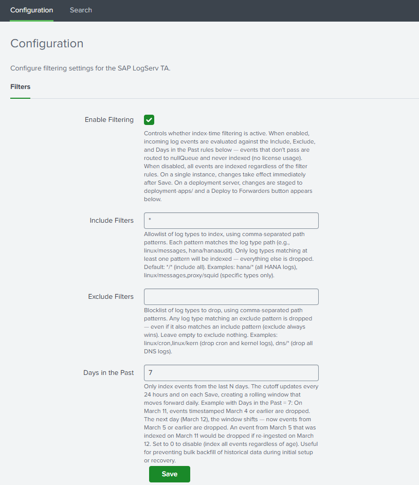
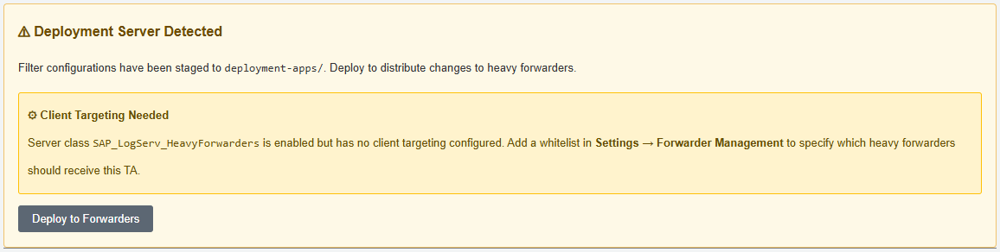

# AWS Remote S3 Connect to Filter Migration Walkthrough

### :material-circle-box:{ .taiconcolor } Introduction

This guide walks you through migrating from an existing **splunk-logserv-remote-s3-connect** deployment to the **splunk-logserv-remote-s3-filter** deployment without deleting or recreating your existing IAM User and IAM Role resources.

The migration adds Lambda-based S3 event filtering capabilities to your existing deployment, allowing you to filter S3 event notifications based on time and path patterns before they are processed by Splunk.

??? tip "Also available: Native TA Index-Time Filtering"
    Starting with version 0.0.3, the TA also includes **built-in index-time filtering** that works inside Splunk itself. This can be used alongside or instead of Lambda-based filtering. After completing this migration (or with any deployment scenario), see [Configuring Filters](configure-filters.md) or the section at the bottom of this page.

:material-lightning-bolt:{ .taiconcolor } This migration guide assumes you have already completed the [AWS Remote S3 Connect Setup](aws-remote-s3-connect-walkthrough.md) and have a working deployment in your **_Secondary account_**.

<br>

### :material-circle-box:{ .taiconcolor } What the Migration Does

The Python migration script performs the following actions on your existing deployment:

??? tip "Migration Actions"
    **Updates to Existing Resources:**

    - Updates the existing IAM Role trust policy to allow Lambda service
    - Attaches the **_AWSLambdaBasicExecutionRole_** managed policy to the existing IAM Role
    - Adds CloudWatch Logs permissions to the existing IAM policy
    - Adds local SQS queue permissions to the existing IAM policy

    **New Resources Created:**

    - An SQS Queue - Default name is **_splunk-logserv-local-target-queue_**
    - A Dead Letter SQS Queue - Default name is **_splunk-logserv-local-target-queue-dlq_**
    - A Lambda Function - Default name is **_splunk-logserv-lambda-filter_**
    - A CloudWatch LogGroup used by the Lambda Function
    - An Event Source Mapping connecting the Lambda to the cross-account SQS Queue

<br>

### :material-circle-box:{ .taiconcolor } Architecture After Migration

After migration, the architecture will match the **splunk-logserv-remote-s3-filter** deployment:

- S3 event notifications from the **_SAP ECS account_** are received by the Lambda function
- The Lambda function filters events based on time (days in past) and path patterns (include/exclude)
- Matching events are forwarded to a local SQS queue in your **_Secondary account_**
- Splunk polls the local SQS queue for filtered notifications

<br>

### :material-circle-box:{ .taiconcolor } Prerequisites

Before starting the migration, ensure you have the following:

**Existing Deployment:**

- A working **splunk-logserv-remote-s3-connect** deployment in your **_Secondary account_**
- The ARN and name of the existing IAM Role (e.g., `splunk-logserv-ta-role`)
- The ARN of the existing IAM User (e.g., `arn:aws:iam::123456789012:user/splunk_logserv_user`)
- The name of the existing IAM policy attached to the role (e.g., `splunk-logserv-ta-policy`)

**Cross-Account Information:**

- The ARN of the SQS Queue in your **_SAP ECS account_**
- The name of the S3 Bucket in your **_SAP ECS account_**

**Local Environment:**

- Python 3.9 or higher installed
- boto3 library installed
- AWS CLI configured with appropriate credentials/profile

<br>

### :material-circle-box:{ .taiconcolor } High Level Steps

Below are the high level steps for the migration process listed in the order they should be followed.

:material-lightning-bolt:{ .taiconcolor } Please ensure the user you log in with in your AWS **_Secondary account_** has the appropriate permissions to perform all the steps outlined below.

1. Install Python and boto3 dependencies (if not already installed)
2. Create a new S3 Bucket in your **_Secondary account_** and upload the Lambda function ZIP file
3. Download the migration scripts and configuration file
4. Configure the migration configuration file with your deployment details
5. Run the migration script in dry-run mode, then execute it to perform the migration
6. Update the Splunk AWS Add-on SQS-Based S3 Input to use the new local queue
7. Verify the migration is successful

<br>

### :material-circle-box:{ .taiconcolor } 1. Install Python and boto3

The migration scripts require Python 3.9 or higher and the boto3 library.

#### :material-crop-square:{ .taiconcolor } Check Python Version

Open a command prompt or terminal and run the following command to check your Python version:

```bash
python --version
```

If Python is not installed or the version is below 3.9, download and install Python from the <a href="https://www.python.org/downloads/" target="_blank">official Python website</a>.

:material-lightning-bolt:{ .taiconcolor } On Windows, ensure you check the **_Add Python to PATH_** option during installation.

#### :material-crop-square:{ .taiconcolor } Check boto3 Installation

Run the following command to check if boto3 is installed:

```bash
pip show boto3
```

If boto3 is installed, you will see version and location information. If not installed, you will see a warning message.

#### :material-crop-square:{ .taiconcolor } Install boto3

If boto3 is not installed, run the following command to install it:

```bash
pip install boto3
```

<br>

### :material-circle-box:{ .taiconcolor } 2. Create S3 Bucket with Lambda Function ZIP File

2.<b style="color: #ff9100">a</b> Take note of the **AWS Region** in your **_SAP ECS account_** where the S3 Bucket and SQS Queue are located.

2.<b style="color: #ff9100">b</b> Log into your AWS **_Secondary account_** and change to the region that matches the region in your **_SAP ECS account_**

2.<b style="color: #ff9100">c</b> Choose a name for the new S3 bucket (**_splunk-logserv-lambda-binary_** is the default bucket name in the migration configuration file)

2.<b style="color: #ff9100">d</b> Navigate to the S3 console and create a <a href="https://docs.aws.amazon.com/AmazonS3/latest/userguide/create-bucket-overview.html" target="_blank">general purpose S3 bucket</a> using all the default settings

2.<b style="color: #ff9100">e</b> <a href="https://docs.aws.amazon.com/AmazonS3/latest/userguide/upload-objects.html" target="_blank">Upload</a> the <a href="https://github.com/splunk/splunk-sap-logserv/blob/main/aws_assets/lambda_function/splunk-logserv-filter-lambda.zip" target="_blank">splunk-logserv-filter-lambda.zip</a> file to the root of the S3 bucket

<br>

### :material-circle-box:{ .taiconcolor } 3. Download Migration Scripts

Download the following files from the GitHub repository to a local directory on your machine:

| File | Description |
|------|-------------|
| <a href="https://github.com/splunk/splunk-sap-logserv/blob/main/aws_assets/cloud_formation/migration/connect_2_filter/migrate-config.json" target="_blank">migrate-config.json</a> | Configuration file with all migration parameters |
| <a href="https://github.com/splunk/splunk-sap-logserv/blob/main/aws_assets/cloud_formation/migration/connect_2_filter/migrate-to-filter.py" target="_blank">migrate-to-filter.py</a> | Python script that performs the migration |
| <a href="https://github.com/splunk/splunk-sap-logserv/blob/main/aws_assets/cloud_formation/migration/connect_2_filter/migrate-to-filter-rollback.py" target="_blank">migrate-to-filter-rollback.py</a> | Python script that rolls back the migration |

<br>

### :material-circle-box:{ .taiconcolor } 4. Configure Migration Settings

Open the **_migrate-config.json_** file in a text editor and update the values to match your deployment.

#### :material-crop-square:{ .taiconcolor } Existing Resources Configuration

Update the **_existing_resources_** section with the details from your current **splunk-logserv-remote-s3-connect** deployment:

```json
"existing_resources": {
    "iam_user_arn": "arn:aws:iam::YOUR_ACCOUNT_ID:user/YOUR_IAM_USER_NAME",
    "iam_role_name": "YOUR_IAM_ROLE_NAME",
    "iam_role_arn": "arn:aws:iam::YOUR_ACCOUNT_ID:role/YOUR_IAM_ROLE_NAME",
    "iam_role_policy_name": "YOUR_IAM_POLICY_NAME"
}
```

| Parameter | Description | Example |
|-----------|-------------|---------|
| **iam_user_arn** | ARN of the existing IAM User | `arn:aws:iam::112543817624:user/splunk_logserv_user` |
| **iam_role_name** | Name of the existing IAM Role | `splunk-logserv-ta-role` |
| **iam_role_arn** | ARN of the existing IAM Role | `arn:aws:iam::112543817624:role/splunk-logserv-ta-role` |
| **iam_role_policy_name** | Name of the existing inline policy on the IAM Role | `splunk-logserv-ta-policy` |

#### :material-crop-square:{ .taiconcolor } Cross-Account Configuration

Update the **_cross_account_** section with the details from your **_SAP ECS account_**:

```json
"cross_account": {
    "sqs_queue_arn": "arn:aws:sqs:REGION:SAP_ACCOUNT_ID:QUEUE_NAME",
    "s3_bucket_name": "SAP_S3_BUCKET_NAME"
}
```

| Parameter | Description | Example |
|-----------|-------------|---------|
| **sqs_queue_arn** | ARN of the SQS Queue in your SAP ECS account | `arn:aws:sqs:ap-south-1:395719258032:sap-logserv-queue` |
| **s3_bucket_name** | Name of the S3 Bucket in your SAP ECS account | `sap-logserv-bucket` |

#### :material-crop-square:{ .taiconcolor } Local SQS Configuration

Update the **_local_sqs_** section to configure the local SQS queue that will receive filtered notifications:

```json
"local_sqs": {
    "queue_name": "splunk-logserv-local-target-queue",
    "visibility_timeout_seconds": 600,
    "message_retention_seconds": 1209600,
    "dlq_max_receive_count": 3
}
```

| Parameter | Description | Default |
|-----------|-------------|---------|
| **queue_name** | Name for the local SQS queue | `splunk-logserv-local-target-queue` |
| **visibility_timeout_seconds** | Visibility timeout in seconds | `600` (10 minutes) |
| **message_retention_seconds** | Message retention period in seconds | `1209600` (14 days) |
| **dlq_max_receive_count** | Max receives before sending to DLQ | `3` |

#### :material-crop-square:{ .taiconcolor } Lambda Function Configuration

Update the **_lambda_function_** section to configure the Lambda filter function:

```json
"lambda_function": {
    "function_name": "splunk-logserv-lambda-filter",
    "code_s3_bucket": "splunk-logserv-lambda-binary",
    "code_s3_key": "splunk-logserv-filter-lambda.zip",
    "handler": "log-filterer-lambda.lambda_handler",
    "runtime": "python3.12",
    "timeout_seconds": 300,
    "memory_size_mb": 512
}
```

| Parameter | Description | Default |
|-----------|-------------|---------|
| **function_name** | Name for the Lambda function | `splunk-logserv-lambda-filter` |
| **code_s3_bucket** | S3 bucket containing the Lambda ZIP file | `splunk-logserv-lambda-binary` |
| **code_s3_key** | S3 key (path) to the Lambda ZIP file | `splunk-logserv-filter-lambda.zip` |
| **handler** | Lambda handler function | `log-filterer-lambda.lambda_handler` |
| **runtime** | Lambda runtime | `python3.12` |
| **timeout_seconds** | Lambda timeout in seconds | `300` (5 minutes) |
| **memory_size_mb** | Lambda memory allocation in MB | `512` |

#### :material-crop-square:{ .taiconcolor } Filter Settings Configuration

Update the **_filter_settings_** section to configure the S3 event filtering behavior:

```json
"filter_settings": {
    "days_in_the_past": 7,
    "include_filters": "linux/*,hana/*",
    "exclude_filters": "linux/cron,linux/messages,linux/localmessages,linux/slapd,linux/sudolog,linux/warn"
}
```

| Parameter | Description | Default |
|-----------|-------------|---------|
| **days_in_the_past** | Filter out messages older than this many days | `7` |
| **include_filters** | Comma-separated fnmatch patterns for paths to include | `linux/*,hana/*` |
| **exclude_filters** | Comma-separated fnmatch patterns for paths to exclude | `linux/cron,linux/messages,...` |

:material-lightning-bolt:{ .taiconcolor } Use `*/*` for **include_filters** to include all paths. Leave **exclude_filters** empty to exclude nothing.

#### :material-crop-square:{ .taiconcolor } Event Source Mapping Configuration

Update the **_event_source_mapping_** section to configure the Lambda trigger:

```json
"event_source_mapping": {
    "batch_size": 10,
    "maximum_batching_window_seconds": 5,
    "maximum_concurrency": 10
}
```

| Parameter | Description | Default |
|-----------|-------------|---------|
| **batch_size** | Number of messages per Lambda invocation | `10` |
| **maximum_batching_window_seconds** | Max time to wait for a full batch | `5` |
| **maximum_concurrency** | Max concurrent Lambda executions | `10` |

<br>

### :material-circle-box:{ .taiconcolor } 5. Run Migration Script

#### :material-crop-square:{ .taiconcolor } Command Line Arguments

The migration script supports the following command line arguments:

| Argument | Short | Required | Description |
|----------|-------|----------|-------------|
| `--config` | `-c` | Yes | Path to the migration configuration JSON file |
| `--region` | `-r` | Yes | AWS region (must match your existing deployment region) |
| `--profile` | `-p` | No | AWS CLI profile name (uses default credentials if not specified) |
| `--dry-run` | `-d` | No | Preview changes without making any modifications |

#### :material-crop-square:{ .taiconcolor } Dry Run Mode

:material-lightning-bolt:{ .taiconcolor } Always run the migration script in dry-run mode first to preview the changes that will be made.

**Windows Command Prompt:**

```bash
python migrate-to-filter.py --config migrate-config.json --region us-east-1 --dry-run
```

**Windows Command Prompt with AWS Profile:**

```bash
python migrate-to-filter.py --config migrate-config.json --region us-east-1 --profile my-aws-profile --dry-run
```

**Linux/macOS Terminal:**

```bash
python3 migrate-to-filter.py --config migrate-config.json --region us-east-1 --dry-run
```

**Linux/macOS Terminal with AWS Profile:**

```bash
python3 migrate-to-filter.py --config migrate-config.json --region us-east-1 --profile my-aws-profile --dry-run
```

Review the dry-run output to ensure all steps are correct and the existing resources are found.

#### :material-crop-square:{ .taiconcolor } Execute Migration

Once you have verified the dry-run output, run the migration script without the `--dry-run` flag:

**Windows Command Prompt:**

```bash
python migrate-to-filter.py --config migrate-config.json --region us-east-1
```

**Windows Command Prompt with AWS Profile:**

```bash
python migrate-to-filter.py --config migrate-config.json --region us-east-1 --profile my-aws-profile
```

**Linux/macOS Terminal:**

```bash
python3 migrate-to-filter.py --config migrate-config.json --region us-east-1
```

**Linux/macOS Terminal with AWS Profile:**

```bash
python3 migrate-to-filter.py --config migrate-config.json --region us-east-1 --profile my-aws-profile
```

The script will display progress for each step and provide a summary upon completion, including the new local SQS queue URL that you will need for the next step.

<br>

### :material-circle-box:{ .taiconcolor } 6. Update Splunk AWS Add-on Configuration

After the migration completes successfully, you need to update your existing SQS-Based S3 Input in the Splunk Add-on for AWS to use the new local SQS queue.

6.<b style="color: #ff9100">a</b> Log into your Splunk instance and open the **_Splunk Add-on for AWS_**

6.<b style="color: #ff9100">b</b> Navigate to **_Inputs_** and find your existing SQS-Based S3 Input

6.<b style="color: #ff9100">c</b> Click **_Edit_** on the input

6.<b style="color: #ff9100">d</b> Update the **_SQS Queue Name_** field to use the new local queue URL from the migration output
    - Example: `https://sqs.ap-south-1.amazonaws.com/112543817624/splunk-logserv-local-target-queue`

6.<b style="color: #ff9100">e</b> Click **_Save_** to apply the changes

The input will restart and begin polling the new local filtered queue.

<br>

### :material-circle-box:{ .taiconcolor } 7. Verify Migration

After completing the migration and updating the Splunk configuration:

7.<b style="color: #ff9100">a</b> **Check Lambda Logs** - Navigate to CloudWatch Logs in the AWS Console and verify the Lambda function is receiving and processing messages

7.<b style="color: #ff9100">b</b> **Check Local SQS Queue** - Navigate to SQS in the AWS Console and verify messages are appearing in the local queue

7.<b style="color: #ff9100">c</b> **Check Splunk** - Run a search for recent LogServ logs to confirm data is being ingested:
    ```
    index=your_index sourcetype=sap_logserv_logs earliest=-1h
    ```

<br>

### :material-circle-box:{ .taiconcolor } Rollback Migration

If you need to rollback the migration and return to the original **splunk-logserv-remote-s3-connect** configuration, use the rollback script.

#### :material-crop-square:{ .taiconcolor } Rollback Command Line Arguments

The rollback script supports the same command line arguments as the migration script:

| Argument | Short | Required | Description |
|----------|-------|----------|-------------|
| `--config` | `-c` | Yes | Path to the migration configuration JSON file |
| `--region` | `-r` | Yes | AWS region |
| `--profile` | `-p` | No | AWS CLI profile name (uses default credentials if not specified) |
| `--dry-run` | `-d` | No | Preview changes without making any modifications |

#### :material-crop-square:{ .taiconcolor } Rollback Dry Run

:material-lightning-bolt:{ .taiconcolor } Always run the rollback script in dry-run mode first to preview what will be removed.

**Windows Command Prompt:**

```bash
python migrate-to-filter-rollback.py --config migrate-config.json --region us-east-1 --dry-run
```

**Windows Command Prompt with AWS Profile:**

```bash
python migrate-to-filter-rollback.py --config migrate-config.json --region us-east-1 --profile my-aws-profile --dry-run
```

**Linux/macOS Terminal:**

```bash
python3 migrate-to-filter-rollback.py --config migrate-config.json --region us-east-1 --dry-run
```

**Linux/macOS Terminal with AWS Profile:**

```bash
python3 migrate-to-filter-rollback.py --config migrate-config.json --region us-east-1 --profile my-aws-profile --dry-run
```

#### :material-crop-square:{ .taiconcolor } Execute Rollback

Once you have verified the dry-run output, run the rollback script without the `--dry-run` flag:

**Windows Command Prompt:**

```bash
python migrate-to-filter-rollback.py --config migrate-config.json --region us-east-1
```

**Windows Command Prompt with AWS Profile:**

```bash
python migrate-to-filter-rollback.py --config migrate-config.json --region us-east-1 --profile my-aws-profile
```

**Linux/macOS Terminal:**

```bash
python3 migrate-to-filter-rollback.py --config migrate-config.json --region us-east-1
```

**Linux/macOS Terminal with AWS Profile:**

```bash
python3 migrate-to-filter-rollback.py --config migrate-config.json --region us-east-1 --profile my-aws-profile
```

??? tip "What does the rollback script do?"
    **Removes Created Resources:**

    - Deletes the Event Source Mapping
    - Deletes the Lambda function
    - Deletes the CloudWatch Log Group
    - Deletes the local SQS queue and Dead Letter Queue

    **Reverts IAM Changes:**

    - Removes local SQS permissions from the existing IAM policy
    - Removes CloudWatch Logs permissions from the existing IAM policy
    - Detaches the **_AWSLambdaBasicExecutionRole_** managed policy
    - Reverts the IAM Role trust policy to remove Lambda service

After rollback, update your Splunk AWS Add-on SQS-Based S3 Input to use the original cross-account SQS queue URL from your **_SAP ECS account_**.

<br>

### :material-circle-box:{ .taiconcolor } Troubleshooting

#### :material-crop-square:{ .taiconcolor } Lambda Not Receiving Messages

- Verify the Event Source Mapping is enabled in the Lambda console
- Verify cross-account permissions are correctly configured for your IAM Role
- Check the IAM Role trust policy includes `lambda.amazonaws.com`

#### :material-crop-square:{ .taiconcolor } Lambda Errors in CloudWatch

- Check for "Access Denied" errors which indicate IAM permission issues
- Verify the Lambda code ZIP file was uploaded correctly to S3
- Check the handler name in the configuration matches the Lambda code

#### :material-crop-square:{ .taiconcolor } Messages Not Appearing in Local Queue

- Review the Lambda CloudWatch logs for filtering decisions
- Verify the **include_filters** patterns match your expected paths
- Check the **days_in_the_past** setting is not filtering out your messages

#### :material-crop-square:{ .taiconcolor } Splunk Not Ingesting

- Verify the local SQS queue URL is correctly configured in the Splunk input
- Check the Splunk AWS Add-on internal logs for connection errors
- Verify messages are present in the local SQS queue

<br>

---

## Configure Native TA Index-Time Filtering

### :material-circle-box:{ .taiconcolor } Introduction

Starting with version 0.0.3, the Splunk TA for SAP LogServ includes **built-in index-time filtering** that works inside Splunk itself, independently of the Lambda-based S3 event filtering configured above. You can use both approaches together for defense-in-depth filtering, or use the native TA filtering on its own.

??? tip "Native TA Filtering vs. Lambda-based Filtering"
    - **Lambda-based filtering** (configured above) filters S3 event notifications *before* they reach Splunk, reducing the number of SQS messages processed by the Splunk AWS Add-on.
    - **Native TA filtering** (configured below) filters events *inside Splunk at index time* via TRANSFORMS-based queue routing. Filtered events never consume Splunk license.
    
    Both use the same `clz_dir/clz_subdir` pattern syntax. Using both together means events are filtered at the AWS level first and then again at the Splunk level, providing a safety net if either filter configuration is incomplete.

<br>

### :material-circle-box:{ .taiconcolor } Open the Filters Tab

1. In Splunk Web, open the **Splunk TA for SAP LogServ** app
2. Go to **Configuration → Filters**



<br>

### :material-circle-box:{ .taiconcolor } Set Your Filter Options

#### :material-crop-square:{ .taiconcolor } Enable Filtering

Check the **Enable Filtering** checkbox to activate index-time filtering.

#### :material-crop-square:{ .taiconcolor } Include Filters

Comma-separated patterns specifying which log types to include. Patterns use the format `clz_dir/clz_subdir` with `fnmatch`-style wildcards:

| Pattern | Meaning |
|---------|---------|
| `*/*` | Include all log types (default) |
| `hana/hanaaudit` | Include only HANA audit logs |
| `linux/*` | Include all Linux log types |
| `linux/messages, hana/*` | Include Linux messages and all HANA logs |

:material-lightning-bolt:{ .taiconcolor } This field cannot be empty when filtering is enabled. Use `*/*` to include everything.

#### :material-crop-square:{ .taiconcolor } Exclude Filters

Comma-separated patterns for log types to exclude. Events matching any exclude pattern are dropped even if they also match an include pattern. Leave empty to exclude nothing.

#### :material-crop-square:{ .taiconcolor } Days in the Past

Whole number (0–3650) specifying the maximum age of events to index. Set to `0` to disable time-based filtering. Default: `7`.

#### :material-crop-square:{ .taiconcolor } Save

Click **Save**. The TA validates your patterns and generates the necessary configuration files.

<br>

### :material-circle-box:{ .taiconcolor } Deployment Server: Deploy to Forwarders

If you are running on a Deployment Server with Heavy Forwarders, additional steps are required after saving filters.

After saving, the Filters tab will display a **"⚠ Deployment Server Detected"** banner with a **"Deploy to Forwarders"** button.



#### :material-crop-square:{ .taiconcolor } Configure the Server Class (First Time Only)

1. Go to **Settings → Forwarder Management**
2. Find the `SAP_LogServ_HeavyForwarders` server class
3. Click the three-dot menu → **Edit agent assignment**
4. Add your Heavy Forwarder IP addresses or hostnames
5. Save the agent assignment

#### :material-crop-square:{ .taiconcolor } Deploy

1. Return to the Filters tab and click **"Deploy to Forwarders"**
2. Confirm the deployment
3. Wait for HFs to phone home (typically 30–60 seconds)
4. Verify deployment status in **Settings → Forwarder Management**

<br>

### :material-circle-box:{ .taiconcolor } Verify Native Filtering

After deployment, verify that native filtering is operating correctly:

```spl
`sap_logserv_idx_macro` | stats count by clz_dir, clz_subdir
```

You should see data only for log types matching your include patterns. See [Configuring Filters](configure-filters.md) for the full verification and troubleshooting guide.

