# AWS Remote S3 Connect Setup Walkthrough

### :material-circle-box:{ .taiconcolor } Introduction

The deployment diagram below shows two different AWS accounts.  For brevity and clarity, the AWS account at the top of the diagram will be referred to as the **_SAP ECS account_** and the second AWS account in the middle of the diagram will be referred to as the **_Secondary account_** from this point onward. 

Ensure you have completed all of the steps in the [prerequisites](prerequisites.md) and the [installation of the Splunk TA for SAP LogServ](install-ta.md) before you continue with the steps in this setup walkthrough.

Your SAP ECS LogServ subscription for AWS (e.g. in your **_SAP ECS account_**) should have one S3 Bucket in that account where LogServ will store your LogServ logs.  It should also have one SQS Queue in your **_SAP ECS account_** that receives notifications when new logs are added to the S3 Bucket in that account.

You will need obtain the <a href="https://docs.aws.amazon.com/IAM/latest/UserGuide/reference-arns.html" target="_blank">AWS ARN</a> for the SQS Queue and the S3 Bucket that resides in your **_SAP ECS account_** prior to performing the steps in this setup walkthrough.

Take note of the AWS Region in your **_SAP ECS account_** where the S3 Bucket and SQS Queue are located as you will need to deploy the CloudFormation template provided in that same region in your **_Secondary account_**. 

??? tip
    If you want to ingest historical logs from the S3 bucket in the SAP ECS account, the [AWS Remote S3 Copy Setup](aws-remote-s3-copy-walkthrough.md) is the recommended approach. Utilizing that approach provides you the ability to copy historical logs from the S3 bucket in the SAP ECS account to a secondary S3 bucket, so they will be ingested into Splunk, with the flexibility to switch over to this remote S3 connect deployment approach afterward.

    If you have no interest in obtaining the historical logs then use this remote S3 connect deployment approach.   

### :material-circle-box:{ .taiconcolor } High Level Steps

Below are the high level steps for this setup process listed in the order they should be followed.

:material-lightning-bolt:{ .taiconcolor } Please ensure the user you log in with in your AWS **_Secondary account_** has the appropriate permissions to perform all the steps outlined below.

1. Obtain the ARNs for the SQS Queue and the S3 Bucket in your **_SAP ECS account_**
2. Deploy the AWS <a href="https://github.com/splunk/splunk-sap-logserv/blob/main/aws_assets/cloud_formation/splunk-logserv-remote-s3-connect.yaml" target="_blank">CloudFormation Template</a> provided for this remote S3 connect deployment approach in your **_Secondary account_**
3. Contact SAP LogServ support and request an update to the access policies for the <a href="https://github.com/splunk/splunk-sap-logserv/blob/main/aws_assets/sap_ecs_account_policies/sap-ecs-account-sqs-access-policy.json" target="_blank">SQS Queue</a> and <a href="https://github.com/splunk/splunk-sap-logserv/blob/main/aws_assets/sap_ecs_account_policies/sap-ecs-account-s3-access-policy.json" target="_blank">S3 Bucket</a> residing in your **_SAP ECS account_**
4. Create an <a href="https://docs.aws.amazon.com/keyspaces/latest/devguide/create.keypair.html" target="_blank">Access Key</a> for the new IAM User that was created with the CloudFormation template in your **_Secondary account_**
5. Configure your AWS **_Secondary account_** in the <a href="https://splunk.github.io/splunk-add-on-for-amazon-web-services/ManageAwsAccounts/" target="_blank">Splunk Add-on for Amazon Web Services (AWS)</a>
6. Configure the new cross-account <a href="https://splunk.github.io/splunk-add-on-for-amazon-web-services/ManageAwsIAMRole/" target="_blank">IAM Role</a> from your AWS **_Secondary account_** in the Splunk Add-on for Amazon Web Services (AWS).
7. Configure a new <a href="https://splunk.github.io/splunk-add-on-for-amazon-web-services/SQS-basedS3/" target="_blank">SQS-Based S3 Input</a> in the Splunk Add-on for Amazon Web Services (AWS).
8. Confirm that LogServ logs are being ingested into Splunk

### :material-circle-box:{ .taiconcolor } Deploy CloudFormation Template

:material-lightning-bolt:{ .taiconcolor } Before you deploy the CloudFormation template, take note of the AWS Region in your **_SAP ECS account_** where the S3 Bucket and SQS Queue are located as you will need to deploy the CloudFormation template provided in that same region in your **_Secondary account_**.

??? tip "What does the CloudFormation template do?"
    Creates the following resources:
    
    - An IAM User - Default name is **_splunk_logserv_user_**
    - An IAM Policy named **_splunk-logserv-ta-policy_**
    - An IAM Role named **_splunk-logserv-ta-role_**
    - An Inline IAM Policy on the IAM User to assume the IAM Role created above

1. Navigate to the CloudFormation console (ensure the region you are in matches the region in your **_SAP ECS account_**)
2. Click on the **_Create stack_** button and select **_With new resources (standard)_**
??? indented-note "Example"
    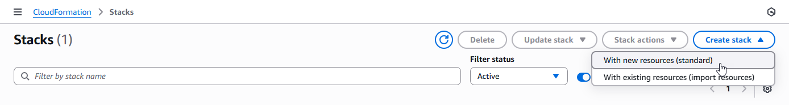

3. Upload the AWS <a href="https://github.com/splunk/splunk-sap-logserv/blob/main/aws_assets/cloud_formation/splunk-logserv-remote-s3-connect.yaml" target="_blank">CloudFormation Template file provided</a> for this remote S3 connect deployment approach, then click the **_Next_** button
??? indented-note "Example"
    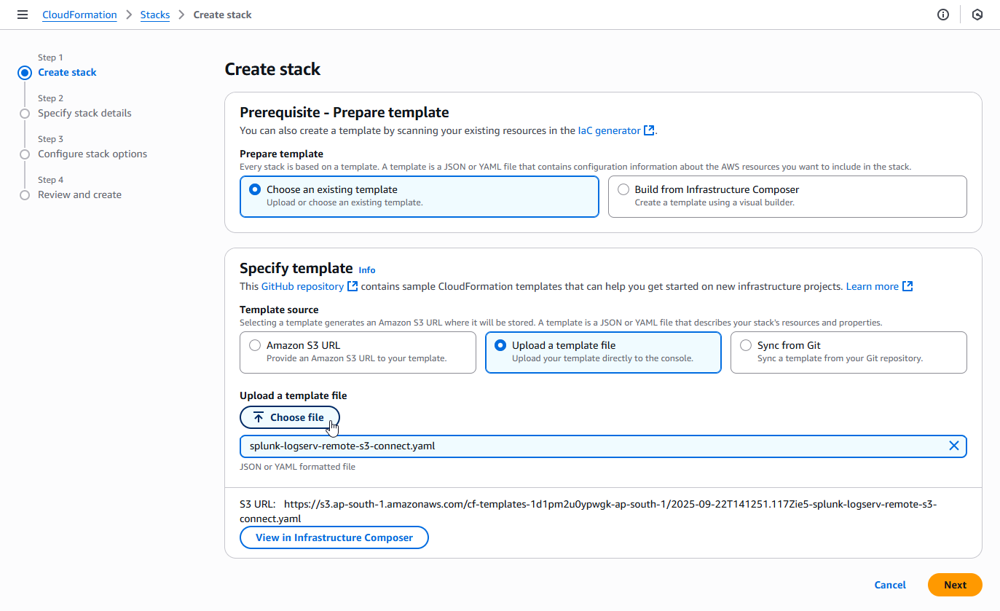

4. Enter a name for the CloudFormation Stack - **_splunk-logserv-remote-s3-connect_**
??? indented-note "Example"
    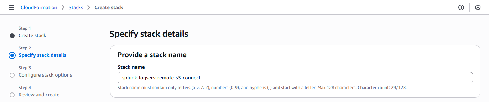

5. Enter just the name (not the ARN) of the S3 Bucket in your **_SAP ECS account_** in the **_CrossAccountS3Bucket_** parameter
   - If your ARN looks like this *arn:aws:s3:::sap-hec-clz-ap-south-1-hec53-xsd* then just use the name like this *ap-hec-clz-ap-south-1-hec53-xsd*
??? indented-note "Example"
    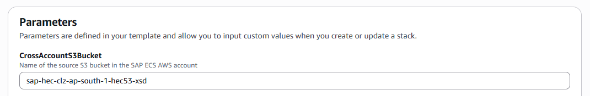

6. Enter the complete ARN of the SQS Queue in your **_SAP ECS account_** in the **_CrossAccountSQSQueueArn_** parameter
??? indented-note "Example"
    

7. Choose and enter a name for the IAM User to be created in your **_Secondary account_** in the **NewIAMUserName** parameter, then click on the **_Next_** button
??? indented-note "Example"
    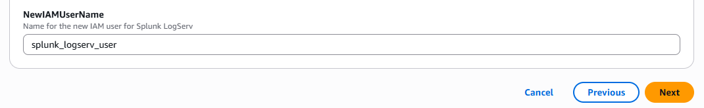

8. Scroll down to the bottom of the page and check the **_I acknowledge that AWS CloudFormation might create IAM resources with custom names_** checkbox, then click on the **_Next_** button
??? indented-note "Example"
    

9. Scroll down to the bottom of the page and click on the **_Submit_** button
??? indented-note "Example"
    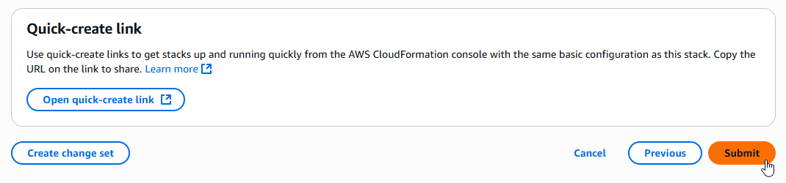

10. Ensure the deployment of the CloudFormation template completes successfully
??? indented-note "Example- Image Needs Update !!!!"
    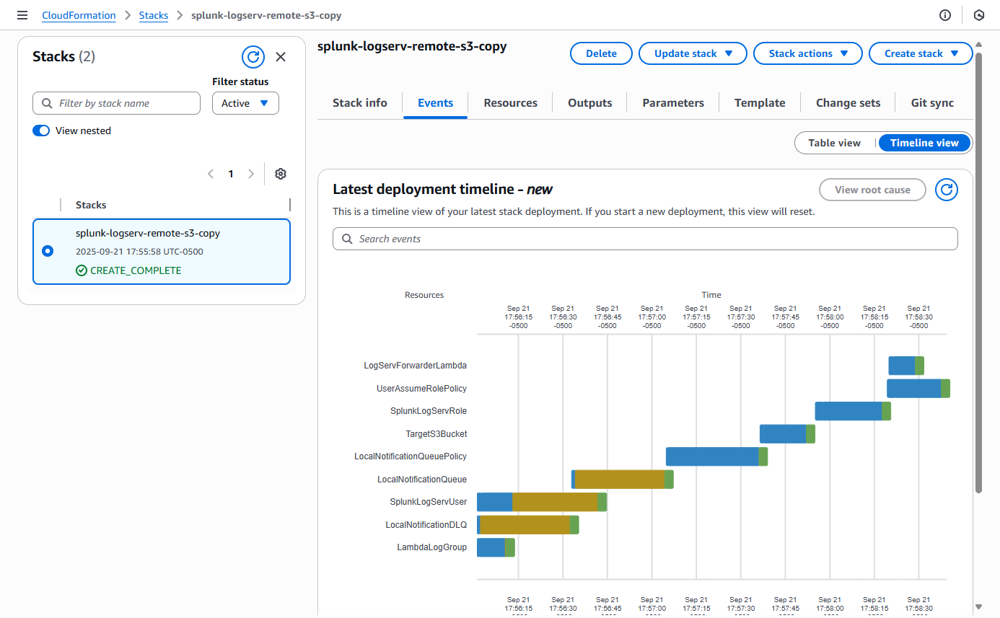

### :material-circle-box:{ .taiconcolor } Contact SAP LogServ Support

Once the deployment of the CloudFormation templates completes successfully, you will need to provide SAP LogServ Support with the ARN of the IAM Role named **_splunk-logserv-ta-role_** that was created by the template.

The ARN for the IAM Role should look like the one below but with your 12-digit AWS account Id of your **_Secondary account_**.

arn:aws:iam::**_secondary-account-id_**:role/splunk-logserv-ta-role

Example access policies for the SQS Queue and S3 Bucket residing in your **_SAP ECS account_** are provided as a reference to provide clarity on the specific permissions that need to be applied by the SAP LogServ Support team.

- <a href="https://github.com/splunk/splunk-sap-logserv/blob/main/aws_assets/sap_ecs_account_policies/sap-ecs-account-sqs-access-policy.json" target="_blank">Example SQS Queue Access Policy</a>
- <a href="https://github.com/splunk/splunk-sap-logserv/blob/main/aws_assets/sap_ecs_account_policies/sap-ecs-account-s3-access-policy.json" target="_blank">Example S3 Bucket Access Policy</a>

### :material-circle-box:{ .taiconcolor } Create Access Key for IAM User

1. Navigate to the IAM console in your **_Secondary account_** and search for the IAM User name you used when deploying the CloudFormation template. Click on the name of the IAM User to see the user details.
??? indented-note "Example"
    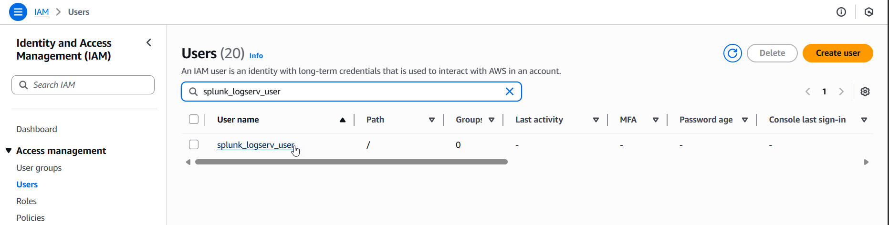

2. Click on the **_Security credentials_** tab in the middle of the screen. Scroll down and click on the **_Create access key_** button.
??? indented-note "Example"
    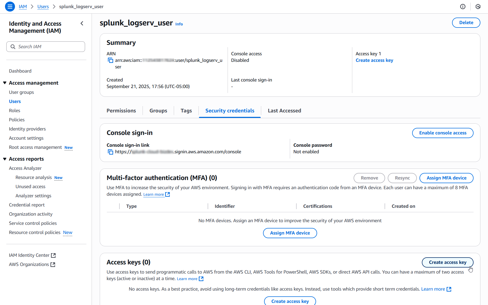

3. Select the **_Local code_** use case, check the **_Confirmation_** checkbox and click on the **_Next_** button.
??? indented-note "Example"
    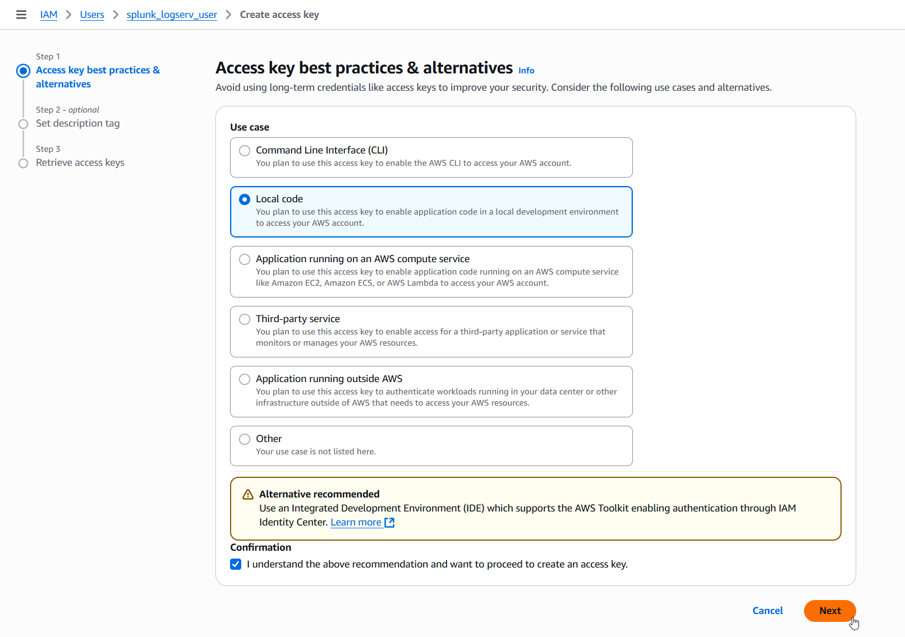

4. Enter a description tag value if desired and click on the **_Create access key_** button.
??? indented-note "Example"
    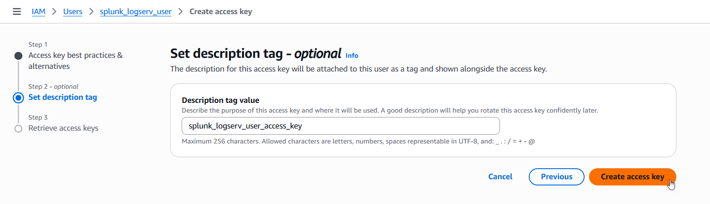

5. Copy the values for both the **_Access key_** and the **_Secret access key_** and save them in a secure place as you will need them in the upcoming steps. Now click on the **_Done_** button.
??? indented-note "Example"
    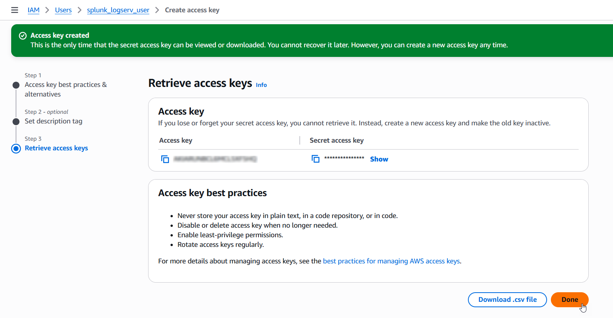

