# AWS Remote S3 Copy Setup Guide

### :material-circle-box:{ .taiconcolor } Introduction

The deployment diagram below shows two different AWS accounts.  For brevity and clarity, the AWS account at the top of the diagram will be referred to as the **_SAP ECS account_** and the second AWS account on the bottom left of the diagram will be referred to as the **_Secondary account_** from this point onward. 

Ensure you have completed all of the steps in the [Prerequisites](prerequisites.md) and the [Installation of the Splunk TA for SAP LogServ](install-ta.md) before you continue with the steps in this setup guide.

Your SAP ECS LogServ subscription for AWS (e.g. in your **_SAP ECS account_**) should have one S3 Bucket in that account where LogServ will store your LogServ logs.  It should also have one SQS Queue in your **_SAP ECS account_** that receives notifications when new logs are added to the S3 Bucket in that account.

You will need obtain the <a href="https://docs.aws.amazon.com/IAM/latest/UserGuide/reference-arns.html" target="_blank">AWS ARN</a> for the SQS Queue and the S3 Bucket that resides in your **_SAP ECS account_** prior to performing the steps in this setup guide.

Take note of the AWS Region in your **_SAP ECS account_** where the S3 Bucket and SQS Queue are located as you will need to deploy the CloudFormation template provided in that same region in your **_Secondary account_**. 

 

### :material-circle-box:{ .taiconcolor } High Level Steps

Below are the high level steps for this setup process listed in the order they should be followed.

:material-lightning-bolt:{ .taiconcolor } Please ensure the user you log in with in your AWS **_Secondary account_** has the appropriate permissions to perform all the steps outlined below.  

1. Obtain the ARNs for the SQS Queue and the S3 Bucket in your **_SAP ECS account_**
2. Create a new S3 Bucket in the correct AWS Region in your **_Secondary account_** and upload the <a href="https://github.com/splunk/splunk-sap-logserv/blob/main/aws_assets/lambda_function/splunk-logserv-lambda-binary.zip" target="_blank">splunk-logserv-lambda-binary.zip</a> file to the root of the bucket (do not rename the file — the CloudFormation template looks for the object key `splunk-logserv-lambda-binary.zip` at the bucket root) 
3. Deploy the AWS <a href="https://github.com/splunk/splunk-sap-logserv/blob/main/aws_assets/cloud_formation/splunk-logserv-remote-s3-copy.yaml" target="_blank">CloudFormation Template</a> provided for this remote S3 copy deployment approach in your **_Secondary account_**
4. Contact SAP LogServ support and request an update to the access policies for the <a href="https://github.com/splunk/splunk-sap-logserv/blob/main/aws_assets/sap_ecs_account_policies/sap-ecs-account-sqs-access-policy.json" target="_blank">SQS Queue</a> and <a href="https://github.com/splunk/splunk-sap-logserv/blob/main/aws_assets/sap_ecs_account_policies/sap-ecs-account-s3-access-policy.json" target="_blank">S3 Bucket</a> residing in your **_SAP ECS account_**
5. Create an <a href="https://docs.aws.amazon.com/keyspaces/latest/devguide/create.keypair.html" target="_blank">Access Key</a> for the new IAM User that was created with the CloudFormation template in your **_Secondary account_**
6. Configure your AWS **_Secondary account_** in the <a href="https://splunk.github.io/splunk-add-on-for-amazon-web-services/ManageAwsAccounts/" target="_blank">Splunk Add-on for Amazon Web Services (AWS)</a>
7. Configure the new cross-account <a href="https://splunk.github.io/splunk-add-on-for-amazon-web-services/ManageAwsIAMRole/" target="_blank">IAM Role</a> from your AWS **_Secondary account_** in the Splunk Add-on for Amazon Web Services (AWS).
8. Configure a new <a href="https://splunk.github.io/splunk-add-on-for-amazon-web-services/SQS-basedS3/" target="_blank">SQS-Based S3 Input</a> in the Splunk Add-on for Amazon Web Services (AWS).
9. Review the SQS Queue Trigger in the new Lambda function created with the CloudFormation template
10. Confirm that LogServ logs are being ingested into Splunk

 

### :material-circle-box:{ .taiconcolor } 1. Obtain ARNs from SAP ECS Account

Before you can create the local S3 Bucket and deploy the CloudFormation template in your **_Secondary account_**, you need to obtain the AWS <a href="https://docs.aws.amazon.com/IAM/latest/UserGuide/reference-arns.html" target="_blank">ARN</a> for two resources that reside in your **_SAP ECS account_**:

- The **S3 Bucket** that stores your LogServ logs
- The **SQS Queue** that receives notifications when new logs are added to the S3 Bucket

You will also need to note the **AWS Region** where these resources are located, because the S3 Bucket and CloudFormation template in the next two sections must be created and deployed into that same region in your **_Secondary account_**.

??? tip "What does an ARN look like?"
    AWS Amazon Resource Names (ARNs) follow a predictable format. Examples:

    - S3 Bucket ARN: `arn:aws:s3:::sap-hec-clz-ap-south-1-hec53-xsd`
    - SQS Queue ARN: `arn:aws:sqs:ap-south-1:121212121212:sap-hec-clz-ap-south-1-hec53-xsd-logserv`

**How to obtain the ARNs:**

1.<b class="taiconcolor">a</b> If you do not have console access to your **_SAP ECS account_**, contact SAP LogServ Support to obtain the ARN for the S3 Bucket, the ARN for the SQS Queue, and the AWS Region where these resources reside.

1.<b class="taiconcolor">b</b> If you **do** have console access to your **_SAP ECS account_**, obtain the ARNs yourself:

    - For the **S3 Bucket**: navigate to the S3 console, find the bucket used for LogServ logs, click on the bucket name, and copy the ARN from the **_Properties_** tab.
    - For the **SQS Queue**: navigate to the SQS console, find the queue that receives S3 notifications, click on the queue name, and copy the ARN from the **_Details_** section.

1.<b class="taiconcolor">c</b> Save both ARNs and the AWS Region in a secure location -- you will reference them when creating the S3 Bucket (next section), deploying the CloudFormation Template, and configuring the SQS-Based S3 Input later in this guide.

 

### :material-circle-box:{ .taiconcolor } 2. Create S3 Bucket with Lambda Function ZIP File

2.<b class="taiconcolor">a</b> Take note of the AWS Region in your **_SAP ECS account_** where the S3 Bucket and SQS Queue are located.

2.<b class="taiconcolor">b</b> Log into your AWS **_Secondary account_** and change to the region that matches the region in your **_SAP ECS account_**

2.<b class="taiconcolor">c</b> Choose a name for the new S3 bucket (**_splunk-logserv-lambda-binary_** is the default bucket name in the CloudFormation template used in the next section)

2.<b class="taiconcolor">d</b> Navigate to the S3 console and create a <a href="https://docs.aws.amazon.com/AmazonS3/latest/userguide/create-bucket-overview.html" target="_blank">general purpose S3 bucket</a> using all the default settings

2.<b class="taiconcolor">e</b> <a href="https://docs.aws.amazon.com/AmazonS3/latest/userguide/upload-objects.html" target="_blank">Upload</a> the <a href="https://github.com/splunk/splunk-sap-logserv/blob/main/aws_assets/lambda_function/splunk-logserv-lambda-binary.zip" target="_blank">splunk-logserv-lambda-binary.zip</a> file to the root of the S3 bucket

??? note "Example"
    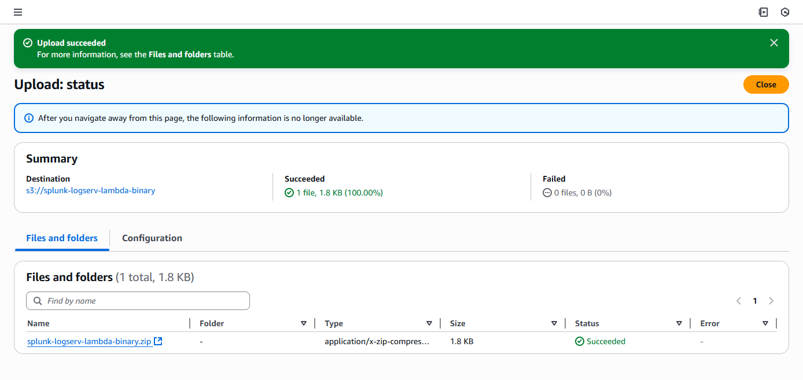

 

### :material-circle-box:{ .taiconcolor } 3. Deploy CloudFormation Template

:material-lightning-bolt:{ .taiconcolor } Before you deploy the CloudFormation template, take note of the AWS Region in your **_SAP ECS account_** where the S3 Bucket and SQS Queue are located as you will need to deploy the CloudFormation template provided in that same region in your **_Secondary account_**.

??? tip "What does the CloudFormation template do?"
    Creates the following resources:
    
    - An IAM User - Default name is **_splunk_logserv_user_**
    - An IAM Policy named **_splunk-logserv-ta-policy_**
    - An IAM Role named **_splunk-logserv-ta-role_**
    - An Inline IAM Policy on the IAM User to assume the IAM Role created above
    - An S3 Bucket with an Event Notification to the SQS Queue below- Default name is **_splunk-logserv-local-target-bucket_**
    - An SQS Queue - Default name is **_splunk-logserv-local-target-queue_**
    - A Dead Letter SQS Queue - Default name is **_splunk-logserv-local-target-queue-dlq_**
    - A Lambda Function - Default name is **_splunk-logserv-lambda-logforwarder_**
    - A LogGroup used by the Lambda Function

3.<b class="taiconcolor">a</b> Navigate to the CloudFormation console (ensure the region you are in matches the region in your **_SAP ECS account_**)

3.<b class="taiconcolor">b</b> Click on the **_Create stack_** button and select **_With new resources (standard)_**
??? indented-note "Example"
    

3.<b class="taiconcolor">c</b> Upload the AWS <a href="https://github.com/splunk/splunk-sap-logserv/blob/main/aws_assets/cloud_formation/splunk-logserv-remote-s3-copy.yaml" target="_blank">CloudFormation Template file provided</a> for this remote S3 copy deployment approach, then click the **_Next_** button
??? indented-note "Example"
    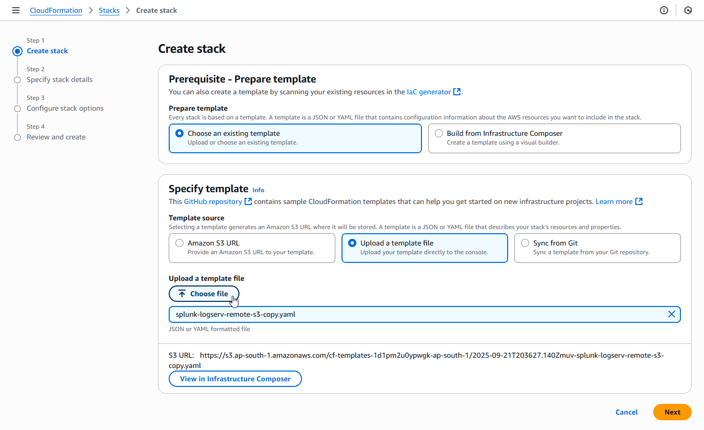

3.<b class="taiconcolor">d</b> Enter a name for the CloudFormation Stack - **_splunk-logserv-remote-s3-copy_**
??? indented-note "Example"
    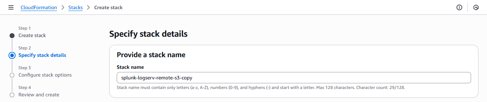

3.<b class="taiconcolor">e</b> Enter just the name (not the ARN) of the S3 Bucket in your **_SAP ECS account_** in the **_CrossAccountS3Bucket_** parameter
   - If your ARN looks like this *arn:aws:s3:::sap-hec-clz-ap-south-1-hec53-xsd* then just use the name like this *sap-hec-clz-ap-south-1-hec53-xsd*
??? indented-note "Example"
    

3.<b class="taiconcolor">f</b> Enter the complete ARN of the SQS Queue in your **_SAP ECS account_** in the **_CrossAccountSQSQueueArn_** parameter
??? indented-note "Example"
    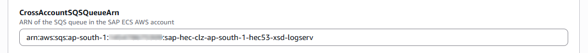

3.<b class="taiconcolor">g</b> Choose and enter a name for the S3 Bucket in your **_Secondary account_** that you used to upload the Lambda Function ZIP File in the **LambdaCodeBucket** parameter
??? indented-note "Example"
    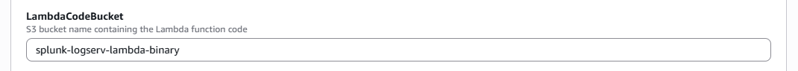

3.<b class="taiconcolor">h</b> Choose and enter a name for the Lambda Function to be created in your **_Secondary account_** in the **LambdaFunctionName** parameter
??? indented-note "Example"
    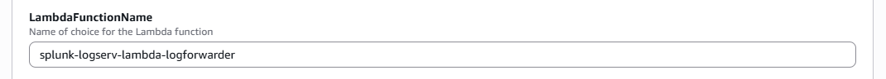

3.<b class="taiconcolor">i</b> Choose and enter a name for the S3 Bucket to be created in your **_Secondary account_** in the **LocalS3BucketName** parameter
??? indented-note "Example"
    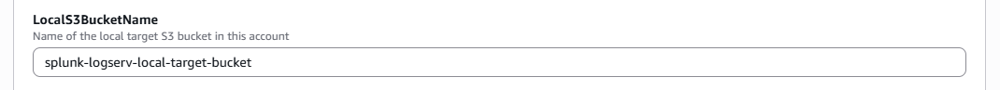

3.<b class="taiconcolor">j</b> Choose and enter a name for the SQS Queue to be created in your **_Secondary account_** in the **LocalSQSQueueName** parameter
??? indented-note "Example"
    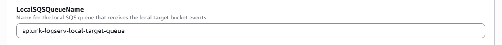

3.<b class="taiconcolor">k</b> Choose and enter a name for the IAM User to be created in your **_Secondary account_** in the **NewIAMUserName** parameter, then click on the **_Next_** button
??? indented-note "Example"
    

3.<b class="taiconcolor">l</b> Scroll down to the bottom of the page and check the **_I acknowledge that AWS CloudFormation might create IAM resources with custom names_** checkbox, then click on the **_Next_** button
??? indented-note "Example"
    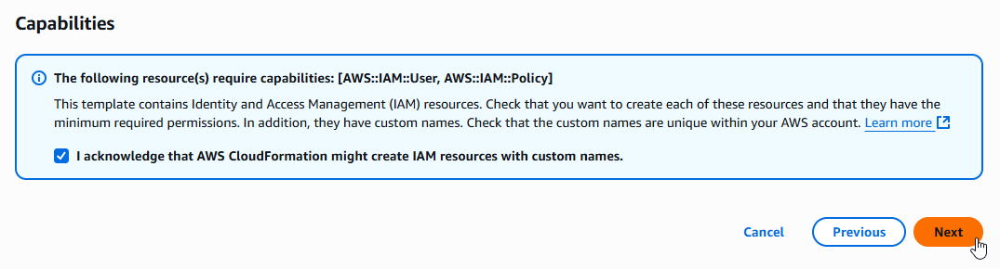

3.<b class="taiconcolor">m</b> Scroll down to the bottom of the page and click on the **_Submit_** button
??? indented-note "Example"
    

3.<b class="taiconcolor">n</b> Ensure the deployment of the CloudFormation template completes successfully
??? indented-note "Example"
    

 

### :material-circle-box:{ .taiconcolor } 4. Contact SAP LogServ Support

Once the deployment of the CloudFormation templates completes successfully, you will need to provide SAP LogServ Support with the ARN of the IAM Role named **_splunk-logserv-ta-role_** that was created by the template.

The ARN for the IAM Role should look like the one below but with your 12-digit AWS account Id of your **_Secondary account_**.

arn:aws:iam::**_secondary-account-id_**:role/splunk-logserv-ta-role

Example access policies for the SQS Queue and S3 Bucket residing in your **_SAP ECS account_** are provided as a reference to provide clarity on the specific permissions that need to be applied by the SAP LogServ Support team.

- <a href="https://github.com/splunk/splunk-sap-logserv/blob/main/aws_assets/sap_ecs_account_policies/sap-ecs-account-sqs-access-policy.json" target="_blank">Example SQS Queue Access Policy</a>
- <a href="https://github.com/splunk/splunk-sap-logserv/blob/main/aws_assets/sap_ecs_account_policies/sap-ecs-account-s3-access-policy.json" target="_blank">Example S3 Bucket Access Policy</a>

 

### :material-circle-box:{ .taiconcolor } 5. Create Access Key for IAM User

5.<b class="taiconcolor">a</b> Navigate to the IAM console in your **_Secondary account_** and search for the IAM User name you used when deploying the CloudFormation template. Click on the name of the IAM User to see the user details.
??? indented-note "Example"
    

5.<b class="taiconcolor">b</b> Click on the **_Security credentials_** tab in the middle of the screen. Scroll down and click on the **_Create access key_** button.
??? indented-note "Example"
    

5.<b class="taiconcolor">c</b> Select the **_Local code_** use case, check the **_Confirmation_** checkbox and click on the **_Next_** button.
??? indented-note "Example"
    

5.<b class="taiconcolor">d</b> Enter a description tag value if desired and click on the **_Create access key_** button.
??? indented-note "Example"
    

5.<b class="taiconcolor">e</b> Copy the values for both the **_Access key_** and the **_Secret access key_** and save them in a secure place as you will need them in the upcoming steps. Now click on the **_Done_** button.
??? indented-note "Example"
    

 

### :material-circle-box:{ .taiconcolor } 6. Configure Secondary Account (AWS Add-on)

:material-lightning-bolt:{ .taiconcolor } Please ensure the user you log in with in your Splunk instance has the appropriate permissions to perform all the steps outlined below.

6.<b class="taiconcolor">a</b> Login to your Splunk console then find and open the **_Splunk Add-on for AWS_** App
??? indented-note "Example"
    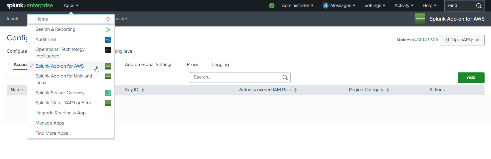

6.<b class="taiconcolor">b</b> Click on the **_Configuration_** tab, then click on the **_Account_** tab, then click on the **_Add_** button
??? indented-note "Example"
    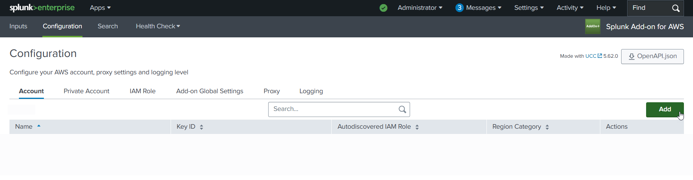

6.<b class="taiconcolor">c</b> Choose and enter a descriptive name for the account in the **_Name_** field. Enter the Access Key and the Secret Key you created for the IAM User in the respective fields. Leave the Region Category set to **_Global_**. Click on the **_Add_** button.
??? indented-note "Example"
    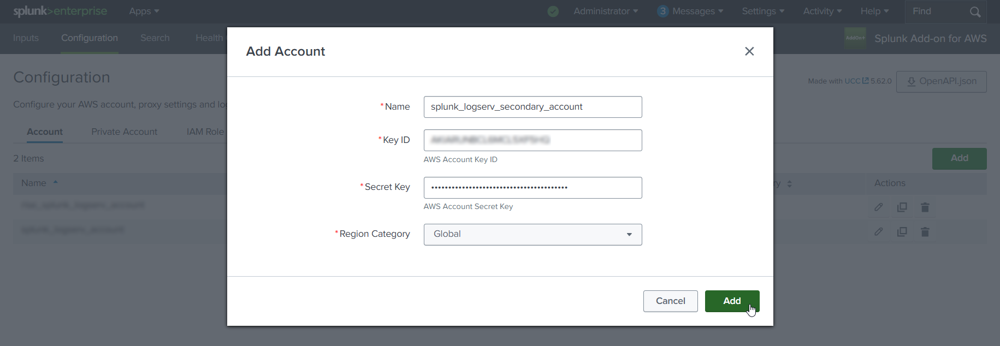

 

### :material-circle-box:{ .taiconcolor } 7. Configure IAM Role (AWS Add-on)

7.<b class="taiconcolor">a</b> Click on the **_IAM Role_** tab to the right of the Account tab, then click on the **_Add_** button
??? indented-note "Example"
    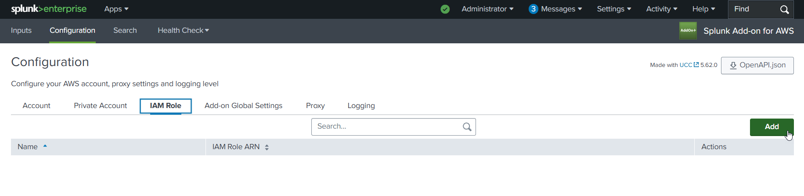

7.<b class="taiconcolor">b</b> Choose and enter a descriptive name for the role in the **_Name_** field. Enter the IAM Role ARN in the **_IAM Role ARN_** field, then click the **_Add_** button. The ARN for the IAM Role should look like the one below but with your 12-digit AWS account Id of your **_Secondary account_**.

    - arn:aws:iam::**_secondary-account-id_**:role/splunk-logserv-ta-role

??? indented-note "Example"
    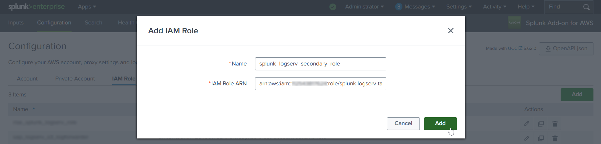

 

### :material-circle-box:{ .taiconcolor } 8. Configure SQS-Based S3 Input (AWS Add-on)

8.<b class="taiconcolor">a</b> Click on the **_Inputs_** tab. Click on the **_Create New Input_** button. Select the **_Custom Data Type_** option at the bottom of the drop-down, then select the **_SQS-Based S3 (Recommended)_** option.
??? indented-note "Example"
    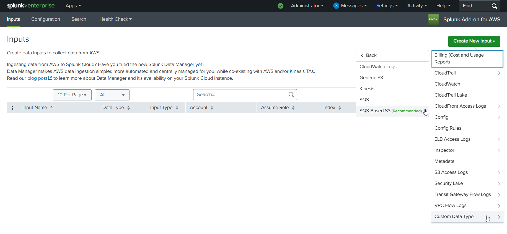

8.<b class="taiconcolor">b</b> Fill out the first three fields in the SQS-Based S3 Input (**_Name_**, **_AWS Account_**, **_Assume Role_**)

    - Choose and enter a descriptive name for the input
    - Select the AWS Account you configured previously
    - Select the IAM Role you configured previously

??? indented-note "Example"
    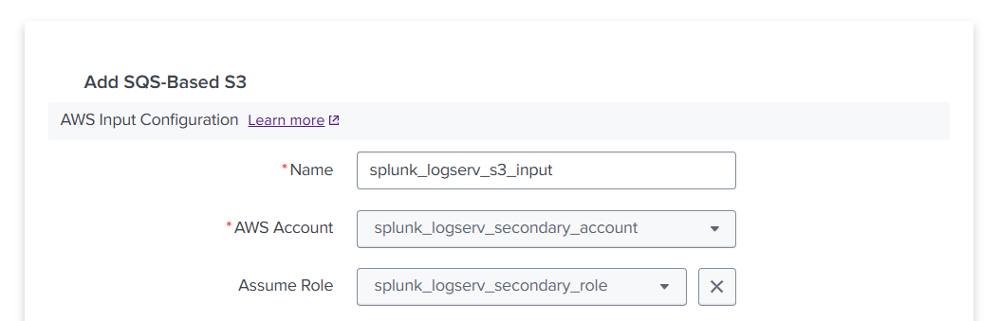

8.<b class="taiconcolor">c</b> Fill out the next three fields in the SQS-Based S3 Input (**_Force using DLQ_**, **_AWS Region_**, **_Use Private Endpoints_**)

    - Leave the **_Force using DLQ (Recommended)_** checkbox **__checked__**
    - Select the **_AWS Region_** where you deployed the CloudFormation template previously
    - Leave the **_Use Private Endpoints_** checkbox **__unchecked__**

??? indented-note "Example"
    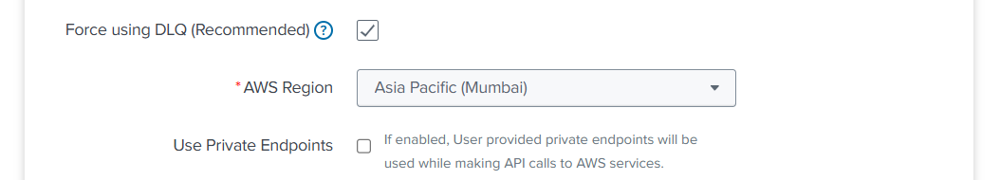

8.<b class="taiconcolor">d</b> Fill out the next three fields in the SQS-Based S3 Input (**_SQS Queue Name_**, **_SQS Batch Size_**, **_S3 File Decoder_**)

    - Select the **_SQS Queue Name_** you entered in step **3.j** (**_LocalSQSQueueName_**) when previously deploying the CloudFormation template
    - Leave the **_SQS Batch Size_** set to 10
    - Leave the **_S3 File Decoder_** set to Custom Logs

??? indented-note "Example"
    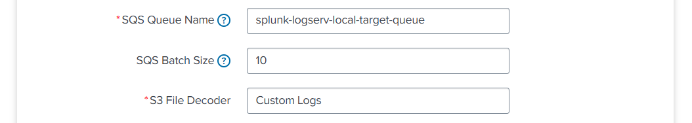

8.<b class="taiconcolor">e</b> Fill out the next three fields in the SQS-Based S3 Input (**_Signature Validate All Events_**, **_Source Type_**, **_Index_**)

    - **__Uncheck__** the **_Signature Validate All Events_** checkbox
    - Enter the value of **_sap_logserv_logs_** in the **_Source Type_** field
    - Enter the name of the Splunk index you want to use in the **_Index_** field
    - Click on the **_Add_** button

??? indented-note "Example"
    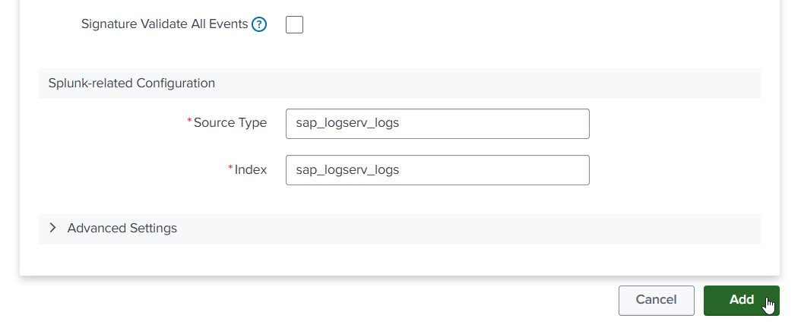

 

### :material-circle-box:{ .taiconcolor } 9. Review SQS Queue Trigger

9.<b class="taiconcolor">a</b> Navigate to the Lambda console in your **_Secondary account_** and ensure the region you are in matches the region in your **_SAP ECS account_**. Find the Lambda function that was created by the CloudFormation template and click on its name to view details. 

??? indented-note "Example"
    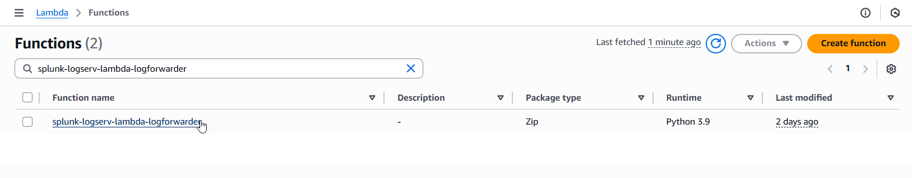

9.<b class="taiconcolor">b</b> If you **__do not__** see an existing SQS Trigger in the Function overview diagram as seen in the example image below, then follow the steps in the **_Create SQS Queue Trigger_** section below, otherwise follow the steps in the **_Configure SQS Queue Trigger_** section below.

??? indented-note "Example"
    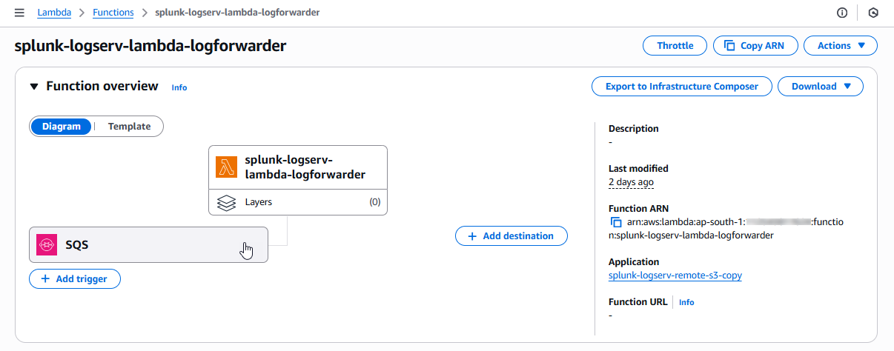

 

#### :material-crop-square:{ .taiconcolor } Create SQS Queue Trigger

1. Click on the **_Add trigger_** button on the left side of the Function overview diagram to create a new SQS Queue Trigger

??? indented-note "Example"
    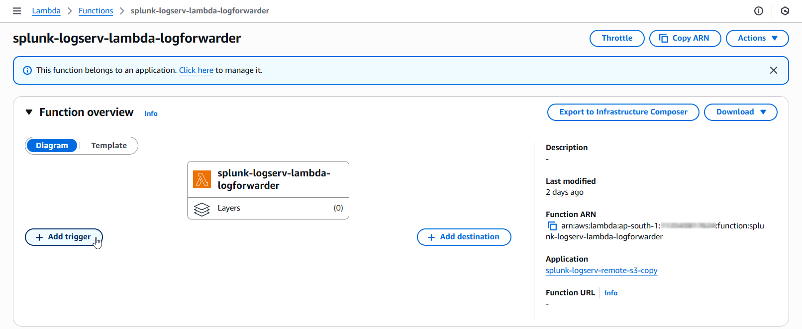

2. Click on the dropdown and select **_SQS_** as the trigger source

??? indented-note "Example"
    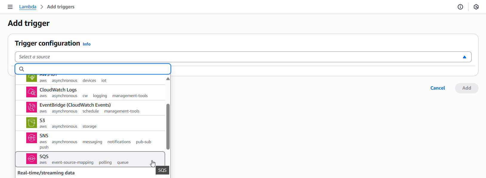

3. Fill out the first three fields in the SQS Trigger (**_SQS queue ARN_**, **_Activate trigger_**, **_Enable metrics_**)

    - Enter the complete **_ARN_** of the SQS Queue in your **_SAP ECS account_**
    - **_Check_** the **_Activate trigger_** checkbox
    - **_Check_** the **_Enable metrics_** checkbox

??? indented-note "Example"
    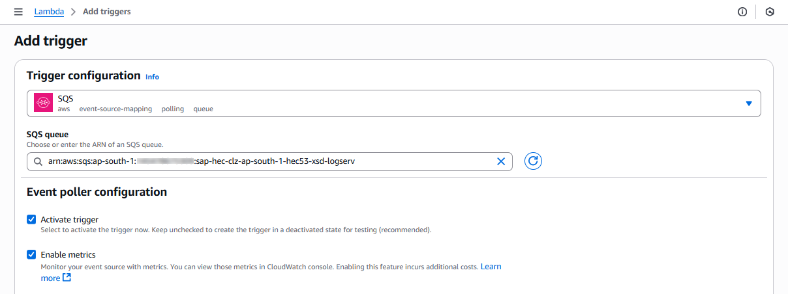

4. Fill out the next three fields in the SQS Trigger (**_Batch size_**, **_Batch window_**, **_Maximum concurrency_**)

    - Set the **_Batch Size_** to 10
    - Set the **_Batch window_** to 5
    - Set the **_Maximum concurrency_** to 8

??? indented-note "Example"
    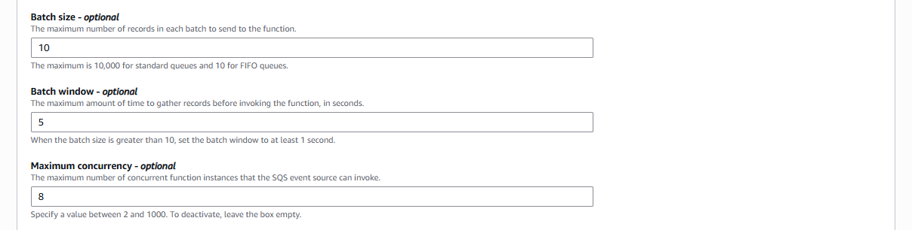

5. Fill out the last field in the SQS Trigger (**_Report batch item failures_**) and save the trigger

    - **_Check_** the **_Report batch item failures_** checkbox
    - Click on the **_Add_** button on the bottom right of the screen to save the trigger

??? indented-note "Example"
    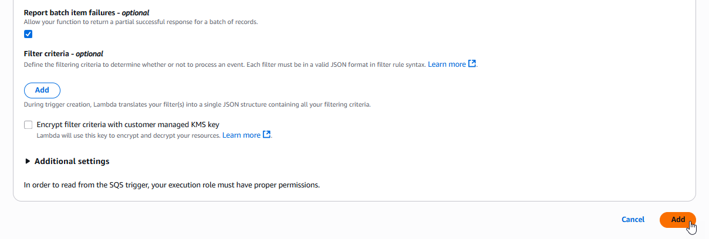

 

#### :material-crop-square:{ .taiconcolor } Configure SQS Queue Trigger

1. Click on the **_SQS_** rectangle on the left side of the Function overview diagram to navigate to the SQS Queue Trigger configuration

??? indented-note "Example"
    

2. Check the checkbox for the **_SQS_** trigger and then click on the **_Edit_** button

??? indented-note "Example"
    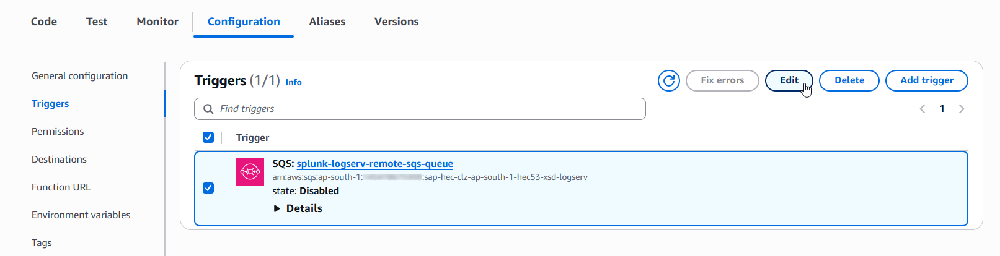

3. Validate the first three fields in the SQS Trigger (**_SQS queue ARN_**, **_Activate trigger_**, **_Enable metrics_**)

    - Ensure the complete **_ARN_** of the SQS Queue in your **_SAP ECS account_** is referenced here
    - Ensure the **_Activate trigger_** checkbox is **_checked_**
    - Ensure the **_Enable metrics_** checkbox is **_checked_**

??? indented-note "Example"
    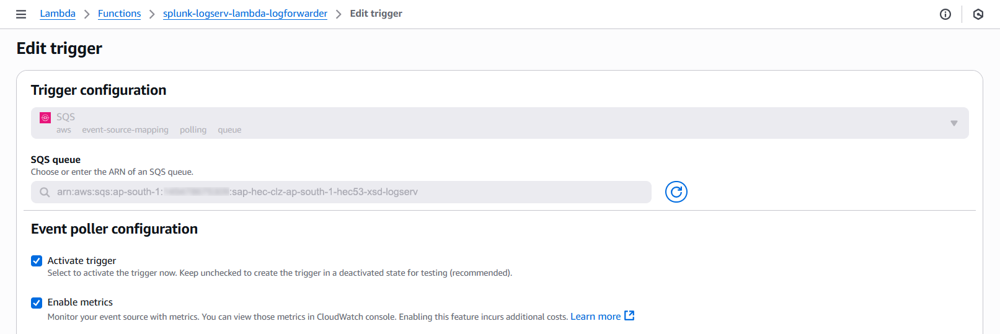

4. Validate the next three fields in the SQS Trigger (**_Batch size_**, **_Batch window_**, **_Maximum concurrency_**)

    - Ensure the **_Batch Size_** is set to 10
    - Ensure the **_Batch window_** is set to 5
    - Ensure the **_Maximum concurrency_** is set to 8

??? indented-note "Example"
    

5. Validate the last field in the SQS Trigger (**_Report batch item failures_**) and save the trigger

    - Ensure the **_Report batch item failures_** checkbox is **_checked_**
    - Click on the **_Save_** button on the bottom right of the screen to save the trigger

??? indented-note "Example"
    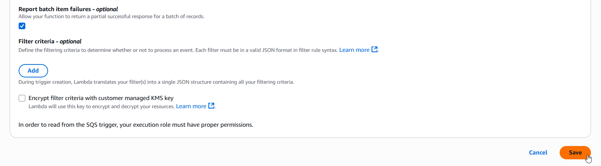

 

### :material-circle-box:{ .taiconcolor } 10. Confirm LogServ Logs are Being Ingested

After completing all the previous steps, verify that LogServ logs are successfully being ingested into Splunk.

:material-lightning-bolt:{ .taiconcolor } The first events typically appear within 5-10 minutes of completing the SQS-Based S3 Input configuration. The Lambda function copies objects from the SAP ECS S3 Bucket to the local target S3 Bucket in your **_Secondary account_** when an SQS notification arrives, then the SQS-Based S3 Input polls the local SQS Queue at the configured interval (default 300 seconds), so allow a short lag before the first events arrive.

10.<b class="taiconcolor">a</b> Log in to your Splunk console and open the **_Search & Reporting_** app (or the SAP LogServ App if you have installed it)

10.<b class="taiconcolor">b</b> Run a basic search against the index you configured in the SQS-Based S3 Input to confirm events are flowing:

        index=<your_index_name> | stats count by sourcetype

    If you are using the SAP LogServ App, you can use the provided index macro:

        `sap_logserv_idx_macro` | stats count by sourcetype

10.<b class="taiconcolor">c</b> You should see events from the LogServ sourcetypes your SAP LogServ subscription is forwarding. Depending on the log types enabled, expected sourcetypes may include (but are not limited to):

    - `linux_messages_syslog`, `linux_secure`, `syslog` -- Linux OS events
    - `isc:bind:query` -- DNS query events
    - `squid:access` -- Proxy events
    - `XmlWinEventLog` -- Windows events
    - `sap:hana:audit`, `sap:hana:tracelogs` -- HANA database events
    - `sap:abap:*` -- ABAP application events
    - `sap:webdispatcher:access` -- Web Dispatcher events
    - `sap:scc:audit`, `sap:scc:http_access` -- Cloud Connector events

10.<b class="taiconcolor">d</b> Confirm events are arriving with recent timestamps:

        index=<your_index_name> earliest=-1h | stats count by sourcetype, host

    You should see recent events from multiple hosts.

10.<b class="taiconcolor">e</b> If no events appear after 15-20 minutes, troubleshoot as follows:

    - **Lambda function errors** -- In the AWS Console, open CloudWatch Logs for the Lambda function created by the CloudFormation template (Section 3). Check for errors copying objects from the SAP ECS S3 Bucket to your local S3 Bucket. Common causes are missing access policies on the SAP ECS resources (Section 4) or an IAM Role propagation delay (wait 5 minutes after initial setup).
    - **Local SQS Queue has no messages** -- Verify the SAP LogServ Support team has applied the updated access policies (from Section 4) to the SQS Queue and S3 Bucket in your **_SAP ECS account_**. Without those policies, the Lambda function cannot receive SQS notifications from the SAP ECS account or read from the SAP ECS S3 Bucket. Also verify the SQS Queue Trigger on the Lambda function is active (Section 9).
    - **Authentication or permission errors** -- In the Splunk Add-on for AWS, check the logs for errors: run `index=_internal source=*aws* log_level IN (ERROR,WARN) earliest=-1h | head 50`. Common causes are a mis-copied Access Key/Secret Key (Section 5), an incorrect IAM Role ARN (Section 7), or the IAM Role not yet propagated through AWS (wait 5 minutes after initial setup).
    - **SQS URL format** -- Double-check the **_SQS Queue Name_** field in the SQS-Based S3 Input (Section 8) points to the **_local_** SQS Queue that was created by the CloudFormation template in your **_Secondary account_** (not the SAP ECS SQS Queue).
    - **Wrong AWS Region** -- The CloudFormation template (Section 3) and the SQS-Based S3 Input (Section 8) must both be in the same AWS Region as the SQS Queue and S3 Bucket in your **_SAP ECS account_**.

??? tip "Where to go next"
    Once you've confirmed ingestion is working, explore the dashboards in the [LogServ UI App](../logserv-app/dashboards/index.md) to see your LogServ data in action. The default landing page is the [Environment Health](../logserv-app/dashboards/environment-health.md) dashboard, which provides a cross-cutting view of your entire SAP landscape.
