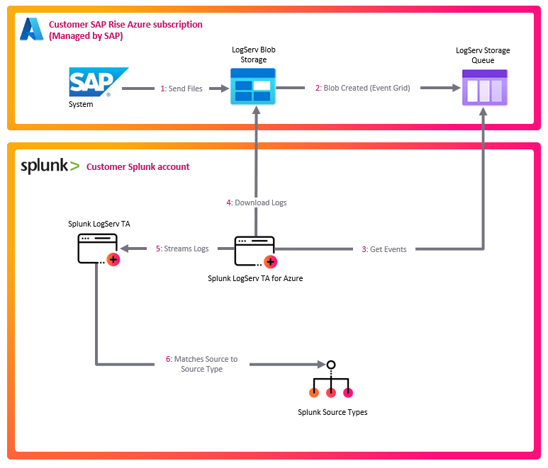
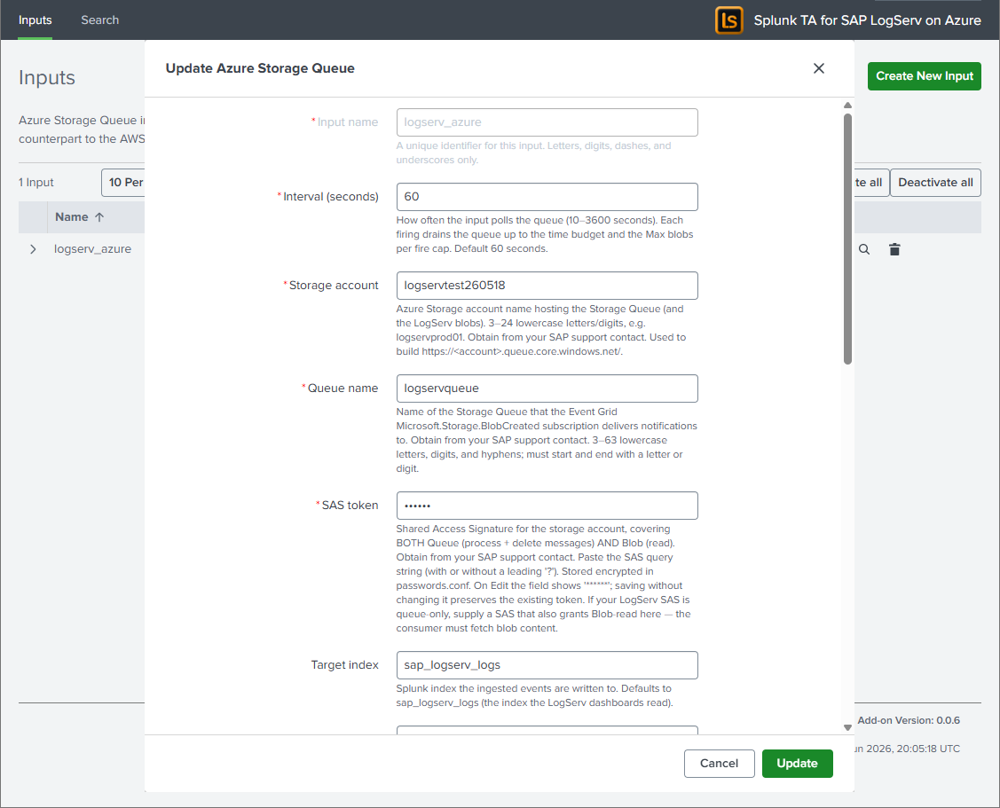

# SAP LogServ on Azure — Setup Guide

This page covers ingesting LogServ data from **Microsoft Azure Blob Storage** using the standalone **Splunk TA for SAP LogServ on Azure** add-on (`splunk_ta_sap_logserv_azure`) and its **`sap_logserv_azure_queue`** modular input — the Azure twin of `Splunk_TA_aws`'s **SQS-Based S3** input. An Azure **Event Grid** subscription drops a `BlobCreated` notification onto a **Storage Queue**; this input consumes the queue, fetches each named blob over a SAS, and emits its NDJSON. This is the model SAP's LogServ-on-Azure collector uses (Storage Queue notifications). You install this small, first-party add-on **on each Heavy Forwarder** — the same deployment model as the Splunk Add-on for AWS — and the LogServ **Data TA** on the same HF provides the downstream sourcetype routing, filtering, and stamping. The downstream pipeline (sourcetype routing, filtering, dashboards, ES integration) is identical to the AWS S3 path.

!!! info "The Azure infrastructure is provided by SAP — you only install the add-on and configure the input"
    In a RISE / SAP ECS deployment the **storage account, blob container, Storage Queue, Event Grid subscription, and SAS are all provisioned and managed by SAP in the SAP ECS Azure account.** You do **not** create or configure anything in Azure. Your only tasks are to **install the `splunk_ta_sap_logserv_azure` add-on on each Heavy Forwarder** and create a **Splunk input** on it — one per Azure landscape (most deployments have a single landscape, hence one input; you can define several on the same HF if you ingest from more than one — see [Multiple landscapes / fleets](#multiple-landscapes-fleets)), using a small set of parameter values that you obtain from your **SAP support contact** — see [Parameters to obtain from SAP](#parameters-to-obtain-from-sap).

!!! note "Current release: LLM functionality intentionally disabled pending review"
    The current release ships with the AI Assistant's LLM-driven path **disabled at compile time pending internal review**. The setup procedure on this page applies in full regardless. See [Templates-only Build Flag](../ai-assistant/templates-only-build.md).

## :material-circle-box:{ .taiconcolor } Architecture overview



```
SAP LogServ RISE-ECS
  └─> writes NDJSON.gz blobs to Azure Blob Storage under the logserv/ prefix
        └─> Azure Event Grid subscription (Microsoft.Storage.BlobCreated)
              └─> Azure Storage Queue (one message per new blob)
                    └─> [Azure TA: sap_logserv_azure_queue]  (runs on the Heavy Forwarder)
                          ├─ reads the queue, fetches each blob over a SAS, gunzips, splits NDJSON
                          └─> emits via EventWriter, sourcetype=sap_logserv_logs
                                └─> [LogServ Data TA pipeline]  (same Heavy Forwarder):
                                      transforms.conf routes by clz_dir/clz_subdir,
                                      Configuration -> Filters nullQueue, _time drop,
                                      splunk_solution / cloud_provider stamping
                                        └─> forwarded to the Indexer
                                              └─> dashboards + ES integration
```

Everything from the LogServ blob writer down through the **Storage Queue lives in the SAP ECS Azure account and is managed by SAP.** The **Azure TA's `sap_logserv_azure_queue` input** — the only component you install and configure — runs on **your Heavy Forwarder**, consumes the queue SAP exposes to you, and hands its events to the **LogServ Data TA** (also on that HF) for routing/filtering/stamping. This is exactly how `Splunk_TA_aws` and the Data TA cooperate for the AWS S3 path.

**Why EventWriter, not HEC:** the input runs on the Heavy Forwarder and emits through the HF's native index-time pipeline, so every existing LogServ Data TA feature — `clz_dir`/`clz_subdir` sourcetype routing, the Configuration → Filters `nullQueue` filtering, the `days_in_past` / `_time` drop, and the `splunk_solution` / `cloud_provider` stamping — applies to Azure events **unchanged**, exactly as it does to AWS S3 events. The input is **stdlib-only** (Azure Storage REST over `urllib` — no Azure SDK), so it adds no AArch64 / native-binary burden and is Splunk Cloud-clean.

## :material-circle-box:{ .taiconcolor } Prerequisites

**Provided by SAP** (in the SAP ECS Azure account — you obtain the *values*, you do not build the resources):

- An **Azure Storage Account** holding the LogServ container (blobs under the `logserv/` prefix — same path convention as AWS S3: `<container>/logserv/<clz_dir>/<clz_subdir>/<YYYY>/<MM>/<DD>/<file>.json.gz`).
- A **Storage Queue** in that account, fed by an **Event Grid subscription** that routes `Microsoft.Storage.BlobCreated` events to it.
- A **SAS** that is **both blob-readable and queue-processable** (see [What the SAP-provided SAS must cover](#what-the-sap-provided-sas-must-cover)).

Obtain the storage account name, the queue name, and the SAS from your **SAP support contact** — see [Parameters to obtain from SAP](#parameters-to-obtain-from-sap).

**On your side (each Heavy Forwarder that will ingest Azure data):**

- **LogServ Data TA `0.0.6`+** installed on the Heavy Forwarder (it provides the index-time routing/filtering/stamping; see [Installing the Data TA](install-ta.md)). The Data TA is normally distributed by the Deployment Server.
- **Splunk TA for SAP LogServ on Azure (`splunk_ta_sap_logserv_azure`) `0.0.6`+** installed on the **same Heavy Forwarder** (see [Install the Azure add-on](#install-the-azure-add-on)). It registers the `sap_logserv_azure_queue` input kind. The input is inert until you create an input instance.
- Network egress from the Heavy Forwarder to `<account>.blob.core.windows.net` **and** `<account>.queue.core.windows.net` (port 443 / HTTPS).

!!! warning "Compact JSON format required"
    Each blob is gzipped NDJSON (one event per line). The index-time routing transforms assume **compact JSON** (no whitespace after `:`). The SAP LogServ collector emits compact JSON natively, so no action is required on your side. (For reference: pretty-printed JSON would bypass the transforms and land as `sourcetype=sap_logserv_logs`, breaking dashboards.)

## :material-circle-box:{ .taiconcolor } Parameters to obtain from SAP

You do **not** create any Azure resources. SAP has already provisioned the storage account, container, queue, and Event Grid subscription in the SAP ECS Azure account. **Contact your SAP support contact** to obtain the following values for your environment, then plug them into the Splunk input ([Configure the input](#configure-the-input)):

| Parameter | Input field | Description |
|---|---|---|
| Storage account name | `account_name` | The Azure Storage account holding the LogServ container (`^[a-z0-9]{3,24}$`). |
| Storage Queue name | `queue_name` | The queue receiving the Event Grid `BlobCreated` notifications. |
| SAS token | `sas_token` | An account SAS scoped for **both** blob read/list **and** queue process/delete (see below). Treat it as a secret. |

The blob container name and `logserv/` prefix are already covered by the SAS and the queue — they are not separate input fields. The account name also determines the two endpoints your Heavy Forwarder must reach (`<account>.blob.core.windows.net` and `<account>.queue.core.windows.net`).

### What the SAP-provided SAS must cover

The input fetches blobs **and** reads/deletes queue messages with the single SAS SAP gives you, so that SAS must cover **both** services. Confirm with your SAP support contact that the SAS includes:

| SAS field | Must include | For |
|---|---|---|
| `ss` (services) | `b` (blob) **and** `q` (queue) | blob fetch + queue ops |
| `srt` (resource types) | `s` `c` `o` (service/container/object) | account-SAS resource scope |
| `sp` (permissions) | `r` `l` (blob read/list) **and** `p` `d`/`u` (queue process/delete/update) | fetch blobs + consume queue |

You can decode a SAS string to check its scope before configuring the input:

```bash
echo "$SAS" | tr '&' '\n' | grep -E '^(ss|srt|sp|se)='
```

!!! warning "If the SAS is queue-only"
    If `ss` lacks `b`, blob fetches fail with HTTP 401/403 and the input logs it explicitly: *"blob read forbidden … the SAS likely lacks Blob-read permission or has expired."* The decisive question for your SAP support contact is **"is the LogServ SAS Blob-readable, or queue-only?"** If it is queue-only, you will need a second, blob-read credential from SAP.

## :material-circle-box:{ .taiconcolor } Install the Azure add-on

Install `splunk_ta_sap_logserv_azure-0.0.6.tar.gz` **directly on each Heavy Forwarder** that will ingest Azure data — exactly the tier where `Splunk_TA_aws` is installed for the AWS path.

- Splunk Web → **Manage Apps → Install app from file** → upload the tarball, **or**
- `/opt/splunk/bin/splunk install app /path/splunk_ta_sap_logserv_azure-0.0.6.tar.gz`, **or**
- configuration management (Ansible / Puppet / Chef) drops the app into `etc/apps/`, then `chown -R splunk:splunk` and restart.

!!! danger "Do NOT distribute the Azure add-on via the Deployment Server"
    Install it **directly on each Heavy Forwarder — never as a deployment-app.** The input's SAS is stored, encrypted, in the add-on's own `local/passwords.conf`; a Deployment Server push **replaces the app's `local/` directory**, which would wipe the per-HF SAS. (This is the same reason `Splunk_TA_aws` is configured per-HF rather than DS-distributed. It is a deliberate change from earlier LogServ builds that bundled this input inside the DS-managed Data TA.) The **Data TA** stays DS-managed as before — only the Azure add-on is per-HF.

After installing + restarting, the `sap_logserv_azure_queue` input kind is registered and the add-on's **Inputs** page is available under **Apps → Splunk TA for SAP LogServ on Azure**.

## :material-circle-box:{ .taiconcolor } Configure the input

On **each** Heavy Forwarder, create one input instance for your Azure landscape. The SAS is encrypted into the **add-on's own** `local/passwords.conf` and is **not** Deployment-Server-managed — it survives restarts and Data-TA pushes with no `system/local` relocation.

### Via Splunk Web (per Heavy Forwarder)

Splunk Web → **Apps → Splunk TA for SAP LogServ on Azure → Inputs → Create New Input → Azure Storage Queue**, and fill in the fields below with the values you obtained from SAP. (For a second landscape on the same HF, use the Inputs table's **Clone** action and give it a new name — the SAS is not carried on clone, so re-enter it.)




### Via REST (scriptable, per Heavy Forwarder)

```bash
# Write the SAS to a single-line temp file (no trailing newline), then create the input:
curl -sk -u admin:<pwd> -X POST \
  https://localhost:8089/servicesNS/nobody/splunk_ta_sap_logserv_azure/splunk_ta_sap_logserv_azure_sap_logserv_azure_queue \
  --data-urlencode name=logserv_azure \
  --data-urlencode account_name=<storage-account> \
  --data-urlencode queue_name=logservqueue \
  --data-urlencode index=sap_logserv_logs \
  --data-urlencode event_sourcetype=sap_logserv_logs \
  --data-urlencode interval=60 \
  --data-urlencode sas_token@/tmp/azure_sas.txt
rm -f /tmp/azure_sas.txt
```

The resulting stanza in the add-on's `local/inputs.conf` looks like:

```ini
[sap_logserv_azure_queue://logserv_azure]
account_name = <storage-account>
queue_name = logservqueue
index = sap_logserv_logs
event_sourcetype = sap_logserv_logs
interval = 60
disabled = 0
```

(The `sas_token` is **not** written to `inputs.conf` — it is stored encrypted in the add-on's own `local/passwords.conf`.)

| Field | Default | Notes |
|---|---|---|
| `account_name` | — | Storage account name from SAP (`^[a-z0-9]{3,24}$`). |
| `queue_name` | — | The Storage Queue name from SAP (receives Event Grid notifications). |
| `sas_token` | — | The SAS from SAP (blob + queue scoped). Encrypted credential, stored in the add-on's `local/passwords.conf`, never in `inputs.conf`. |
| `index` | `sap_logserv_logs` | Target index. Does **not** affect parsing — the Data TA's index-time pipeline keys on the sourcetype, not the index. You may point it at a custom index, but the dashboards query through the `sap_logserv_idx_macro` macro, so update that macro to match (see caveat below). |
| `event_sourcetype` (UI label **Sourcetype**) | `sap_logserv_logs` | **Fixed at `sap_logserv_logs`.** The add-on hard-codes this sourcetype (it is not read from the stanza), and the field is shown read-only when editing the input. Leave it at the default. |
| `interval` | `60` | Seconds between firings. Each firing drains the queue within a time budget (`min(240, interval×0.9)`). |
| `batch_size` | `32` | Queue messages dequeued per request (1–32, the Azure max). |
| `visibility_timeout` | `300` | Seconds a dequeued message is hidden while processing (30–604800). |
| `max_blobs_per_fire` | `500` | Cap on blobs ingested per firing (backlog safety valve). |
| `poison_threshold` | `5` | A message redelivered more than this many times is dead-lettered / dropped. |
| `dead_letter_queue` | *(empty)* | Optional queue name for poison messages (Storage Queue has no native DLQ). |
| `include_filters` / `exclude_filters` | *(empty)* | Optional substring filters on the blob subject (beyond the built-in `logserv` match). |
| `verify_ssl` | `1` | TLS verification for Azure REST calls. |

!!! note "Sourcetype is fixed; the Index is yours to change"
    The **Sourcetype** is effectively fixed at **`sap_logserv_logs`** — the add-on always emits it (the value is hard-coded in the input, not read from the stanza), and the field is shown read-only (disabled) when editing an existing input. This is deliberate: the Data TA's index-time routing, Filters `nullQueue`, `_time` drop, and `splunk_solution` / `cloud_provider` stamping all key on `sourcetype = sap_logserv_logs` (`props.conf` stanzas match on sourcetype, **not** index), so it must never vary.

    The **`index`**, by contrast, may be changed safely — parsing is unaffected (events are routed, filtered, and stamped identically no matter which index they land in). You may point it at a custom index (for example a per-customer index such as `sap_logserv_logs_con01`). The only follow-up is dashboard visibility: the dashboards and rollups search through the `sap_logserv_idx_macro` macro (default `index="sap_logserv_logs"`), so override that macro in the App's `local/macros.conf` to match your index, or the dashboards won't find the data.

### `cloud_provider` attribution

The input stamps every event it emits with the indexed field `cloud_provider=azure` (via `_meta = cloud_provider::azure` on the generated stanza), so search-time queries and the **Multi-Cloud Overview** dashboard can distinguish Azure-sourced from AWS-sourced data.

!!! warning "On a Heavy Forwarder that ingests BOTH AWS and Azure"
    The Data TA's **Configuration → Cloud Provider** dropdown stamps `cloud_provider` TA-wide at index time. If it is set to `aws` on a forwarder that also runs this Azure input, that index-time stamp co-fires with the input's per-event `_meta=azure`, leaving `cloud_provider` **multivalued (`azure` + `aws`)** on the Azure events. For correct per-channel attribution on a mixed forwarder, set the **Cloud Provider dropdown to "Not set"** and add `_meta = cloud_provider::aws` to the `Splunk_TA_aws` SQS-S3 input — then each input self-attributes. On a single-cloud forwarder, the dropdown alone is simplest. See [Configuring Filters → Cloud Provider Attribution](configure-filters.md#cloud-provider-attribution).

### Multiple landscapes / fleets

- **Multiple Azure landscapes on one HF:** create one input instance per landscape (different `account_name` / `queue_name`), using the Inputs table's **Clone** action. The per-instance credential is keyed by the input name; re-enter the SAS on each (clone never carries secrets).
- **A fleet of Heavy Forwarders:** repeat the install + input creation on each HF. For zero-touch fleets, config management can drop the add-on into `etc/apps/` and seed the SAS via the REST call above (it encrypts under each HF's own `splunk.secret`). **Do not** add the add-on to the Deployment Server's `deployment-apps/`.

!!! note "Scaling one queue by cloning — supported (like the AWS add-on), but at-least-once"
    Separate input *instances* are normally for **different** queues (different `queue_name`). You *can* also point several identical inputs at the **same** queue to raise throughput — this is the same competing-consumer pattern Splunk's AWS add-on uses to scale its **SQS-Based S3** input: the queue's visibility lease hands each message to one consumer at a time, so N inputs fetch and ingest N batches of blobs in parallel (across one HF, since the input is not single-instance, or across several HFs). Understand the trade-off first:

    - A **single** input is **exactly-once even under redelivery** — its per-input dedup checkpoint (`<input_name>.dedup.json`) skips an already-ingested blob if a message reappears.
    - **Cloned same-queue inputs don't share that checkpoint**, so they fall back to **at-least-once** (the same guarantee as the AWS SQS-S3 input). If a blob's fetch + ingest exceeds the message's `visibility_timeout` (default 300 s), the message reappears and another input re-ingests it → **duplicate events**. The guard is identical to the AWS pattern: **set `visibility_timeout` comfortably above your worst-case per-message processing time.** (`dequeue_count` is the queue's server-side, shared counter, so the `poison_threshold` decision stays coordinated across the clones — but unlike SQS, Azure Storage Queue has no native dead-letter/redrive, so poison handling is the TA's client-side `poison_threshold` + optional `dead_letter_queue`.)

    For typical LogServ volumes a **single input already keeps up** (it drains up to `max_blobs_per_fire` blobs per firing). Prefer raising `batch_size` / `max_blobs_per_fire` or lowering `interval` on one input before cloning; clone same-queue inputs only when one input genuinely can't keep up, and raise `visibility_timeout` when you do.

## :material-circle-box:{ .taiconcolor } Reliability behavior

- **At-least-once + dedup.** A queue message is deleted **only after** its blob ingests successfully; each blob is deduplicated by `url|etag` in a checkpoint sidecar, so a redelivered message re-ingests nothing.
- **Transient failures leave the message.** A 5xx / network error on a blob fetch leaves the message on the queue (it redelivers after the visibility timeout); already-ingested blobs in that message are no-ops on retry.
- **Blob-read denied (401/403) leaves the message** and logs loudly — this is the queue-only-SAS signal (get a blob-readable credential from SAP, the message reprocesses).
- **Poison messages** (redelivered more than `poison_threshold` times) are moved to `dead_letter_queue` if configured, else dropped, so one permanently-bad blob can't loop forever.

## :material-circle-box:{ .taiconcolor } Historical backfill

Queue-driven ingest is **forward-only by nature** — Event Grid fires only on *new* `BlobCreated` events, so once SAP's subscription is live the input ingests everything written from that point on, but does **not** replay blobs that already existed. There is no queue-native historical backfill yet; a one-time bulk load of pre-existing blobs is a roadmap item. If you need to seed history, contact your Splunk team. The index-time `days_in_past` / `_time` filter applies to any backfilled events the same way it does to live ingest.

## :material-circle-box:{ .taiconcolor } Validation

Confirm the input is registered and firing (run on the Heavy Forwarder):

```bash
curl -sk -u admin:<pwd> \
  "https://localhost:8089/servicesNS/nobody/splunk_ta_sap_logserv_azure/splunk_ta_sap_logserv_azure_sap_logserv_azure_queue?output_mode=json"
```

Watch the input log on the HF:

```bash
sudo tail -f /opt/splunk/var/log/splunk/splunk_ta_sap_logserv_azure_queue.log
# look for:  Input 'logserv_azure' done: messages=N blobs=N events=N dups=N deleted=N ...
```

Search the indexer (events route to per-source sourcetypes just like AWS):

```spl
index=sap_logserv_logs cloud_provider=azure _index_earliest=-1h | stats count by sourcetype
```

### Troubleshooting

| Symptom (in the input log) | Cause | Fix |
|---|---|---|
| `SAS token not found in passwords.conf; skipping` | No credential for this input name on this host | Re-enter the SAS on this HF (Inputs tab → Edit, or the REST call above). The SAS lives in the add-on's own `local/passwords.conf`; it is **not** affected by Deployment-Server pushes. |
| `queue read failed (... 403 ...)` | SAS lacks queue process/delete, or expired | Ask SAP for a SAS with `sp` ⊇ `p`/`d` and a future `se=`. |
| `blob read forbidden (HTTP 401/403)` | SAS is queue-only (no blob read) or expired | Ask SAP for a blob-readable SAS (`ss` ⊇ `b`, `sp` ⊇ `r`); the message is left for retry. |
| `done: messages=0` every firing, but blobs exist | The Event Grid subscription (SAP-managed) isn't enqueuing, or the queue name is wrong | Confirm with your SAP support contact that the Event Grid subscription is active and the queue name is correct; verify network egress to `<account>.queue.core.windows.net`. |
| Input kind `sap_logserv_azure_queue` not listed / Inputs page missing | The Azure add-on isn't installed (or Splunkd wasn't restarted) on this HF | Install `splunk_ta_sap_logserv_azure` on the HF and restart (see [Install the Azure add-on](#install-the-azure-add-on)). |

## :material-circle-box:{ .cboxmove } Next steps

- Confirm the [LogServ App is installed](install-ta.md) on your Search Head
- Review the [supported log types](../getting-started/supported-log-types.md) reference
- For Splunk Cloud Victoria considerations, see [Splunk Cloud Victoria Notes](splunk-cloud-victoria-notes.md)
