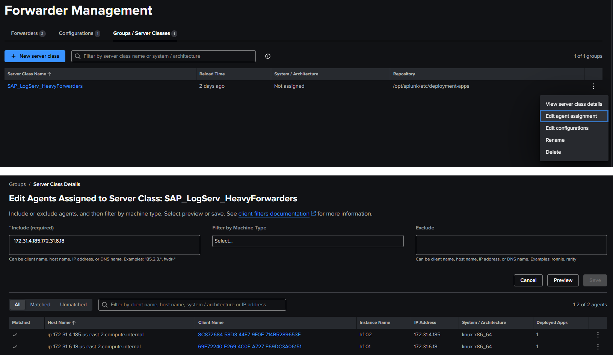
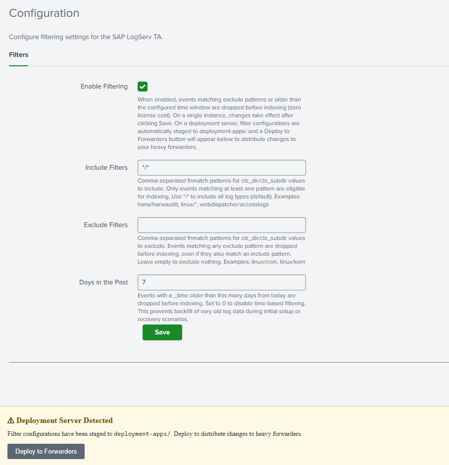
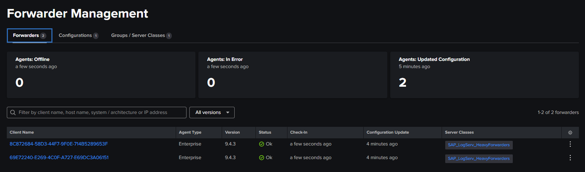
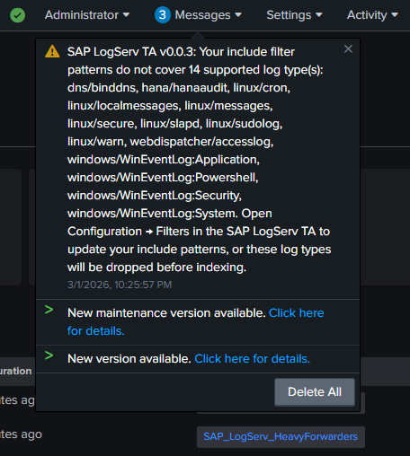

# Configuring Filters

### :material-circle-box:{ .taiconcolor } Overview

The Splunk TA for SAP LogServ provides two complementary approaches to filtering LogServ data. You can use either one independently or combine them for defense-in-depth filtering.

| | Native TA Index-Time Filtering | AWS Lambda-Based Filtering |
|---|---|---|
| **Where it runs** | Inside Splunk at index time | In AWS Lambda, before data reaches Splunk |
| **Configured via** | Splunk Web UI (Configuration → Filters) | Lambda environment variables or migration config |
| **Works with** | All deployment scenarios (Connect, Filter, Copy) | S3 Filter and Connect-to-Filter migration only |
| **What it filters** | Raw NDJSON events via TRANSFORMS queue routing | S3 event notifications via Lambda function |
| **License impact** | Filtered events consume zero Splunk license | Filtered notifications never reach Splunk |
| **Pattern syntax** | `clz_dir/clz_subdir` fnmatch patterns | `clz_dir/clz_subdir` fnmatch patterns (same) |
| **Time filtering** | Days in the Past (epoch regex, refreshed daily) | Days in the Past (Lambda evaluation) |
| **AWS resources needed** | None | Lambda function, local SQS queue, DLQ |
| **Deployment Server support** | ✅ Auto-distributes to Heavy Forwarders | N/A (AWS-side only) |
| **Upgrade notifications** | ✅ Alerts when new log types aren't covered | ❌ Not available |

<br>

### :material-circle-box:{ .taiconcolor } Which Approach Should I Use?

??? tip "Choosing a filtering approach"
    **Use Native TA filtering (recommended for most users)** if you want the simplest setup — it works with every deployment scenario, requires no AWS resources beyond what you already have, and is managed entirely from Splunk Web. It also provides upgrade notifications when new log types are added to the TA.

    **Use Lambda-based filtering** if you want to reduce the volume of SQS messages that Splunk processes. Because the Lambda filters S3 event notifications *before* they reach Splunk, unwanted objects are never downloaded from S3 at all. This can reduce S3 GET request costs and Splunk ingestion overhead in very high-volume environments.

    **Use both together** for defense-in-depth. The Lambda filters at the AWS pipeline level, and the native TA filters catch anything that slips through at the Splunk level. Since both use the same `clz_dir/clz_subdir` pattern syntax, you can keep the configurations aligned.

The remainder of this page covers **Native TA Index-Time Filtering** in detail. For Lambda-based filtering setup, see the [AWS Lambda-Based Filtering](#aws-lambda-based-filtering) section at the bottom of this page or the [AWS Remote S3 Filter Setup Walkthrough](aws-remote-s3-filter-walkthrough.md).

<br>

---

## Native TA Index-Time Filtering

### :material-circle-box:{ .taiconcolor } What It Does

Starting with version 0.0.3, the TA includes built-in **index-time filtering** configured entirely through the Splunk Web UI — no manual editing of configuration files is required.

??? tip "How It Works"
    - **Include Filters** — Only events matching at least one include pattern are eligible for indexing. Everything else is dropped before indexing (zero license cost).
    - **Exclude Filters** — Events matching any exclude pattern are dropped, even if they also match an include pattern. Excludes override includes.
    - **Time Filter (Days in the Past)** — Events with a `_time` older than the configured number of days are dropped. This prevents backfill of very old log data during initial setup or recovery scenarios.

    All filtering happens at index time via TRANSFORMS-based queue routing, so filtered events never consume Splunk license.

<br>

### :material-circle-box:{ .taiconcolor } Deployment Architectures

The TA supports two deployment models. The steps differ slightly depending on which one you use.

#### :material-crop-square:{ .taiconcolor } Single Instance / Search Head

The TA is installed directly on the Splunk instance that indexes data. Filter changes take effect immediately after clicking Save (no restart required).

#### :material-crop-square:{ .taiconcolor } Deployment Server with Heavy Forwarders

The TA is installed on the Deployment Server (DS). The DS distributes the TA and its filter configurations to Heavy Forwarders (HFs) that perform the actual data ingestion. This is the recommended architecture for production environments.

In this model:

- You install and configure the TA on the DS only
- The DS automatically stages configurations for distribution
- You use the built-in **Deploy to Forwarders** button to push changes to HFs
- HFs receive the TA and filter configs on their next phone-home interval

!!! note
    Splunk Cloud cannot act as a Deployment Server. If you are using Splunk Cloud, you will need a separate on-premises Deployment Server to manage your Heavy Forwarders.

<br>

### :material-circle-box:{ .taiconcolor } Open the Configuration > Filters Tab

1. In Splunk Web, open the **Splunk TA for SAP LogServ** app
2. Go to **Configuration > Filters**

??? note "Example"
    


### :material-circle-box:{ .taiconcolor } Set Your Filter Options

#### :material-crop-square:{ .taiconcolor } Enable Filtering

Check the **Enable Filtering** checkbox to activate index-time filtering. When disabled, all events are indexed without any filtering.

#### :material-crop-square:{ .taiconcolor } Include Filters

Comma-separated patterns specifying which log types to include. Patterns use the format `clz_dir/clz_subdir` with `fnmatch`-style wildcards:

| Pattern | Meaning |
|---------|---------|
| `*/*` | Include all log types (default) |
| `hana/hanaaudit` | Include only HANA audit logs |
| `linux/*` | Include all Linux log types |
| `linux/messages, hana/*` | Include Linux messages and all HANA logs |
| `*/accesslogs` | Include access logs from any directory |

:material-lightning-bolt:{ .taiconcolor } **Rules:**

- Each pattern must be in `dir/subdir` format or a standalone `*`
- A standalone `*` is equivalent to `*/*` (include everything)
- Valid characters: letters, numbers, `*`, `?`, `.`, `-`, `:`, `_`
- This field cannot be empty when filtering is enabled — use `*/*` to include everything

#### :material-crop-square:{ .taiconcolor } Exclude Filters

Comma-separated patterns for log types to exclude. Same pattern format as includes. Events matching any exclude pattern are dropped even if they also match an include pattern.

**Example:** To include all Linux logs except cron and kernel:

- Include: `linux/*`
- Exclude: `linux/cron, linux/kern`

Leave this field empty to exclude nothing.

#### :material-crop-square:{ .taiconcolor } Days in the Past

Whole number (0–3650) specifying the maximum age of events to index. Events with a `_time` older than this many days from today are dropped before indexing.

- Set to `7` to only index events from the last 7 days
- Set to `0` to disable time-based filtering
- Default: `7`

??? tip "How the time filter works"
    The time filter uses a pre-computed epoch-based regex that is refreshed automatically once per day by a built-in scripted input. If the refresh fails to run for a day, the filter becomes slightly more restrictive (one extra day filtered) — the safer failure mode.

<br>

### :material-circle-box:{ .taiconcolor } Save

Click **Save**. The TA validates your patterns and generates the necessary configuration files. If there are any validation errors (invalid characters, empty include field, etc.), the save is blocked and an error message is displayed.

<br>

---

### :material-circle-box:{ .taiconcolor } Deployment Server: Additional Steps

:material-lightning-bolt:{ .taiconcolor } If you are running on a **single instance**, you can skip this section — filter changes take effect immediately after Save.

<br>

### :material-circle-box:{ .taiconcolor } What Happens Automatically on Save

When you save filter settings on a Deployment Server, the TA automatically:

1. Copies the full TA package to `/opt/splunk/etc/deployment-apps/splunk_ta_sap_logserv/`
2. Mirrors the generated filter configurations (`transforms.conf`, `props.conf`) to the deployment-apps copy
3. Creates a server class named `SAP_LogServ_HeavyForwarders` (if it doesn't already exist)

After saving, the Filters tab displays:

- A **"⚠ Deployment Server Detected"** banner
- A **"⚙ Server Class Setup Required"** or **"Client Targeting Needed"** notice (first time only)
- A **"Deploy to Forwarders"** button

??? note "Example"
    


<br>

### :material-circle-box:{ .taiconcolor } Configure the Server Class (First Time Only)

The auto-created server class needs client targeting to know which Heavy Forwarders should receive the TA:

1. Go to **Settings → Forwarder Management**
2. Find the `SAP_LogServ_HeavyForwarders` server class
3. Click the three-dot menu → **Edit agent assignment**
4. Add your Heavy Forwarder IP addresses, hostnames, or use `*` for all connected forwarders
5. Save the agent assignment

??? note "Example"
    


??? tip "Client Targeting"
    Use IP addresses for client targeting, as Splunk matches against the client's IP, hostname, DNS name, or GUID — not the instance name.

Return to the Filters tab — the setup notice should be gone.

??? note "Example"
    


<br>

### :material-circle-box:{ .taiconcolor } Deploy to Forwarders

1. On the Filters tab, click **"Deploy to Forwarders"** and confirm
2. Wait for your Heavy Forwarders to phone home (typically 30–60 seconds depending on configuration)
3. Verify deployment status in **Settings → Forwarder Management** — HFs should show as "Ok" under the server class

??? note "Example"
    


<br>

### :material-circle-box:{ .taiconcolor } Updating Filters on a Deployment Server

Whenever you change filter settings:

1. Make your changes on the Filters tab and click **Save**
2. Click **"Deploy to Forwarders"** to distribute the updated configurations
3. HFs will pick up the changes on their next phone-home interval

!!! note
    Do not install the TA directly on Heavy Forwarders when using a Deployment Server. The DS manages the TA distribution. Installing locally on an HF can cause configuration conflicts.

<br>

---

## Verifying Filters

### :material-circle-box:{ .taiconcolor } Check Included Data Is Arriving

```spl
index=* sourcetype=sap:logserv:* | stats count by clz_dir, clz_subdir
```

You should see data only for log types matching your include patterns.

<br>

### :material-circle-box:{ .taiconcolor } Check Excluded Data Is Not Present

If you configured exclude patterns, verify those log types are absent from search results.

<br>

### :material-circle-box:{ .taiconcolor } Check Time Filtering

Search for events older than your configured cutoff:

```spl
index=* sourcetype=sap:logserv:* earliest=-30d latest=-10d
```

If your Days in Past is less than 10, this search should return no results.

<br>

---

## Upgrade Notifications

### :material-circle-box:{ .taiconcolor } How Upgrade Notifications Work

When the TA is upgraded to a new version that supports additional log types, a system message banner appears across all Splunk Web pages if your include filter patterns do not cover the newly supported types. This prevents new log types from being silently dropped.

??? note "Example"
    

To resolve the notification:

1. Open **Configuration → Filters** in the TA
2. Review and update your include patterns to cover the new log types (or use `*/*` to include everything)
3. Save

The banner clears automatically once all supported types are covered.

<br>

---

<!--
## Supported Log Types

### :material-circle-box:{ .taiconcolor } Log Type Reference

The TA currently supports the following log types (identified by `clz_dir/clz_subdir`):

| clz_dir | clz_subdir | Splunk Sourcetype |
|---------|------------|-------------------|
| dns | binddns | `isc:bind:query` |
| hana | hanaaudit | `sap:hana:audit` |
| webdispatcher | accesslogs | `sap:webdispatcher:access` |

logserv/linux/cron/2026/01/20/
logserv/linux/linux_secure/2026/01/20/
logserv/linux/localmessages/2026/01/20/
logserv/linux/messages/2026/01/20/
logserv/linux/slapd/2026/01/20/
logserv/linux/sudolog/2026/01/20/
logserv/linux/warn/2025/09/20/

| linux | cron | `syslog` |
| linux | linux_secure | `linux_secure` |
| linux | localmessages | `linux_messages_syslog` |
| linux | messages | `linux_messages_syslog` |
| linux | slapd | `syslog` |
| linux | sudolog | `syslog` |
| linux | warn | `syslog` |

| linux | pacemaker | `syslog` |


| linux | kernel | `linux_secure` |
| linux | sssd | `linux_secure` |
| squid | access | `squid:access` |
| squid | cache | `squid:access` |
| squid | store | `squid:access` |
| linux | lastlog | `lastlog` |
| linux | who | `who` |
| windows | wineventlog | `XmlWinEventLog` |

<br>

---

-->

## Troubleshooting

### :material-circle-box:{ .taiconcolor } Filters Not Taking Effect (Single Instance)

- Verify filtering is enabled: Check the **Enable Filtering** checkbox
- Check `local/transforms.conf` in the app directory for the generated filter stanzas
- Check `_internal` for errors:

```spl
index=_internal sourcetype=splunkd component=PersistentScript splunk_ta_sap_logserv
```

<br>

### :material-circle-box:{ .taiconcolor } Filters Not Reaching Heavy Forwarders

- Verify the server class exists and has client targeting configured in **Settings → Forwarder Management**
- Verify deployment-apps has the filter configs:

```bash
cat /opt/splunk/etc/deployment-apps/splunk_ta_sap_logserv/local/transforms.conf
```

- Click **Deploy to Forwarders** and wait for phone-home
- Check HF configs:

```bash
cat /opt/splunk/etc/apps/splunk_ta_sap_logserv/local/transforms.conf
```

<br>

### :material-circle-box:{ .taiconcolor } Deployment Server Not Detected

- The TA detects deployment servers by checking server roles and for connected deployment clients
- Verify your Heavy Forwarders are configured as deployment clients pointing to the DS
- Check with:

```bash
curl -sk -u admin:<password> \
  "https://localhost:8089/services/deployment/server/clients?output_mode=json&count=1"
```

<br>

### :material-circle-box:{ .taiconcolor } Validation Error on Save

- Include patterns must not be empty when filtering is enabled — use `*/*` to include all
- Patterns must use `dir/subdir` format with only valid characters (letters, numbers, `*`, `?`, `.`, `-`, `:`, `_`)
- Days in the Past must be a whole number between 0 and 3650

<br>

### :material-circle-box:{ .taiconcolor } Time Filter Seems Off by a Day

The time filter epoch cutoff is refreshed once per day by a scripted input. After changing the Days in Past value, the cutoff regex is regenerated immediately on Save. If the daily refresh fails, the filter becomes slightly more restrictive (safer failure mode).

<br>

---

## AWS Lambda-Based Filtering

### :material-circle-box:{ .taiconcolor } Overview

The Lambda-based filtering approach filters S3 event notifications in AWS *before* they reach Splunk. A Lambda function sits between the cross-account SQS queue (in the SAP ECS account) and a local SQS queue (in your Secondary account). It evaluates each S3 event notification against include/exclude path patterns and a time-based cutoff, forwarding only matching notifications to the local queue that Splunk polls.

??? tip "When to use Lambda-based filtering"
    - You want to reduce the number of S3 GET requests Splunk makes (cost savings in high-volume environments)
    - You want to reduce SQS message volume before it reaches Splunk
    - You want filtering to happen at the AWS pipeline level as an additional layer

<br>

### :material-circle-box:{ .taiconcolor } How It Works

```
SAP ECS Account                    Your Secondary Account
+--------------+    +-----------+    +------------+    +-----------+
| S3 Bucket    |--->| SQS Queue |--->|   Lambda   |--->| Local SQS |--->  Splunk HF
| (LogServ)    |    | (cross)   |    |  (filter)  |    |  Queue    |
+--------------+    +-----------+    +------------+    +-----------+
                                       | Drops non-
                                       | matching
                                       v notifications
```

The Lambda function evaluates the S3 object key in each notification to extract `clz_dir` and `clz_subdir` values, then applies the same fnmatch pattern syntax used by the native TA filtering.

<br>

### :material-circle-box:{ .taiconcolor } Setup Options

There are two ways to deploy Lambda-based filtering:

#### :material-crop-square:{ .taiconcolor } New Deployment (S3 Filter Setup)

If you are setting up from scratch, follow the [AWS Remote S3 Filter Setup Walkthrough](aws-remote-s3-filter-walkthrough.md). The CloudFormation template creates all required AWS resources (Lambda, local SQS queue, DLQ, IAM permissions) in a single deployment.

#### :material-crop-square:{ .taiconcolor } Migration from Existing S3 Connect Deployment

If you already have a working **S3 Connect** deployment and want to add Lambda-based filtering, follow the [AWS Remote S3 Connect to Filter Migration](aws-remote-s3-connect-to-filter-migration-walkthrough.md). The Python migration script adds the Lambda resources to your existing IAM infrastructure without recreating it.

<br>

### :material-circle-box:{ .taiconcolor } Lambda Filter Settings

The Lambda function uses three environment variables for its filter configuration:

| Variable | Description | Example |
|----------|-------------|---------|
| `DAYS_IN_THE_PAST` | Drop notifications for objects older than this many days | `7` |
| `INCLUDE_FILTERS` | Comma-separated fnmatch patterns for paths to include | `linux/*,hana/*` |
| `EXCLUDE_FILTERS` | Comma-separated fnmatch patterns for paths to exclude | `linux/cron,linux/slapd` |

:material-lightning-bolt:{ .taiconcolor } These use the same `clz_dir/clz_subdir` pattern format as the native TA filters. If you are using both approaches, keep the patterns aligned for consistent behavior.

<br>

### :material-circle-box:{ .taiconcolor } Comparing the Two Approaches Side by Side

Consider a scenario where you want to ingest only `hana/*` and `linux/messages` logs from the last 7 days:

??? tip "Native TA filtering only (simplest)"
    - **Setup:** Configure the Filters tab with include `hana/*, linux/messages` and days in past `7`
    - **What happens:** All S3 objects are downloaded by Splunk, but unwanted events are dropped at index time via TRANSFORMS before consuming license
    - **Pros:** No extra AWS resources, managed from Splunk Web, upgrade notifications, works with any deployment scenario
    - **Cons:** Splunk still downloads and parses all S3 objects before filtering

??? tip "Lambda filtering only"
    - **Setup:** Configure Lambda with the same include/exclude/days patterns
    - **What happens:** The Lambda drops S3 event notifications for unwanted objects before Splunk ever sees them. Splunk only downloads matching objects from S3
    - **Pros:** Reduces S3 GET request costs, lower Splunk ingestion overhead
    - **Cons:** Requires Lambda + local SQS + DLQ in AWS, no upgrade notifications, filter changes require updating Lambda environment variables

??? tip "Both together (defense-in-depth)"
    - **Setup:** Same patterns configured in both Lambda and the Filters tab
    - **What happens:** Lambda filters at the AWS level first, then native TA filtering catches anything that slips through at the Splunk level
    - **Pros:** Maximum coverage, safety net if either filter is misconfigured
    - **Cons:** Two places to maintain filter configurations

<br>

## :material-circle-box:{ .cboxmove } Next Steps

Return to the [Setup Walkthroughs Overview](setup-walkthroughs.md) for AWS data pipeline configuration, or see the [Developer Reference](../developer/developer-reference.md) for technical internals.
