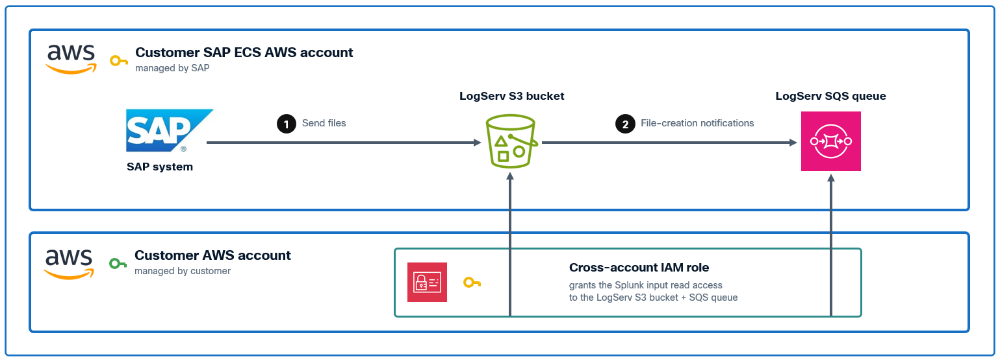
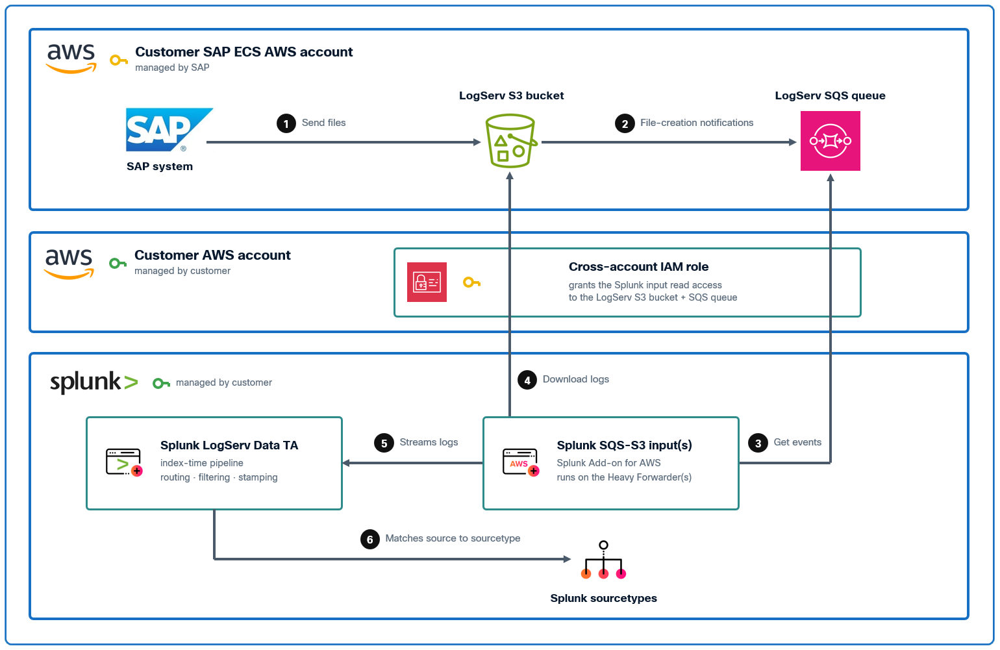
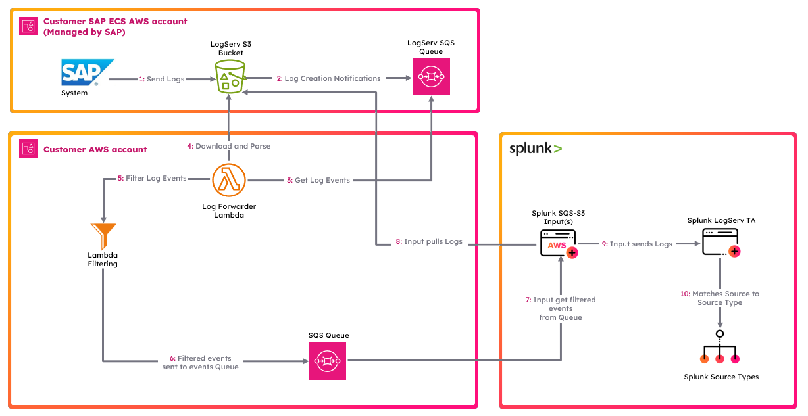
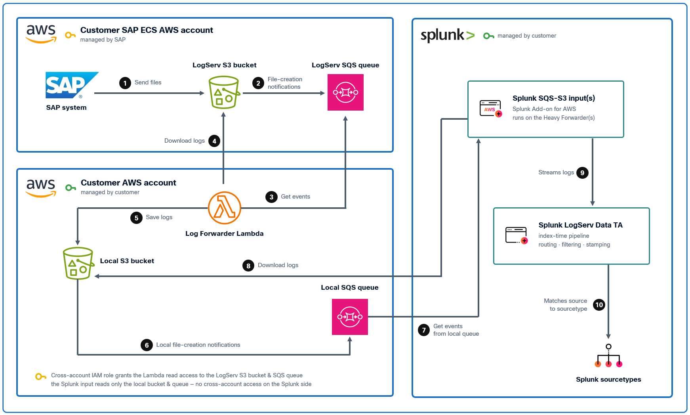

# Setup Walkthroughs Overview

### :material-circle-box:{ .taiconcolor } Introduction
Once the [prerequisites](prerequisites.md) and the [installation of the Splunk TA for SAP LogServ](install-ta.md) have been completed, use the provided setup walkthroughs to complete the setup based on the cloud provider where your SAP ECS environment is running in and your preferred deployment scenario.

!!! note
    Starting with version 0.0.3, the TA includes **built-in index-time filtering** that works with all deployment scenarios below. After completing the AWS setup, see [Configuring Filters](configure-filters.md) to control which log types are indexed and drop stale data directly from Splunk Web — no Lambda-based filtering required.

### :material-circle-box:{ .taiconcolor } Amazon Web Services (AWS)
All AWS deployment scenarios achieve the end goal of ingesting LogServ logs into Splunk. However, ther are some differences in functionality. All AWS deployment scenarios involve two distinct AWS accounts.  

All deployment scenarios for AWS require the use of an AWS **_Secondary account_** (a different AWS account than the one SAP ECS is running in) due to the requirement from SAP for a cross-account IAM Role to access the AWS **_SAP ECS account_** where the LogServ logs reside.  See the diagram below for reference.

For brevity and clarity, the AWS account at the top of the diagram will be referred to as the **_SAP ECS account_** and the second AWS account on the bottom of the diagram will be referred to as the **_Secondary account_** from this point onward. 

The table below lists the AWS Resources required for each deployment scenario:

| AWS Resources    | [AWS Remote S3 Connect Setup](aws-remote-s3-connect-walkthrough.md) | [AWS Remote S3 Filter Setup](aws-remote-s3-filter-walkthrough.md) | [AWS Remote S3 Copy Setup](aws-remote-s3-copy-walkthrough.md) |
|------------------------------------------ | --------- -------------- | ------------------------- | ---------------------- |
| S3 Bucket (**_SAP ECS account_**)          | ✅ Required             | ✅ Required               | ✅ Required           |      
| SQS Queue (**_SAP ECS account_**)          | ✅ Required             | ✅ Required               | ✅ Required           | 
| S3 Bucket (**_Secondary account_**)        | ❌ Not Required         | ❌ Not Required           | ✅ Required           | 
| SQS Queue (**_Secondary account_**)        | ❌ Not Required         | ✅ Required               | ✅ Required           | 
| SQS Queue DLQ (**_Secondary account_**)    | ❌ Not Required         | ✅ Required               | ✅ Required           | 
| IAM Policy (**_Secondary account_**)       | ✅ Required             | ✅ Required               | ✅ Required           | 
| IAM Role (**_Secondary account_**)         | ✅ Required             | ✅ Required               | ✅ Required           | 
| IAM User (**_Secondary account_**)         | ✅ Required             | ✅ Required               | ✅ Required           | 
| Lambda Function (**_Secondary account_**)  | ❌ Not Required         | ✅ Required               | ✅ Required           | 
| Lambda Log Group (**_Secondary account_**) | ❌ Not Required         | ✅ Required               | ✅ Required           | 

If you want to have a secondary copy of the logs from the S3 bucket in the SAP ECS account, the [AWS Remote S3 Copy Setup](aws-remote-s3-copy-walkthrough.md) is the recommended approach. Utilizing that approach ensures you have your own copy of all the logs from the S3 bucket in the SAP ECS account, in a second S3 bucket in your secondary AWS account.

The table below lists the different features supported by each deployment scenario:

| Feature    | [AWS Remote S3 Connect Setup](aws-remote-s3-connect-walkthrough.md) | [AWS Remote S3 Filter Setup](aws-remote-s3-filter-walkthrough.md) | [AWS Remote S3 Copy Setup](aws-remote-s3-copy-walkthrough.md) |
|------------------------------------------ | --------- -------------- | ------------------------- | ---------------------- |
| Secondary Copy of Logs                    | ❌ Not Supported        | ❌ Not Supported          | ✅ Supported          |      
| AWS Lambda-based Filtering                | ❌ Not Supported        | ✅ Supported              | ❌ Not yet, coming soon | 
| **Native TA Index-Time Filtering**        | ✅ Supported            | ✅ Supported              | ✅ Supported          |

??? tip "Native TA Filtering vs. AWS Lambda-based Filtering"
    Starting with version 0.0.3, the TA provides **native index-time filtering** that works with all deployment scenarios. This filtering happens inside Splunk at index time and is configured entirely through the Splunk Web UI.

    The **AWS Lambda-based filtering** (available in the S3 Filter Setup) filters S3 event notifications *before* they reach Splunk, reducing the number of SQS messages processed. Both approaches can be used independently or together for defense-in-depth filtering.

    See [Configuring Filters](configure-filters.md) for details on the native TA filtering.

### &nbsp;&nbsp;&nbsp;&nbsp;&nbsp;&nbsp; :material-crop-square:{ .cboxmove } [AWS Remote S3 Connect Setup Walkthrough](aws-remote-s3-connect-walkthrough.md) 
??? indented-note "Note"
    This deployment scenario uses an IAM User with a configured Access Key and a cross-account IAM Role to directly access LogServ resources in the AWS SAP ECS account where the LogServ logs reside without the need to copy logs to a secondary S3 bucket. 

    - No secondary S3 Bucket needed
    - No secondary SQS Queue needed
    - <a href="https://github.com/splunk/splunk-sap-logserv/blob/main/aws_assets/cloud_formation/splunk-logserv-remote-s3-connect.yaml" target="_blank">CloudFormation Template</a> provided    
    
    

### &nbsp;&nbsp;&nbsp;&nbsp;&nbsp;&nbsp; :material-crop-square:{ .cboxmove } [AWS Remote S3 Filter Setup Walkthrough](aws-remote-s3-filter-walkthrough.md) 
??? indented-note "Note"
    This deployment scenario uses an IAM User with a configured Access Key and a cross-account IAM Role to directly access LogServ resources in the AWS SAP ECS account where the LogServ logs reside without the need to copy logs to a secondary S3 bucket. It also provides the mechanism to filter logs by times stamp and types of logs via parameters on the Lambda function.

    - No secondary S3 Bucket needed
    - Secondary SQS Queue needed
    - Log filtering options supported
    - <a href="https://github.com/splunk/splunk-sap-logserv/blob/main/aws_assets/cloud_formation/splunk-logserv-remote-s3-filter.yaml" target="_blank">CloudFormation Template</a> provided    
    
    
    
### &nbsp;&nbsp;&nbsp;&nbsp;&nbsp;&nbsp; :material-crop-square:{ .cboxmove } [AWS Remote S3 Copy Setup Walkthrough](aws-remote-s3-copy-walkthrough.md)
??? indented-note "Note"
    This deployment scenario uses an IAM User with a configured Access Key and a cross-account IAM Role along with a secondary S3 bucket and SQS queue.  Use this deployment scenario if you want a copy of all the LogServ logs in your own S3 Bucket. 

    - Greater control of data + retention
    - Requires secondary S3 Bucket
    - Requires secondary SQS Queue
    - <a href="https://github.com/splunk/splunk-sap-logserv/blob/main/aws_assets/cloud_formation/splunk-logserv-remote-s3-copy.yaml" target="_blank">CloudFormation Template</a> provided    
    
    
