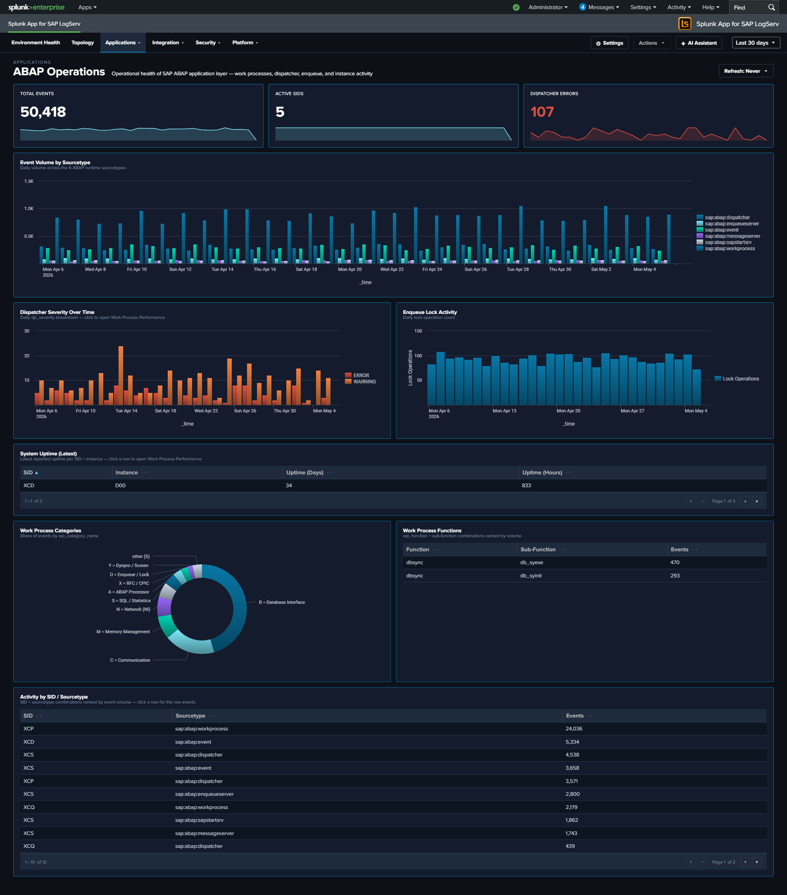

# ABAP Operations

## :material-circle-box:{ .taiconcolor } Why This Dashboard Matters

The ABAP Operations dashboard provides runtime health monitoring for the SAP ABAP application layer. It covers the dispatcher (request routing), work processes (transaction execution), enqueue server (lock management), and system uptime. These components are the engine of every SAP ABAP system, and their health directly impacts user experience and business process execution.

## Panels

- **Total Events** -- Aggregate event count across all ABAP operations sourcetypes
- **Active SIDs** -- Count of distinct SAP System IDs reporting data
- **Dispatcher Errors** -- Count of ERROR/FATAL severity dispatcher events
- **Event Volume by Sourcetype** -- Daily trend across all six sourcetypes
- **System Uptime (Latest)** -- Table showing the most recent uptime in days and hours per SID/instance
- **Dispatcher Severity Over Time** -- Stacked column chart of dispatcher log severity levels
- **Top Work Process Functions** -- Table of the most frequently called work process functions
- **Work Process Categories** -- Donut chart with bottom legend showing activity distribution across all 13 SAP work process categories (e.g., `B = Database Interface`, `A = ABAP Processor`, `S = SQL / Statistics`, `M = Memory Management`, `X = RFC / CPIC`). The donut uses the `wp_category_name` field populated by the app's `props.conf` EVAL so every category code gets a friendly name.
- **Enqueue Lock Activity** -- Timeline of lock management operations
- **Activity by SID / Instance / Type** -- Event distribution across SAP systems and sourcetypes

## :material-lightning-bolt:{ .taiconcolor } What to Look For

- **Uptime resets** -- A system showing low uptime (hours instead of days) indicates a recent restart. Unexpected restarts may signal crashes, memory issues, or unplanned maintenance.
- **Dispatcher ERROR/FATAL increases** -- Rising error severity in the dispatcher indicates work process exhaustion, connection failures, or configuration problems that will soon impact users.
- **Work process category shifts** -- A sudden change in the distribution of work process categories (e.g., dialog processes being consumed by batch jobs) suggests resource contention.
- **Enqueue lock spikes** -- A sharp increase in lock operations can indicate application deadlocks, long-running transactions holding locks, or database performance issues causing lock wait times to increase.
- **SID/instance imbalance** -- If one system or instance is generating significantly more events than its peers, investigate whether it's handling disproportionate load or experiencing issues.

