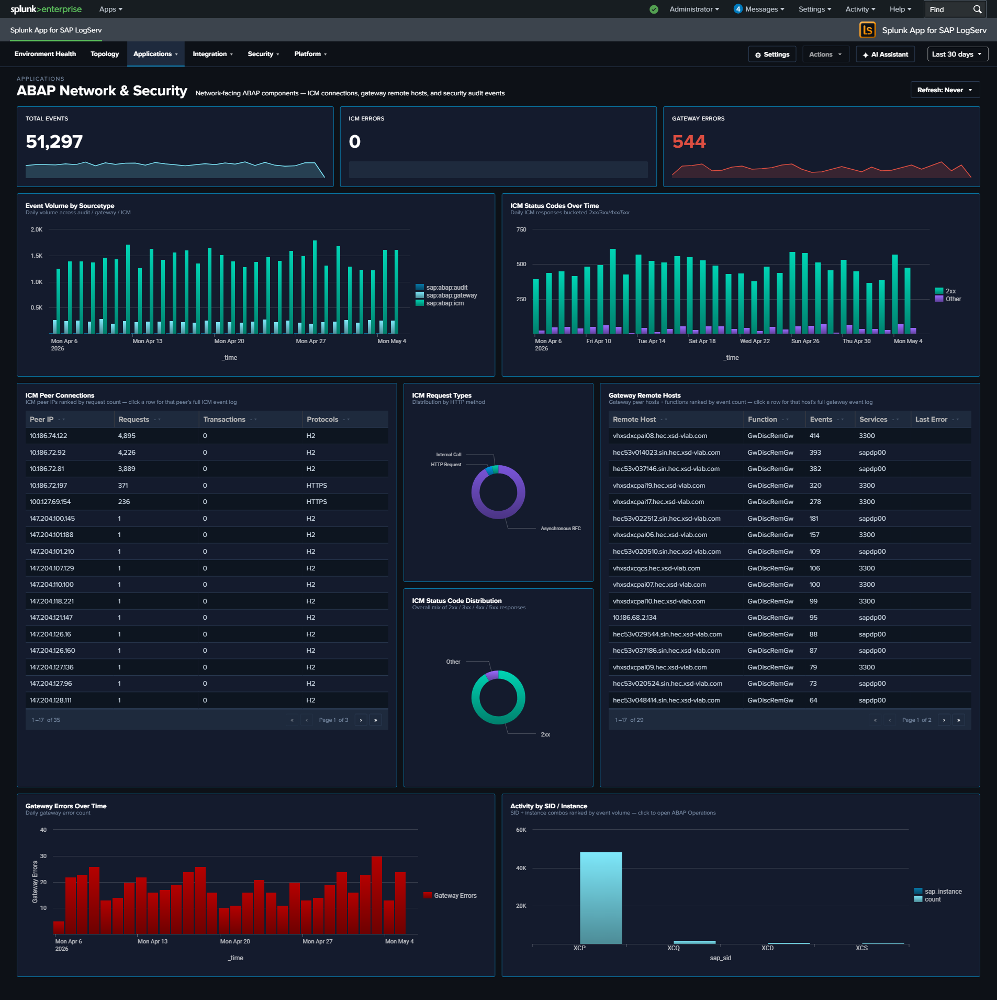

# ABAP Network & Security

## :material-circle-box:{ .taiconcolor } Why This Dashboard Matters

The ABAP Network & Security dashboard monitors the network-facing components of SAP ABAP systems. The Internet Communication Manager (ICM) handles all HTTP/HTTPS traffic into and out of ABAP, while the Gateway controls RFC connections between SAP systems. Together, these are the primary attack surface for ABAP-based landscapes and the first place where performance degradation manifests during connectivity issues.

## Panels

- **Total Events** -- Aggregate event count across ICM, Gateway, and Audit sourcetypes
- **ICM Errors** -- Count of ICM events flagged as errors
- **Gateway Errors** -- Count of Gateway events with error details
- **Event Volume by Sourcetype** -- Daily trend of each sourcetype
- **ICM Status Codes Over Time** -- Stacked column chart of 2xx, 3xx, 4xx, and 5xx responses
- **ICM Peer Connections** -- Table of top peer IPs by request count with protocol details
- **ICM Request Types** -- Pie chart breakdown of ICM request types
- **Gateway Remote Hosts** -- Table of gateway connections by remote host, function, and service
- **Gateway Errors Over Time** -- Timeline of gateway error events
- **Activity by SID / Instance** -- Column chart showing event distribution across SAP systems

## :material-lightning-bolt:{ .taiconcolor } What to Look For

- **ICM 4xx/5xx spikes** -- A sudden increase in client errors (4xx) may indicate application misconfigurations or scanning activity. Server errors (5xx) suggest backend failures or resource exhaustion.
- **Unfamiliar peer IPs** -- New IP addresses appearing in the ICM Peer Connections table warrant investigation, especially if they generate high request volumes or connect using unusual protocols.
- **Gateway connections from unknown hosts** -- The Gateway Remote Hosts table should show expected RFC partners. Unknown remote hosts or unusual service names may indicate unauthorized access attempts.
- **Error rate trends** -- A gradually increasing error rate across days can signal infrastructure degradation (disk space, memory pressure, certificate expiry) before it becomes an outage.

