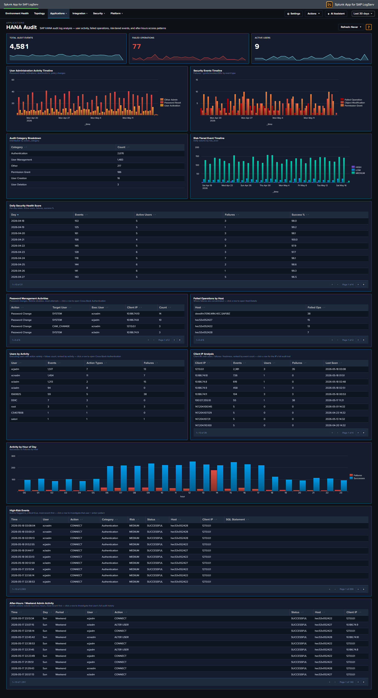

# HANA Audit

## :material-circle-box:{ .taiconcolor } Why This Dashboard Matters

The HANA Audit dashboard is essential for database security compliance and threat detection. SAP HANA stores the most sensitive business data in the SAP landscape, and its audit trail captures every authentication attempt, privilege change, and administrative action. This dashboard transforms raw audit events into actionable security intelligence, supporting both real-time threat detection and compliance reporting.

## Panels

- **Total Audit Events** -- Aggregate count of HANA audit log entries
- **Failed Operations** -- Count of audit events with non-successful status
- **Active Users** -- Count of distinct users generating audit activity
- **User Administration Activity Timeline** -- Tracks user administration actions (password resets, activations, deactivations) over time
- **Daily Security Health Score** -- Stacked chart combining daily event volume, active users, failures, and success rate
- **Audit Category Breakdown** -- Pie chart of audit event categories
- **Security Events Timeline** -- Shows failed operations, object modifications, and permission grants
- **Password Management Activities** -- Table of password-related audit events with user and IP details
- **Failed Operations by Host** -- Pie chart identifying which hosts generate the most failures
- **Top Users by Activity** -- Table ranking users by audit event count with failure counts
- **Activity by Hour of Day** -- Column chart showing successes vs. failures by hour for after-hours detection
- **Client IP Analysis** -- Table of connecting IPs with user counts, failures, and last-seen time
- **Risk-Tiered Event Timeline** -- Stacked column chart of daily events grouped by `risk_level` (critical / high / medium / low), so severe events never get hidden inside overall volume
- **After-Hours / Weekend Admin Activity** -- Table filtered to `is_admin_user=true AND (is_business_hours=false OR weekend)`, surfacing privileged activity outside normal windows; click a row to drill down by user
- **High-Risk Events** -- Full-width table filtered to `is_critical=true` showing the recent top-50 critical audit events with user, client IP, status, action, object, and SQL statement; click a row to drill down by user

## :material-lightning-bolt:{ .taiconcolor } What to Look For

- **Failed operations from unusual IPs** -- Authentication failures from IP addresses not in your expected range may indicate brute-force attacks or credential stuffing attempts.
- **Critical events in the High-Risk Events table** -- Any non-empty row here warrants investigation. The SQL Statement column makes it straightforward to see whether a critical event was a privilege grant, a schema change, or a failed auth.
- **After-hours privileged activity** -- The After-Hours / Weekend Admin Activity table surfaces admin operations outside business hours; correlate with change management records to separate planned maintenance from suspicious activity.
- **Risk-tier shifts over time** -- A rising "critical" or "high" stack in the Risk-Tiered Event Timeline often precedes an incident. A sudden spike in "medium" may point to scripted workloads that need review.
- **Privilege escalation patterns** -- Watch for sequences where a user's privileges are modified followed by unusual data access patterns. The Security Events Timeline surfaces GRANT and REVOKE operations.
- **Declining security health score** -- A downward trend in the daily success rate or an increase in failures signals growing security issues that need investigation.
- **Password management anomalies** -- Bulk password resets or resets for service accounts should be correlated with change management records.

