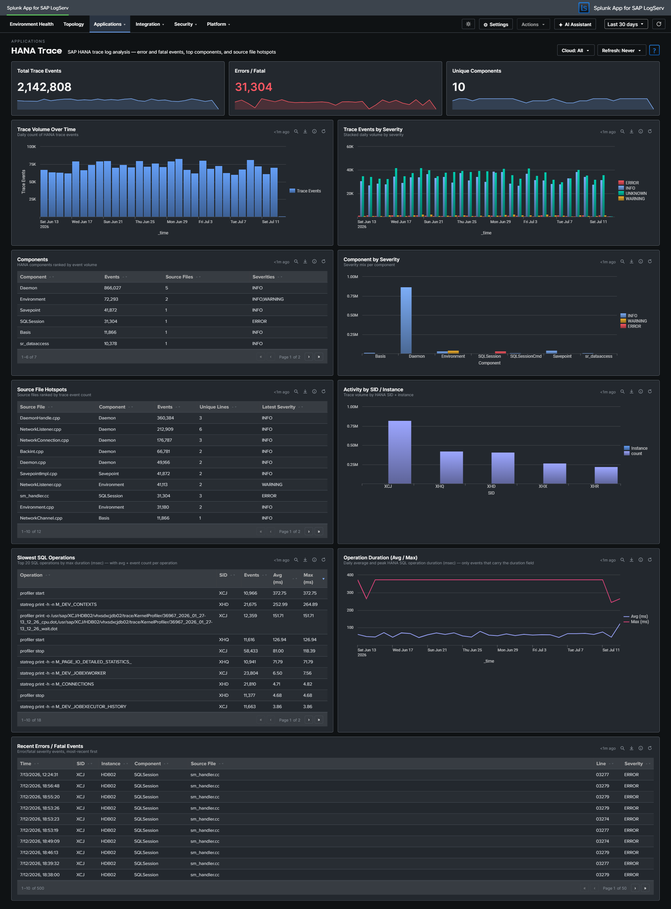

# HANA Trace

## :material-circle-box:{ .taiconcolor } Why This Dashboard Matters

The HANA Trace dashboard provides visibility into SAP HANA's internal diagnostic trace system. Unlike audit logs that capture user actions, trace logs capture what the database engine itself is doing: memory management, query compilation, I/O operations, and internal errors. This is the primary tool for diagnosing HANA performance issues, stability problems, and understanding the root cause of database outages.

## Panels

- **Total Trace Events** -- Aggregate count of trace log entries (click to drill down)
- **Errors / Fatal** -- Count of error and fatal severity events (click to drill down)
- **Unique Components** -- Number of distinct HANA components generating traces (click to drill down)
- **Trace Volume Over Time** -- Daily trend of total trace events
- **Trace Events by Severity** -- Stacked column chart showing info, warning, error, and fatal distributions
- **Top Components** -- Table of the most active HANA components with source file counts (excludes parsing-artifact values such as `INFO`, `of`, `service:` so that real components dominate)
- **Component by Severity (Top 10)** -- Stacked column chart showing which components produce the most errors (same noise filter applied)
- **Source File Hotspots** -- Table identifying specific source files generating the most trace entries (same noise filter applied)
- **Activity by SID / Instance** -- Event distribution across HANA systems
- **Slowest SQL Operations** -- Table of the top 20 SQL operations ranked by max duration (msec), with average duration and event count per operation. (Reads the hourly rollup layer; the per-event time/host columns are not retained at the aggregate grain -- use a row's drill-down for the underlying events.)
- **Operation Duration (Avg / Max)** -- Daily average and peak HANA SQL operation duration (msec), across the events that carry the duration field.
- **Recent Errors / Fatal Events** -- Table of the latest error and fatal trace events with component and source location

## :material-lightning-bolt:{ .taiconcolor } What to Look For

- **Error/fatal severity spikes** -- A sudden increase in error-level traces often precedes a HANA outage or performance degradation. Investigate the component and source file generating the errors.
- **Single component dominance** -- If one component suddenly generates significantly more traces than usual, it may indicate a runaway process, memory leak, or infinite loop within that subsystem.
- **New source files appearing** -- Trace entries from source files not seen before may indicate recently applied patches or code changes that are generating unexpected behavior.
- **SID/instance imbalance** -- Uneven trace volumes across instances of the same HANA system may indicate hardware issues, unbalanced workload distribution, or replication problems.
- **Persistent warning trends** -- Warnings that gradually increase over days often signal resource exhaustion (disk space, memory pools) that will eventually escalate to errors.

