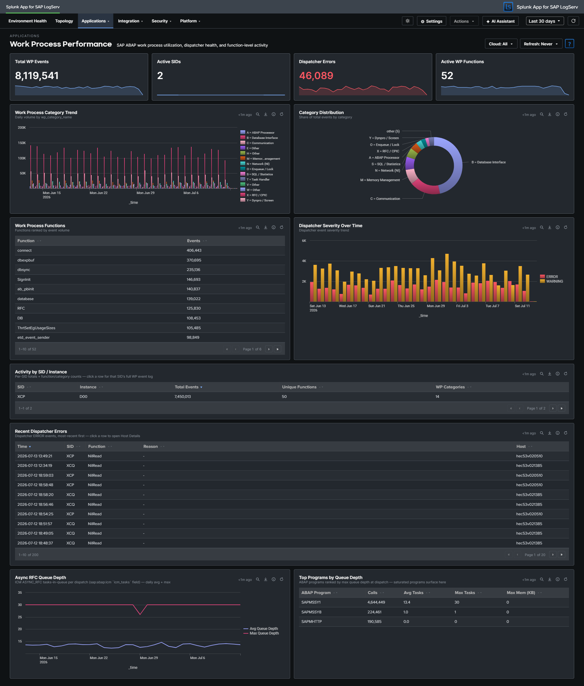

# Work Process Performance

## :material-circle-box:{ .taiconcolor } Why This Dashboard Matters

Work Process Performance focuses specifically on the ABAP work process layer: the finite pool of processes that execute every dialog request, background job, and RFC call. When work processes are exhausted, users see "no free work process" errors; when a specific category is saturated, symptoms manifest differently (e.g., database interface saturation causes SQL timeouts; memory category issues cause roll-area swaps). This dashboard breaks activity down by the SAP-standard `dev_w*` trace component categories so you can target remediation to the right subsystem.

## Panels

!!! warning "Three source log types were discontinued by SAP in April 2026"
    `sap:abap:workprocess`, `sap:abap:dispatcher`, and `sap:abap:event` are no longer delivered by LogServ (see [Supported Log Types](../../../getting-started/supported-log-types.md)). Panels built on them show historical data only unless you have arranged continued collection with SAP.

All panels except the raw-event tables read the hourly summary layer, so figures for wide time ranges can lag by up to about an hour; ranges shorter than 90 minutes are answered from the raw events automatically. See [Performance & Data Freshness](../performance.md).

- **Total WP Events** -- Aggregate `sap:abap:workprocess` event count
- **Active SIDs** -- Count of distinct SAP System IDs reporting work process data
- **Dispatcher Errors** -- Count of dispatcher events with severity ERROR
- **Active WP Functions** -- Count of distinct work process function codes observed
- **Work Process Category Trend** -- Stacked column chart showing daily activity by category, with friendly-named codes (uses the shared `wp_category_name` field)
- **Category Distribution** -- Donut chart showing the overall category mix across the time range (same friendly-named legend)
- **Work Process Functions** -- Table of function codes ranked by event volume
- **Dispatcher Severity Over Time** -- Stacked column of dispatcher severity levels over time
- **Activity by SID / Instance** -- Table ranking each SAP system/instance by event count, with drilldown to filter
- **Recent Dispatcher Errors** -- Table of the most recent dispatcher ERROR events (up to 200) with SID, function, reason, and host; click a row to open Host Details for that host. This panel always reads raw events.
- **Async RFC Queue Depth** -- Daily average and peak ICM `ASYNC_RFC` tasks-in-queue per dispatch (from `sap:abap:icm`)
- **Top Programs by Queue Depth** -- Table of ICM programs ranked by their async-RFC queue depth

## :material-circle-box:{ .taiconcolor } Where the Data Comes From

- **Summary-backed panels** — the work-process, dispatcher and ICM panels read the
  `logserv_wp_perf_rollup` KV Store collection (metrics `wp`, `dp`, `icm`), which this dashboard
  **shares with ABAP Operations**. Populated at minute :09 of every hour by
  `logserv_wp_perf_aggregate` from `sap:abap:workprocess` (work-process function/category mix),
  `sap:abap:dispatcher` (severity counts) and `sap:abap:icm` (per-program call/task/memory
  aggregates — sums and maxima are stored so averages reconstruct exactly).
- **Recent Dispatcher Errors** is a live event listing: it dispatches directly against the raw
  `sap:abap:dispatcher` events at view time, capped at the 200 most recent ERROR events.

Summary-backed panels switch automatically to their exact raw-equivalent search when the selected window is shorter than 90 minutes, so sub-hour investigation stays real-time. The collection keeps 365 days of hourly history (trimmed by a daily retention search); a fresh install seeds the last 30 days from **Settings → Dashboard Data → Run backfill**. The global **Cloud** dropdown filters the summaries through the `cloud_provider` dimension stored in every rollup row. Full schedule and freshness reference: [Performance & Data Freshness](../performance.md).

## :material-lightning-bolt:{ .taiconcolor } What to Look For

- **Category saturation** -- If a single category (e.g., `B = Database Interface` or `M = Memory Management`) dominates the Category Distribution donut when it historically didn't, that subsystem may be a bottleneck. Check the associated detail dashboards (HANA Audit/Trace for database; Linux/ABAP Operations for memory).
- **Trend shifts between categories** -- A gradual increase in `N = Network (NI)` or `C = Communication` events can indicate network degradation between the ABAP server and HANA/other SAP systems.
- **Dispatcher error bursts** -- Spikes in the Dispatcher Severity Over Time chart are often the first user-visible symptom of work process exhaustion. Correlate with Category Distribution to identify which category filled up first.
- **Instance imbalance** -- If one instance's WP activity is an order of magnitude higher than its peers in the Activity by SID/Instance table, investigate whether that instance is handling disproportionate load or experiencing a local issue.
- **Function-code hotspots** -- The Work Process Functions table surfaces which ABAP functions are running most often; an unexpected code at the top can indicate a runaway background job or custom transaction generating excessive traces.

