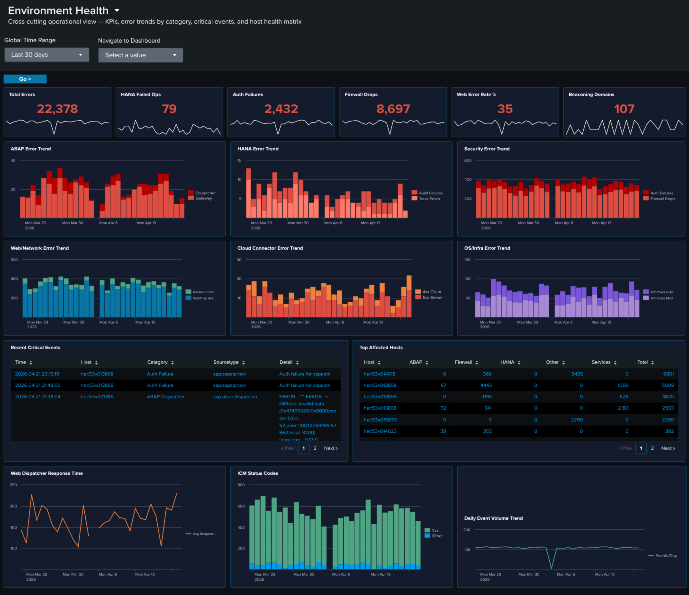

# Environment Health

### :material-circle-box:{ .taiconcolor } Why This Dashboard Matters

The Environment Health dashboard is a single-pane-of-glass operations view that aggregates the most critical signals from across the entire SAP landscape. Instead of switching between individual dashboards to piece together overall health, administrators can use this dashboard to immediately identify active errors, security failures, and performance degradation. Every panel links to the relevant detailed dashboard for investigation, making this the recommended starting point for daily operations monitoring and incident triage.

**Environment Health is the default landing page** when you open the LogServ App — it sits above the four category dropdowns in the top menu.

### Panels

- **Total Errors** -- Aggregate count of errors across all monitored sourcetypes. Click to open a detailed search showing errors by category, sourcetype, affected hosts, and last-seen time.
- **HANA Failed Ops** -- Count of non-successful HANA audit operations (login failures, permission denials, DDL errors). Click to drill down to HANA Audit dashboard.
- **Auth Failures** -- Combined count of sapstartsrv authentication failures and HANA audit connection failures. Click to drill down to SAP Services dashboard.
- **Firewall Drops** -- Count of Linux firewall (iptables) drop events across all monitored hosts. Click to drill down to Linux dashboard.
- **Web Error Rate %** -- Percentage of Web Dispatcher requests returning 4xx/5xx status codes. Click to drill down to Web Dispatcher dashboard.
- **Beaconing Domains** -- Count of DNS domains exhibiting periodic query patterns that may indicate malware or C2 communication. Click to drill down to DNS Analytics dashboard.
- **ABAP Error Trend** -- Stacked column chart of daily ABAP errors by sub-source (Dispatcher, ICM, Gateway). Click to drill down to ABAP Security dashboard.
- **HANA Error Trend** -- Stacked column chart of daily HANA errors (Audit Failures, Trace Errors). Click to drill down to HANA Audit dashboard.
- **Security Error Trend** -- Stacked column chart of daily security errors (Auth Failures, Firewall Drops). Click to drill down to SAP Services dashboard.
- **Web/Network Error Trend** -- Stacked column chart of daily web/network errors (WebDisp 4xx/5xx, Router Errors, Proxy Denied). Click to drill down to Web Dispatcher dashboard.
- **Cloud Connector Error Trend** -- Stacked column chart of daily Cloud Connector HTTP errors (4xx Client, 5xx Server). Click to drill down to Cloud Connector dashboard.
- **OS/Infra Error Trend** -- Stacked column chart of daily Windows events by severity (High, Medium). Click to drill down to Windows dashboard.
- **Recent Critical Events** -- Table of the 20 most recent critical events (HANA audit failures, ABAP dispatcher FATAL, HANA trace fatal, auth failures, Windows high severity). Click any row to drill down to Host Details for that host.
- **Top Affected Hosts** -- Table of hosts ranked by total error count with breakdowns by category (ABAP, HANA, Services, Firewall, Other). Click any host to drill down to Host Details.
- **Web Dispatcher Response Time** -- Line chart of daily average response time trend for web dispatcher requests. Click to drill down to Web Dispatcher dashboard.
- **ICM Status Codes** -- Stacked column chart of HTTP status code categories (2xx/3xx/4xx/5xx) over time. Click to drill down to ABAP Security dashboard.
- **Data Pipeline -- Events/Day** -- Average daily event volume and daily trend line for monitoring pipeline health and detecting ingestion gaps. Click to drill down to Overview dashboard.

### :material-lightning-bolt:{ .taiconcolor } What to Look For

- **Rising error trend** -- An upward slope in any error category chart indicates a worsening condition. Correlate the timing with recent changes, deployments, or infrastructure events. Each chart drills directly to the relevant dashboard for investigation.
- **Auth failure spikes** -- Sudden increases in the Auth Failures KPI or Security Error Trend may indicate brute-force login attempts, expired credentials, or misconfigured service accounts. Cross-reference with the HANA Audit and SAP Services dashboards.
- **HANA audit failures** -- Non-zero HANA Failed Ops always warrant investigation. Failed operations may indicate unauthorized access attempts, privilege escalation, or application misconfigurations.
- **Cloud Connector errors** -- A spike in the Cloud Connector Error Trend (especially 5xx Server errors) may indicate backend system unavailability, network issues between the SCC and SAP BTP, or certificate expiration.
- **Pipeline volume drops** -- A sudden drop in the Events/Day trend may indicate an SQS queue backup, S3 input failure, HF outage, or filter misconfiguration. Check the Data Pipeline Overview for per-host visibility.
- **Response time degradation** -- An increasing trend in Web Dispatcher response time often precedes user-facing performance complaints. Investigate ICM status codes for correlated 5xx errors.
- **Host concentration** -- If the Top Affected Hosts table shows errors concentrated on one or two hosts, those systems may have a localized issue (disk full, service crash, misconfiguration) rather than an environment-wide problem.

