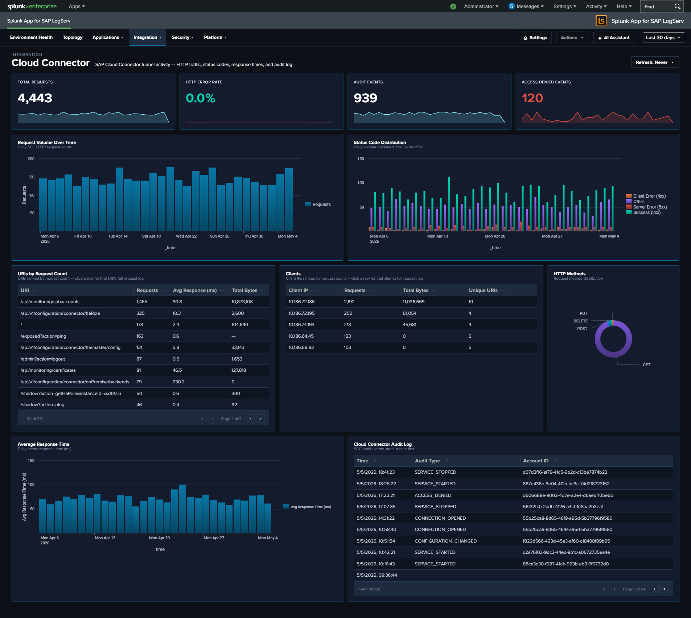

# Cloud Connector

## :material-circle-box:{ .taiconcolor } Why This Dashboard Matters

The Cloud Connector dashboard monitors SAP Cloud Connector (SCC), which provides secure tunneled connectivity between on-premise SAP systems and SAP BTP (Business Technology Platform) cloud services. As the bridge between on-premise and cloud, the Cloud Connector's health directly impacts hybrid integration scenarios, Fiori apps, and cloud-based analytics that depend on on-premise data access.

## Panels

- **Total Requests** -- Count of HTTP requests processed by the Cloud Connector
- **HTTP Error Rate** -- Percentage of HTTP requests returning 4xx or 5xx status codes (scoped name clarifies that this is HTTP-only, not audit-log errors)
- **Audit Events** -- Count of Cloud Connector audit log entries
- **Access Denied Events** -- Count of `sap:scc:audit` entries with `scc_audit_type="ACCESS_DENIED"` (click to drill down to the matching events)
- **Request Volume Over Time** -- Daily HTTP request trend
- **Status Code Distribution** -- Stacked column chart of 2xx, 3xx, 4xx, and 5xx responses
- **Top URIs by Request Count** -- Table of the most requested URIs with average response time and total bytes
- **Average Response Time** -- Line chart trending response time over time
- **HTTP Methods** -- Pie chart breakdown of request methods
- **Top Clients** -- Table of the most active client IPs with request counts and unique URI counts
- **Cloud Connector Audit Log** -- Table of recent audit events with type and account details

## :material-lightning-bolt:{ .taiconcolor } What to Look For

- **HTTP Error Rate increases** -- A rising error rate indicates connectivity issues between on-premise systems and the cloud. Check the Status Code Distribution for whether errors are client-side (4xx) or server-side (5xx).
- **Access Denied events** -- A non-zero Access Denied KPI means the BTP side actively rejected a request -- either a misconfigured subaccount binding, an expired certificate, or an unauthorized access attempt. Click the KPI to see which accounts/URIs are being denied.
- **Response time degradation** -- Gradually increasing response times suggest bandwidth constraints, backend system slowdowns, or Cloud Connector resource exhaustion. Sudden spikes may indicate outages.
- **Unusual URIs** -- Requests to unexpected URI paths in the Top URIs table may indicate scanning or misconfigured cloud applications attempting to access unauthorized resources.
- **Audit events indicating config changes** -- Cloud Connector audit entries for configuration modifications should correlate with approved change windows. Unexpected changes may indicate unauthorized access.
- **New client IPs** -- The Cloud Connector should only receive traffic from expected BTP subaccounts. New client IPs may indicate unauthorized access attempts or misconfigured routing.

