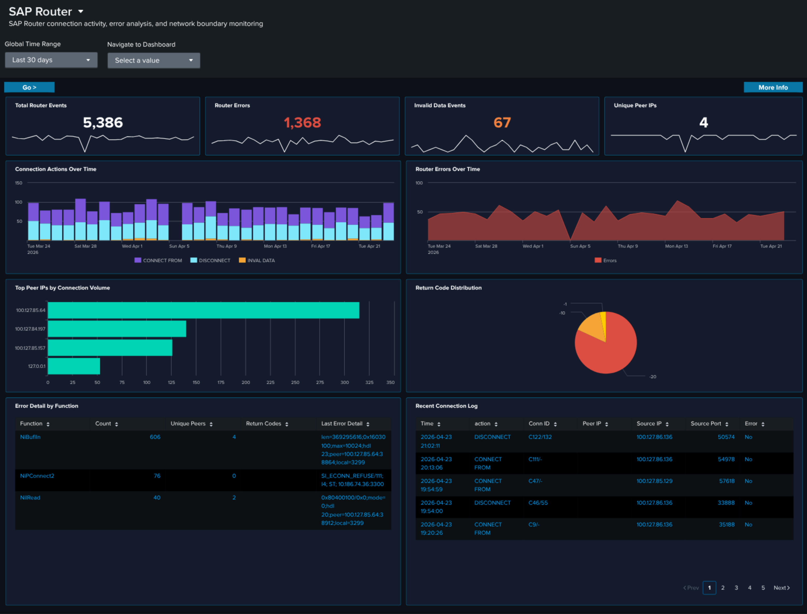

# SAP Router

## :material-circle-box:{ .taiconcolor } Why This Dashboard Matters

SAP Router is the network gateway that sits between SAP systems and external networks, forwarding RFC and HTTP traffic across trust boundaries. Because it is exposed to the network, its logs are a primary audit trail for cross-boundary SAP traffic: every connection attempt, protocol error, and invalid-data event gets recorded. This dashboard separates the SAP Router signal from other services so that spikes in router errors (connectivity breakage, misconfigured routetab, or attempted protocol abuse) are visible on their own.

## Panels

- **Total Router Events** -- Aggregate SAP Router event count
- **Router Errors** -- Count of router error events (click to drill down)
- **Invalid Data Events** -- Count of events where the router received malformed or unexpected protocol data -- often indicates a misconfigured client or probing
- **Unique Peer IPs** -- Distinct count of peer IPs seen in the time window
- **Connection Actions Over Time** -- Stacked column chart of CONNECT, DISCONNECT, and error actions daily
- **Router Errors Over Time** -- Daily trend of router error events (area chart)
- **Top Peer IPs by Connection Volume** -- Horizontal bar chart of the most active peer IPs (top 15)
- **Return Code Distribution** -- Pie chart showing the distribution of router return codes (NiBuf, NiI, NiL, etc.) over the time range
- **Error Detail by Function** -- Table of the top 5 router error functions with return code, count, and sample peer detail; row drilldown
- **Recent Connection Log** -- Table of the 25 most recent CONNECT / DISCONNECT entries with peer IP, action, and return code; row drilldown

## :material-lightning-bolt:{ .taiconcolor } What to Look For

- **Invalid Data spikes** -- A sudden increase in the Invalid Data KPI suggests either a misconfigured client speaking a wrong protocol or a port scan / probe. Check the Top Peer IPs by Connection Volume for new entries.
- **Unfamiliar peers in the top-IPs bar** -- Known SAP-to-SAP traffic should come from a predictable IP set; new IPs in the top bar warrant investigation, especially if they generate high connection volume or show up only in the Error Detail by Function table.
- **Return code imbalance** -- The Return Code Distribution pie should be dominated by normal-case codes. A sudden growth of `NIECONN_REFUSED` or `NIEHOST_UNKNOWN` slices usually means a downstream SAP system is down or a routetab entry is wrong.
- **Rising error trend** -- An upward slope in Router Errors Over Time can precede an outage. Cross-reference with ABAP Operations (dispatcher errors) and Cloud Connector (for hybrid flows) to see whether the root cause is local to the router or broader.
- **Concentrated errors by function** -- If one row of the Error Detail by Function table accumulates most errors, that function is the specific RFC/HTTP path where the problem lives -- a much narrower investigation scope than "the router is broken".

