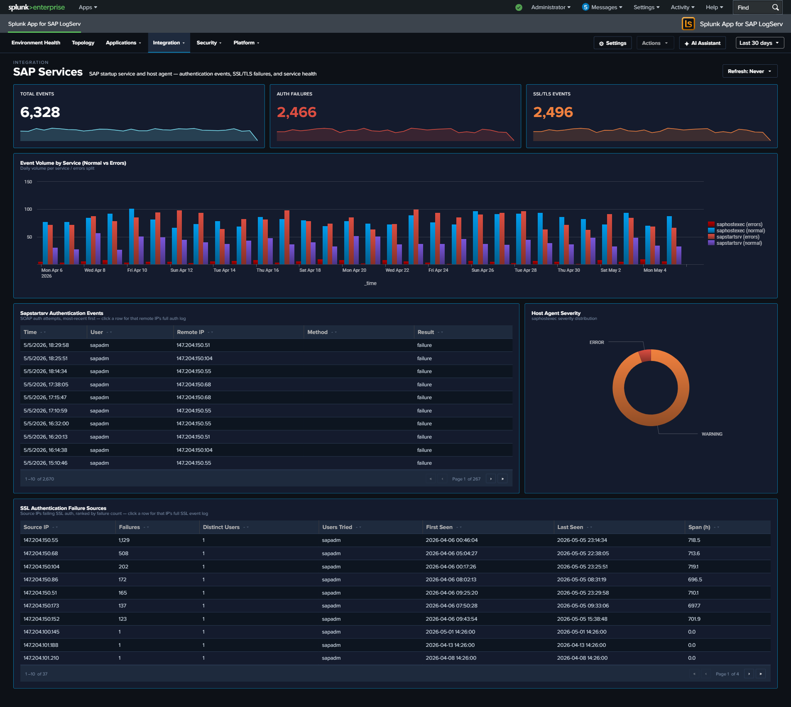

# SAP Services

## :material-circle-box:{ .taiconcolor } Why This Dashboard Matters

The SAP Services dashboard monitors two host-level services that are critical to SAP system availability: **sapstartsrv** (system startup and management) and the **SAP Host Agent** (host monitoring and management). These services operate at the infrastructure layer, below the application, and their failures can prevent SAP systems from starting or being managed remotely. The authentication story is front-and-center here -- sapstartsrv is a common brute-force target, so the dashboard features an SSL-authentication failure panel as the main investigation surface. (SAP Router activity lives on its own [SAP Router](sap-router.md) dashboard.)

## Panels

- **Total Events** -- Aggregate event count across sapstartsrv and saphostexec
- **Auth Failures** -- Count of sapstartsrv authentication failures
- **SSL/TLS Events** -- Count of events involving SSL/TLS negotiation
- **Event Volume by Service (Normal vs Errors)** -- Full-width stacked column chart with four semantic series: sapstartsrv (normal), sapstartsrv (errors), saphostexec (normal), saphostexec (errors). Errors are defined per service: sapstartsrv = failed authentication events; saphostexec = severity ERROR/WARNING.
- **SSL Authentication Failure Sources** -- Full-width featured table aggregating SSL/TLS auth failures by source IP, with failure count, distinct user count, user list, first/last seen, and activity span (hours). Top 50 sources, row drilldown to the full event set for that IP.
- **Sapstartsrv Authentication Events** -- Table of authentication attempts showing user, IP, method, and result
- **Host Agent Severity** -- Pie chart of SAP Host Agent log severity distribution

## :material-lightning-bolt:{ .taiconcolor } What to Look For

- **Auth failure sources** -- The SSL Authentication Failure Sources table is the primary investigation surface. A single source IP with many distinct usernames is credential stuffing; many sources with a few usernames each is distributed brute-force; long activity spans indicate a persistent (not opportunistic) attacker.
- **Authentication failures from new IPs** -- Any new source IP appearing in the SSL Authentication Failure Sources table should be cross-referenced with your expected SAP admin network. Production sapstartsrv should rarely see failed authentications from unfamiliar ranges.
- **Error stack rising in the volume chart** -- If the error series (red) in the Event Volume chart grows relative to normal (blue/teal) series, something is actively going wrong. Correlate the spike timing with the host agent severity pie to determine which service is affected.
- **Host Agent ERROR severity** -- If the Host Agent severity distribution shifts toward ERROR, the host monitoring infrastructure may be degrading, which impacts central management capabilities.

