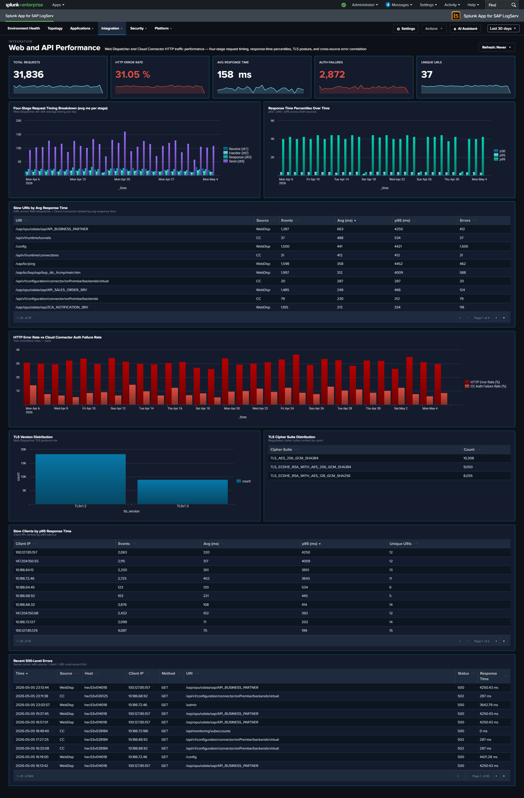

# Web and API Performance

## :material-circle-box:{ .taiconcolor } Why This Dashboard Matters

The Web Dispatcher dashboard answers "what's the traffic doing?" -- volume, status codes, top URIs. Web and API Performance answers the next question: "*why* does it feel slow or unreliable?" It exposes the per-request timing stages that the `sap:webdispatcher:access` sourcetype records (`dt1` receive / `dt2` handler / `dt3` response / `dt4` send), combines response-time percentiles across Web Dispatcher and Cloud Connector HTTP traffic, and correlates the HTTP error rate with the Cloud Connector auth failure rate so that you can see whether a spike in user-visible failures is actually a backend-auth problem. It also surfaces TLS posture (version and cipher suite distributions) -- data already extracted from Web Dispatcher but previously unused -- so that cipher-suite drift or legacy TLS traffic becomes visible.

## Panels

- **Total Requests** -- Aggregate HTTP request count across Web Dispatcher and Cloud Connector
- **HTTP Error Rate** -- Percentage of requests returning 4xx or 5xx status (combined across both sources); click to open the matching events
- **Avg Response Time** -- Average `response_time_ms` across both sources, in milliseconds
- **Auth Failures** -- Count of requests rejected for authentication reasons: Web Dispatcher `status IN (401, 403)` OR Cloud Connector `(status IN (401, 403)) OR is_authenticated="false"`; click to drill down
- **Unique URLs** -- Distinct count of URIs seen across both sources
- **Four-Stage Request Timing Breakdown** -- Full-width stacked column chart showing the average milliseconds a request spends in each of the Web Dispatcher's four internal stages per day: `dt1` receive (blue), `dt2` handler (light cyan), `dt3` response (orange), `dt4` send (red). The stack composition tells you where time is being spent; the total stack height is the average end-to-end response time.
- **Response Time Percentiles Over Time** -- Daily p50 / p95 / p99 of `response_time_ms` (line chart, three series). p99 climbing while p50 stays flat is the classic tail-latency signal.
- **Top Slow URIs by Avg Response Time** -- Table of the 20 slowest URIs ranked by average response time, with source (WebDisp or CC), event count, avg ms, p95 ms, and error count. Row drilldown opens the events for that URI.
- **HTTP Error Rate vs Cloud Connector Auth Failure Rate** -- Full-width line chart overlaying two series: the overall HTTP error rate (4xx/5xx across both sources, red) and the Cloud Connector auth failure rate (401/403/anonymous, scoped to CC's own denominator, orange). Use this to answer "are the user-visible errors actually auth failures at the backend?"
- **TLS Version Distribution** -- Column chart with color-coded series: TLS 1.0 red, 1.1 orange, 1.2 yellow, 1.3 teal -- reinforcing that older versions are the security concern
- **TLS Cipher Suite Distribution (Top 10)** -- Horizontal bar chart of the 10 most-used cipher suites, with cyan accent
- **Top Slow Clients by p95 Response Time** -- Full-width table of the 20 client IPs experiencing the highest p95 latency, with event count, avg ms, p95 ms, and distinct URI count. Row drilldown opens the events for that client IP.
- **Recent 500-Level Errors** -- Full-width table of the 25 most recent 5xx events with time, source, host, client IP, method, URI, status, and response time. Row drilldown opens the full raw event.

## :material-lightning-bolt:{ .taiconcolor } What to Look For

- **Stage imbalance in the timing breakdown** -- In a healthy backend, `dt2` (handler) dominates the stack because that's where the ABAP/JVM work happens. If `dt3` (response) or `dt4` (send) suddenly grow relative to `dt2`, the bottleneck is likely on the response-formation or network-egress side rather than backend processing.
- **Tail latency growth (p99)** -- p99 drifting up while p50 stays flat means a small number of requests are getting dramatically slower -- often database contention or garbage-collection pauses. Correlate with Top Slow URIs to identify which paths are affected.
- **Error-rate and auth-failure-rate correlation** -- When the two lines in the correlation chart track together, your HTTP error spikes are driven by backend auth rejection. When they diverge (HTTP errors up, auth failures flat), the cause is elsewhere (backend unavailable, 500s, timeouts).
- **Legacy TLS traffic** -- Any non-trivial slice of TLS 1.0 or 1.1 in the TLS Version Distribution is a compliance concern. Correlate the TLS Cipher Suite Distribution to see whether legacy ciphers are still being negotiated.
- **Slow clients vs slow URIs** -- The two "Top Slow" tables answer different questions. A single slow client with diverse URIs suggests network-path problem between that client and your infrastructure; a single slow URI across many clients points at a backend issue with that specific endpoint.
- **Concentrated 500 errors** -- Recurring entries in the Recent 500-Level Errors table from a single host, URI, or client IP narrow the investigation scope immediately.

