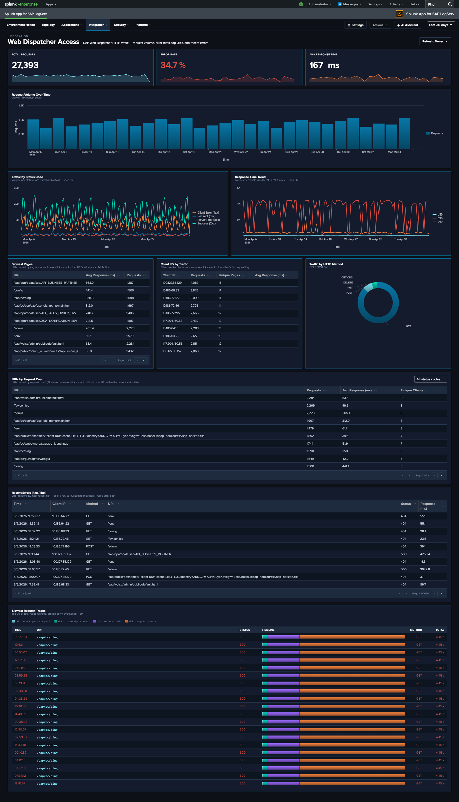

# Web Dispatcher

## :material-circle-box:{ .taiconcolor } Why This Dashboard Matters

The Web Dispatcher dashboard analyzes HTTP traffic flowing through the SAP Web Dispatcher, which acts as the reverse proxy and load balancer for SAP web applications including Fiori, WebGUI, and custom web services. As the front door for all web-based SAP access, the Web Dispatcher's traffic patterns reveal both performance issues and potential security threats. For deeper per-request timing analysis (four-stage breakdown, percentiles, TLS posture), see [Web and API Performance](web-api-performance.md).

## Panels

- **Total Requests** -- Aggregate count of HTTP requests processed by the Web Dispatcher
- **Error Rate** -- Percentage of requests returning 4xx or 5xx status codes
- **Avg Response Time** -- Average response time across all requests in milliseconds
- **Traffic by Status Code** -- Stacked column chart showing 2xx, 3xx, 4xx, and 5xx response distributions
- **Response Time Trend** -- Response time patterns over time
- **Traffic by HTTP Method** -- Breakdown of GET, POST, PUT, DELETE, etc.
- **Top 5 Slowest Pages** -- Bar chart of the slowest responding URLs
- **Top Client IPs by Traffic** -- Bubble chart showing the most active client IP addresses
- **Request Volume Over Time** -- Daily request trend line
- **Top URIs by Request Count** -- Table of the most accessed URIs with average response time and unique client counts
- **Recent Errors (4xx/5xx)** -- Table of the latest error events with client IP, method, URI, and status code

## :material-lightning-bolt:{ .taiconcolor } What to Look For

- **4xx/5xx status code spikes** -- Client errors (4xx) may indicate broken links, misconfigured apps, or scanning activity. Server errors (5xx) signal backend ABAP or Java system failures.
- **Response time degradation** -- Slow response times impact user experience. Correlate with the Top 5 Slowest Pages to identify which applications are affected, then investigate backend system load.
- **Unusual HTTP methods** -- PUT, DELETE, or PATCH requests where only GET/POST are expected may indicate API abuse or vulnerability exploitation.
- **Concentrated client IP traffic** -- A single IP generating disproportionate traffic in the bubble chart may be a bot, scraper, or denial-of-service source.
- **TLS version distribution** -- If your data includes TLS fields, watch for clients using deprecated TLS versions (1.0, 1.1) that may need to be blocked for compliance.

