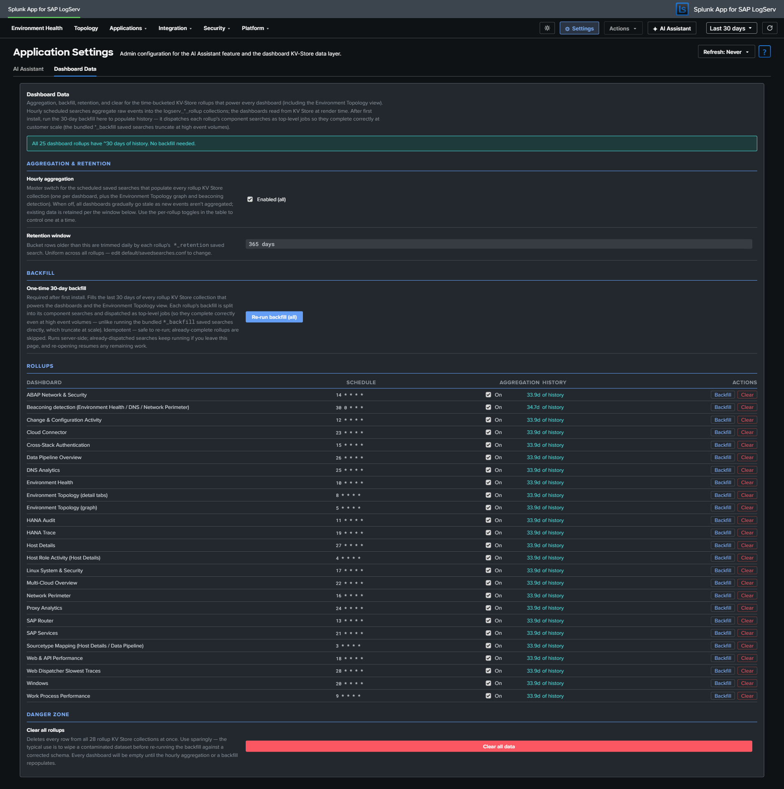

# Dashboard Performance & Data Freshness

The LogServ App dashboards are designed to stay fast on large environments. This page explains how each dashboard panel sources its data, what "data freshness" means per panel, and the one-time step an admin runs after installing on a high-volume instance.

## :material-circle-box:{ .taiconcolor } How the dashboards source their data

Every panel reads from the cheapest *correct* data source for what it shows. There are two fast tiers plus a small set of panels that stay on raw events.

| Tier | Used for | Freshness | Cost |
|---|---|---|---|
| **`tstats` on indexed fields** | Pure counts and averages over indexed dimensions (event volumes, host / sourcetype / cloud-provider breakdowns) | Real-time | Very low — reads the index's tsidx, no raw-event scan |
| **KV-Store precompute rollups** | Most charts, tables, and KPIs across the dashboard suite | Hourly for wide ranges; **real-time for sub-hour ranges** (automatic — see below) | Near-zero at read time — a scheduled search precomputes the data once per hour |
| **Raw events** | Per-event listings, streamstats periodicity (beaconing), and a few timing traces that cannot be rolled up | Real-time | Bounded with `\| head N` where the panel is a time-ordered listing |

!!! info "No CIM data-model acceleration is required"
    The dashboards do **not** depend on accelerating the Common Information Model (CIM) Web / Authentication / Network data models. The fast path is the app's own KV-Store rollups, which work regardless of whether you have accelerated any CIM model. (The app's CIM *tagging* for Splunk Enterprise Security correlation is a separate, independent feature — see [Enterprise Security → CIM Compliance](../../enterprise-security/cim-compliance.md).)

### The KV-Store rollup layer

Behind the rolled-up panels are **24 KV-Store rollup collections** (`logserv_*_rollup`). For each, a scheduled saved search (`logserv_*_aggregate`, cron `5 * * * *` — five minutes past every hour) aggregates the previous hour's raw events into hour-bucketed rows. The dashboard reads the collection back, filtered to the global time-range picker's window via a `bucket_ts` range. Because the heavy aggregation happens once per hour in the background, opening a dashboard re-reads precomputed rows in roughly **0.1–0.6 seconds** instead of dispatching a full raw scan.

A daily retention search trims each collection to a rolling **365-day** window.

## :material-circle-box:{ .taiconcolor } Scheduled-search schedule

The app's scheduled searches are organized into three non-overlapping bands so that no two enabled scheduled searches ever fire in the same minute and the hourly aggregation never contends with the daily retention. This keeps the scheduler from bursting at high event volume.

| Band | When | What runs |
|---|---|---|
| **Hourly aggregates** | `:03`–`:28` every hour, one per minute | The 26 always-on rollup-aggregate searches (`logserv_*_aggregate`) |
| **Daily retention + beaconing** | `:30`–`:58` (hours `00` and `01`), two minutes apart | The 26 retention trims + the 2 daily beaconing aggregates |
| **Enterprise Security** | `:00`–`:02`, `:29`, odd `:31`–`:59` | The 22 `splunk_sap_logserv_es_*` searches (enabled by default) — see note below |

The per-search tables below give each search's **run time** as *typical / busy* — the average and worst single-run duration observed on the validation fleet (~10.7M events/day). Aggregate run times scale with the **per-hour event volume**; retention run times scale with the **collection size**. Every search completes well within its one-minute slot.

### Hourly aggregate band (`:03`–`:28`)

Each rollup aggregate dispatches the just-completed hour (`-1h@h`..`@h`), so the firing minute is freshness-neutral — spreading them one-per-minute simply avoids a burst at `:05`. Peak concurrency is ~1–2 instead of 26.

| Fires | Aggregate search | Powers (dashboard) | Run time (typ. / busy) |
|---|---|---|---|
| `:03` | `logserv_stmap_aggregate` | Host Details · Sourcetype Mapping **+** Data Pipeline Overview · Linked Graph | 1 / 2 s |
| `:04` | `logserv_hostrole_aggregate` | Host Details · Role Activity | 4 / 5 s |
| `:05` | `logserv_topology_aggregate_nodes` | Environment Topology (graph) | 6 / 20 s |
| `:06` | `logserv_topology_aggregate_edges` | Environment Topology (graph) | 3 / 12 s |
| `:07` | `logserv_topology_aggregate_inventory` | Environment Topology (graph) | 3 / 13 s |
| `:08` | `logserv_topology_detail_aggregate` | Environment Topology (detail tabs) | 13 / 35 s |
| `:09` | `logserv_wp_perf_aggregate` | Work Process Performance | 5 / 16 s |
| `:10` | `logserv_severity_aggregate` | Environment Health | 5 / 18 s |
| `:11` | `logserv_hana_aggregate` | HANA Audit | 3 / 12 s |
| `:12` | `logserv_compliance_aggregate` | Change & Configuration Activity | 3 / 15 s |
| `:13` | `logserv_saprouter_aggregate` | SAP Router | 2 / 7 s |
| `:14` | `logserv_abapnet_aggregate` | ABAP Network & Security | 6 / 21 s |
| `:15` | `logserv_xstack_auth_aggregate` | Cross-Stack Authentication | 3 / 10 s |
| `:16` | `logserv_perimeter_aggregate` | Network Perimeter | 6 / 22 s |
| `:17` | `logserv_linux_aggregate` | Linux System & Security | 7 / 24 s |
| `:18` | `logserv_web_timing_aggregate` | Web & API Performance | 8 / 21 s |
| `:19` | `logserv_hana_trace_aggregate` | HANA Trace | 2 / 6 s |
| `:20` | `logserv_windows_aggregate` | Windows | 2 / 6 s |
| `:21` | `logserv_sapservices_aggregate` | SAP Services | 2 / 6 s |
| `:22` | `logserv_mc_aggregate` | Multi-Cloud Overview | 2 / 7 s |
| `:23` | `logserv_cloudconn_aggregate` | Cloud Connector | 4 / 10 s |
| `:24` | `logserv_proxy_aggregate` | Proxy | 4 / 12 s |
| `:25` | `logserv_dns_aggregate` | DNS Analytics | 2 / 5 s |
| `:26` | `logserv_pipeline_aggregate` | Data Pipeline Overview | 2 / 5 s |
| `:27` | `logserv_hostdetails_aggregate` | Host Details (Overview tab) | 2 / 7 s |
| `:28` | `logserv_webdisp_slowtrace_aggregate` | Web Dispatcher · Slowest Request Traces | 1 / 3 s |

### Daily band (`:30`–`:58`)

Retention trims and the two daily beaconing aggregates run in the off-peak `:30`–`:58` window — 15 searches at `00:30`–`00:58`, the remaining 13 at `01:30`–`01:54`, all two minutes apart. Keeping them at minute `:30`+ guarantees they never collide with the hourly aggregate band (which fires at `:03`–`:28` of *every* hour). Each retention search trims its collection to the rolling 365-day window; the two beaconing aggregates (`00:30`, `00:32`) precompute the per-day DNS/perimeter beaconing statistics. (Retention run times scale with collection size, so the larger rollups — Environment Topology detail, Host Role Activity, DNS, Web & API, Network Perimeter — take longest; all are off-peak and collision-free.)

| Fires | Daily search | Action (dashboard) | Run time (typ. / busy) |
|---|---|---|---|
| `00:30` | `logserv_beaconing_aggregate` | Aggregate daily beaconing counts → Environment Health · DNS Analytics | 2 / 4 s |
| `00:32` | `logserv_beaconing_detail_aggregate` | Aggregate daily beaconing gap-stats → DNS Analytics · Network Perimeter | 1 / 2 s |
| `00:34` | `logserv_topology_retention` | Trim Environment Topology (graph) | 7 / 10 s |
| `00:36` | `logserv_wp_perf_retention` | Trim Work Process Performance | 10 / 14 s |
| `00:38` | `logserv_severity_retention` | Trim Environment Health | 7 / 8 s |
| `00:40` | `logserv_hana_retention` | Trim HANA Audit | 5 / 7 s |
| `00:42` | `logserv_compliance_retention` | Trim Change & Configuration Activity | 2 / 2 s |
| `00:44` | `logserv_saprouter_retention` | Trim SAP Router | 2 / 2 s |
| `00:46` | `logserv_abapnet_retention` | Trim ABAP Network & Security | 4 / 5 s |
| `00:48` | `logserv_xstack_auth_retention` | Trim Cross-Stack Authentication | 3 / 3 s |
| `00:50` | `logserv_perimeter_retention` | Trim Network Perimeter | 28 / 31 s |
| `00:52` | `logserv_linux_retention` | Trim Linux System & Security | 7 / 8 s |
| `00:54` | `logserv_web_timing_retention` | Trim Web & API Performance | 25 / 36 s |
| `00:56` | `logserv_hana_trace_retention` | Trim HANA Trace | 5 / 7 s |
| `00:58` | `logserv_windows_retention` | Trim Windows | 4 / 5 s |
| `01:30` | `logserv_sapservices_retention` | Trim SAP Services | 1 / 2 s |
| `01:32` | `logserv_mc_retention` | Trim Multi-Cloud Overview | 13 / 15 s |
| `01:34` | `logserv_beaconing_retention` | Trim beaconing counts | < 1 s |
| `01:36` | `logserv_cloudconn_retention` | Trim Cloud Connector | 4 / 4 s |
| `01:38` | `logserv_proxy_retention` | Trim Proxy | 4 / 5 s |
| `01:40` | `logserv_dns_retention` | Trim DNS Analytics | 35 / 38 s |
| `01:42` | `logserv_pipeline_retention` | Trim Data Pipeline Overview | 5 / 6 s |
| `01:44` | `logserv_hostdetails_retention` | Trim Host Details | 8 / 8 s |
| `01:46` | `logserv_webdisp_slowtrace_retention` | Trim Web Dispatcher · Slowest Traces | 2 / 2 s |
| `01:48` | `logserv_beaconing_detail_retention` | Trim beaconing gap-stats | 1 / 1 s |
| `01:50` | `logserv_topology_detail_retention` | Trim Environment Topology (detail tabs) | 63 / 69 s |
| `01:52` | `logserv_stmap_retention` | Trim Sourcetype Mapping | 24 / 24 s |
| `01:54` | `logserv_hostrole_retention` | Trim Host Role Activity | 38 / 38 s |

### Enterprise Security band (enabled by default)

The 22 `splunk_sap_logserv_es_*` searches ship **enabled** (see [Enterprise Security → The ES schedule](../../enterprise-security/overview.md#the-es-schedule-collision-free)) on crons that sit entirely in the minutes the always-on bands leave free — `:00`–`:02`, `:29`, and the odd minutes `:31`–`:59` — so they are collision-free with both the aggregate band (`:03`–`:28`) and the daily retention band (`:30`–`:58`, hours 00–01). 16 correlation searches run hourly, the 2 Asset/Identity feeds every 4 hours, and the 4 behavioral-anomaly searches once daily at `:02` (hours 02–05). The three heavy 30-day anomaly scans therefore run **once a day** rather than every hour.

### Measured behavior

On the validation fleet (335M events), the hourly aggregates each complete in seconds and the slowest daily retention trim is ~1 minute (see the per-search tables above); the scheduler logs **0 skipped / 0 deferred**. The two heaviest ES searches — the 30-day anomaly scans (~150–340 s and ~50–120 s) — now run **once a day** rather than every hour, so they no longer add per-hour load.

### :material-circle-box:{ .taiconcolor } Behavior with multiple search heads

How these scheduled searches behave depends on the search-head topology:

**Search Head Cluster (SHC) — the supported multi-SH topology.** Works cleanly, with no extra configuration:

- The SHC **captain delegates each scheduled search to a single member** per fire, so every aggregate and retention search runs **once cluster-wide per interval — not once per member**. There is no multiplication of load by the number of search heads.
- **KV Store is automatically replicated across the cluster.** Whichever member runs an aggregate writes the rollup to its local KV Store, and Splunk replicates the collection to every member — so **all search heads serve the dashboards from the same rolled-up data**, regardless of which member computed it. (The rollup design depends on KV Store, which is cluster-replicated by default.)
- The app's saved searches and collection definitions deploy to all members via the **SHC deployer** (`splunk apply shcluster-bundle`), Splunk's standard process. The one-click **Settings → Dashboard Data → Run backfill** also works cluster-wide — an admin runs it from any member and the results replicate.
- The one-search-per-minute staggering helps here too: it keeps the per-minute scheduled load at ~1, which the captain can place on any member without bunching.

**Independent (non-clustered) search heads.** If the app is installed on two or more **standalone** search heads that are *not* in a SHC, each one runs its **own** copy of the schedule against its **own** KV Store (there is no replication between independent search heads). The aggregates therefore run N times — once per search head — which is redundant indexer load, and each search head maintains its rollups independently (they can drift slightly in timing). It is not broken — each search head's dashboards work off its own rollups — but it is wasteful. **Recommendation:** use a SHC for multi-SH deployments; if independent search heads are unavoidable, enable the scheduled searches on only one of them.

**Single search head** (the default — one SH, with or without separate indexers): the search head runs the whole schedule itself, dispatching the raw scans to its indexer peers and writing the rollups to its own KV Store. Nothing special is required.

!!! info "KV Store must be enabled and healthy"
    The rollups live in Splunk's KV Store, so KV Store must be enabled on the search head(s) — it is by default, and is already required for the Environment Topology view and the AI Assistant settings. On a SHC, KV Store replication must be healthy for rollups computed on one member to appear on the others.

## :material-circle-box:{ .taiconcolor } What "data freshness" means per panel

- **`tstats` and raw panels are real-time** — they reflect events the instant they are indexed.
- **Rolled-up panels are accurate to the most-recently-completed hour, for time ranges of 90 minutes or wider.** The hourly aggregation runs at five minutes past each hour, so within the current partial hour a rolled-up panel shows data through the last completed hour, not the live partial hour.
- **Sub-hour time ranges are real-time** — every rolled-up panel switches to raw events automatically (see below).

### Sub-hour time ranges (automatic)

The rollups are keyed on whole-hour buckets, so a **sub-hour** time range — anything narrower than 90 minutes, such as Splunk's *Last 15 minutes* or *Last 60 minutes* — cannot be answered correctly from the hourly cache alone: a window that falls inside a single hour matches no completed bucket (the panel would read **empty**), and a window that straddles an hour boundary would pull the whole hour (**over-counting**). To keep short ranges correct, every rolled-up panel **automatically routes a sub-hour window to its underlying raw-event query** instead of the cache — so a *Last 15 minutes* range shows accurate, real-time data at minute granularity with **no action needed**. For a window of 90 minutes or wider, the panel reads the fast hourly cache as usual.

The switch is based purely on the selected range's span (a 90-minute threshold), is transparent to the user, and applies across every rolled-up dashboard — including the two Sourcetype Mapping link graphs and the Host Details Role Activity tab. Because the sub-hour path runs the panel's actual raw query, it is **exact** — not an approximation of the cache. (The trade-off is only speed, not correctness: a sub-hour raw query is inexpensive because it scans a small window, while a multi-day raw scan is what the hourly cache exists to avoid.)

!!! lightning "Investigating live activity"
    Sub-hour ranges are already real-time (above), so you can simply narrow the time-range picker to see live activity on any rolled-up dashboard. For deeper ad-hoc investigation at any range, a panel's **Open in Search** toolbar action jumps into Splunk's Search app with the panel's SPL and your selected time range pre-applied, against raw events.

## :material-circle-box:{ .taiconcolor } The Dashboard Data settings tab

The **Dashboard Data** tab on the **Application Settings** page (Settings → Dashboard Data, admin-only) is the single control surface for this entire KV-Store rollup layer — for every dashboard **and** the Environment Topology view. It exposes the hourly-aggregation master switch, the retention window, the one-time backfill, a per-rollup status + action table, and a global clear.

!!! note "Consolidated in build 245"
    This tab was merged with the former **Topology** settings tab. The Environment Topology graph is now just one more rollup in the table below — its aggregation, backfill, retention, and clear are managed uniformly alongside every dashboard rollup. (Folding it in also switched its backfill to the per-arm top-level dispatch, so the topology graph backfill no longer truncates at high event volume.)

### Aggregation & retention (global controls)

- **Hourly aggregation — master switch.** Enables/disables the scheduled saved searches that populate every rollup collection. Reads the live state of all aggregate searches and shows **Enabled (all)**, **Disabled (all)**, or **Mixed (N/M on)**. Toggling flips them all (Mixed → enable all). Use the per-rollup toggles in the table to control one at a time.
- **Retention window — 365 days** (read-only). Bucket rows older than this are trimmed daily by each rollup's `*_retention` saved search. Uniform across all rollups; change `default/savedsearches.conf` to alter.

### Backfilling on first install

A freshly installed rollup collection is empty until its hourly aggregation has run. On a high-volume instance you do not want to wait — so the app ships a one-click backfill.

1. Open **Settings → Dashboard Data** (admin-only).
2. Review the per-rollup status. Rollups with no history show an "incomplete history" banner and a warning row.
3. Click **Run backfill** (the button targets only the incomplete rollups; once all are complete it becomes **Re-run backfill (all)**).

The backfill seeds **30 days** of history into every rollup collection. It dispatches each rollup's component aggregation searches as **top-level Splunk jobs** — this matters at scale: the bundled `*_backfill` saved searches use a single `\| union` that Splunk auto-finalizes at a subsearch wall-clock limit, which silently truncates results at high event volume. The Dashboard Data button avoids that by running each component as its own unrestricted job. It shows a progress bar, is **idempotent** (re-running upserts the same rows), and is **resumable** (it detects collections that are already complete and skips them).

After the initial backfill, the hourly aggregation keeps each collection current and the 365-day retention grows the cached history toward a full year (seed-and-grow). You only need to run the backfill again if you reinstall or deliberately clear a collection.

!!! note "If you skip the backfill"
    You don't have to run it. Without a backfill, rolled-up panels simply start populating from the next hourly aggregation onward, filling in one hour at a time. The backfill is purely to make 30 days of history available immediately.

### Per-rollup table

One row per logical rollup (each dashboard, plus **Environment Topology (graph)**, **Environment Topology (detail tabs)**, and **Beaconing detection**). Columns:

| Column | Meaning |
|---|---|
| **Dashboard** | The dashboard / view this rollup powers. |
| **Schedule** | The aggregate search's cron (e.g. `5 * * * *`); hover for the next scheduled run. |
| **Aggregation** | Per-rollup enable toggle (acts on that rollup's aggregate search(es); a multi-collection rollup like the topology graph toggles all of its searches). |
| **History** | Oldest bucket present — `~30d of history` (complete), a shorter span (incomplete), `empty`, or live `backfilling N/M` while a backfill runs. |
| **Actions** | **Backfill** (this rollup only, per-arm top-level dispatch) · **Clear** (delete this rollup's collection(s), confirm-gated). |

### Danger zone

**Clear all rollups** — a confirm-gated button that deletes every row from all rollup collections at once. Use sparingly (e.g. to wipe a contaminated dataset before re-running a backfill against a corrected schema). Every dashboard is empty until the hourly aggregation or a backfill repopulates it.

## :material-circle-box:{ .taiconcolor } Per-panel toolbar

Every chart and table panel header carries a small action toolbar plus a "&lt;1m ago" stamp showing when the panel's search last ran:

| Action | What it does |
|---|---|
| **Open in Search** | Opens Splunk's Search app in a new tab with the panel's SPL and the current time range pre-applied — your real-time, raw drill-down path. |
| **Download (CSV)** | Exports the panel's current result set as CSV. |
| **Inspect** | Opens Splunk's Job Inspector for the panel's last search — useful for diagnosing performance or verifying what ran. |
| **Refresh** | Re-runs the panel's search immediately. |

KPI single-value cards show the loading spinner but no toolbar (they have no tabular result to export or inspect). While any panel's search is in flight it renders an orange-dot loading spinner with "Loading data…".

## :material-lightning-bolt:{ .taiconcolor } What to know at a glance

- **Most panels are hourly-fresh; counts and per-event listings are real-time.** If a rolled-up trend looks an hour behind at a multi-day range, that's expected.
- **Sub-hour time ranges (under 90 minutes) are real-time automatically** — a rolled-up panel routes a *Last 15 minutes*-style window to its raw query, so short ranges stay minute-accurate with no manual step.
- **Scheduled searches are staggered into collision-free bands** — hourly aggregates at `:03`–`:28`, daily retention at `:30`–`:58`, and the ES content (enabled by default) in the disjoint minutes (`:00`–`:02`, `:29`, odd `:31`–`:59`) — so no two enabled scheduled searches collide.
- **On a new high-volume install, run Settings → Dashboard Data → Run backfill once** to populate 30 days of history immediately.
- **No CIM acceleration is needed** for dashboard performance.
- **Use a panel's Open in Search action** for ad-hoc raw-event investigation at any range (sub-hour ranges are already real-time on the dashboard itself).
