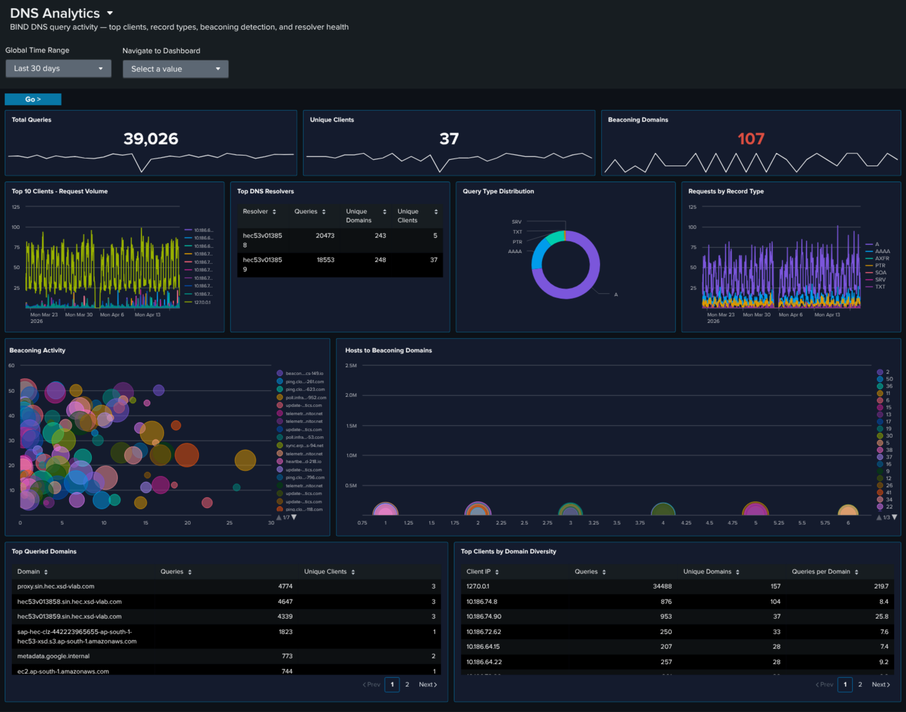
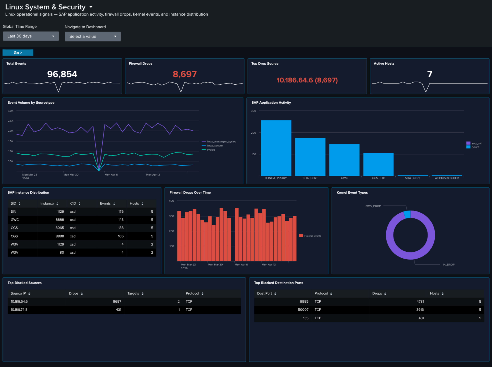
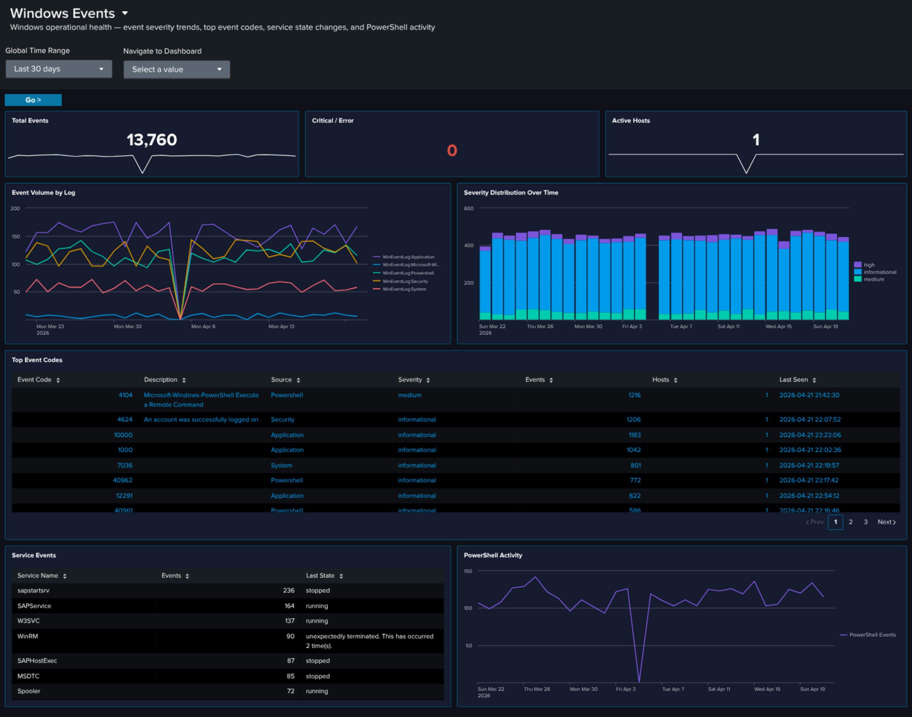

# Platform

The **Platform** category covers the infrastructure underneath SAP — data pipeline health (Splunk ingest), network services (DNS, Proxy), host operating systems (Linux, Windows), and a per-host forensic drill-down. These dashboards answer questions about the underlying systems and the data-collection pipeline itself rather than the SAP workloads on top.

| Dashboard | Purpose | Key Data Sources |
|-----------|---------|-----------------|
| [Data Pipeline Overview](#data-pipeline-overview) | Ingest pipeline view: 5 KPIs, Sourcetype Summary table, host activity, and source-to-sourcetype link graph (in second tab) | All sourcetypes |
| [DNS Analytics](#dns-analytics) | DNS query analysis, top resolvers, beaconing detection, and client activity | `isc:bind:query`, `isc:bind:network`, `isc:bind:transfer` |
| [Linux System & Security](#linux-system-security) | Linux OS events, SAP application activity, and firewall monitoring (with Top Drop Source surface) | `linux_messages_syslog`, `syslog`, `linux_secure` |
| [Windows Events](#windows-events) | Windows operational health — event severity trends, top event codes, service state changes, PowerShell activity | `XmlWinEventLog` |
| [Proxy Analytics](#proxy-analytics) | Squid proxy traffic, top domains by bandwidth, cache action distribution, client diversity | `squid:access` |
| [Host Details](#host-details) | Per-host drill-down showing event volume and sourcetype breakdown | All sourcetypes (filtered by host) |

---

## Data Pipeline Overview

### :material-circle-box:{ .taiconcolor } Why This Dashboard Matters

The Data Pipeline Overview is your single pane of glass for the entire SAP LogServ ingestion pipeline. It answers the most fundamental question: is data flowing from all expected hosts and sourcetypes? In a distributed SAP landscape with multiple SIDs, instances, and log types, a gap in data collection can go unnoticed for days without centralized visibility. This dashboard has two tabs: **Overview** for the operational KPI/table view, and **Linked Graph** for the full-width source-to-sourcetype mapping.

### Tab 1 -- Overview

- **Total Events** -- Aggregate event count across all LogServ sourcetypes
- **Total Sourcetypes** -- Count of distinct sourcetypes seen in the time range
- **Total Volume** -- Sum of `_raw` bytes, formatted as KB/MB/GB
- **Ingest Errors** -- Count of Splunk ingest-pipeline errors from `Splunk_TA_aws` and `splunk_ta_sap_logserv` (filters out ExecProcessor scheduled-input noise; click to open the matching events)
- **Active Hosts** -- Count of distinct hosts reporting data
- **Host Event Count** -- Daily event volume per host (log scale)
- **Sourcetype Summary** -- Rich table with 14 columns: Sourcetype, Status (Fresh/Stale/Very Stale), Trend (sparkline), Events, % of Total, Avg/Day, Volume, App Errors, Hosts, Sources, Events (1h), First Seen, Last Seen, Lag. Click a row to open the search app pre-filtered by sourcetype.
- **Host Latest Activity** -- Table showing each host's last event time, event count, and sourcetypes (click a row to drill down to Host Details)

### Tab 2 -- Linked Graph

- **Source to Sourcetype Mapping** -- Full-width link graph (Sankey) visualizing the flow of data from source paths to sourcetypes, with column widening tuned so 3 columns fit inside the frame without horizontal scroll

### :material-lightning-bolt:{ .taiconcolor } What to Look For

- **Hosts going silent** -- A host that was previously reporting data but suddenly stops may indicate an agent failure, network issue, or system outage. Check the Host Latest Activity table for stale timestamps and the Sourcetype Summary **Status** column for "Stale" or "Very Stale" entries.
- **Sourcetype volume drops** -- A sudden decrease in events for a specific sourcetype often signals an ingestion pipeline issue. The Sourcetype Summary **Events (1h)** and **Trend** sparkline columns make recent drops visible at a glance.
- **Unexpected volume spikes** -- A sharp increase in event volume from a single host could indicate a log storm (runaway process, debug logging left enabled) or a security event generating excessive audit entries.
- **Ingest errors climbing** -- The Ingest Errors KPI is a curated count (after filtering harmless noise); a non-zero count sustained over days usually points to a misconfigured S3 input, SQS permissions issue, or malformed records in a specific prefix.
- **Missing sourcetype mappings** -- If a host shows data but is missing an expected sourcetype in the link graph (second tab), the routing transforms may need attention.

---

## DNS Analytics

### :material-circle-box:{ .taiconcolor } Why This Dashboard Matters

The DNS Analytics dashboard transforms DNS query data into a security detection tool. DNS is used by virtually all network communications and is often exploited by attackers for command-and-control (C2) beaconing, data exfiltration via DNS tunneling, and reconnaissance. Because DNS traffic is rarely inspected by traditional security tools, this dashboard fills a critical visibility gap in SAP infrastructure security.

### Panels

- **Total Queries** -- Aggregate count of DNS queries in the selected time range
- **Unique Clients** -- Count of distinct client IPs generating DNS queries
- **Beaconing Domains** -- Count of domains exhibiting periodic query patterns consistent with C2 beaconing
- **Top 10 Clients - Request Volume** -- Time-series line chart of the most active DNS clients
- **Query Type Distribution** -- Donut chart showing the breakdown of DNS record types (A, AAAA, PTR, TXT, etc.)
- **Top DNS Resolvers** -- Table of the BIND resolvers (the DNS hosts processing queries) ranked by query count; the `host` field is the authoritative resolver since `src`/`dest` are always 127.0.0.1 in this environment
- **Requests by Record Type** -- Line chart trending DNS query types (A, AAAA, PTR, MX, etc.) over time
- **Beaconing Activity** -- Bubble chart highlighting domains with regular, periodic query patterns that may indicate C2 beaconing
- **Hosts to Beaconing Domains** -- Full-width bubble chart mapping which hosts are communicating with suspected beaconing domains
- **Top Queried Domains** -- Table of the most looked-up domains with unique client counts
- **Top Clients by Domain Diversity** -- Table ranking clients by number of unique domains queried, with queries-per-domain ratio for DGA detection

### :material-lightning-bolt:{ .taiconcolor } What to Look For

- **Beaconing patterns** -- The Beaconing Activity panel uses statistical analysis (low variance in query intervals) to detect domains being contacted at regular intervals, which is a hallmark of malware C2 communication. Domains with low variance and high count are the highest priority.
- **Unusual record types** -- TXT record queries at high volume are a common DNS tunneling technique. MX queries from non-mail servers may indicate reconnaissance. Watch the Query Type Distribution donut and the Requests by Record Type line chart for deviations from your normal mix.
- **New high-volume clients** -- A host that suddenly becomes one of the top DNS clients may be compromised and performing domain generation algorithm (DGA) lookups or reconnaissance scanning.
- **Multiple hosts reaching beaconing domains** -- The Hosts to Beaconing Domains panel shows lateral spread. If multiple internal hosts contact the same suspected C2 domain, it suggests widespread compromise.
- **High domain diversity** -- Clients querying many unique domains with a low queries-per-domain ratio in the Top Clients by Domain Diversity table may indicate Domain Generation Algorithm (DGA) activity or automated reconnaissance.
- **Resolver imbalance** -- The Top DNS Resolvers table should show an expected workload split across your BIND servers. One resolver handling disproportionate load may indicate a misconfigured forwarder or a cluster failover that wasn't noticed.

---

## Linux System & Security

### :material-circle-box:{ .taiconcolor } Why This Dashboard Matters

The Linux dashboard provides OS-level visibility for the hosts running SAP applications. Most SAP ABAP and HANA systems run on Linux, making OS-level monitoring essential for understanding the infrastructure beneath the application layer. This dashboard combines SAP-aware context (SID, instance, application identification from syslog) with kernel-level security monitoring (firewall drops and kernel events).

### Panels

- **Total Events** -- Aggregate event count across all Linux sourcetypes
- **Firewall Drops** -- Count of kernel firewall drop events
- **Active Hosts** -- Count of distinct Linux hosts reporting data
- **Top Drop Source** -- Single-value panel showing the #1 source IP by firewall-drop count in the format `<IP> (<count>)`, e.g. `10.186.64.6 (8,522)`. This surfaces the dominant drop source directly in the KPI row so it doesn't get buried in the table. Click the KPI to drill down to all source IPs ranked by drop count.
- **Event Volume by Sourcetype** -- Daily trend across linux_messages_syslog, syslog, and linux_secure
- **SAP Application Activity** -- Column chart showing event distribution by SAP application and SID
- **SAP Instance Distribution** -- Table of SAP instances with event counts by SID, instance number, and CID
- **Firewall Drops Over Time** -- Timeline of kernel firewall drop events
- **Kernel Event Types** -- Pie chart breakdown of kernel event categories (IN_DROP, segfault, etc.)
- **Top Blocked Sources** -- Table of source IPs being blocked by the firewall with target counts and protocols
- **Top Blocked Destination Ports** -- Table of destination ports targeted by blocked traffic

### :material-lightning-bolt:{ .taiconcolor } What to Look For

- **Firewall drop spikes** -- A sudden increase in blocked connections may indicate port scanning, network reconnaissance, or a brute-force attack against SAP services.
- **Top Drop Source concentration** -- If the Top Drop Source KPI shows a single IP accounting for the overwhelming majority of drops, that IP is either a misconfigured internal system hammering a blocked port (check if it's an internal SAP host that recently changed config) or a persistent external scanner. Click through to see the distribution.
- **New blocked source IPs** -- Unfamiliar source IPs appearing in the Top Blocked Sources table should be investigated, especially if they target SAP service ports (3200-3299 for dialog, 8000-8099 for HTTP, 30015 for HANA).
- **SAP application distribution changes** -- If the SAP Application Activity chart shows a previously active SID or application going silent, it may indicate a process crash or configuration issue.
- **Kernel segfaults** -- Segmentation faults appearing in the Kernel Event Types panel indicate application crashes, which may affect SAP system stability.
- **Port targeting patterns** -- The Top Blocked Destination Ports table reveals which services attackers are targeting. Ports associated with SAP services warrant immediate attention.

---

## Windows Events

### :material-circle-box:{ .taiconcolor } Why This Dashboard Matters

The Windows Events dashboard monitors Windows hosts in the SAP landscape, which commonly run SAP application servers, database instances, and management consoles. Windows Event Logs capture service health, PowerShell execution, and system errors that indicate Windows-specific operational issues. This dashboard focuses on operational health and service state -- the authentication-failure story is owned by the [Cross-Stack Authentication](security.md#cross-stack-authentication) dashboard so that all three layers (SAP / HANA / Windows) can be investigated together.

### Panels

- **Total Events** -- Aggregate Windows event count
- **Critical / Error** -- Count of critical and error severity events
- **Active Hosts** -- Count of distinct Windows hosts reporting data
- **Event Volume by Log** -- Daily trend by Windows log source (Application, Security, System, PowerShell)
- **Severity Distribution Over Time** -- Stacked column chart of severity levels
- **Top Event Codes** -- Featured full-width table of the most frequent EventCodes with 7 enriched columns: Event Code, Description (signature), Source log, Severity, Events, Hosts (distinct count), Last Seen. Row drilldown opens the search app filtered by that event code.
- **Service Events** -- Table of Windows service start/stop activity with latest state
- **PowerShell Activity** -- Line chart trending PowerShell event volume

### :material-lightning-bolt:{ .taiconcolor } What to Look For

- **High-frequency Event Codes** -- The Top Event Codes table is the primary starting point. EventCode 7031 / 7034 (service terminated unexpectedly), 1000 (application crash), and 41 (unexpected shutdown) are high-priority. Click through to see every occurrence of a specific code.
- **Service crashes** -- EventCode 7031 (service terminated unexpectedly) in either the Top Event Codes table or the Service Events panel indicates a critical service failure. For SAP services (sapstartsrv, SAPService), this requires immediate attention.
- **PowerShell activity spikes** -- Sudden increases in PowerShell execution may indicate lateral movement by an attacker using PowerShell-based attack tools. Correlate with the [Cross-Stack Authentication](security.md#cross-stack-authentication) dashboard to see whether any Windows logons were concurrent.
- **Critical/error severity trends** -- A rising trend in critical and error events over multiple days indicates accumulating system health issues that need proactive investigation.
- **Event Code hosts expanding** -- The Hosts column on the Top Event Codes table makes it obvious when a normally-host-isolated error starts appearing on multiple hosts -- a sign the underlying cause is environmental (failed update, domain policy change) rather than local.

---

## Proxy Analytics

### :material-circle-box:{ .taiconcolor } Why This Dashboard Matters

The Proxy Analytics dashboard monitors outbound internet access through the Squid proxy server. In SAP environments, proxy logs reveal which systems and users are accessing external resources, enabling detection of data exfiltration attempts, policy violations (unauthorized internet access), and compromised systems communicating with malicious infrastructure. Proxy logs complement DNS analytics by showing the actual HTTP connections that follow DNS resolution.

### Panels

- **Total Requests** -- Aggregate proxy request count
- **Total Bandwidth** -- Sum of bytes transferred through the proxy (formatted KB/MB/GB)
- **Denied Requests** -- Count of requests blocked by proxy policy
- **Request Volume Over Time** -- Daily request trend
- **Status Code Distribution** -- Stacked column chart of response categories (2xx-5xx)
- **Top Domains** -- Table of the most accessed domains with request counts, bandwidth, and unique client counts
- **Top Clients** -- Table of the most active client IPs with request counts, bandwidth, and domain diversity
- **Top Clients by Domain Diversity** -- Horizontal bar chart ranking client IPs by the distinct count of URL domains they accessed (replaces the earlier HTTP Methods donut, which consistently collapsed to a single slice and didn't earn its space)
- **Cache Action Distribution** -- Column chart of Squid vendor-action values (CONNECT, TCP_HIT, TCP_MISS, TCP_REFRESH_MISS, etc.) -- replaces the earlier Content Types donut for the same single-slice reason and reveals cache-hit behavior
- **Bandwidth Over Time** -- Line chart trending total bytes transferred
- **Top URL Domains by Bytes Out** -- Horizontal bar chart of the top 10 URL domains by outbound bytes (data exfiltration detection surface)
- **Bandwidth Over Time by Domain (Top 5)** -- Multi-line chart of the top 5 bandwidth-consuming domains over time -- pairs with Top URL Domains by Bytes Out to show whether exfiltration is ongoing or historical

### :material-lightning-bolt:{ .taiconcolor } What to Look For

- **Denied request spikes** -- A sudden increase in denied requests may indicate a compromised system attempting to reach blocked destinations, or a policy change affecting legitimate traffic.
- **High-bandwidth domains** -- The Top URL Domains by Bytes Out panel is tuned specifically for exfiltration detection. A new domain appearing near the top, or a known-OK domain spiking, warrants investigation.
- **Sustained-bandwidth domains** -- The Bandwidth Over Time by Domain chart shows whether a top domain's traffic is steady (expected service) or a sudden burst (exfiltration attempt, large file transfer).
- **Client domain diversity** -- A client IP with extremely high domain diversity in the Top Clients by Domain Diversity panel is unusual for a well-behaved SAP server -- most production systems talk to a predictable small set of external domains.
- **Cache miss dominance** -- If Cache Action Distribution is dominated by TCP_MISS, the proxy cache may not be earning its keep (or a new workload is defeating it). For security-relevant investigations, CONNECT dominance signals mostly-HTTPS traffic that the proxy can't inspect.
- **New high-volume clients** -- A system that suddenly appears as a top proxy client may be compromised and performing outbound scanning, beaconing, or data exfiltration.

---

## Host Details

### :material-circle-box:{ .taiconcolor } Why This Dashboard Matters

The Host Details dashboard is a forensic drill-down tool for investigating individual hosts. Accessed by clicking a host row in the [Data Pipeline Overview](#data-pipeline-overview) or by selecting a host from the dropdown, it shows the complete event timeline and sourcetype breakdown for a single system. This view is essential for root cause analysis, incident response, and validating that all expected data sources are present for a given host.

### Panels

- **Host Event Timeline** -- Column chart of daily event volume for the selected host
- **Host Inventory** -- Table showing the host's hardware specs (CPU, cores, RAM), EC2 instance type, operating system, region, and availability zone. Sourced from osquery data in syslog (Linux hosts only).
- **Sourcetype Distribution** -- Sankey diagram showing how the host's events are distributed across sourcetypes

### :material-lightning-bolt:{ .taiconcolor } What to Look For

- **Sourcetype gaps** -- If a host is missing a sourcetype that similar hosts have (e.g., a HANA host without `sap:hana:audit`), it may indicate a misconfigured audit policy or broken log forwarding.
- **Volume anomalies** -- Compare the selected host's event volume to its peers. Significantly higher or lower volume may indicate a workload issue, logging configuration problem, or security event.
- **Sudden volume changes** -- A host that normally generates a steady volume of events but suddenly spikes or drops warrants investigation. Spikes may indicate security events; drops may indicate system or agent failures.
- **Single-sourcetype dominance** -- If one sourcetype accounts for the vast majority of a host's events, the balance may indicate a noisy process (check ICM or workprocess logs for runaway activity).

This dashboard accepts `host_name` and `global_time` parameters from the URL, so the time range and host selection carry over from the Overview dashboard.

