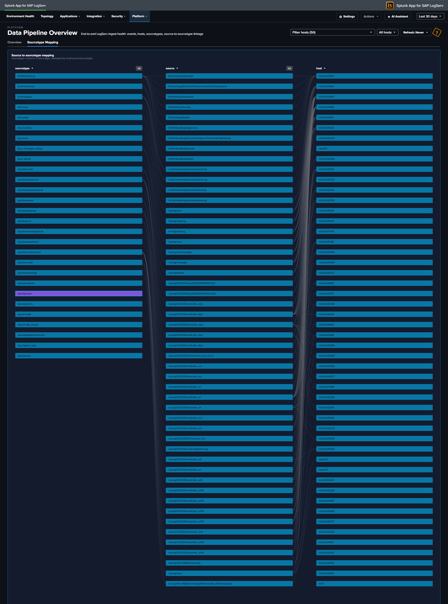

# Data Pipeline Overview

## :material-circle-box:{ .taiconcolor } Why This Dashboard Matters

The Data Pipeline Overview is your single pane of glass for the entire SAP LogServ ingestion pipeline. It answers the most fundamental question: is data flowing from all expected hosts and sourcetypes? In a distributed SAP landscape with multiple SIDs, instances, and log types, a gap in data collection can go unnoticed for days without centralized visibility. This dashboard has two tabs: **Overview** for the operational KPI/table view, and **Linked Graph** for the full-width source-to-sourcetype mapping.

The title row carries a **dashboard-wide host filter**: a Multiselect (with filter input + Select All Matches) plus a Top-N picker that scopes EVERY panel on BOTH tabs to the chosen hosts. The filter splices a `host="X"` (1 host) or `host IN (...)` (2+ hosts) clause into all 4 KPIs + their sparklines, the Events Over Time chart, the Sourcetype Summary table, the Host Latest Activity table, AND the linked-graph view on the second tab. Top N kicks in only when zero specific hosts are selected.

!!! tip "Multi-cloud ingest split"
    The Data Pipeline Overview aggregates across BOTH AWS S3 and Azure Blob Storage ingest channels without distinguishing them — events from either channel land under `sap_logserv_logs` and route to the same downstream sourcetypes. For a per-cloud-provider breakdown (AWS vs Azure event counts, sourcetype distribution per provider, recent activity), see the [Multi-Cloud Overview](multi-cloud-overview.md) dashboard in the same Platform group. See [Azure Setup Guide](../../../install-setup/azure-queue-setup.md) for Azure-side configuration.

## Tab 1 -- Overview

- **Total Events** -- Aggregate event count across all LogServ sourcetypes
- **Total Sourcetypes** -- Count of distinct sourcetypes seen in the time range
- **Total Volume** -- Sum of `_raw` bytes, formatted as KB/MB/GB
- **Ingest Errors** -- Count of Splunk ingest-pipeline errors from `Splunk_TA_aws` and `splunk_ta_sap_logserv` (filters out ExecProcessor scheduled-input noise; click to open the matching events)
- **Active Hosts** -- Count of distinct hosts reporting data
- **Host Event Count** -- Daily event volume per host (log scale)
- **Sourcetype Summary** -- Rich table with 14 columns: Sourcetype, Status (Fresh/Stale/Very Stale), Trend (sparkline), Events, % of Total, Avg/Day, Volume, App Errors, Hosts, Sources, Events (1h), First Seen, Last Seen, Lag. Click a row to open the search app pre-filtered by sourcetype.
- **Host Latest Activity** -- Table showing each host's last event time, event count, and sourcetypes (click a row to drill down to Host Details)

## Tab 2 -- Linked Graph

- **Source to Sourcetype Mapping** -- Full-width link graph visualizing the flow of data from source paths to sourcetypes, with column widening tuned so 3 columns fit inside the frame without horizontal scroll

## :material-lightning-bolt:{ .taiconcolor } What to Look For

- **Hosts going silent** -- A host that was previously reporting data but suddenly stops may indicate an agent failure, network issue, or system outage. Check the Host Latest Activity table for stale timestamps and the Sourcetype Summary **Status** column for "Stale" or "Very Stale" entries.
- **Sourcetype volume drops** -- A sudden decrease in events for a specific sourcetype often signals an ingestion pipeline issue. The Sourcetype Summary **Events (1h)** and **Trend** sparkline columns make recent drops visible at a glance.
- **Unexpected volume spikes** -- A sharp increase in event volume from a single host could indicate a log storm (runaway process, debug logging left enabled) or a security event generating excessive audit entries.
- **Ingest errors climbing** -- The Ingest Errors KPI is a curated count (after filtering harmless noise); a non-zero count sustained over days usually points to a misconfigured S3 input, SQS permissions issue, or malformed records in a specific prefix.
- **Missing sourcetype mappings** -- If a host shows data but is missing an expected sourcetype in the link graph (second tab), the routing transforms may need attention.

