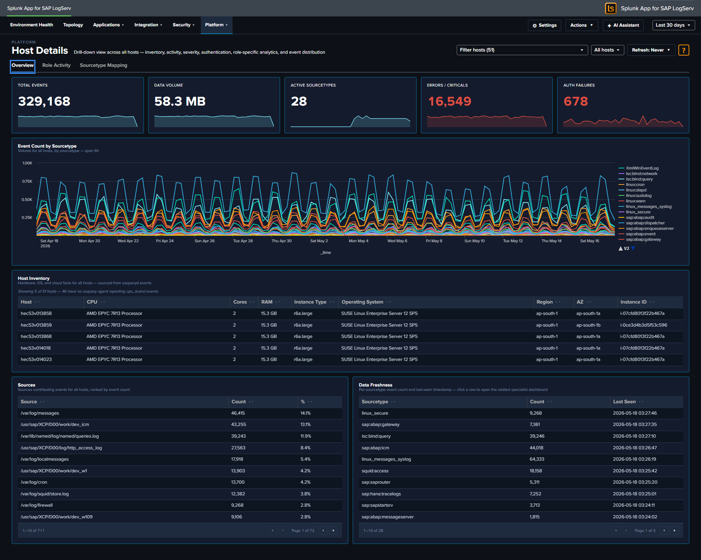
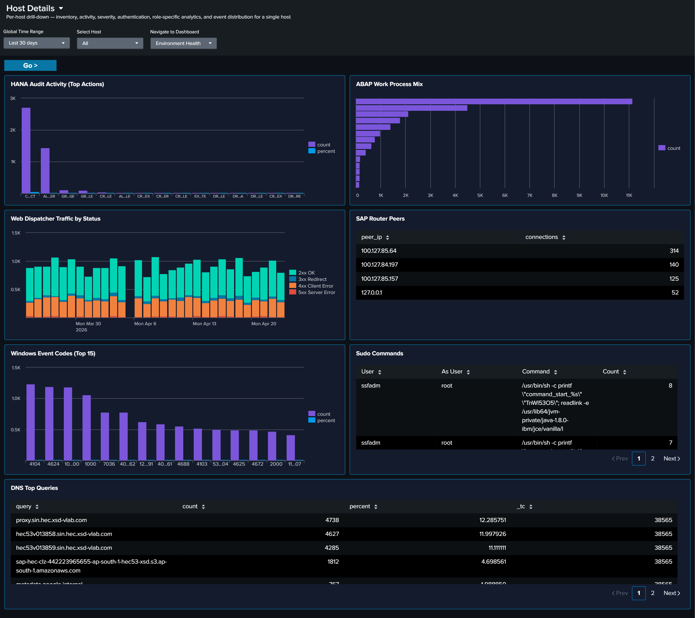
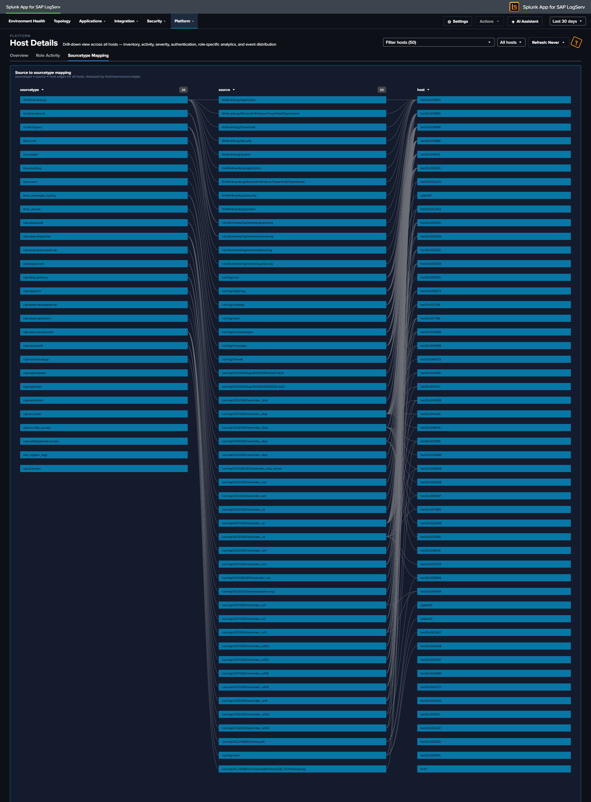

# Host Details

## :material-circle-box:{ .taiconcolor } Why This Dashboard Matters

The Host Details dashboard is the forensic drill-down tool for investigating one or more hosts. Accessed by clicking a host row in any dashboard's host-keyed table (Data Pipeline Overview, Cross-Stack Authentication, Environment Health, etc.) or by selecting hosts from the title-row Multiselect, it surfaces event volume, data freshness, authentication activity, inventory, errors, and role-specific signals (HANA audit, ABAP work process, web dispatcher traffic, etc.) for the selected scope. This view is essential for root cause analysis, incident response, capacity investigations, and validating that all expected data sources are present.

The title-row **host picker** is a Multiselect (with filter input + Select All Matches) supporting three scopes:

- **All Hosts** (no hosts selected) — Top-N kicks in (default Top 10) and panels aggregate across the most-active hosts.
- **Single host** — splices `host="X"` into all SPL; URL becomes `?host=X` (back-compatible deep-link form).
- **Multiple hosts** — splices `host IN ("X","Y","Z")` into all SPL; URL becomes `?hosts=h1,h2,h3` (CSV form). LocalStorage persists the last selection per browser tab.

The dashboard is organized into three tabs:

- **Overview** -- universal panels that populate for any host with any event: KPIs, event timeline, severity breakdown, inventory, authentication and error tables, top sources, activity-by-hour, and data-freshness checks.
- **Role Activity** -- panels scoped to a specific role (HANA, ABAP, Web Dispatcher, SAP Router, Windows, Linux sudo, DNS). Each panel auto-hides when the selected host(s) have no data for that role, so the tab only shows what's relevant for the host(s) in front of you.
- **Sourcetype Mapping** -- Link graph showing the distribution of events across sourcetypes and sources for the selected host(s).

## :material-circle-box:{ .taiconcolor } Overview Tab

- **KPI row (5 values)** -- Total Events, Data Volume (auto-scaled MB/GB), Active Sourcetypes, Error/Critical event count (red), and Auth Failure count (red)
- **Host Event Count by Sourcetype** -- Stacked column of daily event volume per sourcetype for the selected host
- **Severity Timeline** -- Stacked area chart normalizing Critical / Error / Warning / Info severities across all the host's sourcetypes
- **Host Inventory** -- Table of hardware specs (CPU, cores, RAM), EC2 instance type, OS, region, and availability zone. Sourced from osquery data in `linux_messages_syslog`.
- **Recent Authentication Events** -- Cross-source auth activity table (HANA / Linux / Windows), with a Layer column identifying the source
- **Recent Errors & Criticals** -- Latest ERROR/CRITICAL/FATAL events across all the host's sourcetypes with severity, component, and truncated message
- **Top Sources** -- Horizontal bar of the host's most active log sources by event count
- **Activity by Hour of Day** -- Column chart surfacing off-hours activity patterns
- **Data Freshness** -- Per-sourcetype last-seen table with Fresh/Stale/Very Stale status to spot collection gaps

## :material-circle-box:{ .taiconcolor } Role Activity Tab

Role-specific panels. Each panel only appears when the host has data for that role; irrelevant panels auto-hide.

- **HANA Audit Activity (Top Actions)** -- Column chart of top audit actions from `sap:hana:audit`
- **ABAP Work Process Mix** -- Horizontal bar of work-process categories from `sap:abap:workprocess`
- **Web Dispatcher Traffic by Status** -- Stacked column (2xx/3xx/4xx/5xx) from `sap:webdispatcher:access`
- **SAP Router Peers** -- Connection counts by peer IP from `sap:saprouter`
- **Windows Event Codes (Top 15)** -- Column chart of top `EventCode` values from `XmlWinEventLog*`
- **Sudo Commands** -- Table of invoking user, target user, command, and count from `linux_messages_syslog` sudo events
- **DNS Top Queries** -- Top query strings from `isc:bind:query`

!!! note "Why some panels may show for certain hosts but not others"
    Panels on the **Role Activity** tab — and a few on the **Overview** tab (Host Inventory, Recent Authentication Events, Recent Errors & Criticals) — use the `hideWhenNoData` attribute. Splunk automatically hides these panels when the selected host's data source returns no rows in the current time range.

    This means the dashboard adapts its layout to what the host actually is:

    - A **HANA host** sees the HANA Audit Activity panel on Role Activity and hides ABAP, Web Dispatcher, Router, Windows, Sudo, and DNS.
    - An **ABAP application server** sees the ABAP Work Process Mix panel and hides the HANA / Windows / DNS panels.
    - A **Windows host** sees Windows Event Codes (and typically Recent Authentication Events) and hides the SAP-specific panels.
    - A **full-stack Linux host** (with osquery + sudo + SAP ABAP) sees all of Host Inventory, Sudo Commands, ABAP WP Mix, and Recent Authentication Events.
    - A **sparse host** with only one or two sourcetypes will see just the universal Overview panels plus whichever Role Activity panels match.
    - Selecting **All Hosts** aggregates across every host — most panels populate because at least one host in the environment contributes data to each.

    Empty panels aren't a bug; they're the dashboard telling you the selected host doesn't have that role or doesn't forward that log type. If you expect a panel to populate for a specific host (for example, an ABAP app server that should have `sap:abap:workprocess` data but doesn't), that's a genuine collection issue worth investigating — check the forwarder configuration and the host's logging policy.

## :material-circle-box:{ .taiconcolor } Sourcetype Mapping Tab

Full-width link graph showing how the host's events flow from source files to sourcetypes. Useful for spotting a noisy source file that's producing an outsized share of the host's volume, or for validating that a host's expected sources are all represented.

## :material-lightning-bolt:{ .taiconcolor } What to Look For

- **Sourcetype gaps** -- If a host is missing a sourcetype that similar hosts have (e.g., a HANA host without `sap:hana:audit`), it may indicate a misconfigured audit policy or broken log forwarding.
- **Stale sourcetypes** -- Any row in the **Data Freshness** table marked Stale or Very Stale signals that a specific log pipeline has stopped delivering. Drill into the timeline to see when it stopped.
- **Volume anomalies** -- Compare the selected host's event volume to its peers. Significantly higher or lower volume may indicate a workload issue, logging configuration problem, or security event.
- **Sudden volume changes** -- A host that normally generates a steady volume but suddenly spikes or drops warrants investigation. Spikes may indicate security events; drops may indicate system or agent failures.
- **Auth failure spikes** -- A non-zero Auth Failures KPI on a host that usually has zero is worth immediate attention. Drill to the Recent Authentication Events table for context.
- **Off-hours activity** -- A non-zero bar in **Activity by Hour of Day** outside business hours, especially on an app server, can indicate batch jobs, maintenance, or suspicious activity.
- **Sudo command patterns** -- On the Role Activity tab, a host with unexpected sudo commands (new users, non-standard commands, or commands run `As User: root`) may reflect lateral-movement attempts or misconfigured automation.
- **Single-sourcetype dominance** -- If the Sourcetype Mapping link graph shows one sourcetype accounting for the vast majority of the host's events, the balance may indicate a noisy process (check ICM, workprocess, or web dispatcher logs for runaway activity).

This dashboard accepts `host` and global time-range query params from the URL, so the time range and host selection carry over from the [Data Pipeline Overview](data-pipeline-overview.md) and other dashboards.
