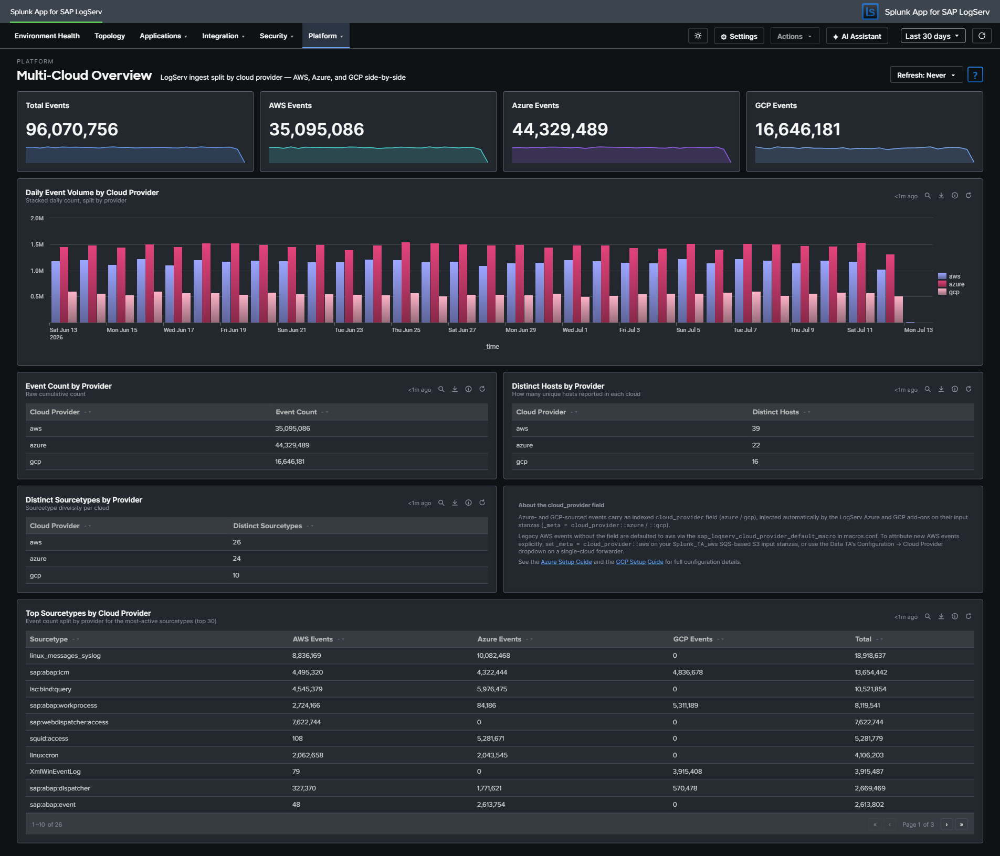

# Multi-Cloud Overview

## :material-circle-box:{ .taiconcolor } Why This Dashboard Matters

The Multi-Cloud Overview dashboard answers the question: **"Where is our LogServ data coming from, and is it balanced between cloud providers?"** It splits ingest by the indexed `cloud_provider` field so admins running any mix of **AWS S3**, **Azure Blob Storage**, and **Google Cloud Storage** ingest can confirm each pipeline is healthy and see relative volume at a glance.

Customers running a single cloud see the dashboard collapse cleanly to one provider (the unused providers' KPIs show `0`, the active provider's series carries the trend chart). Customers running two or three clouds — common during a migration or in a multi-region SAP landscape — see comparative KPIs + side-by-side trend so they can spot a stalled ingest channel before it becomes a visible gap in their other operational dashboards.

!!! tip "How `cloud_provider` is attributed"
    Azure-sourced events carry an indexed `cloud_provider = azure` field, set by the **Splunk TA for SAP LogServ on Azure** add-on's **`sap_logserv_azure_queue`** input stanza via `_meta = cloud_provider::azure`; GCP-sourced events likewise carry `cloud_provider = gcp` via the **Splunk TA for SAP LogServ on GCP** add-on's **`sap_logserv_gcp_pubsub`** input (`_meta = cloud_provider::gcp`) — both add-ons inject the setting automatically. Legacy AWS events without the field are defaulted to `aws` at search time via the `sap_logserv_cloud_provider_default_macro` (`eval cloud_provider=coalesce(cloud_provider, "aws")`). Every panel on this dashboard applies the macro so the per-provider split is always meaningful regardless of when the events landed. To attribute new AWS events explicitly at ingest time (recommended for any new HF rollout), set `_meta = cloud_provider::aws` on your `Splunk_TA_aws` SQS-based S3 input stanzas — see the [Azure Setup Guide](../../../install-setup/azure-setup.md) / [GCP Setup Guide](../../../install-setup/gcp-setup.md) for the full configuration pattern (the same pattern applies symmetrically to every cloud). Alternatively, the LogServ Data TA's **Configuration → Cloud Provider** dropdown (AWS / Microsoft Azure / Google Cloud Platform / Not set) stamps `cloud_provider` on every event the TA processes — the simpler, TA-managed option for a Heavy Forwarder that ingests from a single cloud. See [Configuring Filters → Cloud Provider Attribution](../../../install-setup/configure-filters.md#cloud-provider-attribution).

## :material-circle-box:{ .taiconcolor } Panels

- **Total Events** -- Aggregate event count across ALL ingest channels with a daily-volume sparkline. Useful as the baseline for comparing the per-provider KPIs that follow.
- **AWS Events** -- Event count where `cloud_provider = "aws"` (includes events explicitly attributed at ingest time AND legacy events defaulted via the macro). Sparkline shows daily AWS-only volume.
- **Azure Events** -- Event count where `cloud_provider = "azure"`. Sparkline shows daily Azure-only volume. On an install without Azure ingest, this KPI shows `0` with a flat-zero sparkline.
- **GCP Events** -- Event count where `cloud_provider = "gcp"`. Sparkline shows daily GCP-only volume. On an install without GCP ingest, this KPI shows `0` with a flat-zero sparkline.
- **Daily Event Volume by Cloud Provider** -- Stacked column chart showing daily event counts split by provider. Each bar is the day's total; the per-provider segments stack to make each contribution visible. Useful for spotting day-over-day shifts (a sudden drop in one provider's stack height while the others stay flat = that provider's ingest stalled).
- **Event Count by Provider** -- One-row-per-provider table with the raw cumulative event counts. The same data as the per-provider KPIs but in tabular form so the ratios are easy to read.
- **Distinct Hosts by Provider** -- One-row-per-provider table showing how many unique `host` values reported under each `cloud_provider`. Confirms forwarder coverage across the cloud boundary.
- **Distinct Sourcetypes by Provider** -- One-row-per-provider table showing how many distinct sourcetypes have at least one event per provider. Useful for confirming every cloud is producing the full sourcetype mix (e.g., not just `linux_messages_syslog` from Azure while AWS has the SAP stack).
- **About the cloud_provider field** -- Inline reference panel (not a search result) explaining how the field is set + linking to the Azure and GCP Setup Guides. Always visible as a customer-friendly reminder of the attribution mechanic.
- **Top Sourcetypes by Cloud Provider** -- Wide table of the 30 most-active sourcetypes with per-provider columns (AWS Events / Azure Events / GCP Events / Total). The Total column is sorted descending so the high-volume sourcetypes lead. Useful for spotting per-sourcetype anomalies (e.g., `sap:hana:audit` is only appearing under one cloud when several should be producing it).

## :material-lightning-bolt:{ .taiconcolor } What to Look For

- **Stalled ingest channel** -- If one provider's KPI sparkline goes flat-zero for the most recent 1–3 days while the others continue to climb, the affected channel's input has likely stalled. Check the LogServ Azure add-on's `sap_logserv_azure_queue` input on the Heavy Forwarder (per-firing summary in `splunk_ta_sap_logserv_azure_queue.log`: `Input '<name>' done: messages=N blobs=N events=N ...`), the LogServ GCP add-on's `sap_logserv_gcp_pubsub` input (`splunk_ta_sap_logserv_gcp_pubsub.log`: `Input '<name>' done: messages=N objects=N events=N ...`), or the `Splunk_TA_aws` S3 input for AWS (the `S3Input` component in `index=_internal sourcetype=splunkd`).
- **Asymmetric sourcetype coverage** -- If both clouds report comparable total event counts but the Top Sourcetypes table shows one cloud with a narrow sourcetype mix (e.g., AWS only producing `sap:hana:audit` while Azure produces 25+ sourcetypes), the AWS-side filter rules may be set to include-only rather than include-all. Check the [Configure Filters](../../../install-setup/configure-filters.md) page.
- **Unexpected appearance of `aws` from an Azure- or GCP-only customer** -- If your environment has no AWS ingest but the AWS Events KPI shows non-zero values, it likely means some legacy events that pre-date the cloud_provider field landed without explicit attribution and the macro defaulted them to `aws`. This is benign for trend-reporting (the events are still real), but to keep the labeling accurate you can stamp those legacy events via a one-time backfill or simply let them age out per index retention.
- **Distinct Hosts count substantially lower than expected** -- If a single cloud's "Distinct Hosts" count is much lower than the actual count of SAP hosts in that cloud, your add-on input config may be too narrow (wrong container prefix on the Azure side, wrong subscription on the GCP side, wrong bucket prefix on the AWS side). Compare against your topology source-of-truth.
- **Total Events ≠ sum of the per-provider KPIs** -- This should never happen given the macro defaults legacy events to `aws`. If you see a mismatch, check that the `sap_logserv_cloud_provider_default_macro` macro is loaded in your search head's `macros.conf` (the LogServ App ships it in `default/macros.conf`). Run `| rest /services/configs/conf-macros | search title=sap_logserv_cloud_provider_default_macro` from a Search Head to confirm.

## :material-circle-box:{ .taiconcolor } Drill-Down Behavior

Every KPI sparkline and the Daily Event Volume chart respect the dashboard's global time-range picker + the per-dashboard Refresh picker like any other LogServ App dashboard.

Tables on this dashboard are inventory views — they don't yet wire click-to-drill-down behavior (because the natural drill destination would be a Splunk search filtered by `cloud_provider` which most customers will see directly via the macro on any dashboard).

## :material-circle-box:{ .taiconcolor } Required Configuration

This dashboard works out of the box on any LogServ App install (it gracefully shows `0` for unused providers), but the data quality is governed by the upstream ingest config:

1. **For Azure ingest:** the `_meta = cloud_provider::azure` line is present on the `[sap_logserv_azure_queue://...]` stanza automatically (the LogServ Azure add-on injects it). See [Azure Setup Guide](../../../install-setup/azure-setup.md).
2. **For GCP ingest:** the `_meta = cloud_provider::gcp` line is present on the `[sap_logserv_gcp_pubsub://...]` stanza automatically (the LogServ GCP add-on injects it). See [GCP Setup Guide](../../../install-setup/gcp-setup.md).
3. **For explicit AWS attribution (optional):** either set the LogServ Data TA's **Configuration → Cloud Provider** dropdown to **AWS** (stamps `cloud_provider = aws` on every event the TA processes — simplest for a single-cloud Heavy Forwarder), OR add `_meta = cloud_provider::aws` to each `filtr2_logserv_s3_*` SQS-based S3 input stanza in `Splunk_TA_aws`'s `local/inputs.conf` (use this per-input form when one HF ingests from more than one cloud). Without either, AWS events get the value via the search-time `sap_logserv_cloud_provider_default_macro` macro — still correct for this dashboard, but the field is not indexed which means it can't be used as a filter on raw-event searches outside this dashboard's macro-wrapped panels. See [Configuring Filters → Cloud Provider Attribution](../../../install-setup/configure-filters.md#cloud-provider-attribution).
4. **Macro must be present:** the LogServ App's `default/macros.conf` defines `[sap_logserv_cloud_provider_default_macro]` with `definition = eval cloud_provider=coalesce(cloud_provider, "aws")`. If you've overridden `macros.conf` in your local app directory, ensure this macro is still defined.

See the [Azure Setup Guide](../../../install-setup/azure-setup.md) and the [GCP Setup Guide](../../../install-setup/gcp-setup.md) for the canonical setup procedures (including the `cloud_provider` attribution pattern that applies symmetrically to every cloud).

