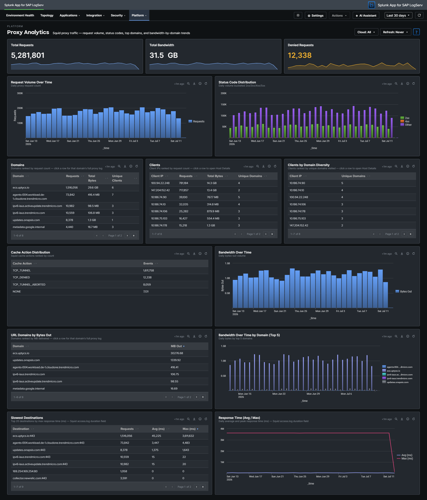

# Proxy Analytics

## :material-circle-box:{ .taiconcolor } Why This Dashboard Matters

The Proxy Analytics dashboard monitors outbound internet access through the Squid proxy server. In SAP environments, proxy logs reveal which systems and users are accessing external resources, enabling detection of data exfiltration attempts, policy violations (unauthorized internet access), and compromised systems communicating with malicious infrastructure. Proxy logs complement DNS analytics by showing the actual HTTP connections that follow DNS resolution.

## Panels

- **Total Requests** -- Aggregate proxy request count
- **Total Bandwidth** -- Sum of bytes transferred through the proxy (formatted KB/MB/GB)
- **Denied Requests** -- Count of requests blocked by proxy policy
- **Request Volume Over Time** -- Daily request trend
- **Status Code Distribution** -- Stacked column chart of response categories (2xx-5xx)
- **Top Domains** -- Table of the most accessed domains with request counts, bandwidth, and unique client counts
- **Top Clients** -- Table of the most active client IPs with request counts, bandwidth, and domain diversity
- **Top Clients by Domain Diversity** -- Horizontal bar chart ranking client IPs by the distinct count of URL domains they accessed (replaces the earlier HTTP Methods donut, which consistently collapsed to a single slice and didn't earn its space)
- **Cache Action Distribution** -- Column chart of Squid vendor-action values (CONNECT, TCP_HIT, TCP_MISS, TCP_REFRESH_MISS, etc.) -- replaces the earlier Content Types donut for the same single-slice reason and reveals cache-hit behavior
- **Bandwidth Over Time** -- Line chart trending total bytes transferred
- **Top URL Domains by Bytes Out** -- Horizontal bar chart of the top 10 URL domains by outbound bytes (data exfiltration detection surface)
- **Bandwidth Over Time by Domain (Top 5)** -- Multi-line chart of the top 5 bandwidth-consuming domains over time -- pairs with Top URL Domains by Bytes Out to show whether exfiltration is ongoing or historical

## :material-lightning-bolt:{ .taiconcolor } What to Look For

- **Denied request spikes** -- A sudden increase in denied requests may indicate a compromised system attempting to reach blocked destinations, or a policy change affecting legitimate traffic.
- **High-bandwidth domains** -- The Top URL Domains by Bytes Out panel is tuned specifically for exfiltration detection. A new domain appearing near the top, or a known-OK domain spiking, warrants investigation.
- **Sustained-bandwidth domains** -- The Bandwidth Over Time by Domain chart shows whether a top domain's traffic is steady (expected service) or a sudden burst (exfiltration attempt, large file transfer).
- **Client domain diversity** -- A client IP with extremely high domain diversity in the Top Clients by Domain Diversity panel is unusual for a well-behaved SAP server -- most production systems talk to a predictable small set of external domains.
- **Cache miss dominance** -- If Cache Action Distribution is dominated by TCP_MISS, the proxy cache may not be earning its keep (or a new workload is defeating it). For security-relevant investigations, CONNECT dominance signals mostly-HTTPS traffic that the proxy can't inspect.
- **New high-volume clients** -- A system that suddenly appears as a top proxy client may be compromised and performing outbound scanning, beaconing, or data exfiltration.

