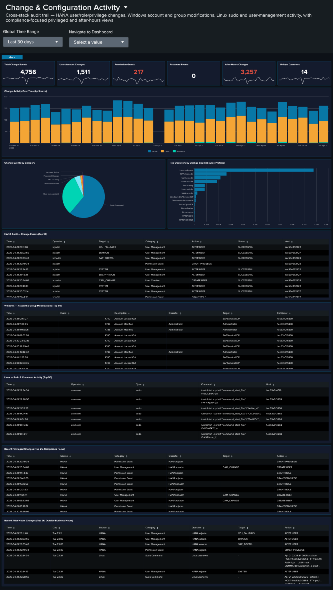

# Security

The **Security** category contains three cross-source synthesis dashboards designed for security posture analysis and compliance conversations. Each unifies signals that would otherwise live scattered across individual Applications or Platform dashboards, and adds a cross-source correlation panel that surfaces what no single-source dashboard can show.

| Dashboard | Purpose | Key Data Sources |
|-----------|---------|-----------------|
| [Network Perimeter](#network-perimeter) | Unified network-boundary view: firewall drops (inbound), proxy outbound traffic, DNS resolution, and cross-source suspicious-activity correlation | `linux_secure`, `squid:access`, `isc:bind:query` |
| [Cross-Stack Authentication](#cross-stack-authentication) | Unified authentication failure analysis across SAP, HANA, and Windows layers | `sap:sapstartsrv`, `sap:hana:audit`, `XmlWinEventLog` |
| [Change & Configuration Activity](#change-configuration-activity) | Cross-stack audit trail: HANA user/role/privilege changes, Windows account and group modifications, Linux sudo and user-management activity, with compliance-focused privileged and after-hours views | `sap:hana:audit`, `XmlWinEventLog`, `linux_messages_syslog` |

---

## Network Perimeter

### :material-circle-box:{ .taiconcolor } Why This Dashboard Matters

Firewall drops, proxy traffic, and DNS queries are three different lenses on the same underlying question: **what is crossing the network boundary and should it be there?** Each lens lives on its own operational dashboard ([Linux](platform.md#linux-system-security), [Proxy Analytics](platform.md#proxy-analytics), [DNS Analytics](platform.md#dns-analytics)), but an attacker rarely limits themselves to a single surface -- a compromised host often shows up in multiple signals simultaneously, and that correlation is where the security value lives. Network Perimeter synthesizes the three sources into a single view: inbound rejections (firewall), outbound flow (proxy), and resolution activity (DNS), with a dedicated cross-source panel that ranks hosts by combined suspicious-signal score. Use it as the first stop for "is our network perimeter healthy and clean?"

### Panels

- **Firewall Drops** -- Count of kernel firewall `IN_DROP` events from `linux_secure`
- **Proxy Requests** -- Count of HTTP requests handled by Squid
- **DNS Queries** -- Count of DNS queries from `isc:bind:query`
- **Beaconing Domains** (red) -- Domains exhibiting periodic query patterns (low variance in inter-query interval) -- candidate C2 channels
- **Denied Requests** (red) -- Count of proxy requests with `status=403` or `vendor_action="TCP_DENIED"`; click to drill down
- **Outbound Bandwidth** -- `sum(bytes_out)` across all proxy requests, formatted KB/MB/GB
- **Perimeter Activity Over Time** -- Full-width multi-line chart (log-scale y-axis) showing daily counts of all three sources on a single timeline. Log scale keeps Firewall Drops and Proxy Requests visible alongside the much larger DNS Queries volume; simultaneous spikes across two or three lines are the correlation signal to watch for.
- **Top Blocked Source IPs** -- Table of the 20 source IPs most rejected by the firewall, with unique target count and protocols seen; row drilldown to the matching events
- **Top Blocked Destination Ports** -- Table of the 20 destination ports most targeted by rejected traffic, grouped by port + protocol
- **Firewall Drops by Protocol** -- Stacked column showing daily IN_DROP events split by TCP / UDP / ICMP. Protocol shifts are often the clearest signal (ICMP spikes = ping flood / recon; UDP spikes = DNS amplification / port scan; TCP spikes = SYN-style port scan)
- **Proxy Denied Traffic Over Time** -- Area chart of daily denied proxy requests -- the outbound complement to firewall drops (inbound)
- **Top Outbound Domains by Volume & Bytes** -- Table of the 20 destination domains receiving the most outbound traffic, ranked by bytes, with request count and unique client count. Row drilldown opens the events for that domain.
- **DNS Query Type Distribution** -- Donut of query-type mix (A / AAAA / PTR / TXT / MX / other). High TXT or MX volume from non-mail hosts is a DNS-tunneling / exfiltration indicator.
- **Top Queried Domains** -- Full-width table of the 30 most queried domains with unique-client count and per-domain `%TXT` and `%MX` ratios for quick anomaly spotting. Row drilldown opens DNS query events for that domain.
- **Suspicious Activity Indicator** -- Full-width cross-source table of internal hosts appearing in **both** beaconing DNS queries and denied proxy requests, ranked by signal score (`beacon_domains × 3 + denied_requests`). Columns: Host, Beaconing Domains, Beaconing Queries, Denied Proxy Requests, Signal Score. Row drilldown opens both DNS and proxy events for that host.

### :material-lightning-bolt:{ .taiconcolor } What to Look For

- **Correlated spikes across sources** -- The Perimeter Activity Over Time chart is the quickest read on "is something happening right now?" Watch for days when two or three of the lines spike together -- that's usually an active event (port scan, active C2, exfiltration window) rather than baseline drift.
- **Protocol shifts in firewall drops** -- The stacked column by protocol is more diagnostic than raw drop counts. A normally TCP-heavy mix suddenly showing large UDP or ICMP bands signals a different attacker technique.
- **Top Blocked Source IPs concentration** -- A single source IP generating the overwhelming majority of drops is either a persistent attacker or a misconfigured internal host. Either way, the action is the same: investigate that specific IP.
- **TXT-heavy queries to a single domain** -- A domain in Top Queried Domains with a high `%TXT` ratio is a DNS-tunneling pattern. Cross-reference the Suspicious Activity Indicator to see which hosts are issuing those queries.
- **Hosts in the Suspicious Activity table** -- Any non-empty row here is worth investigating. A host showing up in both beaconing DNS and denied proxy is strong evidence of compromise -- the DNS lookups suggest malware C2, and the denied proxy requests suggest the same malware trying to reach blocked destinations.
- **Outbound Bandwidth spikes** -- A sudden rise in the Outbound Bandwidth KPI that isn't matched by a proportional rise in Proxy Requests means individual transfers are getting larger -- often the signature of an exfiltration event.

---

## Cross-Stack Authentication

### :material-circle-box:{ .taiconcolor } Why This Dashboard Matters

Authentication failures are usually investigated one layer at a time -- someone looks at HANA audit logs, then switches to Windows Event Log, then opens the SAP services dashboard. An attacker who probes multiple layers at once is therefore hard to spot. Cross-Stack Authentication unifies the failure signal across the three layers that matter in an SAP landscape -- **SAP sapstartsrv**, **HANA audit**, and **Windows Security Event Log** -- so that a single pane shows the total, the per-layer split, and the source IPs and users in common across layers. Use it as the first stop when you suspect credential-based attacks or widespread misconfiguration after a password rotation.

### Panels

- **Total Auth Failures** -- Aggregate failed authentication count across all three layers (click to drill down)
- **SAP Auth Failures** -- Count of sapstartsrv authentication failures (click to drill down)
- **HANA Auth Failures** -- Count of HANA audit events where the connection/authentication was rejected (click to drill down)
- **Windows Auth Failures** -- Count of Windows `XmlWinEventLog:Security` events corresponding to logon failures (click to drill down)
- **Auth Failures Over Time by Layer** -- Stacked column chart showing daily totals per layer (SAP / HANA / Windows) so correlated spikes across layers are visible at a glance
- **Top Users by Auth Failures** -- Horizontal bar of the 15 usernames with the most failures, summed across all layers
- **Auth Failure Source IPs** -- Table of the top 20 source IPs with failure counts and per-layer breakdown; row drilldown to the matching events
- **HANA Auth Activity by User** -- Table of the top HANA users by failed-auth count with client IP and last-seen time; row drilldown
- **Recent Windows Auth Failures** -- Table of the 25 most recent Windows logon-failure events with user, source workstation, and logon type; row drilldown
- **Recent SAP Auth Failures** -- Table of the 25 most recent sapstartsrv failed-auth events with user, source IP, and method; row drilldown

### :material-lightning-bolt:{ .taiconcolor } What to Look For

- **Correlated spikes across layers** -- If the stacked Auth Failures Over Time chart shows all three layers ramping simultaneously, that's almost always a network-level attack (password spray, credential stuffing) rather than a local misconfiguration. Investigate source IPs immediately.
- **Single source IP across layers** -- The Auth Failure Source IPs table makes it obvious when one IP is failing against SAP, HANA, AND Windows. That's the hallmark of a targeted attack rather than an expired-password incident.
- **High user failure count concentrated on service accounts** -- Service accounts (sapadm, sapservice accounts, DBADMIN-style) with large failure counts suggest either a recently rotated password that wasn't updated downstream, or an attacker trying to abuse a high-privilege account.
- **Asymmetry between layers** -- Many HANA failures but zero SAP / Windows failures usually indicates an application-layer issue (bad connection string, expired JDBC cert). Asymmetry the other way (many Windows failures, no HANA failures) often points to a domain-level issue.
- **After a password rotation** -- Expect a short burst of failures across one or more layers immediately after a change. If the burst persists beyond the rotation window, some downstream system is still using the old credential.

---

## Change & Configuration Activity

### :material-circle-box:{ .taiconcolor } Why This Dashboard Matters

Compliance conversations (SOX, PCI, internal change management) all require evidence that configuration changes are (1) authorized, (2) attributable to a specific operator, and (3) happening in approved maintenance windows. That evidence lives scattered across three audit trails: HANA audit logs (user/role/privilege/password operations and DDL), Windows Security Event Log (account and group modifications), and Linux syslog (sudo commands plus `useradd`/`usermod`/`userdel`/`passwd` events). This dashboard unifies the three into a single audit trail with a consistent operator column and category taxonomy, plus two compliance-focused "recent" tables: one filtered to privileged actions, one filtered to after-hours activity.

### Panels

- **Total Change Events** -- Aggregate count of change events across all three sources
- **User Account Changes** -- Count of user-management actions (HANA `User Management`/`User Creation`/`User Deletion`; Windows EventCodes 4720/4722/4725/4726/4738/4781; Linux `useradd`/`usermod`/`userdel`)
- **Permission Grants** (red) -- Count of privilege/group-membership grants (HANA `Permission Grant`; Windows EventCodes 4728/4732/4756 -- "added to group")
- **Password Events** -- Count of password changes and resets (HANA `Password Management`/`Password Reset`; Windows EventCode 4724; Linux `passwd`)
- **After-Hours Changes** (red) -- Count of change events occurring outside business hours (weekday 7am-7pm) or on weekends; HANA events use the pre-computed `is_business_hours` / `is_weekend` flags, other sources compute from `_time`
- **Unique Operators** -- Distinct count of source-prefixed operator identities (e.g., `HANA:XCPADM`, `Windows:domain\admin`, `Linux:ops-user`)
- **Change Activity Over Time** -- Full-width stacked column by day, series split by source (HANA / Windows / Linux). Same-day spikes across two or three series often line up with maintenance windows; isolated spikes in one source worth investigating.
- **Change Events by Category** -- Donut showing the category mix: Permission Grant, Permission Revoke, User Management, Password Change, Group Membership, Account Status, Sudo Command, DDL / Config, Other.
- **Top Operators by Change Count** -- Horizontal bar chart of the 15 operators generating the most change events, with source-prefixed identities so operator activity is clearly scoped to each system.
- **HANA Audit -- Change Events** -- Full-width table of the 50 most recent HANA user/role/privilege/password/DDL actions with Operator, Target, Category, Action, Status, Host.
- **Windows -- Account & Group Modifications** -- Full-width table of the 50 most recent Windows Security events across all 15 canonical account/group EventCodes, with human-readable Description column derived from EventCode.
- **Linux -- Sudo & Command Activity** -- Full-width table of the 50 most recent sudo commands + `useradd`/`usermod`/`userdel`/`groupadd`/`groupmod`/`groupdel`/`passwd` activity, with Operator (extracted from sudo prefix or PAM `(user)` pattern) and Command.
- **Recent Privileged Changes (Top 25, Compliance Focus)** -- Full-width table filtered to the highest-risk subset: HANA Permission Grants + User Creations + Audit Policy changes; Windows account creation/enable/password-reset + local-group additions; Linux `useradd`/`visudo`/admin-group modifications. This is the "who gave themselves or others more access" report.
- **Recent After-Hours Changes (Top 25)** -- Full-width table of any change event filtered to `is_after_hours=1`. This is the "who was working outside the change window" report -- high compliance value.

### :material-lightning-bolt:{ .taiconcolor } What to Look For

- **Rows in the Privileged Changes table with unfamiliar operators** -- The "headline" compliance question. A permission grant or group-addition you don't recognize is the first thing to investigate.
- **After-Hours activity on business days** -- The After-Hours table surfaces all outside-window activity. Weekend entries are often planned maintenance; weekday late-night or early-morning entries warrant a check against your change tickets.
- **Single operator dominating the Top Operators bar** -- One identity generating most changes can be legitimate (an admin performing a large rollout) or concerning (an account being abused). The source prefix tells you which system to look at first.
- **Category-mix drift** -- If the Change Events by Category donut suddenly shows a large "Permission Grant" slice where it's historically been minor, someone has been handing out privileges. Check the HANA Audit table for details.
- **Source asymmetry** -- The stacked column should show all three sources over time. If one source goes silent, it's likely a logging-pipeline issue rather than "no changes happened". Correlate with [Data Pipeline Overview](platform.md#data-pipeline-overview).
- **Linux sudo commands starting with useradd/usermod/visudo/passwd** -- These are the Linux equivalent of admin changes; they show up in both the Linux table and the Privileged Changes table for visibility.

