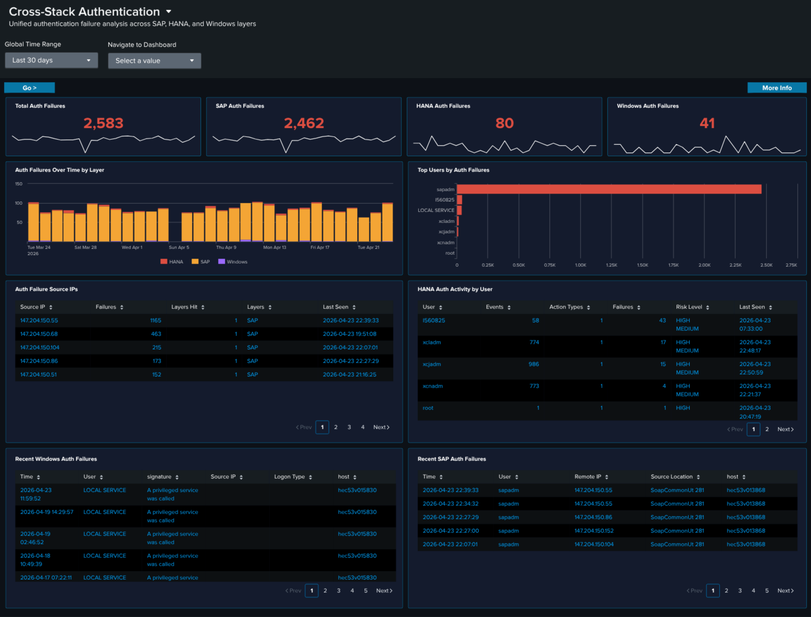

# Cross-Stack Authentication

## :material-circle-box:{ .taiconcolor } Why This Dashboard Matters

Authentication failures are usually investigated one layer at a time -- someone looks at HANA audit logs, then switches to Windows Event Log, then opens the SAP services dashboard. An attacker who probes multiple layers at once is therefore hard to spot. Cross-Stack Authentication unifies the failure signal across the three layers that matter in an SAP landscape -- **SAP sapstartsrv**, **HANA audit**, and **Windows Security Event Log** -- so that a single pane shows the total, the per-layer split, and the source IPs and users in common across layers. Use it as the first stop when you suspect credential-based attacks or widespread misconfiguration after a password rotation.

## Panels

- **Total Auth Failures** -- Aggregate failed authentication count across all three layers (click to drill down)
- **SAP Auth Failures** -- Count of sapstartsrv authentication failures (click to drill down)
- **HANA Auth Failures** -- Count of HANA audit events where the connection/authentication was rejected (click to drill down)
- **Windows Auth Failures** -- Count of Windows `XmlWinEventLog:Security` events corresponding to logon failures (click to drill down)
- **Auth Failures Over Time by Layer** -- Stacked column chart showing daily totals per layer (SAP / HANA / Windows) so correlated spikes across layers are visible at a glance
- **Top Users by Auth Failures** -- Horizontal bar of the 15 usernames with the most failures, summed across all layers
- **Auth Failure Source IPs** -- Table of the top 20 source IPs with failure counts and per-layer breakdown; row drilldown to the matching events
- **HANA Auth Activity by User** -- Table of the top HANA users by failed-auth count with client IP and last-seen time; row drilldown
- **Recent Windows Auth Failures** -- Table of the 25 most recent Windows logon-failure events with user, source workstation, and logon type; row drilldown
- **Recent SAP Auth Failures** -- Table of the 25 most recent sapstartsrv failed-auth events with user, source IP, and method; row drilldown

## :material-lightning-bolt:{ .taiconcolor } What to Look For

- **Correlated spikes across layers** -- If the stacked Auth Failures Over Time chart shows all three layers ramping simultaneously, that's almost always a network-level attack (password spray, credential stuffing) rather than a local misconfiguration. Investigate source IPs immediately.
- **Single source IP across layers** -- The Auth Failure Source IPs table makes it obvious when one IP is failing against SAP, HANA, AND Windows. That's the hallmark of a targeted attack rather than an expired-password incident.
- **High user failure count concentrated on service accounts** -- Service accounts (sapadm, sapservice accounts, DBADMIN-style) with large failure counts suggest either a recently rotated password that wasn't updated downstream, or an attacker trying to abuse a high-privilege account.
- **Asymmetry between layers** -- Many HANA failures but zero SAP / Windows failures usually indicates an application-layer issue (bad connection string, expired JDBC cert). Asymmetry the other way (many Windows failures, no HANA failures) often points to a domain-level issue.
- **After a password rotation** -- Expect a short burst of failures across one or more layers immediately after a change. If the burst persists beyond the rotation window, some downstream system is still using the old credential.

