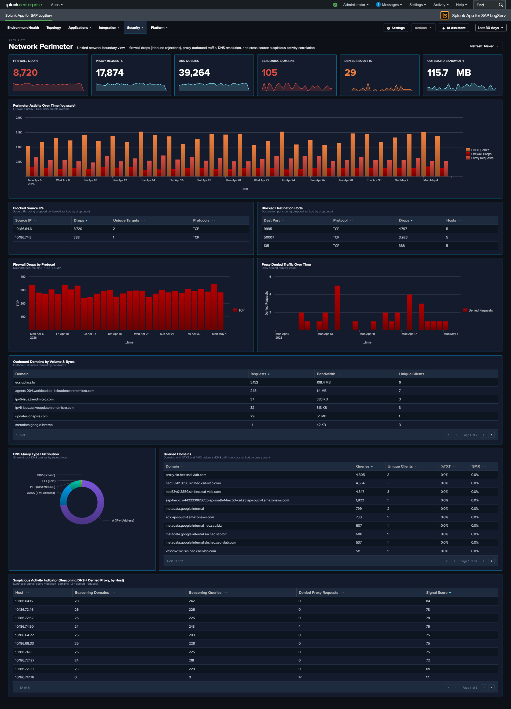

# Network Perimeter

## :material-circle-box:{ .taiconcolor } Why This Dashboard Matters

Firewall drops, proxy traffic, and DNS queries are three different lenses on the same underlying question: **what is crossing the network boundary and should it be there?** Each lens lives on its own operational dashboard ([Linux](../platform/linux.md), [Proxy Analytics](../platform/proxy.md), [DNS Analytics](../platform/dns-analytics.md)), but an attacker rarely limits themselves to a single surface -- a compromised host often shows up in multiple signals simultaneously, and that correlation is where the security value lives. Network Perimeter synthesizes the three sources into a single view: inbound rejections (firewall), outbound flow (proxy), and resolution activity (DNS), with a dedicated cross-source panel that ranks hosts by combined suspicious-signal score. Use it as the first stop for "is our network perimeter healthy and clean?"

## Panels

- **Firewall Drops** -- Count of kernel firewall `IN_DROP` events from `linux_secure`
- **Proxy Requests** -- Count of HTTP requests handled by Squid
- **DNS Queries** -- Count of DNS queries from `isc:bind:query`
- **Beaconing Domains** (red) -- Domains exhibiting periodic query patterns (low variance in inter-query interval) -- candidate C2 channels
- **Denied Requests** (red) -- Count of proxy requests with `status=403` or `vendor_action="TCP_DENIED"`; click to drill down
- **Outbound Bandwidth** -- `sum(bytes_out)` across all proxy requests, formatted KB/MB/GB
- **Perimeter Activity Over Time** -- Full-width multi-line chart (log-scale y-axis) showing daily counts of all three sources on a single timeline. Log scale keeps Firewall Drops and Proxy Requests visible alongside the much larger DNS Queries volume; simultaneous spikes across two or three lines are the correlation signal to watch for.
- **Top Blocked Source IPs** -- Table of the 20 source IPs most rejected by the firewall, with unique target count and protocols seen; row drilldown to the matching events
- **Top Blocked Destination Ports** -- Table of the 20 destination ports most targeted by rejected traffic, grouped by port + protocol
- **Firewall Drops by Protocol** -- Stacked column showing daily IN_DROP events split by TCP / UDP / ICMP. Protocol shifts are often the clearest signal (ICMP spikes = ping flood / recon; UDP spikes = DNS amplification / port scan; TCP spikes = SYN-style port scan)
- **Proxy Denied Traffic Over Time** -- Area chart of daily denied proxy requests -- the outbound complement to firewall drops (inbound)
- **Top Outbound Domains by Volume & Bytes** -- Table of the 20 destination domains receiving the most outbound traffic, ranked by bytes, with request count and unique client count. Row drilldown opens the events for that domain.
- **DNS Query Type Distribution** -- Donut of query-type mix (A / AAAA / PTR / TXT / MX / other). High TXT or MX volume from non-mail hosts is a DNS-tunneling / exfiltration indicator.
- **Top Queried Domains** -- Full-width table of the 30 most queried domains with unique-client count and per-domain `%TXT` and `%MX` ratios for quick anomaly spotting. Row drilldown opens DNS query events for that domain.
- **Suspicious Activity Indicator** -- Full-width cross-source table of internal hosts appearing in **both** beaconing DNS queries and denied proxy requests, ranked by signal score (`beacon_domains × 3 + denied_requests`). Columns: Host, Beaconing Domains, Beaconing Queries, Denied Proxy Requests, Signal Score. Row drilldown opens both DNS and proxy events for that host.

## :material-lightning-bolt:{ .taiconcolor } What to Look For

- **Correlated spikes across sources** -- The Perimeter Activity Over Time chart is the quickest read on "is something happening right now?" Watch for days when two or three of the lines spike together -- that's usually an active event (port scan, active C2, exfiltration window) rather than baseline drift.
- **Protocol shifts in firewall drops** -- The stacked column by protocol is more diagnostic than raw drop counts. A normally TCP-heavy mix suddenly showing large UDP or ICMP bands signals a different attacker technique.
- **Top Blocked Source IPs concentration** -- A single source IP generating the overwhelming majority of drops is either a persistent attacker or a misconfigured internal host. Either way, the action is the same: investigate that specific IP.
- **TXT-heavy queries to a single domain** -- A domain in Top Queried Domains with a high `%TXT` ratio is a DNS-tunneling pattern. Cross-reference the Suspicious Activity Indicator to see which hosts are issuing those queries.
- **Hosts in the Suspicious Activity table** -- Any non-empty row here is worth investigating. A host showing up in both beaconing DNS and denied proxy is strong evidence of compromise -- the DNS lookups suggest malware C2, and the denied proxy requests suggest the same malware trying to reach blocked destinations.
- **Outbound Bandwidth spikes** -- A sudden rise in the Outbound Bandwidth KPI that isn't matched by a proportional rise in Proxy Requests means individual transfers are getting larger -- often the signature of an exfiltration event.

