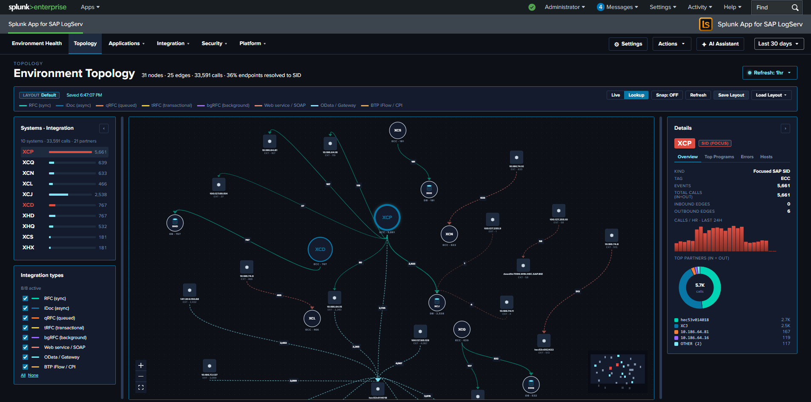

# Environment Topology

### :material-circle-box:{ .taiconcolor } Why This View Matters

The Environment Topology view answers a question every SAP administrator has: *"what's actually talking to what?"* Traditional dashboards show events, errors, and aggregates per source — but the **shape** of how SAP systems integrate with each other (RFC partners, HANA tenant relationships, web traffic boundaries, cross-zone connections) is hidden in those tabular surfaces. This view materializes that shape as an interactive graph drawn from your existing log data — no new ingest, no CMDB integration, no tagging effort required.

Use it to:

- Validate that your topology matches the as-designed architecture (every system shows up; no rogue partners are talking inbound).
- Investigate a single SID's call surface — who calls it, what does it call, where are the errors concentrated?
- Onboard a new analyst by giving them a one-page picture of the SAP landscape before they start digging into individual dashboards.
- Spot orphaned IPs / hosts that don't belong to any known SID — these are typically misconfigured load balancers, scanners, or unauthorized integration partners.

This view replaces the manual hand-drawn architecture diagrams that SAP admin teams typically maintain in slides or wikis. Because it's data-driven, it stays current as systems are added or retired.

### :material-circle-box:{ .taiconcolor } What's on Screen

The view consists of three regions:

- **Left toolbar** — a layout name chip showing the active saved layout, a Refresh button (re-runs all 6 underlying SPL queries while preserving the saved positions), a Live mode toggle (auto-refresh every 30 seconds), and a Save / Load Layout dropdown for named-layout management.
- **Center canvas** — the force-directed graph itself, rendered with [`@xyflow/react`](https://reactflow.dev/). Nodes are SAP systems (SID-tagged), HANA tenant DBs (cylinder icon), and integration partners (DB / web / external endpoints). Edges show observed call relationships, with edge thickness reflecting call volume.
- **Right sidebar** — when a node is selected, four tabs surface that node's per-selection context:
    - **Calls/Hr** — bar chart of hourly call volume into the selected node, hardcoded to the last 24 hours regardless of the global time-range picker (this chart's purpose is "what's happening RIGHT NOW on this node," not "what happened over the picker's window").
    - **Programs** — top ABAP programs / RFC functions invoked on the node, sourced from the gateway and ICM logs.
    - **Errors** — categorized error breakdown for the node (HTTP 4xx/5xx, severity ERROR / CRITICAL / FATAL, gateway error_function, ICM transactions). Aggregated by sourcetype + error_kind.
    - **Hosts** — the host(s) backing the SID, with first-seen / last-seen / `dc(sourcetype)` per host.
- **Right cluster (toolbar)** — a checkbox list of integration types lets you filter the visible nodes (RFC partners, HANA tenants, web endpoints, etc.).

When no node is selected, the right sidebar's "Systems" panel shows the inventory roll-up: how many nodes / edges / total calls; how many endpoints are unambiguously SID-attributed.

### :material-circle-box:{ .taiconcolor } Where the Data Comes From

The view assembles its node + edge inventory from a `union` of six SPL searches against existing sourcetypes — no new ingest is required:

| Source | What it contributes |
|---|---|
| `sap:abap:gateway` | RFC peer/local IPs (`P=<peer>` / `L=<local>` fields). The local IP is canonical for IP→SID inventory because it always belongs to **this** host's SID. |
| `sap:abap:icm` | ICM peer/local IPs for HTTP-side traffic. |
| `sap:hana:tracelogs` | HANA host + tenant SID extracted from the source path (`/usr/sap/<HANA_SID>/HDB<inst>/<host>/trace/DB_<TENANT_SID>/`). Yields the rich HANA-side topology including multi-tenant relationships. |
| `sap:saprouter` | Peer hostname extracted from the parens after `host <ip>/<service> (<resolved.host>)`. Provides the inbound edge for external partners. |
| `linux_messages_syslog` (osquery cpu_brand subset) | Host inventory: CPU model, RAM, OS, region, AZ, EC2 instance ID. Used to enrich the host-level facts on the Hosts tab. |
| Default Splunk `host` field (cross-source fallback) | Picks up hosts that aren't surfaced in the above. |

### :material-circle-box:{ .taiconcolor } Self-Derived IP→SID Inventory

The "which IP belongs to which SID" mapping isn't read from a CMDB or an admin-maintained lookup — it's **self-derived from the same logs you're already ingesting**. The mechanism is a multi-source `union` SPL with a `mvcount(sids)=1` filter: a host whose multiple sourcetypes all agree on a single SAP SID is unambiguously attributed; otherwise it's marked "unknown."

Coverage depends on what your data exposes — unique hostname/IP appearances across multiple SAP sourcetypes attribute cleanly, while shared NAT IPs and external partners typically appear as "unknown" nodes (their SAP affiliation isn't observable from logs alone, or they legitimately don't belong to any single SID).

The inventory is extensible per-customer without new ingest: appending another `union` arm to the inventory SPL adds a new attribution source. Common future arms: HANA audit `svc_host` rex, ABAP program self-attribution from gateway L= cross-pivot, customer-specific CMDB lookup.

### :material-circle-box:{ .taiconcolor } Saved Layouts

User-arranged graph layouts are persisted via Splunk KV Store collection `logserv_topology_layouts`. The schema (currently v4) carries:

- **Node positions** — where you've manually placed each node on the canvas
- **Panel state** — sidebar tab + width
- **Viewport** — zoom level + pan offset (x, y)
- **Enabled integration types** — which checkboxes are ticked in the right toolbar
- **Selected node** — which node was active when you saved
- **Active right-sidebar tab** — Calls / Programs / Errors / Hosts
- **Snap mode** — whether new nodes snap to a grid

Layouts are per-user-named — you can save your own variants ("focus on XCQ", "all DBs", "external partners only") and switch between them from the Load Layout dropdown. An admin saving a layout named **default** sets the layout other users see on first load.

Schema migration is in-memory: v1 / v2 / v3 records still load (the `loadCachedLayout` helper promotes them with the new fields undefined). When you save, the record is rewritten as v4.

### :material-circle-box:{ .taiconcolor } Live Mode

The Live mode toggle in the left toolbar drives a 30-second auto-refresh of all 6 underlying SPL queries while preserving the saved positions. Useful for:

- Watching a known integration come online during a deploy.
- Confirming an integration is healthy by seeing its edge weight increase tick-over-tick.
- Operations wallboard use — leave the topology view up on a dashboard monitor and watch the call-graph update in near-real-time.

Live mode coexists with the [per-dashboard auto-refresh picker](index.md) — currently both contribute additively to the refresh nonce. Consolidation is planned for a future release.

### :material-lightning-bolt:{ .taiconcolor } What to Look For

- **Unknown nodes with high edge weight** — an "unknown" SID with hundreds of calls/hr is either a misconfigured CMDB entry on our side, OR an unauthorized partner that nobody documented. Both warrant investigation.
- **Asymmetric edge counts** — an edge showing many calls one direction but very few the other usually means one side is the caller (RFC client) and the other is the callee (RFC server). Use the Programs tab to confirm which.
- **Orphan SIDs** — a node with no edges is a system that's running but not integrated with anything else. May be a quiet test system, or a system whose integration partners aren't monitored.
- **Tenants drifting from their HANA system** — multi-tenant HANA produces edges from the parent system to each tenant. Missing tenant edges indicate either tenant outage or audit-log gap.
- **Unexpected external partners** — saprouter peer_hostname entries that don't match the documented partner list are the strongest signal of an unauthorized external integration.
- **Host counts on the Hosts tab** — a SID showing 3 hosts when you expected 2 may indicate a stale forwarder / VM that should have been decommissioned.

### :material-circle-box:{ .taiconcolor } Notes

- The view's URL slug is `/integration-topology` (historical — the user-visible label was changed from "Integration Topology" to "Environment Topology", but the URL slug + code identifiers stayed stable so existing bookmarks + saved-layout records remain valid).
- Layout persistence works across browser tabs and across Splunk Web sessions — your KV Store records survive Splunkd restarts.
- Layouts are saved **per Splunk user** — every KV Store record is keyed by `<username>::<slug>`, so different users have completely separate records and can't overwrite each other's layouts. If the same user edits the topology in two browser tabs concurrently, the tabs race each other and last-tab-save wins (multi-tab edit-collision protection is planned for a future release).

