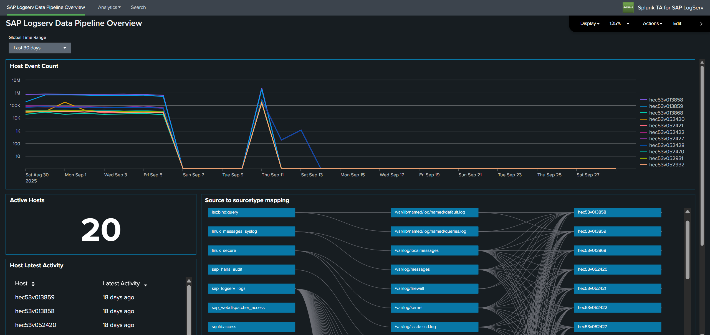

# About the Splunk TA for SAP LogServ

## :material-circle-box:{ .cboxmove } Introduction

SAP offers its customers ECS (fka RISE) with SAP S/4HANA Cloud Private Edition. This is an IaaS model (on a very basic level) from SAP's vendor perspective, where SAP hosts customers' SAP S/4HANA and other SAP systems in the customer's choice of public cloud providers (AWS, Microsoft Azure, GCP, etc.), in accounts owned and managed by SAP itself. <a href="https://blog.sap-press.com/cybersecurity-for-rise-with-sap" target="_blank">SAP LogServ</a> provides logs from all SAP systems and layers (OS, database, etc.), and the logs can be integrated to be available to the customer's security information and event management (SIEM) solution.

The Splunk TA for SAP LogServ provides multiple mechanisms to access the logs from LogServ, ingest them into Splunk, and map the various log types to Splunk sourcetypes.

Starting with version 0.0.3, the TA includes built-in **index-time filtering** that lets you control which log types are indexed and drop stale data — all configured through Splunk Web with zero license cost for filtered events. See [Configuring Filters](content/install-setup/configure-filters.md) for details.

|             |                                                                                                                                                                        |
|-------------|------------------------------------------------------------------------------------------------------------------------------------------------------------------------|
| Version     | 0.0.3-beta                                                                                                                                                             |
| Supported vendor products     | SAP LogServ for SAP ECS in Amazon Web Services (AWS)                                                                                                  |
| CIM | 5.1.1 and later |
| Add-on has a web UI           | Yes. This add-on contains a configuration UI and dashboards.                                                                                          |

 

