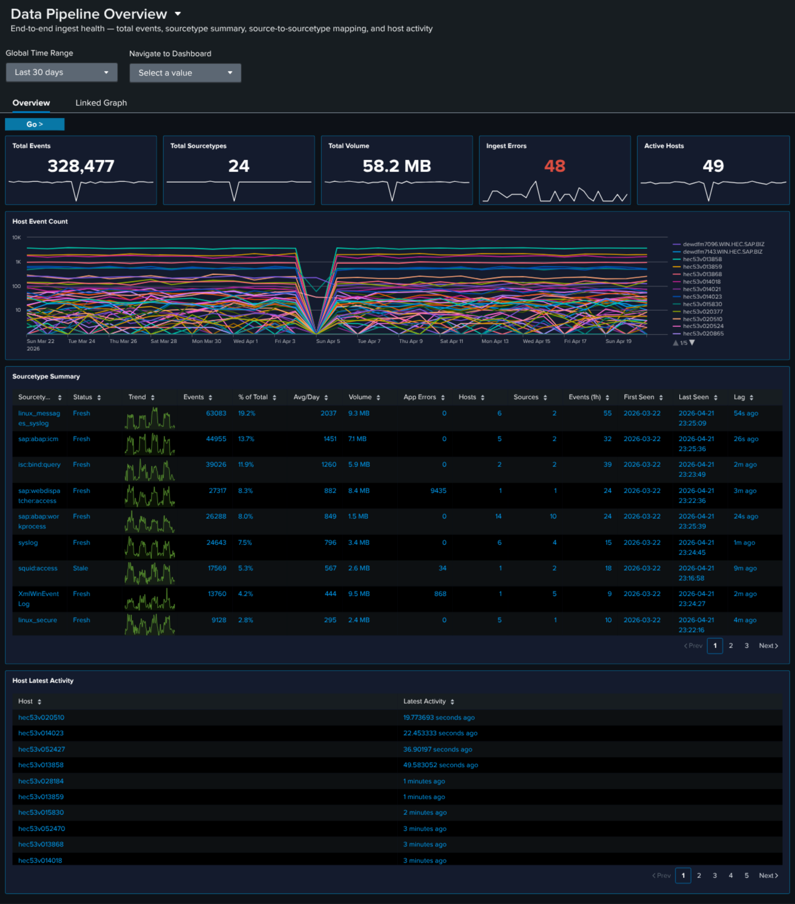
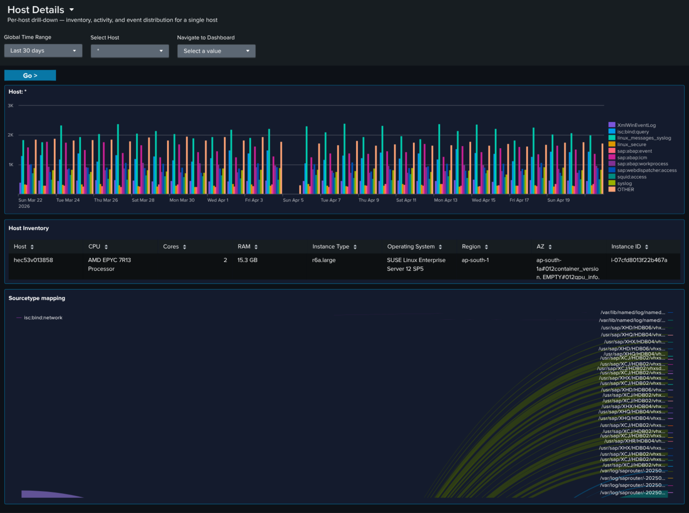

# About SAP LogServ for Splunk

## :material-circle-box:{ .cboxmove } Introduction

SAP offers its customers ECS (fka RISE) with SAP S/4HANA Cloud Private Edition. This is an IaaS model (on a very basic level) from SAP's vendor perspective, where SAP hosts customers' SAP S/4HANA and other SAP systems in the customer's choice of public cloud providers (AWS, Microsoft Azure, GCP, etc.), in accounts owned and managed by SAP itself. <a href="https://blog.sap-press.com/cybersecurity-for-rise-with-sap" target="_blank">SAP LogServ</a> provides logs from all SAP systems and layers (OS, database, etc.), and the logs can be integrated to be available to the customer's security information and event management (SIEM) solution.

SAP LogServ for Splunk provides multiple mechanisms to access the logs from LogServ, ingest them into Splunk, and map the various log types to Splunk sourcetypes.

## :material-circle-box:{ .cboxmove } Two Packages

Starting with version 0.0.3, the solution is delivered as **two separately installable packages**:

| Package | App ID | Install On |
|---------|--------|------------|
| **Data TA** | `splunk_ta_sap_logserv` | Deployment Server, Heavy Forwarders (or single instance) |
| **LogServ App** | `splunk_app_sap_logserv` | Search Head only (or single instance) |

The **Data TA** handles data collection, sourcetype routing, index-time filtering, and deployment server automation. The **LogServ App** provides dashboards and search-time field extractions for analyzing the ingested data.

For details on which package goes where, see [Architecture](content/getting-started/architecture.md).

## :material-circle-box:{ .cboxmove } Key Features

- **Index-time filtering** -- Control which log types are indexed and drop stale data, all configured through Splunk Web with zero license cost for filtered events
- **Deployment Server automation** -- Automatically stages filter configurations for distribution to Heavy Forwarders with a one-click deploy button
- **Dashboard Studio dashboards** -- Twenty pre-built dashboards organized into four purpose-driven navigation groups plus a top-level Environment Health landing page: **Applications** (5 dashboards covering ABAP and HANA runtime), **Integration** (5 dashboards covering SAP Services, Router, Cloud Connector, Web Dispatcher, and Web and API Performance), **Security** (3 cross-stack synthesis dashboards: Network Perimeter, Cross-Stack Authentication, Change & Configuration Activity), and **Platform** (6 dashboards covering data pipeline, DNS, Linux, Windows, Proxy, and Host Details). Every dashboard provides cross-dashboard drill-down with preserved time range.
- **Search-time field extractions** -- ~176 search-time directives (EXTRACT, EVAL, FIELDALIAS) across SAP-specific sourcetypes

|             |                                                                                                                                                                        |
|-------------|------------------------------------------------------------------------------------------------------------------------------------------------------------------------|
| Version     | 0.0.4.2-beta                                                                                                                                                             |
| Supported vendor products     | SAP LogServ for SAP ECS in Amazon Web Services (AWS)                                                                                                  |
| Splunk platform versions | 9.4.3 and later |
| CIM | 5.1.1 and later |

 

